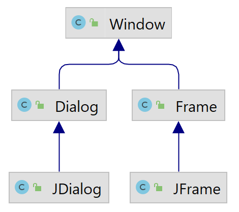

# Swing 组件

- [Swing 组件](#swing-组件)
  - [概述](#概述)
  - [Window 类](#window-类)
  - [中间容器](#中间容器)
  - [JComponent](#jcomponent)
    - [Tool tips](#tool-tips)
    - [边框](#边框)
    - [可插入样式](#可插入样式)
    - [自定义属性](#自定义属性)
    - [双缓冲](#双缓冲)

2021-11-13, 16:37
***

## 概述

Swing 组件可以分为：

- 顶层窗口，`JFrame`, `JDialog` 等，可以独立显示的组件；
- 中间容器，如 `JPanel`, `JScrollPaane`, `JSplitPane` 等，可以充当基本组件的载体，但是不可独立显示的组件；
- 基本组件，如 `JButton`, `JComboBox` 等。

## Window 类



如图所示，Swing 中主要有以上两种顶层容器：

- `JFrame` 用来设计类似于 Windows 系统中窗口形式的应用程序；
- `JDialog` 和 `JFrame` 类似，只不过 `JDialog` 从来设计对话框。

基于 Swing 的土星界面至少有一个顶层容器。

## 中间容器

Swing 组件不能添加到顶层容器中，而必须添加到一个与 Swing 顶层容器关联的内容面板（`ContentPane`），内容面板就是一个中间容器。

向 `JFrame` 顶层容器中添加组件的方式有两种：

- 调用 `JFrame` 的 `getContentPane()` 方法获得内容面板，然后向其中添加组件；
- 建立包含组件的 `JPanel` 或其它中间容器，然后调用 `JFrame` 的 `seetContentPane()` 将其设置为内容面板。

## JComponent

`JComponent` 是所有组件的父类，包含许多特性，下面依次描述。

### Tool tips

设置工具提示功能，通过 `setToolTipText` 方法指定提示字符串。例如：

```java
public class HelloToolTip
{
    static final int WIDTH = 300;
    static final int HEIGHT = 200;

    public static void main(String[] args)
    {
        JFrame jf = new JFrame("添加内容面板测试程序");
        jf.setSize(WIDTH, HEIGHT);
        jf.setDefaultCloseOperation(JFrame.EXIT_ON_CLOSE);
        jf.setVisible(true);

        JPanel contentPane = new JPanel();
        jf.setContentPane(contentPane);

        JButton b1 = new JButton("确定");
        JButton b2 = new JButton("取消");
        contentPane.add(b1);
        contentPane.add(b2);
        
        b1.setToolTipText("这个按钮是一个确定按钮");//设置按钮组件的工具提示功能
        b2.setToolTipText("这个按钮是一个取消按钮");
    }
}
```

### 边框

每个 `JComponent` 可以有一个或多个边框，边框不仅可以绘制线条和漂亮的边界，还可以提供标题和组件周围的空白控件。

可以使用 `setBorder` 设置 `JComponent` 的边框，可以使用 `BorderFactory` 创建 Swing 所提供的大多数边框。例如：

```java
public class BorderDemo
{
    //这段代码主要是为读者介绍如何设置按钮组件的边框
    static final int WIDTH = 300;
    static final int HEIGHT = 200;

    public static void main(String[] args)
    {
        JFrame jf = new JFrame("添加内容面板测试程序");
        jf.setSize(WIDTH, HEIGHT);
        jf.setDefaultCloseOperation(JFrame.EXIT_ON_CLOSE);
        jf.setVisible(true);

        JPanel contentPane = new JPanel();
        jf.setContentPane(contentPane);
        JButton b1 = new JButton("确定");
        JButton b2 = new JButton("取消");
        contentPane.add(b1);
        contentPane.add(b2);
        
        b1.setBorder(BorderFactory.createLineBorder(Color.red));//用来设置按钮组件的边框
    }
}
```

在实际开发中，一般会使用边框将组件设计地更加美观。

### 可插入样式

所谓可插入样式，即可以定制自己的桌面、更换新的颜色方案。Swing 提供了打包好的外观。

### 自定义属性

`JComponent` 可以将一个或多个属性与其关联。使用 `putClientProperty` 和 `getClientProperty` 设置和获得属性值。

### 双缓冲

使用双缓冲技术能改进频繁变化组件的显示效果。`JComponent` 组件默认双缓冲，可以使用 `setDoubleBuffered(false)` 关闭双缓冲。


