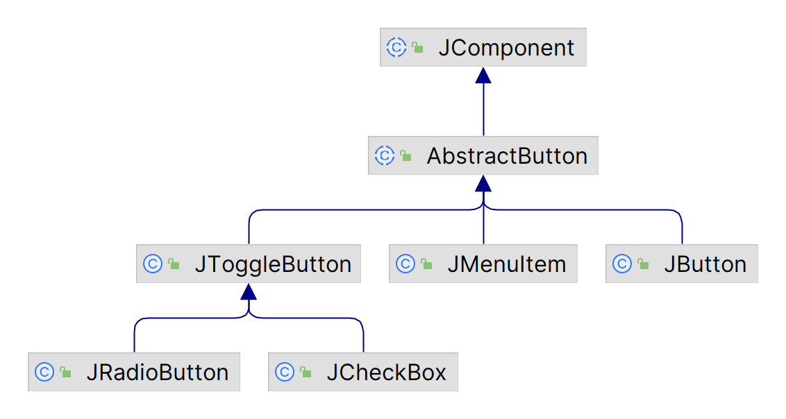
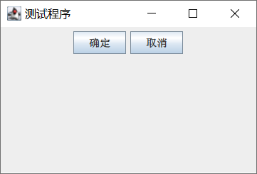
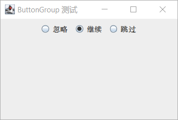
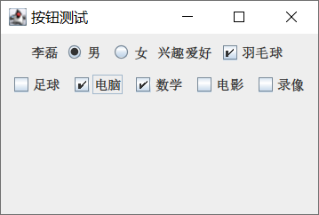

# 按钮

- [按钮](#按钮)
  - [简介](#简介)
  - [JButton](#jbutton)
  - [JRadioButtion](#jradiobuttion)
  - [JCheckBox](#jcheckbox)
  - [按钮示例](#按钮示例)

2023-12-22, 00:39
****

## 简介

按钮几乎是不可或缺的组件，是实现人机交互操作的典型组件之一。Swing 提供了许多种类的按钮，如下所示



## JButton

`JButton` 表示普通按钮。和 `JLabel` 一样，也支持文本和图表：

| 构造函数                          | 说明                 |
| --------------------------------- | -------------------- |
| `JButton()`                       | 不带文本和图标的按钮 |
| `JButton(Icon icon)`              | 带图标的按钮         |
| `JButton(String text)`            | 带文本的按钮         |
| `JButton(String text, Icon icon)` | 带文本和图标的按钮   |

创建和添加普通按钮很简单，关键监听其事件。

示例：

```java
public class JButtonDemo1 {

    public static void main(String[] args) {
        JFrame frame = new JFrame("测试程序");
        frame.setSize(300, 200);
        frame.setDefaultCloseOperation(WindowConstants.EXIT_ON_CLOSE);
        frame.setVisible(true);

        JPanel contentPane = new JPanel();
        frame.setContentPane(contentPane);

        JButton b1 = new JButton("确定");
        JButton b2 = new JButton("取消");

        contentPane.add(b1);
        contentPane.add(b2);
    }
}
```



## JRadioButtion

`JRadioButtion` 类实现单选按钮。其构造函数与 `JButton` 类似，这里不再赘述。

`JRatioButton` 相对 `JButton` 多了一个是否选中的状态，下面演示其使用：

```java
public class JRadioDemo1 {

    public static void main(String[] args) {
        JFrame frame = new JFrame("测试");
        frame.setSize(300, 200);
        frame.setDefaultCloseOperation(JFrame.EXIT_ON_CLOSE);
        frame.setVisible(true);

        JPanel contentPane = new JPanel();
        frame.setContentPane(contentPane);
        JRadioButton b1 = new JRadioButton("忽略");
        JRadioButton b2 = new JRadioButton("继续");
        JRadioButton b3 = new JRadioButton("跳过");
        contentPane.add(b1);
        contentPane.add(b2);
        contentPane.add(b3);
    }
}
```


这里三个按钮是单独添加的，没有互斥机制。而实际的单选按钮，选中一个，其它自动取消选择。要实现该功能，需要用到 `ButtonGroup`：

```java
public class ButtonGroupDemo {

    public static void main(String[] args) {
        JFrame frame = new JFrame("ButtonGroup 测试");
        frame.setSize(300, 200);
        frame.setDefaultCloseOperation(WindowConstants.EXIT_ON_CLOSE);
        frame.setVisible(true);

        JPanel contentPane = new JPanel();
        frame.setContentPane(contentPane);
        JRadioButton jr1 = new JRadioButton("忽略");
        JRadioButton jr2 = new JRadioButton("继续");
        JRadioButton jr3 = new JRadioButton("跳过");
        ButtonGroup bg = new ButtonGroup();
        bg.add(jr1);
        bg.add(jr2);
        bg.add(jr3);
        contentPane.add(jr1);
        contentPane.add(jr2);
        contentPane.add(jr3);
    }
}
```



此时这三个按钮，当选择一个，另一个自动取消选中。

## JCheckBox

`JCheckBox` 类实现了复选框。复选框与单选按钮的区别，就在于它可以多选。

| 构造函数 | 说明 |
| -------- | ---- |
| `JCheckBox()`         | 无文本、未勾选的复选框 |
| `JCheckBox(Icon icon)`         | 无文本、指定图标、未勾选的复选框 |
| `JCheckBox(Icon icon, Boolean selected)`         | 无文本、指定图标、指定状态的复选框 |
| `JCheckBox(String text)`         | 指定文本、未勾选的复选框 |
| `JCheckBox(String text, Boolean selected)`         | 指定文本、指定状态的复选框 |
| `JCheckBox(String text, Icon icon)`         | 指定文本、指定图标的复选框 |
| `JCheckBox(String text, Icon icon, Boolean selected)` | 指定文本、指定图标、指定状态的复选框 |

示例：

```java
public class JCheckBoxDemo1 {

    public static void main(String[] args) {
        JFrame frame = new JFrame("测试");
        frame.setSize(300, 200);
        frame.setDefaultCloseOperation(WindowConstants.EXIT_ON_CLOSE);
        frame.setVisible(true);

        JPanel contentPane = new JPanel();
        frame.setContentPane(contentPane);
        // 6 个复选框
        JCheckBox box1 = new JCheckBox("羽毛球");
        JCheckBox box2 = new JCheckBox("足球");
        JCheckBox box3 = new JCheckBox("电脑书");
        JCheckBox box4 = new JCheckBox("数学书");
        JCheckBox box5 = new JCheckBox("电影");
        JCheckBox box6 = new JCheckBox("录像");

        contentPane.add(box1);
        contentPane.add(box2);
        contentPane.add(box3);
        contentPane.add(box4);
        contentPane.add(box5);
        contentPane.add(box6);
    }
}
```


## 按钮示例

同时演示 `JRadioButton` 和 `JCheckBox`，两者主要差别在于 `JRadioButton` 放到 `ButtonGroup` 可实现单选。

```java
public class ButtonDemo extends JPanel {

    public ButtonDemo() {
        JFrame frame = new JFrame("按钮测试");
        frame.setSize(300, 200);
        frame.setContentPane(this);

        JLabel name = new JLabel("李磊");
        JRadioButton b1 = new JRadioButton("男");
        JRadioButton b2 = new JRadioButton("女");
        add(name);
        add(b1);
        add(b2);

        ButtonGroup bg1 = new ButtonGroup();
        bg1.add(b1);
        bg1.add(b2);

        JLabel interesting = new JLabel("兴趣爱好");
        JCheckBox cb1 = new JCheckBox("羽毛球");
        JCheckBox cb2 = new JCheckBox("足球");
        JCheckBox cb3 = new JCheckBox("电脑");
        JCheckBox cb4 = new JCheckBox("数学");
        JCheckBox cb5 = new JCheckBox("电影");
        JCheckBox cb6 = new JCheckBox("录像");


        add(interesting);
        add(cb1);
        add(cb2);
        add(cb3);
        add(cb4);
        add(cb5);
        add(cb6);

        frame.setVisible(true);
    }

    public static void main(String[] args) {
        new ButtonDemo();
    }
}
```



