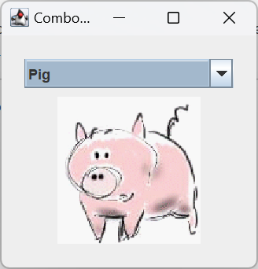

# JComboBox

## 简介

`JComboBox` 允许用户从多个选项中选择一个，有两种不同的形式：

- 默认是不可编辑的选择框，具有一个按钮和一个下拉框
- 另一种是可编辑选择框，具有一个 textField 和一个按钮。用户可以在 textField 中输入值，也可以点击按钮显示下拉列表

以下是两种形式的组合框在 Java 中的默认外观：


comboBox 占用的屏幕空间小，可编辑 textField 让用户可以快速选择值且不会限制值的范围。其它可以显示多个选项的组件还有 radioButtons 和 lists。一组 ratioButtons 最容易理解，但当空间有限或选项过多时，comboBox 更合适。当选项特别多，或者需要选择多个选项，list 则更合适。

由于可编辑和不可编辑的 comboBox 有很大不同，下面分别介绍。

## 不可编辑 combo-box

下面用不可编辑 combo-box 选择宠物图片：



代码：

```java
import javax.swing.*;
import java.awt.*;
import java.awt.event.ActionEvent;
import java.awt.event.ActionListener;
import java.net.URL;

public class ComboBoxDemo extends JPanel implements ActionListener {

    JLabel picture;

    public ComboBoxDemo() {
        super(new BorderLayout());
        String[] petStrings = {"Bird", "Cat", "Dog", "Rabbit", "Pig"};

        // 创建 combo-box，选择 index 4 的 Pig
        JComboBox<String> petList = new JComboBox<>(petStrings);
        petList.setSelectedIndex(4);
        petList.addActionListener(this);

        // 配置图片
        picture = new JLabel();
        picture.setFont(picture.getFont().deriveFont(Font.ITALIC));
        picture.setHorizontalAlignment(JLabel.CENTER);
        updateLabel(petStrings[petList.getSelectedIndex()]);
        picture.setBorder(BorderFactory.createEmptyBorder(10, 0, 0, 0));

        // 将 JLabel 的首选大小硬编码为最宽图像的宽度和最高图像的高度+边框
        // 真实程序应该根据需要计算
        picture.setPreferredSize(new Dimension(177, 122 + 10));

        add(petList, BorderLayout.PAGE_START);
        add(picture, BorderLayout.PAGE_END);
        setBorder(BorderFactory.createEmptyBorder(20, 20, 20, 20));
    }

    protected void updateLabel(String name) {
        ImageIcon imageIcon = createImageIcon("images/" + name + ".gif");
        picture.setIcon(imageIcon);
        picture.setToolTipText("A drawing of a " + name.toLowerCase());
        if (imageIcon != null) {
            picture.setText(null);
        } else {
            picture.setText("Image not found");
        }
    }

    protected static ImageIcon createImageIcon(String path) {
        URL imgURL = ComboBoxDemo.class.getResource(path);
        if (imgURL != null) {
            return new ImageIcon(imgURL);
        } else {
            System.err.println("Couldn't find file: " + path);
            return null;
        }
    }

    @Override
    public void actionPerformed(ActionEvent e) {
        JComboBox<String> cb = (JComboBox) e.getSource();
        String petName = (String) cb.getSelectedItem();
        updateLabel(petName);
    }

    protected static void createAndShowGUI() {
        JFrame frame = new JFrame("ComboBoxDemo");
        frame.setDefaultCloseOperation(JFrame.EXIT_ON_CLOSE);

        JComponent contentPane = new ComboBoxDemo();
        contentPane.setOpaque(true);
        frame.setContentPane(contentPane);

        frame.pack();
        frame.setVisible(true);
    }

    public static void main(String[] args) {
        SwingUtilities.invokeLater(ComboBoxDemo::createAndShowGUI);
    }
}
```

其中，创建并配置 combo-box 的代码：

```java
String[] petStrings = {"Bird", "Cat", "Dog", "Rabbit", "Pig"};

// 创建 combo-box，选择 index 4 的 Pig
JComboBox<String> petList = new JComboBox<>(petStrings);
petList.setSelectedIndex(4);
petList.addActionListener(this);
```

该 combo-box 包含一个 `String` 数组，也可以直接使用 icon 数组。将其它内容放入 combo-box，需要编写自定义 renderer。可编辑 combo-box 还需要自定义 editor。

上面代码在 combo-box 上注册了一个 action-listener。下面会介绍。

无论使用哪种构造函数，combo-box 都使用 combo-box-model 来管理 items。当使用数组或 `Vector` 初始化 combo-box，combo-box 会创建一个默认模型。与其它 Swing 组件一样。也可以通过实现自定义模型（实现 `ComboBoxModel` 接口）来部分自定义 combo-box。

> [!NOTE]
>
> 自定义实现 `ComboBoxModel` 需要小心，使用 `JComboBox` 的方法修改 combo-box 中的 item，如 `insertItemAt`，需要模型实现 `MutableComboBoxModel` 接口（`ComboBoxModel` 的子接口）。具体哪些方法要求实现该接口，可以查看 API。
>
> 另外，要确保自定义模型在 combo-box 的数据或状态发生变化时触发 list-data-event。虽然不可编辑 combo-box 的数据不会改变，当选择发生变化时也必须出发 `CONTENT_CHANGED` 事件。一种处理这些事件的简单方法是继承 `AbstractListModel` 接口。

## 处理 combo-box 事件

以下是 `ComboBoxDemo` 中注册和实现 action-listener 的代码：

```java
petList.addActionListener(this);

@Override
public void actionPerformed(ActionEvent e) {
    JComboBox<String> cb = (JComboBox) e.getSource();
    String petName = (String) cb.getSelectedItem();
    updateLabel(petName);
}
```

该 action-listener 从 combo-box 获取新选择的 item，使用它来计算新 image 文件的名称，然后更新 label 显示 image。当用户选择一个 item，combo-box 触发一个 action-event。

combo-box 还可以生成 item-event，当任何 item 的选择状态发生变化，都会触发该事件。combo-box 一次只能选择一个 item，因此当用户选择新的 item，之前选择的 item 变为未选择状态。因此：

- 每次用户从菜单中选择不同 item 时，都会触发两个 item-event。
- 如果选择相同 item，则不会触发 item-event

使用 `addItemListener` 注册 item-listener，如何注册 item-listener，可参考 [How to Write an Item Listener](https://docs.oracle.com/javase/tutorial/uiswing/events/itemlistener.html) 。

尽管 `JComboBox` 继承了注册低级事件（如焦点、键盘和鼠标）的方法，但不建议监听 combo-box 上的低级事件。因为 combo-box 是一个复合组件，它由两个或多个其它组件组成。combo-box 本身会触发高级事件，如 action-event。其子组件会触发低级事件，如鼠标、键盘和焦点事件。低级事件和触发它们的子组件依赖于外观，为了避免代码依赖于外观，建议只监听 combo-box 和其它符合组件上的高级事件。

## 参考

- https://docs.oracle.com/javase/tutorial/uiswing/components/combobox.html