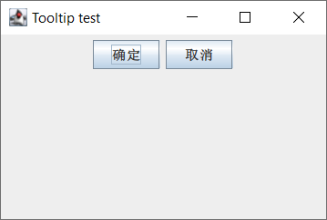
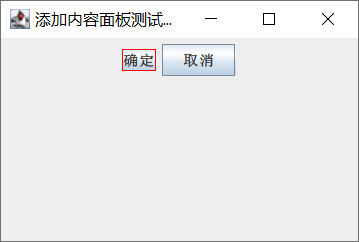

# JComponent

- [JComponent](#jcomponent)
  - [简介](#简介)
  - [Tool tips](#tool-tips)
  - [边框](#边框)
  - [可插入样式](#可插入样式)
  - [自定义属性](#自定义属性)
  - [layout 支持](#layout-支持)
  - [无障碍](#无障碍)
  - [拖曳支持](#拖曳支持)
  - [双缓冲](#双缓冲)

2023-12-21, 23:40
****

## 简介

除了顶层容器，所以以 "J" 开头的 Swing 组件都继承自`JComponent`。

`JComponent` 继承自 `Container`，`Container` 又继承 `Component`：

- `Component` 类包含支持布局、绘制和事件等所有内容。
- `Container` 支持向容器添加组件，并进行布局

所有继承 `JComponent` 的组件都是基本组件类，需要放在中间容器展示。下面总结 `Component`, `Container` 和 `JComponent` 中常用方法。

## JComponent 功能

JComponent 为其子类添加了如下功能：

| 功能       | 说明                                                         |
| ---------- | ------------------------------------------------------------ |
| tool-tip   | 使用 `setToolTipText` 指定字符串，可以为组件提供帮助信息。光标停留在组件上，指定的字符串将在组件附近出现的一个小窗口中显示 |
| 渲染和边框 | 使用 `setBorder` 可以指定在组件边缘周围显示的边框。覆盖 `paintComponent` 可以绘制组件内部 |
| 可插入 laf | 在底层，每个 JComponent 都有一个对应的 ComponentUI 对象，用于执行该 JComponent 的所有绘制、事件处理、尺寸调整等操作。而使用哪个 ComponentUI 取决于当前的 laf，通过 `UIManager.setLookAndFeel` 可以设置 |
|            |                                                              |


## Tool tips

设置工具提示功能，通过 `setToolTipText` 方法指定提示字符串，在鼠标悬停在组件上时，可以显示提示信息。例如：

```java
public class HelloTooltip {

    static final int WIDTH = 300;
    static final int HEIGHT = 200;

    public static void main(String[] args) {
        JFrame frame = new JFrame("Tooltip test");
        frame.setSize(WIDTH, HEIGHT);
        frame.setDefaultCloseOperation(WindowConstants.EXIT_ON_CLOSE);

        JPanel contentPane = new JPanel();
        frame.setContentPane(contentPane);

        JButton b1 = new JButton("确定");
        JButton b2 = new JButton("取消");
        b1.setToolTipText("这是确定按钮");
        b2.setToolTipText("这是取消按钮");

        contentPane.add(b1);
        contentPane.add(b2);
        frame.setVisible(true);
    }
}
```




## 边框

每个 `JComponent` 可以有一个或多个边框，边框不仅可以绘制线条和漂亮的边界，还可以提供标题和组件周围的空白控件。

可以使用 `setBorder` 设置 `JComponent` 的边框，可以使用 `BorderFactory` 创建 Swing 所提供的大多数边框。例如：

```java
public class BorderDemo {

    public static void main(String[] args) {
        JFrame jf = new JFrame("添加内容面板测试程序");
        jf.setSize(300, 200);
        jf.setDefaultCloseOperation(WindowConstants.EXIT_ON_CLOSE);
        jf.setVisible(true);

        JPanel contentPane = new JPanel();
        jf.setContentPane(contentPane);
        JButton b1 = new JButton("确定");
        JButton b2 = new JButton("取消");
        contentPane.add(b1);
        contentPane.add(b2);

        b1.setBorder(BorderFactory.createLineBorder(Color.red));//用来设置按钮组件的边框
    }
}
```



在实际开发中，一般会使用边框美化组件。

## 可插入样式

所谓可插入样式，即可以定制自己的桌面、更换新的颜色方案。Swing 提供了打包好的外观，包括默认、Motif 和 Windows 的 L&F。

## 自定义属性

`JComponent` 可以将一个或多个属性与其关联。使用 `putClientProperty` 和 `getClientProperty` 设置和获得属性值。在现实开发中，会经常使用这个特性。

## layout 支持

`JComponent` 在 `Component` 的基础上提供了多个设置布局的方法：

- `setPreferredSize`
- `setMinimumSize`
- `setMaximumSize`
- `setAlignmentX`
- `setAlignmentY`

这些方法为应用布局管理器提供了支持。

## 无障碍

无障碍技术用于支持残疾人士使用计算机，一般包括语音接口、屏幕阅读器等输入设备组成，不仅对残疾人士，对在非办公室环境使用计算机的人来说都非常有用，例如堵车时，可以使用无障碍技术通过语音输入和输出来查收电子邮件。

## 拖曳支持

## 双缓冲

使用双缓冲技术能改进频繁变化组件的显示效果。`JComponent` 组件默认双缓冲，可以使用 `setDoubleBuffered(false)` 关闭双缓冲。

