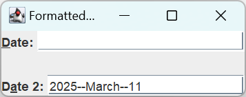
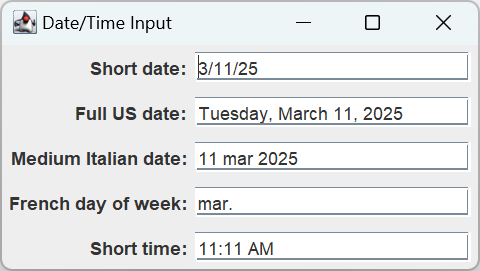
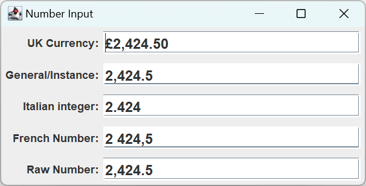
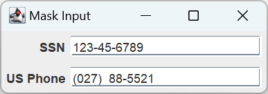
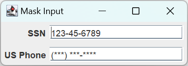

# JFormattedTextField

2025-03-11 ⭐
@author Jiawei Mao
***
## 简介

`JFormattedTextField` 支持输入格式化文本。在创建 `JFormattedTextField` 为输入定义一个 mask，该 mask 支持 4 种样式：`java.text.Format`, `AbstractFormatter`, `AbstractFormatterFactory` 或实际值（如 3.14159）。

根据数据类型，Java 提供了几种实现：

- 数字：`NumberFormatter`
- 日期：`DateFormatter`
- 字符串：`MaskFormatter`，如 `XXX-XX-XXX`

如果需要不同的显示或编辑格式，可以使用 `AbstractFormatterFactory`。

## 创建 JFormattedTextField

`JFormattedTextField` 有 6 个构造函数：

```java
public JFormattedTextField()

JFormattedTextField formattedField = new JFormattedTextField();
```

```java
public JFormattedTextField(Format format)

DateFormat format = new SimpleDateFormat("yyyy--MMMM--dd");
JFormattedTextField formattedField = new JFormattedTextField(format);
```

```java
public JFormattedTextField(JFormattedTextField.AbstractFormatter formatter)

DateFormat displayFormat = new SimpleDateFormat("yyyy--MMMM--dd");
DateFormatter displayFormatter = new DateFormatter(displayFormat);
JFormattedTextField formattedField = new JFormattedTextField(displayFormatter);
```

```java
public JFormattedTextField(JFormattedTextField.AbstractFormatterFactory factory)

DateFormat displayFormat = new SimpleDateFormat("yyyy--MMMM--dd");
DateFormatter displayFormatter = new DateFormatter(displayFormat);
DateFormat editFormat = new SimpleDateFormat("MM/dd/yy");
DateFormatter editFormatter = new DateFormatter(editFormat);
DefaultFormatterFactory factory = new DefaultFormatterFactory(
  displayFormatter, displayFormatter, editFormatter);
JFormattedTextField formattedField = new JFormattedTextField(factory);
```

```java
public JFormattedTextField(JFormattedTextField.AbstractFormatterFactory factory,
  Object currentValue)

DateFormat displayFormat = new SimpleDateFormat("yyyy--MMMM--dd");
DateFormatter displayFormatter = new DateFormatter(displayFormat);
DateFormat editFormat = new SimpleDateFormat("MM/dd/yy");
DateFormatter editFormatter = new DateFormatter(editFormat);
DefaultFormatterFactory factory = new DefaultFormatterFactory(
  displayFormatter, displayFormatter, editFormatter);
JFormattedTextField formattedField = new JFormattedTextField(factory, new Date());
```

```java
public JFormattedTextField(Object value)

JFormattedTextField formattedField = new JFormattedTextField(new Date());
```

无参数版本需要后续配置，其它构造函数支持配置输入格式。

## 属性

下表为 `JFormattedTextField` 的 8 个属性，与 `JTextField` 不同，`JTextField` 通过 `text` 属性以 `String` 获得内容，而 `JFormattedTextField` 通过 `value` 属性获得 `Object` 类型的值。因此，如果格式化内容为 `Date`，则可以将 `value` 转换为 `java.util.Date` 类型。

| 属性名称          | 类型                                           | 访问权限         |
| ----------------- | ---------------------------------------------- | ---------------- |
| `actions`         | `Action[]`                                     | read-only        |
| document          | `Document`                                     | write-only       |
| editValid         | `boolean`                                      | read-only        |
| focusLostBehavior | `int`                                          | read-write       |
| formatter         | `JFormattedTextField.AbstractFormatter`        | read-only        |
| formatterFactory  | `JFormattedTextField.AbstractFormatterFactory` | read-write bound |
| UIClassID         | `String`                                       | read-only        |
| value             | `Object`                                       | read-write bound |

下面通过自定义 formatter 和 factory 演示如何使用 `JFormattedTextField`。需要注意的是，在编辑底部 text-field 时，显示格式和编辑格式不同。

```java
import javax.swing.*;
import javax.swing.text.DateFormatter;
import javax.swing.text.DefaultFormatterFactory;
import java.awt.*;
import java.awt.event.ActionEvent;
import java.awt.event.ActionListener;
import java.awt.event.KeyEvent;
import java.text.DateFormat;
import java.text.SimpleDateFormat;
import java.util.Date;

public class FormattedSample {
    public static void main(String[] args) {
        Runnable runner = new Runnable() {
            @Override
            public void run() {
                JFrame frame = new JFrame("Formatted Example");
                frame.setDefaultCloseOperation(JFrame.EXIT_ON_CLOSE);

                JPanel datePanel = new JPanel(new BorderLayout());
                JLabel dateLabel = new JLabel("Date: ");
                dateLabel.setDisplayedMnemonic(KeyEvent.VK_D);
                DateFormat format = new SimpleDateFormat("yyyy--MMMM--dd");
                JFormattedTextField dateTextField = new JFormattedTextField(format);
                dateLabel.setLabelFor(dateTextField);
                datePanel.add(dateLabel, BorderLayout.WEST);
                datePanel.add(dateTextField, BorderLayout.CENTER);
                frame.add(datePanel, BorderLayout.NORTH);

                JPanel date2Panel = new JPanel(new BorderLayout());
                JLabel date2Label = new JLabel("Date 2: ");
                date2Label.setDisplayedMnemonic(KeyEvent.VK_A);
                DateFormat displayFormat = new SimpleDateFormat("yyyy--MMMM--dd");
                DateFormatter displayFormatter = new DateFormatter(displayFormat);
                DateFormat editFormat = new SimpleDateFormat("MM//dd//yy");
                DateFormatter editFormatter = new DateFormatter(editFormat);
                DefaultFormatterFactory factory = new DefaultFormatterFactory(displayFormatter, displayFormatter, editFormatter);
                JFormattedTextField date2TextField = new JFormattedTextField(factory, new Date());
                date2Label.setLabelFor(date2TextField);
                date2Panel.add(date2Label, BorderLayout.WEST);
                date2Panel.add(date2TextField, BorderLayout.CENTER);
                frame.add(date2Panel, BorderLayout.SOUTH);

                ActionListener actionListener = new ActionListener() {
                    @Override
                    public void actionPerformed(ActionEvent e) {
                        JFormattedTextField source = (JFormattedTextField) e.getSource();
                        Object value = source.getValue();
                        System.out.println("Class: " + value.getClass());
                        System.out.println("Value: " + value);
                    }
                };
                dateTextField.addActionListener(actionListener);
                date2TextField.addActionListener(actionListener);

                frame.setSize(250, 100);
                frame.setVisible(true);
            }
        };
        EventQueue.invokeLater(runner);
    }
}
```



说明：

- 输入格式不满足要求，则输入无效

## 自定义 JFormattedTextField 的 laf

`JFormattedTextField` 为 `JTextField` 的子类，在所有预定义的 laf 下，其外观与 `JTextField`相同。

`JFormattedTextField` 有 16 个 `UIResource` 相关属性。

| 属性字符串                             | 对象类型       |
| -------------------------------------- | -------------- |
| FormattedTextField.actionMap           | ActionMap      |
| FormattedTextField.background          | Color          |
| FormattedTextField.border              | Border         |
| FormattedTextField.caretAspectRatio    | Number         |
| FormattedTextField.caretBlinkRate      | Integer        |
| FormattedTextField.caretForeground     | Color          |
| FormattedTextField.focusInputMap       | InputMap       |
| FormattedTextField.font                | Font           |
| FormattedTextField.foreground          | Color          |
| FormattedTextField.inactiveBackground  | Color          |
| FormattedTextField.inactiveForeground  | Color          |
| FormattedTextField.keyBindings         | `KeyBinding[]` |
| FormattedTextField.margin              | Insets         |
| FormattedTextField.selectionBackground | Color          |
| FormattedTextField.selectionForeground | Color          |
| FormattedTextFieldUI                   | String         |

## 格式

`JFormattedTextField` 不仅支持格式化输入，还允许 用户使用键盘增加或减少输入值。例如，滚动查看某个日期可用的月份。

`JFormattedTextField` 格式验证由 `focusLostBehavior` 属性控制。可以将其设置为以下 4 个值：

- `COMMIT_OR_REVERT`：默认选项。当组件失去焦点时，组件在内部自动调用 `commitEdit()` 方法，该方法解析组件内容，解析错误时抛出 `ParseException`，并将内容恢复为上一个有效值。
- `COMMIT`：该设置与 `COMMIT_OR_REVERT` 类似，但是它保留无效内容在 field 内。
- `REVERT`：该设置总是恢复值。
- `PERSIST`：该设置不执行任何操作。当将 `focusLostBehavior` 属性设置为 `PERSIST`，需要手动调用 `commitEdit()` 来查看内容是否有效。

### 日期和数字

首先，看看 `JFormattedTextField` 如何接受国际化输入。这包括所有形式的日期、时间和数字，基本上包括 `DateFormat` 或 `NumberFormat` 支持的任何格式。

如果向 `JFormattedTextField` 构造函数提供 `Date` 或 `Number` 子类，则组件会将输入 `String` 传入 `Date` 或 `Number` 子类构造函数进行输入验证。相反，如果使用 `java.swing.text` 中的 `InternationalFormatter` 类，通过将 `DateFormat` 或 `NumberFormat` 传递给构造函数，这样就可以为日期和时间指定长格式和短格式，以及为数字指定货币、百分比、浮点数和整数。

### 日期和时间

下面演示接受各种日期和时间输入。从上到下，输入是:

- 默认语言环境的短日期格式
- 美国英语的完整日期格式
- 意大利语的中等日期格式
- 法语的星期几
- 默认语言环境的短时间格式

```java
import javax.swing.*;
import java.awt.*;
import java.text.DateFormat;
import java.text.Format;
import java.text.SimpleDateFormat;
import java.util.Date;
import java.util.Locale;

public class DateInputSample {
    public static void main(String[] args) {
        Runnable runner = new Runnable() {
            public void run() {
                JFrame frame = new JFrame("Date/Time Input");
                frame.setDefaultCloseOperation(JFrame.EXIT_ON_CLOSE);

                JLabel label;
                JFormattedTextField input;
                JPanel panel;

                BoxLayout layout = new BoxLayout(frame.getContentPane(), BoxLayout.Y_AXIS);
                frame.setLayout(layout);

                Format shortDate = DateFormat.getDateInstance(DateFormat.SHORT);
                label = new JLabel("Short date:");
                input = new JFormattedTextField(shortDate);
                input.setValue(new Date());
                input.setColumns(20);
                panel = new JPanel(new FlowLayout(FlowLayout.RIGHT));
                panel.add(label);
                panel.add(input);
                frame.add(panel);

                Format fullUSDate =
                        DateFormat.getDateInstance(DateFormat.FULL, Locale.US);
                label = new JLabel("Full US date:");
                input = new JFormattedTextField(fullUSDate);
                input.setValue(new Date());
                input.setColumns(20);
                panel = new JPanel(new FlowLayout(FlowLayout.RIGHT));
                panel.add(label);
                panel.add(input);
                frame.add(panel);
                Format mediumItalian =
                        DateFormat.getDateInstance(DateFormat.MEDIUM, Locale.ITALIAN);
                label = new JLabel("Medium Italian date:");
                input = new JFormattedTextField(mediumItalian);
                input.setValue(new Date());
                input.setColumns(20);
                panel = new JPanel(new FlowLayout(FlowLayout.RIGHT));
                panel.add(label);
                panel.add(input);
                frame.add(panel);

                Format dayOfWeek = new SimpleDateFormat("E", Locale.FRENCH);
                label = new JLabel("French day of week:");
                input = new JFormattedTextField(dayOfWeek);
                input.setValue(new Date());
                input.setColumns(20);
                panel = new JPanel(new FlowLayout(FlowLayout.RIGHT));
                panel.add(label);
                panel.add(input);
                frame.add(panel);

                Format shortTime = DateFormat.getTimeInstance(DateFormat.SHORT);
                label = new JLabel("Short time:");
                input = new JFormattedTextField(shortTime);
                input.setValue(new Date());
                input.setColumns(20);
                panel = new JPanel(new FlowLayout(FlowLayout.RIGHT));
                panel.add(label);
                panel.add(input);
                frame.add(panel);

                frame.pack();
                frame.setVisible(true);
            }
        };

        EventQueue.invokeLater(runner);
    }
}
```



### 数字格式

数字的工作方式与日期类型，只是使用 `java.text.NumberFormat` 类，而不是 `DateFormat`。本地化可以使用 `getCurrencyInstance()`、`getInstance()`、`getIntegerInstance()`、`getNumberInstance()`、`getPercentInstance()` 实现。

`NumberFormat` 类会处理必要的逗号、句号、百分号等。在输入数字时，不需要输入类似千分位逗号的字符。输入后组件会自动添加。

示例：每个输入字段都以 2424.50 开头，对整数，输入值会四舍五入。设置 `JFormattedTextField` 的内容时，使用 `setValue()` 而不是 `setText()` 方法，以保证内容得到 验证。

```java
import javax.swing.*;
import java.awt.*;
import java.text.Format;
import java.text.NumberFormat;
import java.util.Locale;

public class NumberInputSample {
    public static void main(String[] args) {
        Runnable runner = new Runnable() {
            public void run() {
                JFrame frame = new JFrame("Number Input");
                frame.setDefaultCloseOperation(JFrame.EXIT_ON_CLOSE);
                Font font = new Font("SansSerif", Font.BOLD, 16);

                JLabel label;
                JFormattedTextField input;
                JPanel panel;

                BoxLayout layout =
                        new BoxLayout(frame.getContentPane(), BoxLayout.Y_AXIS);
                frame.setLayout(layout);
				
                // 英国货币
                Format currency =
                        NumberFormat.getCurrencyInstance(Locale.UK);
                label = new JLabel("UK Currency:");
                input = new JFormattedTextField(currency);
                input.setValue(2424.50);
                input.setColumns(20);
                input.setFont(font);
                panel = new JPanel(new FlowLayout(FlowLayout.RIGHT));
                panel.add(label);
                panel.add(input);
                frame.add(panel);

                Format general = NumberFormat.getInstance();
                label = new JLabel("General/Instance:");
                input = new JFormattedTextField(general);
                input.setValue(2424.50);
                input.setColumns(20);
                input.setFont(font);
                panel = new JPanel(new FlowLayout(FlowLayout.RIGHT));
                panel.add(label);
                panel.add(input);
                frame.add(panel);

                Format integer = NumberFormat.getIntegerInstance(Locale.ITALIAN);
                label = new JLabel("Italian integer:");
                input = new JFormattedTextField(integer);
                input.setValue(2424.50);
                input.setColumns(20);
                input.setFont(font);
                panel = new JPanel(new FlowLayout(FlowLayout.RIGHT));
                panel.add(label);
                panel.add(input);
                frame.add(panel);

                Format number = NumberFormat.getNumberInstance(Locale.FRENCH);
                label = new JLabel("French Number:");
                input = new JFormattedTextField(number);
                input.setValue(2424.50);
                input.setColumns(20);
                input.setFont(font);
                panel = new JPanel(new FlowLayout(FlowLayout.RIGHT));
                panel.add(label);
                panel.add(input);
                frame.add(panel);

                label = new JLabel("Raw Number:");
                input = new JFormattedTextField(2424.50);
                input.setColumns(20);
                input.setFont(font);
                panel = new JPanel(new FlowLayout(FlowLayout.RIGHT));
                panel.add(label);
                panel.add(input);
                frame.add(panel);
                frame.pack();
                frame.setVisible(true);
            }
        };
        EventQueue.invokeLater(runner);
    }
}
```



上面有 5 个 `JFormattedTextField`：

- 最后一个使用 `double` 值初始化组件，因此 2424.50 自动转换为 `Double` 对象，及直接从 `String` 转换为 `Double`，没有经过 `Format` 对象
- 将 `java.text.Format` 对象传递给 `JFormattedTextField` 构造函数时，在对象在内部被映射到 `DateFormatter` 或 `NumberFormatter`，两者都是 `InternationalFormatter` 的子类。
  - 在 `JFormattedTextField` 内部由 `AbstractFormatterFactory` 管理 formatter 对象
  - factory 在用户进入 `JFormattedTextField` 时 `install()` formatter，并在离开时 `uninstall()` formatter，确保 formatter 一次仅在一个 text-field 中处于活动状态
  - 这些 `install()` 和 `uninstall()` 方法由 formatter 类继承

### Input Masks

除了数字和日期，`JFormattedTextField` 还支持按照特定模式或 mask 输入。例如，如果输入字段是美国社会安全号码（SSN），则其模式为 ###-##-####。借助 `MaskFormatter` 类，可以使用如下字符指定 mask。

| 字符 | 说明                                              |
| ---- | ------------------------------------------------- |
| #    | 匹配数字字符：`Character.isDigit()`               |
| H    | 匹配十六进制数：0-9, a-f, A-F                     |
| A    | 匹配字符和数字字符：`Character.isLetterOrDigit()` |
| ?    | 匹配字母字符：`Character.isLetter()`              |
| U    | 匹配大写字母，将小写字母自动映射为大写            |
| L    | 匹配小写字母：将大写字母自动映射为小写            |
| *    | 通配符，匹配任意字符                              |
| `    | 转义字符，将输入字段中显示 `/` 分隔符             |

例如，下面创建一个 SSN  mask：

```java
new MaskFormatter("###'-##'-####")
```

mask 中的撇号表示其后面的字符按字面意思处理，通过传递给 `JFormattedTextField` 构造函数或使用 `setMask()` 方法配置。

示例：两个 `JFormattedTextField`，一个接受 SSN，一个接受美国电话号码

```java
import javax.swing.*;
import javax.swing.text.MaskFormatter;
import java.awt.*;
import java.text.ParseException;

public class MaskInputSample {
    public static void main(String[] args) {
        Runnable runner = new Runnable() {
            public void run() {
                JFrame frame = new JFrame("Mask Input");
                frame.setDefaultCloseOperation(JFrame.EXIT_ON_CLOSE);
                JLabel label;
                JFormattedTextField input;
                JPanel panel;
                MaskFormatter formatter;

                BoxLayout layout =
                        new BoxLayout(frame.getContentPane(), BoxLayout.Y_AXIS);
                frame.setLayout(layout);

                try {
                    label = new JLabel("SSN");
                    formatter = new MaskFormatter("###'-##'-####");
                    input = new JFormattedTextField(formatter);
                    input.setValue("123-45-6789");
                    input.setColumns(20);
                    panel = new JPanel(new FlowLayout(FlowLayout.RIGHT));
                    panel.add(label);
                    panel.add(input);
                    frame.add(panel);
                } catch (ParseException e) {
                    System.err.println("Unable to add SSN");
                }

                try {
                    label = new JLabel("US Phone");
                    formatter = new MaskFormatter("'(###')' ###'-####");
                    input = new JFormattedTextField(formatter);
                    input.setColumns(20);
                    panel = new JPanel(new FlowLayout(FlowLayout.RIGHT));
                    panel.add(label);
                    panel.add(input);
                    frame.add(panel);
                } catch (ParseException e) {
                    System.err.println("Unable to add Phone");
                }

                frame.pack();
                frame.setVisible(true);
            }
        };
        EventQueue.invokeLater(runner);
    }
}
```



`MaskFormatter` 提供了一些自定义选项：

- formatter 默认为覆盖模式，在输入时，输入的数字将替换输入字段中的数字和空格，将 `overwriteMode` 属性设置为 `false` 可禁用。
- 如果希望使用不同的字符作为占位符，可以设置 `MaskFormatter` 的 `placeholderCharacter` 属性。例如

```java
formatter.setPlaceholderCharacter('*');
```



`MaskFormatter` 还有一个 `validCharacters` 属性，用于限制哪些字符是有效输入。

### DefaultFormatterFactory

`DefaultFormatterFactory` 类在 `javax.swing.text` 包中，可以使用不同的 formatter 来显示值、编辑值以及处理 null 值。它提供了 5 个构造函数：

```java
public DefaultFormatterFactory()
DefaultFormatterFactory factory = new DefaultFormatterFactory()

public DefaultFormatterFactory(JFormattedTextField.AbstractFormatter defaultFormat)
DateFormat defaultFormat = new SimpleDateFormat("yyyy--MMMM--dd");
DateFormatter defaultFormatter = new DateFormatter(displayFormat);
DefaultFormatterFactory factory = new DefaultFormatterFactory(defaultFormatter);

public DefaultFormatterFactory(JFormattedTextField.AbstractFormatter defaultFormat,
  JFormattedTextField.AbstractFormatter displayFormat)
DateFormat displayFormat = new SimpleDateFormat("yyyy--MMMM--dd");
DateFormatter displayFormatter = new DateFormatter(displayFormat);
DefaultFormatterFactory factory = new DefaultFormatterFactory(displayFormatter,
  displayFormatter);

public DefaultFormatterFactory(JFormattedTextField.AbstractFormatter defaultFormat,
  JFormattedTextField.AbstractFormatter displayFormat,
  JFormattedTextField.AbstractFormatter editFormat)
DateFormat displayFormat = new SimpleDateFormat("yyyy--MMMM--dd");
DateFormatter displayFormatter = new DateFormatter(displayFormat);
DateFormat editFormat = new SimpleDateFormat("MM/dd/yy");
DateFormatter editFormatter = new DateFormatter(editFormat);
DefaultFormatterFactory factory = new DefaultFormatterFactory(
  displayFormatter, displayFormatter, editFormatter);

public DefaultFormatterFactory(JFormattedTextField.AbstractFormatter defaultFormat,
  JFormattedTextField.AbstractFormatter displayFormat,
  JFormattedTextField.AbstractFormatter editFormat,
  JFormattedTextField.AbstractFormatter nullFormat)
DateFormat displayFormat = new SimpleDateFormat("yyyy--MMMM--dd");
DateFormatter displayFormatter = new DateFormatter(displayFormat);
DateFormat editFormat = new SimpleDateFormat("MM/dd/yy");
DateFormatter editFormatter = new DateFormatter(editFormat);
DateFormat nullFormat = new SimpleDateFormat("'null'");
DateFormatter nullFormatter = new DateFormatter(nullFormat);
DefaultFormatterFactory factory = new DefaultFormatterFactory(
  displayFormatter, displayFormatter, editFormatter, nullFormatter);
```

`DefaultFormatterFactory` 的使用没有任何特别之处。只需创建一个并将其传递给 `JFormattedTextField` 构造函数即可。然后，text-field 的状态决定使用哪个 formatter 来显示当前值。通常，display-formatter 会重复 default-formatter。如果任何一个 formatter 为 null 或没有设置，则使用 default-formatter。
