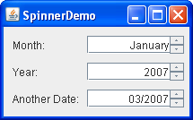

# JSpinner

- [JSpinner](#jspinner)
  - [简介](#简介)
  - [创建 JSpinner](#创建-jspinner)
  - [JSpinner 属性](#jspinner-属性)
  - [使用标准 Spinner Model 和 Editor](#使用标准-spinner-model-和-editor)
  - [参考](#参考)


## 简介

spinner 类似 combo-box 和 list，允许用户从一系列值中选择。与可编辑 combo-box 一样，spinner 允许用户直接输入值。与 combo-box 不同的是，spinner 没有下拉框。

spinner 是复合组件，包含三部分：两个按钮和一个 editor。editor 可以是任何 `JComponent`，默认实现为包含 `JFormattedTextField` 的 Panel。

spinner 的可能值和当前值由 model 管理。

下面包含三个 spinner，用于指定日期：



创建 spinner：

```java
String[] monthStrings = getMonthStrings(); //get month names
SpinnerListModel monthModel = new SpinnerListModel(monthStrings); // 先创建模型
JSpinner spinner = new JSpinner(monthModel);
```

完整代码：

```java
import javax.swing.*;
import java.awt.*;
import java.util.Calendar;
import java.util.Date;

public class SpinnerDemo extends JPanel {

    public SpinnerDemo(boolean cycleMonths) {
        super(new SpringLayout());

        String[] labels = {"Month: ", "Year: ", "Another Date: "};
        int numPairs = labels.length;
        Calendar calendar = Calendar.getInstance();

        //Add the first label-spinner pair.
        String[] monthStrings = getMonthStrings(); //get month names
        SpinnerListModel monthModel;
        if (cycleMonths) { // 使用自定义模型
            monthModel = new CyclingSpinnerListModel(monthStrings);
        } else { // 使用标准模型
            monthModel = new SpinnerListModel(monthStrings);
        }
        JSpinner spinner = addLabeledSpinner(this,
                labels[0],
                monthModel);
        // Tweak the spinner's formatted text field.
        JFormattedTextField ftf = getTextField(spinner);
        if (ftf != null) {
            ftf.setColumns(8); //specify more width than we need
            ftf.setHorizontalAlignment(JTextField.RIGHT);
        }

        //Add second label-spinner pair.
        int currentYear = calendar.get(Calendar.YEAR);
        SpinnerModel yearModel = new SpinnerNumberModel(currentYear, //initial value
                currentYear - 100, //min
                currentYear + 100, //max
                1);                //step
        //If we're cycling, hook this model up to the month model.
        if (monthModel instanceof CyclingSpinnerListModel) {
            ((CyclingSpinnerListModel) monthModel).setLinkedModel(yearModel);
        }
        spinner = addLabeledSpinner(this, labels[1], yearModel);
        //Make the year be formatted without a thousands separator.
        spinner.setEditor(new JSpinner.NumberEditor(spinner, "#"));


        //Add the third label-spinner pair.
        Date initDate = calendar.getTime();
        calendar.add(Calendar.YEAR, -100);
        Date earliestDate = calendar.getTime();
        calendar.add(Calendar.YEAR, 200);
        Date latestDate = calendar.getTime();
        SpinnerModel dateModel = new SpinnerDateModel(initDate,
                earliestDate,
                latestDate,
                Calendar.YEAR);//ignored for user input
        spinner = addLabeledSpinner(this, labels[2], dateModel);
        spinner.setEditor(new JSpinner.DateEditor(spinner, "MM/yyyy"));

        //Lay out the panel.
        SpringUtilities.makeCompactGrid(this,
                numPairs, 2, //rows, cols
                10, 10,        //initX, initY
                6, 10);       //xPad, yPad
    }

    /**
     * Return the formatted text field used by the editor, or
     * null if the editor doesn't descend from JSpinner.DefaultEditor.
     */
    public JFormattedTextField getTextField(JSpinner spinner) {
        JComponent editor = spinner.getEditor();
        if (editor instanceof JSpinner.DefaultEditor) {
            return ((JSpinner.DefaultEditor) editor).getTextField();
        } else {
            System.err.println("Unexpected editor type: "
                    + spinner.getEditor().getClass()
                    + " isn't a descendant of DefaultEditor");
            return null;
        }
    }

    /**
     * DateFormatSymbols returns an extra, empty value at the
     * end of the array of months.  Remove it.
     */
    static protected String[] getMonthStrings() {
        String[] months = new java.text.DateFormatSymbols().getMonths();
        int lastIndex = months.length - 1;

        if (months[lastIndex] == null
                || months[lastIndex].length() == 0) { //last item empty
            String[] monthStrings = new String[lastIndex];
            System.arraycopy(months, 0, monthStrings, 0, lastIndex);
            return monthStrings;
        } else { // last item not empty
            return months;
        }
    }

    static protected JSpinner addLabeledSpinner(Container c, String label,
            SpinnerModel model) {
        JLabel l = new JLabel(label);
        c.add(l);

        JSpinner spinner = new JSpinner(model);
        l.setLabelFor(spinner);
        c.add(spinner);

        return spinner;
    }

    private static void createAndShowGUI() {
        JFrame frame = new JFrame("SpinnerDemo");
        frame.setDefaultCloseOperation(JFrame.EXIT_ON_CLOSE);

        frame.add(new SpinnerDemo(false));

        frame.pack();
        frame.setVisible(true);
    }

    public static void main(String[] args) {
        SwingUtilities.invokeLater(() -> {
            //Turn off metal's use of bold fonts
            UIManager.put("swing.boldMetal", Boolean.FALSE);
            createAndShowGUI();
        });
    }
}
```

## 创建 JSpinner

```java
public JSpinner()
JSpinner spinner = new JSpinner();

public JSpinner(SpinnerModel model)
SpinnerModel model = new SpinnerListModel(args);
JSpinner spinner = new JSpinner(model);
```
 
`SpinnerModel` 有三个子类：`SpinnerListModel`, `SpinnerNumberModel` 和 `SpinnerDateModel`。默认为 `SpinnerNumberModel`。

## JSpinner 属性

|属性|类型|权限|
|---|---|---|
|accessibleContext AccessibleContext Read-only|
|changeListeners ChangeListener[ ] Read-only|
|editor JComponent Read-write bound|
|model SpinnerModel Read-write bound|
|nextValue Object Read-only|
|previousValue Object Read-only|
|UI SpinnerUI Read-write|
|UIClassID String Read-only|
|value Object Read-write|


## 使用标准 Spinner Model 和 Editor

Swing API 提供了三种 Spinner 模型：

**SpinnerListModel**

`SpinnerListModel` 的值由数组或 List 定义。上例展示 "Month:" 的 spinner 就是该类型。

**SpinnerNumberModel**

`SpinnerNumberModel` 支持 double, int, Number 序列。可以指定：min, max 和 step 值。上例的 Year spinner 使用的该模型：

```java
SpinnerModel yearModel = new SpinnerNumberModel(currentYear, //initial value
        currentYear - 100, //min
        currentYear + 100, //max
        1);                //step
```

**SpinnerDateModel**

`SpinnerDateModel` 是专门为 `Date` 设计的。可以指定 min 和 max date，以及 spinner 调整的字段，如 `Calendar.YEAR`。


## 参考

- https://docs.oracle.com/javase/tutorial/uiswing/components/spinner.html