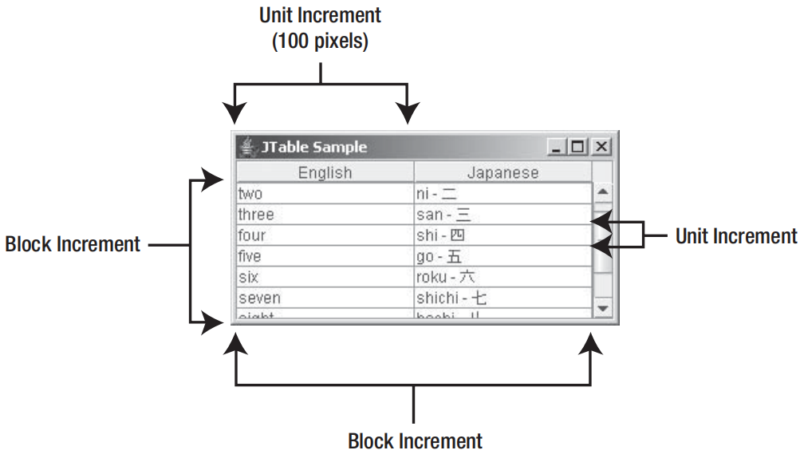
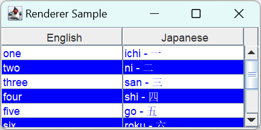

# 表格

2024-01-19
@author Jiawei Mao
***
## 简介

`JTable` 用于显示和编辑表格数据。其基本结构为：

- 标题行（头部）
- 表格列
- 单元格

相关类在 `javax.swing.table` 包中：

- `ListSelectionModel`：选择模型
- `TableCellRenderer`：绘制 cell，默认实现 `DefaultTableCellRenderer` 为 `JLabel` 子类
- `TableModel`：管理数据
  - `AbstractTableModel` 提供了实现基础，实现了数据存储以外的部分
  - `DefaultTableModel` 提供了 `TableModel` 的默认实现，采用 Vector 存储数据
  - 如果数据存储类型不是 `Vector`，扩展 `AbstractTableModel` 是最佳选择
- `TableColumnModel`：提供了按 column 管理数据的模型
  - `DefaultTableColumnModel` 为默认实现
  - 与 `TableColumn` 类一起，用于 column 的管理和操作
  - `TableColumnModel` 使用另一个 `ListSelectionModel` 来管理 column 的选择
- 每个 column 的顶部为标题。`TableColumn` 使用 `JTableHeader` 类绘制 column 标题文本。不过，必须将 `JTable` 放在 `JScrollPane` 中才能看到默认标题。
- `JTable` 中的 cell 可以编辑。对可编辑 cell，如何编辑取决于 `TableCellEditor` 实现，如 `DefaultCellEditor` 扩展 `AbstractCellEditor`，为 Table 和 Tree 提供 cell-editor。

没有单独处理 row 的类，对 row 只能逐个 cell 处理。`JTable` 内部使用 `SizeSequence` 工具类处理可变高度 rows，不需要自己操作。

## JTable 类

### 创建 JTable

`JTable` 提供了 7 个构造函数。

- `public JTable()`

```java
JTable table = new JTable();
```

创建空表格。

- `public JTable(int rows, int columns)`

```java
JTable table = new JTable(2, 3);
```

指定行数和列数的空表格。Table cell 默认可编辑，通过 `JTable.setValueAt(Object value, int row, int column)` 可以修改 cell 值。

- `public JTable(Object rowData[][], Object columnNames[])`

```java
Object rowData[][] = {
        {"Row1-Column1", "Row1-Column2", "Row1-Column3"},
        {"Row2-Column1", "Row2-Column2", "Row2-Column3"}
};
Object columnNames[] = {"Column One", "Column Two", "Column Three"};
JTable table = new JTable(rowData, columnNames);
```

当已有数据，可以直接使用数据创建 `JTable`，而无需创建 `TableModel`。

- `public JTable(Vector rowData, Vector columnNames)`

```java
Vector rowOne = new Vector();
rowOne.addElement("Row1-Column1");
rowOne.addElement("Row1-Column2");
rowOne.addElement("Row1-Column3");
Vector rowTwo = new Vector();
rowTwo.addElement("Row2-Column1");
rowTwo.addElement("Row2-Column2");
rowTwo.addElement("Row2-Column3");
Vector rowData = new Vector();
rowData.addElement(rowOne);
rowData.addElement(rowTwo);
Vector columnNames = new Vector();
columnNames.addElement("Column One");
columnNames.addElement("Column Two");
columnNames.addElement("Column Three");
JTable table = new JTable(rowData, columnNames);
```

直接使用数据创建 JTable 很方便，缺点是：

- cell 自动可编辑
- 所有数据作为字符串处理，例如，对 boolean 数据，使用复选框可能更直观，但这种方式只能以字符串显示
- 需要提前就数据转换为数组或向量

如果想绕过这些问题，可以使用 `TableModel`。

- `public JTable(TableModel model)`

```java
TableModel model = new DefaultTableModel(rowData, columnNames);
JTable table = new JTable(model);
```

- `public JTable(TableModel model, TableColumnModel columnModel)`

```java
// Swaps column order
TableColumnModel columnModel = new DefaultTableColumnModel();
TableColumn firstColumn = new TableColumn(1);
firstColumn.setHeaderValue(headers[1]);
columnModel.addColumn(firstColumn);
TableColumn secondColumn = new TableColumn(0);
secondColumn.setHeaderValue(headers[0]);
columnModel.addColumn(secondColumn);
JTable table = new JTable(model, columnModel);
```

- `public JTable(TableModel model, TableColumnModel columnModel, ListSelectionModel selectionModel)`

```java
// Set single selection mode
ListSelectionModel selectionModel = new DefaultListSelectionModel();
selectionModel.setSelectionMode(ListSelectionModel.SINGLE_SELECTION);
JTable table = new JTable(model, columnModel, selectionModel);
```

使用 `TableModel`, `TableColumnModel` 和 `ListSelectionModel` 创建 `JTable`，缺少的参数使用默认设置。例如：

- `TableColumnModel` 的默认值为 `DefaultTableColumnModel`，并使用 `TableModel` 的 column 顺序自动填充 `TableColumn`。
- `ListSelectionModel` 默认实现为多选模式，可以选择不连续的 rows

### 滚动 JTable

`JTable` 实现了 `Scrollable` 接口，应该放在 `JScrollPane` 中。常用代码：

```java
JTable table = new JTable(...);
JScrollPane scrollPane = new JScrollPane(table);
```

如下所示：

![[images/Pasted image 20240119123740.png|400]]

这是两个相同的表格，上面的表格直接添加到面板，第二个表格添加到 `JScrollPane` 中。主要差别：不放在 `JScrollPane` 中，`JTable` 的标题行不可见，且不能调整大小。

`JTable` 实现 `Scrollable` 接口，其 `getPreferredScrollableViewportSize` 返回 view-port 的首选尺寸，默认 (450, 400)，上图表格 2 即以该尺寸显示。

`boolean getScrollableTracksViewportWidth()` 方法，设置表格宽度是否与 view-port 宽度相同。

**示例：** 上面两个表格的实现代码

```java
import javax.swing.*;
import java.awt.*;

public class ScrollTableDemo1 extends JFrame
{
    public ScrollTableDemo1() throws HeadlessException {
        Container contentPane = getContentPane();
        contentPane.setLayout(new FlowLayout());
        contentPane.add(new JTable(10, 10));
        contentPane.add(new JScrollPane(new JTable(10, 10)));
    }

    public static void main(String[] args) {
        EventQueue.invokeLater(() -> {
            ScrollTableDemo1 demo1 = new ScrollTableDemo1();
            demo1.setDefaultCloseOperation(JFrame.EXIT_ON_CLOSE);
            demo1.setVisible(true);
        });
    }
}
```

### 手动定位 JTable 视图

将 `JTable` 放在 `JScrollPane` 中，默认位置满足左上角显示第一行和第一列。如果需要将表格调整会初始位置，可以将 viewport 位置设置为 (0,0)：

```java
scrollPane.getViewport().setViewPosition(new Point(0,0));
```

`Scrollable` 接口定义了两个方法：

- `getScrollableBlockIncrement`
- `getScrollableUnitIncrement`

它们定义表格的块增量和单元增量。

- block-increment 值为 viewport 的可见宽度和高度
- 对水平滚动，unit-increment 为 100 像素
- 对垂直滚动，单元增量为单个 row 的高度



下面是将 `JScrollPane` 作为表格容器的典型代码：

```java
JScrollPane scrollPane = new JScrollPane(table); // 将表格添加到滚动面板
table.setFillsViewportHeight(true);
```

`JTable.setFillsViewportHeight` 设置 `fillsViewportHeight` 属性。该属性为 `true` 时，表格会使用容器整个高度。

`JScrollPane` 自动将表格的标题放在视图的顶部。滚动表格时，column-names 保持可见。

如果不使用滚动窗格，则需要手动设置表格的标题和内容：

```java
container.setLayout(new BorderLayout());
container.add(table.getTableHeader(), BorderLayout.PAGE_START);
container.add(table, BorderLayout.CENTER);
```

### 删除 column headers

`JScrollPane` 中放置 `JTable` 会自动为不同 column-names 生成 column-headers。如果不想要 column-headers，删除的方法有多种。

- 提供空字符串作为 column-names

在 `JTable(Object rowData[][], Object columnNames[])` 构造函数中，将每个 column-names 都设置为空字符串：

```java
Object rowData[][] = {
    {"Row1-Column1", "Row1-Column2", "Row1-Column3"},
    {"Row2-Column1", "Row2-Column2", "Row2-Column3"}
};
Object columnNames[] = { "", "", ""};
JTable table = new JTable(rowData, columnNames);
JScrollPane scrollPane = new JScrollPane(table);
```

这种方法在删除 column-header 的同时删除了 column 的描述信息。

- 直接隐藏 column-headers

```java
table.setTableHeader(null);
```

也可以通过扩展 JTable 并重写 `configureEnclosingScrollPane()` 来删除 column-headers，或者通过 `TableColumn` 实现。

调用 `scrollPane.setColumnHeaderView(null)` 不能删除 column-header，而是会使 `JScrollPane` 使用默认标题。

## JTable 属性

使用 `public void setRowHeight(int row, int rowHeight)` 可以设置 row 高度，即 `JTable` row 的高度不固定。

`JTable` 的属性可以分为三类：显示设置、选择设置和自动调整大小设置。

### 显示设置

除了从 `Component` 继承的 `foreground` 和 `background` 属性，还有修改选择的前景（`selectionForeground`）和背景色（`selectionBackground`）。

还可以控制显示哪些网格线（`showGrid`），以及网格线颜色（`gridColor`）。

`intercellSpacing` 属性处理 table-cell 内的多余空间。

### 选择模式

`JTable` 支持三种选择模式，可以选择一行、一列或一个 cell。这三个设置由 `rowSelectionAllowed`、`columnSelectionAllowed` 和 `cellSelectionEnabled` 属性控制。

默认为 row 选择模式，因为 `ListSelectionModel` 默认多选，所以可以一次选择多行。

通过 `JTable` 的 `selectionMode` 属性可以修改选择模式。当同时启用 row 和 column 选择，cell 选择模式自动启用。选择指示的最后一个 cell 会有标识，称为 *lead-selection*，也称为 *current-cell* 或 *focus-cell*。

用户可以通过鼠标和键盘进行选择：

|操作|鼠标|键盘|
|---|---|---|
|选择单行|点击|上下箭头|
|选择连续多行|Shift+点击或拖动|Shift+上下箭头|
|不连续选择多行|Ctrl+点击|上下箭头移动 focus-cell，使用空格添加选择，或 Ctrl+空格切换选择|

如果对 `JTable` 的 row 或 column 选择感兴趣，可以使用 `JTable` 的 6 个相关属性进行查询：

- selectedColumnCount
- selectedColumn
- selectedColumns
- selectedRowCount
- selectedRow
- selectedRows

`ListSelectionModel` 类为不同选择模式提供了常量。

- `MULTIPLE_INTERVAL_SELECTION` (默认)
- `SINGLE_INTERVAL_SELECTION`
- `SINGLE_SELECTION`

`JTable` 对行和列有独立的选择模型：

- row 选择模型保存在 `JTable` 的 `selectionModel` 属性
- column 选择模型保存在 `TableColumnModel` 中

但设置 `JTable` 的 `selectionMode` 时，会同时设置这两个选择模式。

下面是 `DefaultListSelectionModel` 提供的查询选择的属性：

|属性|类型|权限|
|---|---|---|
|anchorSelectionIndex|int|Read-write|
|leadAnchorNotificationEnabled|boolean|Read-write|
|leadSelectionIndex|int|Read-write|
|listSelectionListeners|ListSelectionListener[]|Read-only|
|maxSelectionIndex|int|Read-only|
|minSelectionIndex|int|Read-only|
|selectionEmpty|boolean|Read-only|
|selectionModel|int|Read-write|
|valueIsAdjusting|boolean|Read-write|

如果想直到选择时间何时发生，可以向 `ListSelectionModel` 注册 `ListSelectionListener`。

在 `JList` 中有展示 `ListSelectionListener` 的使用。

### 自动调整大小模式

`JTable` 余下属性处理 column-resize 行为。

auto-resize 模式常量：

|模式|说明|
|---|---|
|`AUTO_RESIZE_ALL_COLUMNS`|按比例调整所有 column 宽度|
|`AUTO_RESIZE_LAST_COLUMN`|仅调整最右侧 column 的宽度，如果最右侧 column 没有可用空间，则调整前一列的宽度，直到有足够空间|
|`AUTO_RESIZE_NEXT_COLUMN`|如果减少列宽度，则相邻列增长以填充未使用空间；如果增加一列宽度，相邻列缩小|
|`AUTO_RESIZE_OFF`|关闭用户调整大小的功能，但仍可以通过编程方式调整|
|`AUTO_RESIZE_SUBSEQUENT_COLUMNS`|按比例调整修改列右侧的所有列，默认|

示例：

```java
import javax.swing.*;
import java.awt.*;
import java.awt.event.ItemListener;

public class ResizeTable {

    public static void main(String[] args) {
        final Object rowData[][] = {
                {"1", "one", "ichi - \u4E00", "un", "I"},
                {"2", "two", "ni - \u4E8C", "deux", "II"},
                {"3", "three", "san - \u4E09", "trois", "III"},
                {"4", "four", "shi - \u56DB", "quatre", "IV"},
                {"5", "five", "go - \u4E94", "cinq", "V"},
                {"6", "six", "roku - \u516D", "treiza", "VI"},
                {"7", "seven", "shichi - \u4E03", "sept", "VII"},
                {"8", "eight", "hachi - \u516B", "huit", "VIII"},
                {"9", "nine", "kyu - \u4E5D", "neur", "IX"},
                {"10", "ten", "ju - \u5341", "dix", "X"}
        };

        final String columnNames[] = {"#", "English", "Japanese", "French", "Roman"};
        Runnable runner = () -> {
            final JTable table = new JTable(rowData, columnNames);
            JScrollPane scrollPane = new JScrollPane(table);

            String modes[] = {"Resize All Columns", "Resize Last Column",
                    "Resize Next Column", "Resize Off", "Resize Subsequent Columns"};
            final int modeKey[] = {
                    JTable.AUTO_RESIZE_ALL_COLUMNS,
                    JTable.AUTO_RESIZE_LAST_COLUMN,
                    JTable.AUTO_RESIZE_NEXT_COLUMN,
                    JTable.AUTO_RESIZE_OFF,
                    JTable.AUTO_RESIZE_SUBSEQUENT_COLUMNS};
            JComboBox resizeModeComboBox = new JComboBox(modes);
            int defaultMode = 4;
            table.setAutoResizeMode(modeKey[defaultMode]);
            resizeModeComboBox.setSelectedIndex(defaultMode);
            ItemListener itemListener = e -> {
                JComboBox source = (JComboBox) e.getSource();
                int selectedIndex = source.getSelectedIndex();
                table.setAutoResizeMode(modeKey[selectedIndex]);
            };
            resizeModeComboBox.addItemListener(itemListener);

            JFrame frame = new JFrame("Resizing Table");
            frame.setDefaultCloseOperation(JFrame.EXIT_ON_CLOSE);

            frame.add(resizeModeComboBox, BorderLayout.NORTH);
            frame.add(scrollPane, BorderLayout.CENTER);
            frame.setSize(300, 150);
            frame.setVisible(true);
        };
        EventQueue.invokeLater(runner);
    }
}
```


## 渲染 Table cell

表格数据默认由 `JLabel` 渲染。表格中的所有数据都渲染为字符串。`JTable` 中为 `Boolean`, `Date`, `Number` 等实现了额外的 renderers，但是默认没有启用。

### TableCellRenderer 和 DefaultTableCellRenderer

`TableCellRenderer` 只定义了一个方法：

```java
public interface TableCellRenderer {
    Component getTableCellRendererComponent(JTable table, Object value,
                                            boolean isSelected, boolean hasFocus,
                                            int row, int column);
}
```

`getTableCellRendererComponent` 参数包含 cell 状态，如是否被选中，是否持有焦点，以及 cell 位置，这些信息辅助实现特定 renderer。

例如，根据所在 row 切换颜色：


```java
public class EvenOddRenderer implements TableCellRenderer {

    public static final DefaultTableCellRenderer TABLE_CELL_RENDERER = new DefaultTableCellRenderer();

    @Override
    public Component getTableCellRendererComponent(JTable table, Object value, boolean isSelected, boolean hasFocus,
            int row, int column) {
        Component renderer = TABLE_CELL_RENDERER.getTableCellRendererComponent(table, value, isSelected, hasFocus, row, column);
        Color foreground, background;
        if (isSelected) {
            foreground = Color.YELLOW;
            background = Color.GREEN;
        } else {
            if (row % 2 == 0) {
                foreground = Color.BLUE;
                background = Color.WHITE;
            } else {
                foreground = Color.WHITE;
                background = Color.BLUE;
            }
        }
        renderer.setForeground(foreground);
        renderer.setBackground(background);
        return renderer;
    }
}
```

可以为特定类或特定 column 定制 renderer。例如，为 `JTable` 设置默认 renderer：

```java
TableCellRenderer renderer = new EvenOddRenderer();
table.setDefaultRenderer(Object.class, renderer);
```

设置后，对没有更具体类别的 column，使用 EvenOddRenderer 渲染。`TableMode.getColumnClass()` 返回 column 的类别。`DefaultTableModel` 对所有 column 都返回 `Object.class`，因此通过上述设置，EvenOddRenderer 被用于渲染所有 cells。

!!! note
    一个 renderer 组件用于特定类的所有 columns 的所有 cells，而不是为每个 cell 单独创建 renderer。

**示例：** 使用 EvenOddRenderer

```java
import javax.swing.*;
import javax.swing.table.TableCellRenderer;
import java.awt.*;

public class RendererSample {

    public static void main(String[] args) {
        final Object rows[][] = {
                {"one", "ichi - \u4E00"},
                {"two", "ni - \u4E8C"},
                {"three", "san - \u4E09"},
                {"four", "shi - \u56DB"},
                {"five", "go - \u4E94"},
                {"six", "roku - \u516D"},
                {"seven", "shichi - \u4E03"},
                {"eight", "hachi - \u516B"},
                {"nine", "kyu - \u4E5D"},
                {"ten", "ju - \u5341"}
        };
        final Object[] headers = {"English", "Japanese"};
        Runnable runner = () -> {
            JFrame frame = new JFrame("Renderer Sample");
            frame.setDefaultCloseOperation(JFrame.EXIT_ON_CLOSE);
            JTable table = new JTable(rows, headers);
            TableCellRenderer renderer = new EvenOddRenderer();
            table.setDefaultRenderer(Object.class, renderer);
            JScrollPane scrollPane = new JScrollPane(table);
            frame.add(scrollPane, BorderLayout.CENTER);
            frame.setSize(300, 150);
            frame.setVisible(true);
        };
        EventQueue.invokeLater(runner);
    }
}
```



### 使用 Tooltips

`TableCellRenderer` 默认会显示配置的 tooltip。和 `JTree` 不同，不需要手动调用 `ToolTipManager` 注册。

通过如下方式取消 tooltip，可以提高表格响应速度：

```java
// Explicitly
ToolTipManager.sharedInstance().unregisterComponent(aTable);
// Implicitly
yourTable.setToolTipText(null);
```

## JTable 事件

没有可以直接注册到 `JTable` 的事件。需要注册 `JTable` 的模型类：`TableModel`, `TableColumnModel` 或 `ListSelectionModel`。

## 自定义 JTable Laf

每个 Swing Laf 提供不同的 `JTable` 外观的一组 `UIResource` 值。 

JTable 的 UIResource 相关属性如下表所示，共 21 个：

|Property String|类型|
|---|---|
|able.actionMap|ActionMap|
|able.ancestorInputMap|InputMap|
|able.ancestorInputMap.RightToLeft|InputMap|
|able.background|Color|
|able.darkShadow|Color|
|able.focusCellBackground|Color|
|able.focusCellForeground|Color|
|able.focusCellHighlightBorder|Border|
|able.font|Font|
|able.foreground|Color|
|able.gridColor|Color|
|able.highlight|Color|
|able.light|Color|
|able.rendererUseTableColors|Boolean|
|able.rendererUseUIBorder|Boolean|
|able.rowHeight|Integer|
|able.scrollPaneBorder|Border|
|able.selectionBackground|Color|
|able.selectionForeground|Color|
|able.shadow|Color|
|ableUI|String|
## TableModel 接口

表格维护了三个不同的模型：

- 表格模型（`TableModel`）：负责管理表格数据，提供标题，支持编辑 `JTable` 
- 表格列模型（`TableColumnModel`）：负责选择 column
- 列表选择模型（`ListSelectionModel`）：负责选择 row

`JTable` 实现了 `ListSelectionListener`, `TableModelListener` 和 `TableColumnModelListener` 接口来监听这些模型。

| 模型 | 功能 | 事件 |
| ---- | ---- | ---- |
| `ListSelectionModel` | 维护行选取模式、选取间隔以及是否正在调整选择 | `ListSelectionEvent` |
| `TableColumnModel` | 存储表格列；添加、移动和删除列；跟踪列属性：选取、边距、索引、总宽度和列数 | `TableColumnModelEvent`, `ChangeEvent` |
| `TableModel` | 为单元数据、数据类型、行数、列数及是否可编辑提供访问方法 | `TableModelEvent` |

`TableModel` 接口定义表格数据操作和获取方式，在单元值变化时把 `TableModelEvent` 发送给 `TableModelListener`，其定义如下：

```java
public interface TableModel{

    // 属性
    public int getRowCount();
    public int getColumnCount();

    // 标题
    public String getColumnName(int columnIndex);
    public Class<?> getColumnClass(int columnIndex);

    // cell 值和可编辑性
    public boolean isCellEditable(int rowIndex, int columnIndex);
    public Object getValueAt(int rowIndex, int columnIndex);
    public void setValueAt(Object aValue, int rowIndex, int columnIndex);

    // Listeners
    public void addTableModelListener(TableModelListener l);
    public void removeTableModelListener(TableModelListener l);
}
```

### AbstractTableModel 类

`AbstractTableModel` 提供了 `TableModel` 的基本实现，包括 `TableModelListener` 的管理功能。继承该类，只需要提供数据：

- 提供 `rowCount` 和 `columnCount`
- 特定位置的值 `getValueAt`
- `column` 标题默认为 A, B, C,..., Z, AA, BB 等
- 默认只读，除非覆盖 `isCellEditable` 方法

即实现如下方法：

```java
public int getRowCount();
public int getColumnCount();
public Object getValueAt(int rowIndex, int columnIndex);
```

如果继承 `AbstractTableModel` 并使数据模型可编辑，则需要调用 `AbstractTableModel` 的 `fireXXX()` 系列方法，确保当模型数据发生变化时，触发合适的事件通知 `TableModelListener`：

```java
public void fireTableCellUpdated(int row, int column) // 单元值更新
public void fireTableChanged(TableModelEvent e);
public void fireTableDataChanged(); // 任何或全部单元值更新
public void fireTableRowsDeleted(int firstRow, int lastRow); // 指定范围 row 被删除
public void fireTableRowsInserted(int firstRow, int lastRow); // 插入 row
public void fireTableRowsUpdated(int firstRow, int lastRow);
public void fireTableStructureChanged();
```

为了重用现有数据结构，经常需要继承 `AbstractTableModel`。

```ad-tip
建议通过继承 `AbstractTableModel` 实现自定义 `TableModel`，而不是直接实现 `TableModel` 接口，从头开始实现。
```


**示例：** 使用数组为 `AbstractTableModel` 提供数据

```java
public class CreateTable {

    public static void main(String[] args) {
        TableModel model = new AbstractTableModel() {
            Object rowData[][] = {
                    {"one", "ichi"},
                    {"two", "ni"},
                    {"three", "san"},
                    {"four", "shi"},
                    {"five", "go"},
                    {"six", "roku"},
                    {"seven", "shichi"}, {"eight", "hachi"},
                    {"nine", "kyu"},
                    {"ten", "ju"}
            };
            Object columnNames[] = {"English", "Japanese"};

            public String getColumnName(int column) {
                return columnNames[column].toString();
            }

            public int getRowCount() {
                return rowData.length;
            }

            public int getColumnCount() {
                return columnNames.length;
            }

            public Object getValueAt(int row, int col) {
                return rowData[row][col];
            }
        };
        JTable table = new JTable(model);
        JScrollPane scrollPane = new JScrollPane(table);
    }
}
```

#### 固定 column

经常需要固定表格的某些列，例如索引列。要创建不滚动的 column，需要在 `JScrollPane` 的 row 标题视图中放第二个 `JTable`。当用户滚动表格，这两个表要保持同步，且共享 `ListSelectionModel`，在一个表格中选择 row，另一个表的 row 自动被选中。

**示例：** 下表包含一个固定 column 和 4 个滚动 column


水平滚动时，第一列保持不同。

```java
public class FixedTable {
    public static void main(String[] args) {
        final Object rowData[][] = {
                {"1", "one", "ichi", "un", "I", "\u4E00"},
                {"2", "two", "ni", "deux", "II", "\u4E8C"},
                {"3", "three", "san", "trois", "III", "\u4E09"},
                {"4", "four", "shi", "quatre", "IV", "\u56DB"},
                {"5", "five", "go", "cinq", "V", "\u4E94"},
                {"6", "six", "roku", "treiza", "VI", "\u516D"},
                {"7", "seven", "shichi", "sept", "VII", "\u4E03"},
                {"8", "eight", "hachi", "huit", "VIII", "\u516B"},
                {"9", "nine", "kyu", "neur", "IX", "\u4E5D"},
                {"10", "ten", "ju", "dix", "X", "\u5341"}
        };
        final String columnNames[] =
                {"#", "English", "Japanese", "French", "Roman", "Kanji"};

        final TableModel fixedColumnModel = new AbstractTableModel() {
            public int getColumnCount() {
                return 1;
            }

            public String getColumnName(int column) {
                return columnNames[column];
            }

            public int getRowCount() {
                return rowData.length;
            }

            public Object getValueAt(int row, int column) {
                return rowData[row][column];
            }
        };

        final TableModel mainModel = new AbstractTableModel() {
            public int getColumnCount() {
                return columnNames.length - 1;
            }

            public String getColumnName(int column) {
                return columnNames[column + 1];
            }

            public int getRowCount() {
                return rowData.length;
            }

            public Object getValueAt(int row, int column) {
                return rowData[row][column + 1];
            }
        };
        Runnable runner = () -> {
            JTable fixedTable = new JTable(fixedColumnModel);
            fixedTable.setAutoResizeMode(JTable.AUTO_RESIZE_OFF);
            JTable mainTable = new JTable(mainModel);
            mainTable.setAutoResizeMode(JTable.AUTO_RESIZE_OFF);
            ListSelectionModel model = fixedTable.getSelectionModel();
            mainTable.setSelectionModel(model);

            JScrollPane scrollPane = new JScrollPane(mainTable);
            Dimension fixedSize = fixedTable.getPreferredSize();
            JViewport viewport = new JViewport();
            viewport.setView(fixedTable);
            viewport.setPreferredSize(fixedSize);
            viewport.setMaximumSize(fixedSize);
            scrollPane.setCorner(JScrollPane.UPPER_LEFT_CORNER,
                    fixedTable.getTableHeader());
            scrollPane.setRowHeaderView(viewport);
            JFrame frame = new JFrame("Fixed Column Table");
            frame.setDefaultCloseOperation(JFrame.EXIT_ON_CLOSE);
            frame.add(scrollPane, BorderLayout.CENTER);
            frame.setSize(300, 150);
            frame.setVisible(true);
        };
        EventQueue.invokeLater(runner);
    }
}
```

#### 启用默认 table cell renderer

`JTable` 为 `Date` 和 `Number` 类型提供了默认 renderer。下面介绍如何在 `AbstractTableModel` 中启用这些 renderers。

`TableModel` 的 `public Class getColumnClass(int column)` 返回数据模型中指定 column 的类型。如果 `JTable` 为这个特定类型安装了对应的 renderer，就使用该 renderer 显示该类型。`TableModel` 的实现 `AbstractTableModel` 和 `DefaultTableModel` 对所有数据默认返回 `Object.class`。

`AbstractTableModel` 没有尝试猜测 column 中数据类型。但是，如果你知道数据模型中特定 column 是数字、日期或其它类型，则可以让数据模型返回该类型。

下表是 JTable 中预安装的 renderers。假设你有一列是数字，那么可以重写 `getColumnClass()` 让对应列返回 `Number.class`。

|类|Renderer|说明|
|---|---|---|
|Boolean|JCheckBox|Centered|
|Date|JLabel|Right-aligned; uses DateFormat for output|
|Double|JLabel|Right-aligned; uses NumberFormat for output|
|Float|JLabel|Right-aligned; uses NumberFormat for output|
|Icon|JLabel|Centered|
|ImageIcon|JLabel|Centered|
|Number|JLabel|Right-aligned|
|Object|JLabel|Left-aligned|

假设每列只有一种数据类型，则可以采用下列实现方式：

```java
public Class getColumnClass(int column) {
    return (getValueAt(0, column).getClass());
}
```

### DefaultTableModel

`DefaultTableModel` 是 `AbstractTableModel` 的子类，使用 `Vector` 存储数据。如果数据意在合适的数据结构中，则不推荐使用 `DefaultTableModel`，而是扩展 `AbstractTableModel` 更合适。

#### 创建 DefaultTableModel

`DefaultTableModel` 有 6 个构造函数：

```java
public DefaultTableModel()
TableModel model = new DefaultTableModel()

public DefaultTableModel(int rows, int columns)
TableModel model = new DefaultTableModel(2, 3)

public DefaultTableModel(Object rowData[][], Object columnNames[])
Object rowData[][] = {
    {"Row1-Column1", "Row1-Column2", "Row1-Column3"},
    {"Row2-Column1", "Row2-Column2", "Row2-Column3"}};
Object columnNames[] = {"Column One", "Column Two", "Column Three"};
TableModel model = new DefaultTableModel(rowData, columnNames);

public DefaultTableModel(Vector rowData, Vector columnNames)
Vector rowOne = new Vector();
rowOne.addElement("Row1-Column1");
rowOne.addElement("Row1-Column2");
rowOne.addElement("Row1-Column3");
Vector rowTwo = new Vector();
rowTwo.addElement("Row2-Column1");
rowTwo.addElement("Row2-Column2");
rowTwo.addElement("Row2-Column3");
Vector rowData = new Vector();
rowData.addElement(rowOne);
rowData.addElement(rowTwo);
Vector columnNames = new Vector();
columnNames.addElement("Column One");
columnNames.addElement("Column Two");
columnNames.addElement("Column Three");
TableModel model = new DefaultTableModel(rowData, columnNames);

public DefaultTableModel(Object columnNames[], int rows)
TableModel model = new DefaultTableModel(columnNames, 2);
public DefaultTableModel(Vector columnNames, int rows)
TableModel model = new DefaultTableModel(columnNames, 2);
```

其中 4 个构造函数与 JTable 构造函数一致，余下两个允许以固定行数和 column-headers 创建空表格。

创建 DefaultTableModel 后，将其传入 JTable 构造函数创建实际的表格，然后放入 JScrollPane。

#### 填充 DefaultTableModel

添加 columns:

```java
public void addColumn(Object columnName);
public void addColumn(Object columnName, Vector columnData);
public void addColumn(Object columnName, Object columnData[ ]);
```

添加 rows:

```java
public void addRow(Object rowData[]);
public void addRow(Vector rowData);
```

插入 rows：

```java
public void insertRow(int row, Object rowData[ ]);
public void insertRow(int row, Vector rowData);
```

删除 rows:

```java
public void removeRow( int row);
```

替换数据：

```java
public void setDataVector(Object newData[ ][ ], Object columnNames[ ]);
public void setDataVector(Vector newData, Vector columnNames);
```

#### DefaultTableModel 属性

除了从 AbstractTableModel 继承的 rowCount 和 columnCount 属性，DefaultTableModel 还有另外两个属性。

设置 rowCount 属性可以增加或减少表格大小，如果扩展模型，多余的行是空的。

|属性|类型|权限|
|---|---|---|
|columnCount|int|Read-only|
|columnIdentifiers|Vector|Write-only|
|dataVector|Vector|Read-only|
|rowCount|int|Read-write|

#### 创建稀疏 TableModel

默认的 TableModel 适用于充满数据的表格，而对稀疏表格，使用 DefaultTableModel 会浪费大量空间。以每次查找创建一个 Point 的代价，可以创建一个稀疏表格模型。

```java
import javax.swing.table.AbstractTableModel;
import java.awt.*;
import java.util.HashMap;
import java.util.Map;

public class SparseTableModel extends AbstractTableModel {

    private Map<Point, Object> lookup;
    private final int rows;
    private final int columns;
    private final String headers[];

    public SparseTableModel(int rows, String columnHeaders[]) {
        if ((rows < 0) || (columnHeaders == null)) {
            throw new IllegalArgumentException("Invalid row count/columnHeaders");
        }
        this.rows = rows;
        this.columns = columnHeaders.length;
        headers = columnHeaders;
        lookup = new HashMap<>();
    }

    @Override
    public int getRowCount() {
        return rows;
    }

    @Override
    public int getColumnCount() {
        return columns;
    }

    @Override
    public Object getValueAt(int rowIndex, int columnIndex) {
        return lookup.get(new Point(rowIndex, columnIndex));
    }

    public void setValueAt(Object value, int row, int column) {
        if ((rows < 0) || (columns < 0)) {
            throw new IllegalArgumentException("Invalid row/column setting");
        }
        if ((row < rows) && (column < columns)) {
            lookup.put(new Point(row, column), value);
        }
    }
}
```

测试：

```java
String headers[] = { "English", "Japanese"};
TableModel model = new SparseTableModel(10, headers);
JTable table = new JTable(model);
model.setValueAt("one", 0, 0);
model.setValueAt("ten", 9, 0);
model.setValueAt("roku - \ u516D", 5, 1);
model.setValueAt("hachi - \ u516B", 8, 1);
```

#### 使用 TableModelListener 监听 JTable 事件

如果需要动态更新表格数据，则可以使用 `TableModelListener` 监听数据的更改。该接口只有一个方法：

```java
public interface TableModelListener extends java.util.EventListener{
    public void tableChanged(TableModelEvent e);
}
```

`TableModelListener` 收到通知后，可以通过 `TableModelEvent` 了解事件类型以及受影响的行和列的范围。表面是 `TableModelEvent` 提供的信息：

|属性|类型|权限|
|---|---|---|
|column|int|Read-only|
|firstRow|int|Read-only|
|lastRow|int|Read-only|
|type|int|Read-only|

事件类型有三种，为 `TableModelEvent` 的三个常量之一：`INSERT`, `UPDATE`, `DELETE`.

如果 TableModelEvent 的 column 属性为  `ALL_COLUMNS`，表示数据模型中所有 columns 受到影响。

如果 `firstRow` 属性为  `HEADER_ROW`，表示标题发生变化。

### JTable 元素排序

JTable 没有内置排序功能，但是经常需要该功能。

排序不需要更改数据模型，但是需要更改数据模型的视图。可以通过 Decoratoe 模式支持该功能，即使用相同 API，但提供排序功能：

- Component: 定义服务接口，被装饰
- ConcreteComponent：实际被装饰的组件
- Decorator：ConcreteComponent 的抽象包装器，维护服务接口
- ConcreteDecorator(s) [A, B, C, . . .]:通过添加装饰职能扩展 Decorator，同时保持相同的编程接口。它们会将服务请求重定向到 ConcreteComponent

!!! note
    java.io stream 就是采用的 Decorator 模式。各种过滤流向基本流添加功能，并维护相同的 API。

对表格排序，只需要  `Component`, `ConcreteComponent` 和 `Decorator`，因为只有一个 `ConcreteDecorator` 实现:

- `Component` 对应 `TableModel` 接口
- `ConcreteComponent` 对应实际模型
- `Decorator` 为排序模型

为了排序，需要维护真实数据到排序数据的映射。在用户界面，允许用户通过选择 column 标题对特定列进行排序。

将数据模型传给定制的 `TableSorter` 类，对 TableModel 进行装饰，然后使用装饰后的 TableModel 创建 JTable。要启用选择 column 标题排序的功能，需要调用 TableHeaderSorter 类的 install() 方法：

```java
TableSorter sorter = new TableSorter(model);
JTable table = new JTable(sorter);
TableHeaderSorter.install(sorter, table);
```

TableMap 作为代理类，将所有调用传递给合适的 TableModel 类：

```java
import javax.swing.event.TableModelEvent;
import javax.swing.event.TableModelListener;
import javax.swing.table.AbstractTableModel;
import javax.swing.table.TableModel;

public class TableMap extends AbstractTableModel implements TableModelListener
{
    TableModel model;

    public TableModel getModel() {
        return model;
    }

    public void setModel(TableModel model) {
        if (this.model != null) {
            this.model.removeTableModelListener(this);
        }
        this.model = model;
        if (this.model != null) {
            this.model.addTableModelListener(this);
        }
    }

    public Class getColumnClass(int column) {
        return model.getColumnClass(column);
    }

    @Override
    public int getColumnCount() {
        return ((model == null) ? 0 : model.getColumnCount());
    }

    public String getColumnName(int column) {
        return model.getColumnName(column);
    }

    public int getRowCount() {
        return ((model == null) ? 0 : model.getRowCount());
    }

    public Object getValueAt(int row, int column) {
        return model.getValueAt(row, column);
    }

    public void setValueAt(Object value, int row, int column) {
        model.setValueAt(value, row, column);
    }

    public boolean isCellEditable(int row, int column) {
        return model.isCellEditable(row, column);
    }

    public void tableChanged(TableModelEvent tableModelEvent) {
        fireTableChanged(tableModelEvent);
    }
}
```

`TableSorter` 继承 `TableMap`，实现排序逻辑：

```java
import javax.swing.event.TableModelEvent;
import javax.swing.event.TableModelListener;
import javax.swing.table.TableModel;
import java.util.Date;
import java.util.Vector;

public class TableSorter extends TableMap implements TableModelListener
{
    int[] indexes = new int[0];
    Vector sortingColumns = new Vector();
    boolean ascending = true;

    public TableSorter() {
    }

    public TableSorter(TableModel model) {
        setModel(model);
    }

    public void setModel(TableModel model) {
        super.setModel(model);
        reallocateIndexes();
        sortByColumn(0);
        fireTableDataChanged();
    }

    public int compareRowsByColumn(int row1, int row2, int column) {
        Class type = model.getColumnClass(column);
        TableModel data = model;
        // Check for nulls
        Object o1 = data.getValueAt(row1, column);
        Object o2 = data.getValueAt(row2, column);
        // If both values are null return 0
        if (o1 == null && o2 == null) {
            return 0;
        } else if (o1 == null) { // Define null less than everything.
            return -1;
        } else if (o2 == null) {
            return 1;
        }
        if (type.getSuperclass() == Number.class) {
            Number n1 = (Number) data.getValueAt(row1, column);
            double d1 = n1.doubleValue();
            Number n2 = (Number) data.getValueAt(row2, column);
            double d2 = n2.doubleValue();
            return Double.compare(d1, d2);
        } else if (type == String.class) {
            String s1 = (String) data.getValueAt(row1, column);
            String s2 = (String) data.getValueAt(row2, column);
            int result = s1.compareTo(s2);
            return Integer.compare(result, 0);
        } else if (type == java.util.Date.class) {
            Date d1 = (Date) data.getValueAt(row1, column);
            long n1 = d1.getTime();
            Date d2 = (Date) data.getValueAt(row2, column);
            long n2 = d2.getTime();
            return Long.compare(n1, n2);
        } else if (type == Boolean.class) {
            Boolean bool1 = (Boolean) data.getValueAt(row1, column);
            boolean b1 = bool1.booleanValue();
            Boolean bool2 = (Boolean) data.getValueAt(row2, column);
            boolean b2 = bool2.booleanValue();
            if (b1 == b2)
                return 0;
            else if (b1) // Define false < true
                return 1;
            else
                return -1;
        } else {
            Object v1 = data.getValueAt(row1, column);
            String s1 = v1.toString();
            Object v2 = data.getValueAt(row2, column);
            String s2 = v2.toString();
            int result = s1.compareTo(s2);
            if (result < 0)
                return -1;
            else if (result > 0)
                return 1;
            else
                return 0;
        }
    }

    public int compare(int row1, int row2) {
        for (int level = 0, n = sortingColumns.size(); level < n; level++) {
            Integer column = (Integer) sortingColumns.elementAt(level);
            int result = compareRowsByColumn(row1, row2, column);
            if (result != 0) {
                return (ascending ? result : -result);
            }
        }
        return 0;
    }

    public void reallocateIndexes() {
        int rowCount = model.getRowCount();
        indexes = new int[rowCount];
        for (int row = 0; row < rowCount; row++) {
            indexes[row] = row;
        }
    }

    @Override
    public void tableChanged(TableModelEvent tableModelEvent) {
        super.tableChanged(tableModelEvent);
        reallocateIndexes();
        sortByColumn(0);
        fireTableStructureChanged();
    }

    public void checkModel() {
        if (indexes.length != model.getRowCount()) {
            System.err.println("Sorter not informed of a change in model.");
        }
    }

    public void sort() {
        checkModel();
        shuttlesort(indexes.clone(), indexes, 0, indexes.length);
        fireTableDataChanged();
    }

    public void shuttlesort(int[] from, int[] to, int low, int high) {
        if (high - low < 2) {
            return;
        }
        int middle = (low + high) / 2;
        shuttlesort(to, from, low, middle);
        shuttlesort(to, from, middle, high);
        int p = low;
        int q = middle;
        for (int i = low; i < high; i++) {
            if (q >= high || (p < middle && compare(from[p], from[q]) <= 0)) {
                to[i] = from[p++];
            } else {
                to[i] = from[q++];
            }
        }
    }

    private void swap(int first, int second) {
        int temp = indexes[first];
        indexes[first] = indexes[second];
        indexes[second] = temp;
    }

    @Override
    public Object getValueAt(int row, int column) {
        checkModel();
        return model.getValueAt(indexes[row], column);
    }

    @Override
    public void setValueAt(Object aValue, int row, int column) {
        checkModel();
        model.setValueAt(aValue, indexes[row], column);
    }

    public void sortByColumn(int column) {
        sortByColumn(column, true);
    }

    public void sortByColumn(int column, boolean ascending) {
        this.ascending = ascending;
        sortingColumns.removeAllElements();
        sortingColumns.addElement(column);
        sort();
        super.tableChanged(new TableModelEvent(this));
    }
}
```

排序还需要注册 MouseListener，这样选择 table-header 才能触发排序。鼠标点击升序，按 Shift 点击降序：

```java
import javax.swing.*;
import javax.swing.table.JTableHeader;
import javax.swing.table.TableColumnModel;
import java.awt.event.InputEvent;
import java.awt.event.MouseAdapter;
import java.awt.event.MouseEvent;

public class TableHeaderSorter extends MouseAdapter
{
    private TableSorter sorter;
    private JTable table;

    private TableHeaderSorter() {
    }

    public static void install(TableSorter sorter, JTable table) {
        TableHeaderSorter tableHeaderSorter = new TableHeaderSorter();
        tableHeaderSorter.sorter = sorter;
        tableHeaderSorter.table = table;
        JTableHeader tableHeader = table.getTableHeader();
        tableHeader.addMouseListener(tableHeaderSorter);
    }

    public void mouseClicked(MouseEvent mouseEvent) {
        TableColumnModel columnModel = table.getColumnModel();
        int viewColumn = columnModel.getColumnIndexAtX(mouseEvent.getX());
        int column = table.convertColumnIndexToModel(viewColumn);
        if (mouseEvent.getClickCount() == 1 && column != -1) {
            System.out.println("Sorting ...");
            boolean ascending = (mouseEvent.getModifiersEx() & InputEvent.SHIFT_DOWN_MASK) == InputEvent.SHIFT_DOWN_MASK;
            sorter.sortByColumn(column, ascending);
        }
    }
}
```

## TableColumnModel

TableColumnModel 管理 JTable 显示的 columns。在创建 JTable 时，组件会根据数模型创建默认的 TableColumnModel。该接口通常在后台运行，不需要太多关注。

如果在设置 JTable 的数据模型之前将 JTable 的 autoCreateColumnsFromModel 属性设置为 true，则会自动创建 TableColumnModel。如果需要重置当前设置，也可以手动让 JTable 创建默认 TableColumnModel。`createDefaultColumnsFromModel()` 负责创建默认 TableColumnModel 并分配给 JTable。

所有这些都自动完成，那么，为什么还需要学习 TableColumnModel？当不喜欢默认配置，或者需要手动移动内容时，就需要使用此接口。除了维护一组 TableColumn 对象，TableColumnModel 还管理了另一个 ListSelectionModel，从而允许用户选择行或列。

TableColumnModel 定义：

```java
public interface TableColumnModel
{
    // 修改模型
    public void addColumn(TableColumn aColumn);
    public void removeColumn(TableColumn column);
    public void moveColumn(int columnIndex, int newIndex);
    public void setColumnMargin(int newMargin);

    // 查询模型
    public int getColumnCount();
    public Enumeration<TableColumn> getColumns();
    public int getColumnIndex(Object columnIdentifier);
    public TableColumn getColumn(int columnIndex);
    public int getColumnMargin();
    public int getColumnIndexAtX(int xPosition);
    public int getTotalColumnWidth();

    // 选择
    public void setColumnSelectionAllowed(boolean flag);
    public boolean getColumnSelectionAllowed();
    public int[] getSelectedColumns();
    public int getSelectedColumnCount();
    public void setSelectionModel(ListSelectionModel newModel);
    public ListSelectionModel getSelectionModel();

    // Listeners
    public void addColumnModelListener(TableColumnModelListener x);
    public void removeColumnModelListener(TableColumnModelListener x);
}
```

### DefaultTableColumnModel

DefaultTableColumnModel 类定义了系统使用的 TableColumnModel 实现。它通过跟踪 margins, width, selection 和 quantity 来描述 TableColumn 对象的外观。下表是 DefaultTableColumnModel 的属性：

|属性|类型|权限|
|---|---|---|
|columnCount|int|Read-only|
|columnMargin|int|Read-write|
|columnModelListeners|TableColumnModelListener[ ]|Read-only|
|columns|Enumeration|Read-only|
|columnSelectionAllowed|boolean|Read-write|
|selectedColumnCount|int|Read-only|
|selectedColumns|int[ ]|Read-only|
|selectionModel|ListSelectionModel|Read-write|
|totalColumnWidth|int|Read-only|

除了这些属性，还可以使用如下方法添加、删除或移动 column：

```java
public void addColumn(TableColumn newColumn);
public void removeColumn(TableColumn oldColumn);
public void moveColumn(int currentIndex, int newIndex);
```

### TableColumnModelListener

使用 TableColumnModel 的一个主要原因可能是使用 TableColumnModelListener 监听 TableColumnModelEvent 事件。添加、删除、移动和选择 columns，以及修改 column margins 都会触发该事件。

```java
public interface TableColumnModelListener extends java.util.EventListener
{
    public void columnAdded(TableColumnModelEvent e);

    public void columnRemoved(TableColumnModelEvent e);

    public void columnMoved(TableColumnModelEvent e);

    public void columnMarginChanged(ChangeEvent e);

    public void columnSelectionChanged(ListSelectionEvent e);
}
```

TableColumnModelEvent 中定义了受影响的 columns 范围：

|属性|类型|权限|
|---|---|---|
|fromIndex|int|Read-only|
|toIndex|int|Read-only|

添加 TableColumnModelListener 的方式：

```java
TableColumnModel columnModel = table.getColumnModel();
columnModel.addColumnModelListener(...);
```

例如：

```java
TableColumnModelListener tableColumnModelListener =
    new TableColumnModelListener() {
        public void columnAdded(TableColumnModelEvent e) {
            System.out.println("Added");
        }
        public void columnMarginChanged(ChangeEvent e) {
            System.out.println("Margin");
        }
        public void columnMoved(TableColumnModelEvent e) {
            System.out.println("Moved");
        }
        public void columnRemoved(TableColumnModelEvent e) {
            System.out.println("Removed");
        }
        public void columnSelectionChanged(ListSelectionEvent e) {
            System.out.println("Selected");
    }
};
```

完整代码：

```java
public class ColumnModelSample
{
    public static void main(String[] args) {
        final Object[][] rows = {
                {"one", "ichi - \u4E00"},
                {"two", "ni - \u4E8C"},
                {"three", "san - \u4E09"},
                {"four", "shi - \u56DB"},
                {"five", "go - \u4E94"},
                {"six", "roku - \u516D"},
                {"seven", "shichi - \u4E03"},
                {"eight", "hachi - \u516B"},
                {"nine", "kyu - \u4E5D"},
                {"ten", "ju - \u5341"}
        };

        final Object[] headers = {"English", "Japanese"};
        Runnable runner = () -> {
            JFrame frame = new JFrame("Scrollless Table");
            frame.setDefaultCloseOperation(JFrame.EXIT_ON_CLOSE);
            JTable table = new JTable(rows, headers);
            TableColumnModelListener tableColumnModelListener = new TableColumnModelListener()
            {
                public void columnAdded(TableColumnModelEvent e) {
                    System.out.println("Added");
                }

                public void columnMarginChanged(ChangeEvent e) {
                    System.out.println("Margin");
                }

                public void columnMoved(TableColumnModelEvent e) {
                    System.out.println("Moved");
                }

                public void columnRemoved(TableColumnModelEvent e) {
                    System.out.println("Removed");
                }

                public void columnSelectionChanged(ListSelectionEvent e) {
                    System.out.println("Selection Changed");
                }
            };
            TableColumnModel columnModel = table.getColumnModel();
            columnModel.addColumnModelListener(tableColumnModelListener);
            columnModel.setColumnMargin(12);
            TableColumn column = new TableColumn(1);
            columnModel.addColumn(column);
            JScrollPane pane = new JScrollPane(table);
            frame.add(pane, BorderLayout.CENTER);
            frame.setSize(300, 150);
            frame.setVisible(true);
        };
        EventQueue.invokeLater(runner);
    }
}
```

### TableColumn

TableColumn 是 JTable 的重要组成类。每个 TableColumn 描述一列，包括 editor, renderer, name, sizing 信息等。TableColumn 组合到 TableColumnModel，构成 JTable 的 column 集合。如果不想显示某列，可以将对应 TableColumn 从 TableColumnModel 删除，但保留在 TableModel 中。

#### 创建 TableColumn

```java
public TableColumn()
TableColumn column = new TableColumn()

public TableColumn(int modelIndex)
TableColumn column = new TableColumn(2)

public TableColumn(int modelIndex, int width)
TableColumn column = new TableColumn(2, 25)

public TableColumn(int modelIndex, int width, TableCellRenderer renderer, TableCellEditor editor)
TableColumn column = new TableColumn(2, 25, aRenderer, aEditor)
```

无参构造函数，创建的默认 TableColumn，宽度为 75 pixels，默认 editor 和 renderer。

`modelIndex` 指定该 TableColumn 显示 TableModel 的哪一列。

#### TableColumn 属性

|属性|类型|权限|
|---|---|---|
|cellEditor|TableCellEditor| Read-write bound|
|cellRenderer|TableCellRenderer |Read-write bound|
|headerRenderer |TableCellRenderer |Read-write bound|
|headerValue| Object|Read-write bound|
|identifier| Object|Read-write bound|
|maxWidth|int|Read-write bound|
|minWidth|int|Read-write bound|
|modelIndex|int|Read-write bound|
|preferredWidth|int|Read-write bound|
|propertyChangeListeners|PropertyChangeListener[ ]|Read-only|
|resizable|boolean|Read-write bound|
|width|int|Read-write bound|

如果 `headerRenderer` 为null，则使用默认 header-renderer :

```java
TableCellRenderer headerRenderer = table.getTableHeader().getDefaultRenderer();
```

`getHeaderRenderer()` 不返回默认选项。

#### 设置 column-header icon

header-renderer 默认显示 text 或 HTML。通过 HTML 虽然可以指定多行文本和图像，但有时可能需要在标题中显示常规的 Icon。要实现这一点，必须修改 header 的 renderer。header-renderer 为 `TableCellRenderer` 实例。


要创建显示 Icon 的 renderer，需要 render 将 `value` 以 `JLabel` 处理，而不是填充 `JLabel` 的值。例如：

```java
import javax.swing.*;
import javax.swing.table.TableCellRenderer;
import java.awt.*;

public class JComponentTableCellRenderer implements TableCellRenderer
{
    public Component getTableCellRendererComponent(JTable table, Object value,
            boolean isSelected, boolean hasFocus, int row, int column) {
        return (JComponent) value;
    }
}
```

```java
import javax.swing.*;
import javax.swing.border.Border;
import javax.swing.table.TableCellRenderer;
import javax.swing.table.TableColumn;
import javax.swing.table.TableColumnModel;
import java.awt.*;

public class LabelHeaderSample
{
    public static void main(String[] args) {
        final Object[][] rows = {
                {"one", "ichi - \u4E00"},
                {"two", "ni - \u4E8C"},
                {"three", "san - \u4E09"},
                {"four", "shi - \u56DB"},
                {"five", "go - \u4E94"},
                {"six", "roku - \u516D"},
                {"seven", "shichi - \u4E03"},
                {"eight", "hachi - \u516B"},
                {"nine", "kyu - \u4E5D"}, {"ten", "ju - \u5341"}
        };
        Runnable runner = () -> {
            JFrame frame = new JFrame("Label Header");
            frame.setDefaultCloseOperation(JFrame.EXIT_ON_CLOSE);
            String headers[] = {"English", "Japanese"};
            JTable table = new JTable(rows, headers);
            JScrollPane scrollPane = new JScrollPane(table);
            Icon redIcon = new DiamondIcon(Color.RED);
            Icon blueIcon = new DiamondIcon(Color.BLUE);
            Border headerBorder = UIManager.getBorder("TableHeader.cellBorder");
            JLabel blueLabel = new JLabel(headers[0], blueIcon, JLabel.CENTER);
            blueLabel.setBorder(headerBorder);
            JLabel redLabel = new JLabel(headers[1], redIcon, JLabel.CENTER);
            redLabel.setBorder(headerBorder);
            TableCellRenderer renderer = new JComponentTableCellRenderer();
            TableColumnModel columnModel = table.getColumnModel();
            TableColumn column0 = columnModel.getColumn(0);
            TableColumn column1 = columnModel.getColumn(1);
            column0.setHeaderRenderer(renderer);
            column0.setHeaderValue(blueLabel);
            column1.setHeaderRenderer(renderer);
            column1.setHeaderValue(redLabel);
            frame.add(scrollPane, BorderLayout.CENTER);
            frame.setSize(300, 150);
            frame.setVisible(true);
        };
        EventQueue.invokeLater(runner);
    }
}
```

#### 设置 column 宽度

表格所有 columns 宽度默认相同，且所有 columns 会自动展开以填充表格的整个宽度。当调整表格宽度，所有 columns 宽度对相应改变。

当拖动 column 右边框调整 column 宽度，则其它 column 或整个表格的宽度必须改变。默认表格宽度不变，拖放点右侧的所有 columns 会相应调整宽度。

调用 `TableColumn.setPreferredWidth` 可以自定义 column 初始宽度。

**示例：** 将表格的第三个 column 设置宽一点

```java
TableColumn column = null;
for (int i = 0; i < 5; i++) {
    column = table.getColumnModel().getColumn(i);
    if (i == 2) {
        column.setPreferredWidth(100); //third column is bigger
    } else {
        column.setPreferredWidth(50);
    }
}
```

`TableColumn` 提供 column 的 min, max, pref 宽度的 getter 和 setter 方法，以及获取当前宽度。

用户显式调整 column 宽度设置的是 prefWidth，从而使用户设置的宽度称为当前宽度。不过，当调整表格大小，column 的 prefWidth 不会改变，而是根据现有 prefWidth 计算新的 column 宽度。

调用 `setAutoResizeMode` 可以修改表格调整大小的策略。

## JTableHeader

每个 JTableHeader 对应 column 的一个标题。JTableHeader 放在 JScrollPane 的 column-header-view 中。很少需要直接使用 JTableHeader，不过你也可以根据需要设置 column-header 的一些属性。

### 创建 JTableHeader

JTableHeader 有 2 个构造函数：

```java
public JTableHeader()
JComponent headerComponent = new JTableHeader()

public JTableHeader(TableColumnModel columnModel)
JComponent headerComponent = new JTableHeader(aColumnModel)
```

### JTableHeader 属性

