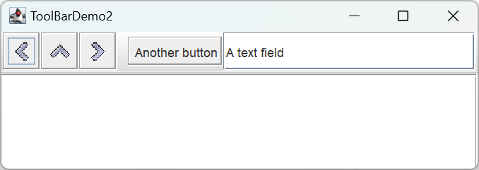

# JToolBar

- [JToolBar](#jtoolbar)
  - [简介](#简介)
  - [构造函数](#构造函数)
  - [添加组件](#添加组件)
  - [JToolBar 属性](#jtoolbar-属性)
  - [JToolBar 事件处理](#jtoolbar-事件处理)
  - [自定义 JToolBar 的 laf](#自定义-jtoolbar-的-laf)
  - [示例](#示例)
    - [ToolBarDemo](#toolbardemo)
    - [ToolBarDemo2](#toolbardemo2)
  - [参考](#参考)

2024-12-21 ⭐
@author Jiawei Mao
***

## 简介

工具栏（`JToolBar` ）是一个容器，它将多个组件（通常是带 icon 的 button）放在一行或一列，一般用于快速访问常用命令，这些命令通常隐藏在分层菜单中。

下图为本文末尾 ToolBarDemo 示例：


默认用户可以将工具栏拖到容器的另一个边缘，或拖到自己的窗口。下图是将工具栏拖到容器右边的图示：


为了使**拖动操作能正常工作**，工具栏所在容器必须采用 `BorderLayout`。工具栏影响的组件通常位于容器中心。工具栏必须是容器除中心组件外唯一组件，且工具栏不能位于中心。

下图是将工具栏拖到窗口外的视图：


在 `ToolBarDemo` 中，创建工具栏并添加到容器的代码如下：

```java
public class ToolBarDemo extends JPanel
                     implements ActionListener {
    ...
    public ToolBarDemo() {
        super(new BorderLayout());
        ...
        JToolBar toolBar = new JToolBar("Still draggable");
        addButtons(toolBar);
        ...
        setPreferredSize(new Dimension(450, 130));
        add(toolBar, BorderLayout.PAGE_START);
        add(scrollPane, BorderLayout.CENTER);
    }
    ...
}
```

该代码将两个组件放在 `BorderLayout` 布局的 `JPanel` 中，工具栏放在顶部，`JScrollPane` 位于中心。由于没有其它组件，所以可以将工具栏拖到容器的其它边。也可以将工具栏拖到单独窗口，此时，窗口的标题为 'Still draggable'，即 `JToolBar` 构造函数所指定。

## 构造函数

```java
public JToolBar()
JToolBar jToolBar = new JToolBar();

public JToolBar(int orientation)
JToolBar jToolBar = new JToolBar(JToolBar.VERTICAL);

public JToolBar(String name)
JToolBar jToolBar = new JToolBar("Window Title");

public JToolBar(String name,int orientation)
JToolBar jToolBar = new JToolBar("Window Title", ToolBar.VERTICAL);
```

`JToolBar` 默认为**水平方向**，通过常量 `HORIZONTAL` 和 `VERTICAL` 设置工具栏方向。

`String` 参数指定标题，当将 `JToolBar` 拖到单独的窗口，就会显示。

另外，工具栏默认 floatable。因此在创建指定方向的工具栏后，用户可以拖动工具栏改变方向。

## 添加组件

可以将任何组件添加到 `JToolBar`，不过出于美观考虑，水平工具栏内组件的高度应大致相同；垂直工具栏内组件的宽度应大致相同。

`JToolBar` 类只定义了一个添加组件的方法，其它方法如 `add(Component)` 均从 `Container` 继承。此外，还可以向工具栏添加分隔符：

```java
public JButton add(Action action);
public void addSeparator();
public void addSeparator(Dimension size);
```

使用 `JToolBar.add(Action)` 添加 `Action` 时，将 `Action` 封装到 `JButton` 中，这与 `JMenu` 和 `JPopupMenu` 不同，向它们添加 `Action` 是用 `JMenuItem` 封装。

使用从 `Container` 继承的方法删除组件：

```java
public void remove(Component component);
```

工具栏中一般添加 `JButton`。以下是 `JToolBarDemo` 中创建按钮并添加到工具栏的代码：

```java
protected void addButtons(JToolBar toolBar) {
    JButton button = null;

    // first button
    button = makeNavigationButton("Back24", PREVIOUS,
                                  "Back to previous something-or-other",
                                  "Previous");
    toolBar.add(button);

    //second button
    button = makeNavigationButton("Up24", UP,
                                  "Up to something-or-other",
                                  "Up");
    toolBar.add(button);

    ...//similar code for creating and adding the third button...
}

protected JButton makeNavigationButton(String imageName,
                                       String actionCommand,
                                       String toolTipText,
                                       String altText) {
    //Look for the image.
    String imgLocation = "images/"
                         + imageName
                         + ".gif";
    URL imageURL = ToolBarDemo.class.getResource(imgLocation);

    //Create and initialize the button.
    JButton button = new JButton();
    button.setActionCommand(actionCommand);
    button.setToolTipText(toolTipText);
    button.addActionListener(this);

    if (imageURL != null) {                      //image found
        button.setIcon(new ImageIcon(imageURL, altText));
    } else {                                     //no image found
        button.setText(altText);
        System.err.println("Resource not found: " + imgLocation);
    }

    return button;
}
```

`makeNavigationButton` 负责加载 image、创建 `JButton`、设置 actionCommand 和提示文本，并为按钮添加 actionListener。

> [!NOTE]
>
> 如果工具栏中的任何按钮重复了其它组件（如菜单）的功能，则推荐使用 `Action`。

## JToolBar 属性

**paintBorder**

默认绘制 `JToolBar` 的边框。

**orientation**

`orientation` 属性只能设置为 `JToolBar` 的常量 `HORIZONTAL` 或 `VERTICAL`。

更改 `orientation` 属性会导致 `JToolBar` 的 layout。如果直接使用 `setLayout()` 更改 layout，再次修改 `orientation` 会导致 layout 再次改变，因此不建议手动修改 `JToolBar` 的 layout。

> [!NOTE]
>
> `JToolBar` 内部使用 `BoxLayout` 执行布局。

**floatable**

工具栏默认可浮动，即用户可以将工具栏拖到其它边、主窗口上方（单独的 window）或原程序窗口外部。如果原始窗口的 layout 是 `BorderLayout`，则工具栏可以放在没有组件的边（不能放在 `BorderLayout` 中心）。设置：

```java
setFloatable(false)
```

**rollover**

`rollover` 属性定义当用户将鼠标移到工具栏内不同组件上时，呈现不同外观。该行为可能涉及颜色或边框差异，取决于 laf。默认当鼠标指针悬停在工具栏按钮上才绘制按钮的边框，默认为 `false`。

在 `ToolBarDemo2` 示例完整展示了这些特性。

通过 `setAlignmentY` 设置组件对齐方式，默认居中。

## JToolBar 事件处理

`JToolBar` 没有特定事件：

- 将 listener 添加到 `JToolBar` 包含的组件监听特定操作
- `JToolBar` 是一个 `Container`，所以可以添加容器相关事件

## 自定义 JToolBar 的 laf

每个 Swing laf 提供自己的 `JToolBar` 外观和一组默认的 `UIResource` 值。

## 示例

### ToolBarDemo

```java
/*
 * ToolBarDemo.java requires the following addditional files:
 * images/Back24.gif
 * images/Forward24.gif
 * images/Up24.gif
 */
import javax.swing.*;
import java.awt.*;
import java.awt.event.ActionEvent;
import java.awt.event.ActionListener;
import java.net.URL;

public class ToolBarDemo extends JPanel
        implements ActionListener {
    protected JTextArea textArea;
    protected String newline = "\n";
    static final private String PREVIOUS = "previous";
    static final private String UP = "up";
    static final private String NEXT = "next";

    public ToolBarDemo() {
        super(new BorderLayout());

        //Create the toolbar.
        JToolBar toolBar = new JToolBar("Still draggable");
        addButtons(toolBar);

        //Create the text area used for output.  Request
        //enough space for 5 rows and 30 columns.
        textArea = new JTextArea(5, 30);
        textArea.setEditable(false);
        JScrollPane scrollPane = new JScrollPane(textArea);

        //Lay out the main panel.
        setPreferredSize(new Dimension(450, 130));
        add(toolBar, BorderLayout.PAGE_START);
        add(scrollPane, BorderLayout.CENTER);
    }

    protected void addButtons(JToolBar toolBar) {
        JButton button = null;

        //first button
        button = makeNavigationButton("Back24", PREVIOUS,
                "Back to previous something-or-other",
                "Previous");
        toolBar.add(button);

        //second button
        button = makeNavigationButton("Up24", UP,
                "Up to something-or-other",
                "Up");
        toolBar.add(button);

        //third button
        button = makeNavigationButton("Forward24", NEXT,
                "Forward to something-or-other",
                "Next");
        toolBar.add(button);
    }

    protected JButton makeNavigationButton(String imageName,
            String actionCommand,
            String toolTipText,
            String altText) {
        //Look for the image.
        String imgLocation = "images/" + imageName + ".gif";
        URL imageURL = ToolBarDemo.class.getResource(imgLocation);

        //Create and initialize the button.
        JButton button = new JButton();
        button.setActionCommand(actionCommand);
        button.setToolTipText(toolTipText);
        button.addActionListener(this);

        if (imageURL != null) {                      //image found
            button.setIcon(new ImageIcon(imageURL, altText));
        } else {                                     //no image found
            button.setText(altText);
            System.err.println("Resource not found: "
                    + imgLocation);
        }

        return button;
    }

    public void actionPerformed(ActionEvent e) {
        String cmd = e.getActionCommand();
        String description = null;

        // Handle each button.
        if (PREVIOUS.equals(cmd)) { //first button clicked
            description = "taken you to the previous <something>.";
        } else if (UP.equals(cmd)) { // second button clicked
            description = "taken you up one level to <something>.";
        } else if (NEXT.equals(cmd)) { // third button clicked
            description = "taken you to the next <something>.";
        }

        displayResult("If this were a real app, it would have " + description);
    }

    protected void displayResult(String actionDescription) {
        textArea.append(actionDescription + newline);
        textArea.setCaretPosition(textArea.getDocument().getLength());
    }

    private static void createAndShowGUI() {
        JFrame frame = new JFrame("ToolBarDemo");
        frame.setDefaultCloseOperation(JFrame.EXIT_ON_CLOSE);

        frame.add(new ToolBarDemo());

        frame.pack();
        frame.setVisible(true);
    }

    public static void main(String[] args) {
        SwingUtilities.invokeLater(new Runnable() {
            public void run() {
                //Turn off metal's use of bold fonts
                UIManager.put("swing.boldMetal", Boolean.FALSE);
                createAndShowGUI();
            }
        });
    }
}
```

### ToolBarDemo2

```java
/*
 * ToolBarDemo2.java requires the following addditional files:
 * images/Back24.gif
 * images/Forward24.gif
 * images/Up24.gif
 */
import javax.swing.JToolBar;
import javax.swing.JButton;
import javax.swing.ImageIcon;
import javax.swing.JTextField;

import javax.swing.JFrame;
import javax.swing.JTextArea;
import javax.swing.JScrollPane;
import javax.swing.JPanel;
import javax.swing.UIManager;
import javax.swing.SwingUtilities;

import java.net.URL;

import java.awt.BorderLayout;
import java.awt.Dimension;
import java.awt.event.ActionEvent;
import java.awt.event.ActionListener;

public class ToolBarDemo2 extends JPanel
        implements ActionListener {
    protected JTextArea textArea;
    protected String newline = "\n";
    static final private String PREVIOUS = "previous";
    static final private String UP = "up";
    static final private String NEXT = "next";
    static final private String SOMETHING_ELSE = "other";
    static final private String TEXT_ENTERED = "text";

    public ToolBarDemo2() {
        super(new BorderLayout());

        // Create the toolbar.
        JToolBar toolBar = new JToolBar("Still draggable");
        addButtons(toolBar);
        toolBar.setFloatable(false); // 关闭拖动工具栏功能
        toolBar.setRollover(true);

        //Create the text area used for output.  Request
        //enough space for 5 rows and 30 columns.
        textArea = new JTextArea(5, 30);
        textArea.setEditable(false);
        JScrollPane scrollPane = new JScrollPane(textArea);

        //Lay out the main panel.
        setPreferredSize(new Dimension(450, 130));
        add(toolBar, BorderLayout.PAGE_START);
        add(scrollPane, BorderLayout.CENTER);
    }

    protected void addButtons(JToolBar toolBar) {
        JButton button = null;

        //first button
        button = makeNavigationButton("Back24", PREVIOUS,
                "Back to previous something-or-other",
                "Previous");
        toolBar.add(button);

        //second button
        button = makeNavigationButton("Up24", UP,
                "Up to something-or-other",
                "Up");
        toolBar.add(button);

        //third button
        button = makeNavigationButton("Forward24", NEXT,
                "Forward to something-or-other",
                "Next");
        toolBar.add(button);

        //separator
        toolBar.addSeparator();

        //fourth button
        button = new JButton("Another button");
        button.setActionCommand(SOMETHING_ELSE);
        button.setToolTipText("Something else");
        button.addActionListener(this);
        toolBar.add(button);

        // 最后一个不是 button，而是 textField
        JTextField textField = new JTextField("A text field");
        textField.setColumns(10);
        textField.addActionListener(this);
        textField.setActionCommand(TEXT_ENTERED);
        toolBar.add(textField);
    }

    protected JButton makeNavigationButton(String imageName,
            String actionCommand,
            String toolTipText,
            String altText) {
        //Look for the image.
        String imgLocation = "images/"
                + imageName
                + ".gif";
        URL imageURL = ToolBarDemo2.class.getResource(imgLocation);

        //Create and initialize the button.
        JButton button = new JButton();
        button.setActionCommand(actionCommand);
        button.setToolTipText(toolTipText);
        button.addActionListener(this);

        if (imageURL != null) {                      //image found
            button.setIcon(new ImageIcon(imageURL, altText));
        } else {                                     //no image found
            button.setText(altText);
            System.err.println("Resource not found: "
                    + imgLocation);
        }

        return button;
    }

    public void actionPerformed(ActionEvent e) {
        String cmd = e.getActionCommand();
        String description = null;

        // Handle each button.
        if (PREVIOUS.equals(cmd)) { //first button clicked
            description = "taken you to the previous <something>.";
        } else if (UP.equals(cmd)) { // second button clicked
            description = "taken you up one level to <something>.";
        } else if (NEXT.equals(cmd)) { // third button clicked
            description = "taken you to the next <something>.";
        } else if (SOMETHING_ELSE.equals(cmd)) { // fourth button clicked
            description = "done something else.";
        } else if (TEXT_ENTERED.equals(cmd)) { // text field
            JTextField tf = (JTextField) e.getSource();
            String text = tf.getText();
            tf.setText("");
            description = "done something with this text: "
                    + newline + "  \""
                    + text + "\"";
        }

        displayResult("If this were a real app, it would have "
                + description);
    }

    protected void displayResult(String actionDescription) {
        textArea.append(actionDescription + newline);
        textArea.setCaretPosition(textArea.getDocument().getLength());
    }

    /**
     * Create the GUI and show it.  For thread safety,
     * this method should be invoked from the
     * event dispatch thread.
     */
    private static void createAndShowGUI() {
        //Create and set up the window.
        JFrame frame = new JFrame("ToolBarDemo2");
        frame.setDefaultCloseOperation(JFrame.EXIT_ON_CLOSE);

        //Add content to the window.
        frame.add(new ToolBarDemo2());

        //Display the window.
        frame.pack();
        frame.setVisible(true);
    }

    public static void main(String[] args) {
        //Schedule a job for the event dispatch thread:
        //creating and showing this application's GUI.
        SwingUtilities.invokeLater(new Runnable() {
            public void run() {
                //Turn off metal's use of bold fonts
                UIManager.put("swing.boldMetal", Boolean.FALSE);
                createAndShowGUI();
            }
        });
    }
}
```




## 参考

- https://docs.oracle.com/javase/tutorial/uiswing/components/toolbar.html
