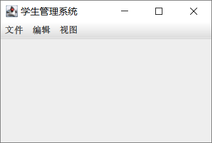

# Swing 程序结构

- [Swing 程序结构](#swing-程序结构)
  - [Swing 组件类图](#swing-组件类图)
  - [Window](#window)
  - [中间容器](#中间容器)
  - [添加菜单](#添加菜单)

2023-12-21, 23:17
****

## Swing 组件类图

Swing 常用组件的类层次结构如下所示：


从图中可以看出，Swing 组件可以分为两类：

- `JComponent` 类：创建 GUI 的一些基本模块
- `Window` 类：可以独立显示的组件

再细分一下：

- 顶层窗口，`JFrame`, `JDialog` 等，可以独立显示的组件；
- 中间容器，如 `JPanel`, `JScrollPaane`, `JSplitPane` 等，可以充当基本组件的载体，但不能独立显示；
- 基本组件，如 `JButton`, `JComboBox` 等。

下面通过一个简单示例，展示这些组件的使用：

```java
public class HelloWorld {
    public static void main(String[] args) {
        JFrame frame = new JFrame("Hello World");
        JPanel pane = new JPanel();
        frame.setContentPane(pane);
        JButton button = new JButton("This is a button");
        pane.add(button);
        frame.setVisible(true);
    }
}
```


## Window

Swing 主要有两种顶层容器：

- `JFrame` 用来设计类似于 Windows 系统中窗口形式的应用程序；
- `JDialog` 和 `JFrame` 类似，只不过 `JDialog` 从来设计弹出对话框。

基于 Swing 的图形界面至少有一个顶层容器。

容器与其所包含的组件形成了树状层次结构：

-  顶层容器是这个树的根
- 每个顶层容器有一个内容面板，即上面所说的中间容器，可以包含界面中所需的组件
- 顶层容器可以添加菜单，即菜单一般直接放在顶层容器中，和内容面板并行

## 中间容器

Swing 组件不能添加到顶层容器中，而必须添加到一个与 Swing 顶层容器关联的内容面板（`ContentPane`），内容面板就是一个中间容器。

向 `JFrame` 顶层容器中添加组件的方式有两种：

- 调用 `JFrame` 的 `getContentPane()` 方法获得内容面板，然后向其中添加组件；
- 建立包含组件的 `JPanel` 或其它中间容器，然后调用 `JFrame` 的 `setContentPane()` 将其设置为内容面板。

代码演示：

```java
public class Containers {

    static final int WIDTH = 300;
    static final int HEIGHT = 200;

    public static void main(String[] args) {
        // 创建顶层容器
        JFrame frame = new JFrame("添加内容面板");
        frame.setSize(WIDTH, HEIGHT);
        frame.setDefaultCloseOperation(JFrame.EXIT_ON_CLOSE);
        frame.setVisible(true);
        // 创建中间容器
        JPanel contentPane = new JPanel();
        // 设置内容面板
        frame.setContentPane(contentPane);
    }
}
```


## 添加菜单

代码演示如何添加菜单：

```java
public class MenuTest {

    static final int WIDTH = 300;
    static final int HEIGHT = 200;

    public static void main(String[] args) {
        JFrame frame = new JFrame();
        frame.setSize(WIDTH, HEIGHT);
        frame.setDefaultCloseOperation(WindowConstants.EXIT_ON_CLOSE);
        frame.setTitle("学生管理系统");

        JMenuBar menuBar = new JMenuBar();
        frame.setJMenuBar(menuBar);
        JMenu menu1 = new JMenu("文件");
        JMenu menu2 = new JMenu("编辑");
        JMenu menu3 = new JMenu("视图");
        menuBar.add(menu1);
        menuBar.add(menu2);
        menuBar.add(menu3);

        JMenuItem item1 = new JMenuItem("打开");
        JMenuItem item2 = new JMenuItem("保存");
        JMenuItem item3 = new JMenuItem("打印");
        JMenuItem item4 = new JMenuItem("退出");

        menu1.add(item1);
        menu1.add(item2);
        menu1.addSeparator();
        menu1.add(item3);
        menu1.addSeparator();
        menu1.add(item4);

        frame.setVisible(true);
    }
}
```


