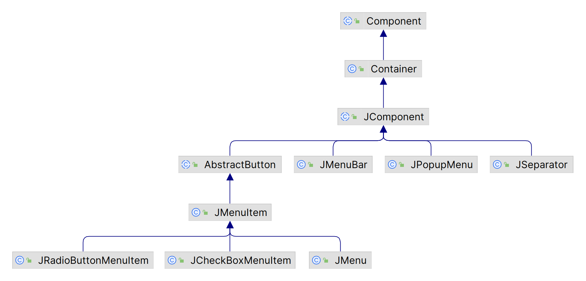
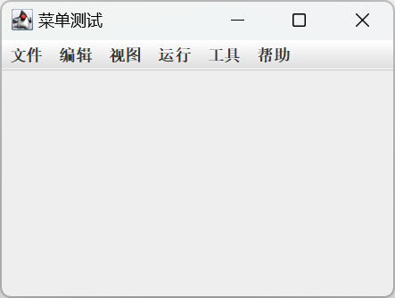

# 菜单

- [菜单](#菜单)
  - [简介](#简介)
  - [菜单类层次结构](#菜单类层次结构)
  - [创建菜单](#创建菜单)
    - [创建 JMenu](#创建-jmenu)
    - [创建 JMenuItem](#创建-jmenuitem)


## 简介

菜单的基本结构如下所示：


菜单栏从上到下分为三部分：

- 菜单栏（`JMenuBar`）
- 菜单（`JMenu`）
- 菜单项（`JMenuItem`）

## 菜单类层次结构



如图所示，menu-item 就是简单的按钮。当激活菜单，menu-item 自动弹出一个弹出式菜单。

## 创建菜单

创建菜单分三步：

1. 先创建 `JMenuBar`
2. 再创建 `JMenu`
3. 最后创建 `JMenuItem`

- 创建 `JMenuBar`

`JMenuBar` 只有一个构造函数：

```java
JMenuBar()
```

### 创建 JMenu

```java
JMenu()
JMenu(Action a)
JMenu(String s)
JMenu(String s, boolean b)
```

`s` 指定菜单的名称，`b` 表示是否为下拉式菜单。

**示例：** 创建 `JMenu`

```java
import javax.swing.*;
import java.awt.*;

public class JMenuDemo extends JFrame {

    public JMenuDemo() throws HeadlessException {
        super("菜单测试");
        JRootPane rp = new JRootPane();
        setContentPane(rp);

        JMenuBar menuBar = new JMenuBar();
        rp.setJMenuBar(menuBar);

        JMenu menu1 = new JMenu("文件");
        JMenu menu2 = new JMenu("编辑");
        JMenu menu3 = new JMenu("视图");
        JMenu menu4 = new JMenu("运行");
        JMenu menu5 = new JMenu("工具");
        JMenu menu6 = new JMenu("帮助");

        menuBar.add(menu1);
        menuBar.add(menu2);
        menuBar.add(menu3);
        menuBar.add(menu4);
        menuBar.add(menu5);
        menuBar.add(menu6);

        setVisible(true);
    }

    public static void main(String[] args) {
        new JMenuDemo();
    }
}
```



### 创建 JMenuItem


基本操作：

- setJMenuBar 为 JFrame 设置菜单栏
- add(JMenu) 为 JMenuBar 添加 JMenu
- add(JMenuItem) 为 JMenu 添加 JMenuItem

> JMenuItem 和其它组件一样，只能在一个容器中，将 JMenuItem 添加到第二个 JMenu，会自动从第一个 JMenu 移除。

下面创建下图所示菜单：


```java
// 创建 GUI
JMenuBar menuBar;
JMenu menu, submenu;
JMenuItem menuItem;
JRadioButtonMenuItem rbMenuItem;
JCheckBoxMenuItem cbMenuItem;

// 创建 menu-bar
menuBar = new JMenuBar();

// 创建第一个 menu
menu = new JMenu("A Menu");
menu.setMnemonic(KeyEvent.VK_A);
menu.getAccessibleContext().setAccessibleDescription(
        "The only menu in this program that has menu items");
menuBar.add(menu);

// a group of JMenuItems
menuItem = new JMenuItem("A text-only menu item",
                         KeyEvent.VK_T);
menuItem.setAccelerator(KeyStroke.getKeyStroke(
        KeyEvent.VK_1, ActionEvent.ALT_MASK));
menuItem.getAccessibleContext().setAccessibleDescription(
        "This doesn't really do anything");
menu.add(menuItem);

menuItem = new JMenuItem("Both text and icon",
                         new ImageIcon("images/middle.gif"));
menuItem.setMnemonic(KeyEvent.VK_B);
menu.add(menuItem);

menuItem = new JMenuItem(new ImageIcon("images/middle.gif"));
menuItem.setMnemonic(KeyEvent.VK_D);
menu.add(menuItem);

//a group of radio button menu items
menu.addSeparator();
ButtonGroup group = new ButtonGroup();
rbMenuItem = new JRadioButtonMenuItem("A radio button menu item");
rbMenuItem.setSelected(true);
rbMenuItem.setMnemonic(KeyEvent.VK_R);
group.add(rbMenuItem);
menu.add(rbMenuItem);

rbMenuItem = new JRadioButtonMenuItem("Another one");
rbMenuItem.setMnemonic(KeyEvent.VK_O);
group.add(rbMenuItem);
menu.add(rbMenuItem);

//a group of check box menu items
menu.addSeparator();
cbMenuItem = new JCheckBoxMenuItem("A check box menu item");
cbMenuItem.setMnemonic(KeyEvent.VK_C);
menu.add(cbMenuItem);

cbMenuItem = new JCheckBoxMenuItem("Another one");
cbMenuItem.setMnemonic(KeyEvent.VK_H);
menu.add(cbMenuItem);

//a submenu
menu.addSeparator();
submenu = new JMenu("A submenu");
submenu.setMnemonic(KeyEvent.VK_S);

menuItem = new JMenuItem("An item in the submenu");
menuItem.setAccelerator(KeyStroke.getKeyStroke(
        KeyEvent.VK_2, ActionEvent.ALT_MASK));
submenu.add(menuItem);

menuItem = new JMenuItem("Another item");
submenu.add(menuItem);
menu.add(submenu);

//Build second menu in the menu bar.
menu = new JMenu("Another Menu");
menu.setMnemonic(KeyEvent.VK_N);
menu.getAccessibleContext().setAccessibleDescription(
        "This menu does nothing");
menuBar.add(menu);

...
frame.setJMenuBar(theJMenuBar);
```