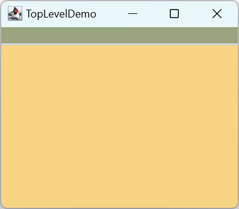

# Swing 程序结构

- [Swing 程序结构](#swing-程序结构)
  - [Swing 组件类图](#swing-组件类图)
  - [顶层容器](#顶层容器)
  - [中间容器](#中间容器)
  - [添加菜单栏](#添加菜单栏)

2023-12-21, 23:17⭐
****

## Swing 组件类图

Swing 常用组件的类层次结构如下所示：


从图中可以看出，Swing 组件可以分为两类：

- `JComponent` 类：创建 GUI 的一些基本模块
- `Window` 类：可以独立显示的组件

再细分一下：

- 顶层窗口，`JFrame`, `JDialog` 等，可以独立显示的组件；
- 中间容器，如 `JPanel`, `JScrollPaane`, `JSplitPane` 等，可以充当基本组件的载体，但不能独立显示；
- 基本组件，如 `JButton`, `JComboBox` 等。

下面通过一个简单示例，展示这些组件的使用：

```java
public class HelloWorld {
    public static void main(String[] args) {
        JFrame frame = new JFrame("Hello World");
        JPanel pane = new JPanel();
        frame.setContentPane(pane);
        JButton button = new JButton("This is a button");
        pane.add(button);
        frame.setVisible(true);
    }
}
```


## 顶层容器

Swing 主要有两个顶层容器：

- `JFrame` 用来设计类似于 Windows 系统中窗口形式的应用程序；
- `JDialog` ，和 `JFrame` 类似，不过 `JDialog` 从来设计弹出对话框。

基于 Swing 的图形界面**至少有一个顶层容器**。

容器与其所包含的组件形成了树状层次结构：

-  顶层容器是这个树的根
- 每个顶层容器有一个**内容面板**，即中间容器，它直接或间接包含顶级容器的所有可见组件
- 顶层容器可以包含菜单栏，菜单栏直接在顶层容器，位于内容面板外
- 每个 GUI 组件只能包含一次，如果一个组件已经在一个容器中，将其添加到另一个容器，它将自动从第一个容器删除。

例如，如果一个应用包含一个 JFrame 和两个 JDialog，那么该应用就包含三棵树，对应三个顶级容器。

下面的 Frame 包含一个绿色菜单栏，内容面板中有一个黄色 label，其结构为：


树状结构：


```java
public class TopLevelDemo {
    /**
     * 基于线程安全，应在 EDT 调用该方法
     */
    private static void createAndShowGUI() {
        //Create and set up the window.
        JFrame frame = new JFrame("TopLevelDemo");
        frame.setDefaultCloseOperation(JFrame.EXIT_ON_CLOSE);

        //Create the menu bar.  Make it have a green background.
        JMenuBar greenMenuBar = new JMenuBar();
        greenMenuBar.setOpaque(true);
        greenMenuBar.setBackground(new Color(154, 165, 127));
        greenMenuBar.setPreferredSize(new Dimension(200, 20));

        //Create a yellow label to put in the content pane.
        JLabel yellowLabel = new JLabel();
        yellowLabel.setOpaque(true);
        yellowLabel.setBackground(new Color(248, 213, 131));
        yellowLabel.setPreferredSize(new Dimension(200, 180));

        //Set the menu bar and add the label to the content pane.
        frame.setJMenuBar(greenMenuBar);
        frame.getContentPane().add(yellowLabel, BorderLayout.CENTER);

        //Display the window.
        frame.pack();
        frame.setVisible(true);
    }

    public static void main(String[] args) {
        //Schedule a job for the event-dispatching thread:
        //creating and showing this application's GUI.
        javax.swing.SwingUtilities.invokeLater(new Runnable() {
            public void run() {
                createAndShowGUI();
            }
        });
    }
}
```



## 中间容器

Swing 组件不能添加到顶层容器中，而必须添加到一个与 Swing 顶层容器关联的内容面板（`ContentPane`），内容面板就是一个中间容器。

上例中获取 JFrame 的内容面板并添加黄色标签：

```java
frame.getContentPane().add(yellowLabel, BorderLayout.CENTER);
```

`JFrame` 的默认内容创个是一个简单的中间容器，它继承自 `JComponent`，`BorderLayout` 作为布局管理器。

不过 `getContentPane()` 返回的是 `Container` 对象，而不是 `JComponent`。如果需要使用 `JComponent` 的特性，选项有三种：

- 调用 `JFrame` 的 `getContentPane()` 方法获得内容面板，然后将类型转换为 `JComponent`。
- **自定义内容面板**，创建包含组件的 `JPanel` 或其它中间容器，然后调用 `JFrame` 的 `setContentPane()` 将其设置为内容面板。一般采用这种方式，更简洁。
- 添加一个自定义组件，完全覆盖内容面板

> `JPanel` 的默认布局管理器为 `FlowLayout`，一般需要修改。

自定义内容面板方式：

```java
//Create a panel and add components to it.
JPanel contentPane = new JPanel(new BorderLayout());
contentPane.setBorder(someBorder);
contentPane.add(someComponent, BorderLayout.CENTER);
contentPane.add(anotherComponent, BorderLayout.PAGE_END);

topLevelContainer.setContentPane(contentPane);
```

为了方便，`JFrame` 的 `add` 方式及其变体，`remove` 和 `setLayout` 都被重写，从而将操作转到 contentPane。所以下面操作是合理的：

```java
frame.add(child);
```

`child` 会被加到 `contentPane`。

不过，只有这三个方法被重写。

代码演示：

```java
public class Containers {

    static final int WIDTH = 300;
    static final int HEIGHT = 200;

    public static void main(String[] args) {
        // 创建顶层容器
        JFrame frame = new JFrame("添加内容面板");
        frame.setSize(WIDTH, HEIGHT);
        frame.setDefaultCloseOperation(JFrame.EXIT_ON_CLOSE);
        frame.setVisible(true);
        // 创建中间容器
        JPanel contentPane = new JPanel();
        // 设置内容面板
        frame.setContentPane(contentPane);
    }
}
```


## 添加菜单栏

理论上，所有顶层容器都可以包含菜单栏。不过在实践中，`JDialog` 一般不需要菜单。

要将菜单栏添加到顶层容器，需要创建 `JMenuBar`，然后填充菜单选项最后调用 `setJMenuBar` 设置菜单栏。

代码演示如何添加菜单：

```java
public class MenuTest {

    static final int WIDTH = 300;
    static final int HEIGHT = 200;

    public static void main(String[] args) {
        JFrame frame = new JFrame();
        frame.setSize(WIDTH, HEIGHT);
        frame.setDefaultCloseOperation(WindowConstants.EXIT_ON_CLOSE);
        frame.setTitle("学生管理系统");

        JMenuBar menuBar = new JMenuBar();
        frame.setJMenuBar(menuBar);
        JMenu menu1 = new JMenu("文件");
        JMenu menu2 = new JMenu("编辑");
        JMenu menu3 = new JMenu("视图");
        menuBar.add(menu1);
        menuBar.add(menu2);
        menuBar.add(menu3);

        JMenuItem item1 = new JMenuItem("打开");
        JMenuItem item2 = new JMenuItem("保存");
        JMenuItem item3 = new JMenuItem("打印");
        JMenuItem item4 = new JMenuItem("退出");

        menu1.add(item1);
        menu1.add(item2);
        menu1.addSeparator();
        menu1.add(item3);
        menu1.addSeparator();
        menu1.add(item4);

        frame.setVisible(true);
    }
}
```


