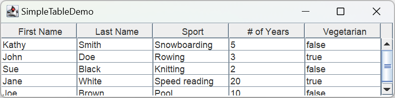

# 表格

- [表格](#表格)
  - [简介](#简介)
  - [创建表格](#创建表格)
  - [将表格添加到容器](#将表格添加到容器)
  - [设置 column 宽度](#设置-column-宽度)
  - [选择](#选择)
  - [参考](#参考)

***

## 简介

JTable 组件用于显示和编辑表格数。

## 创建表格

```java
import javax.swing.*;
import java.awt.*;
import java.awt.event.MouseAdapter;
import java.awt.event.MouseEvent;

public class SimpleTableDemo extends JPanel {

    private boolean DEBUG = false;

    public SimpleTableDemo() {
        super(new GridLayout(1, 0));
        String[] columnNames = {"First Name", "Last Name", "Sport",
                "# of Years", "Vegetarian"};

        Object[][] data = {
                {"Kathy", "Smith", "Snowboarding", 5, false},
                {"John", "Doe", "Rowing", 3, true},
                {"Sue", "Black", "Knitting", 2, false},
                {"Jane", "White", "Speed reading", 20, true},
                {"Joe", "Brown", "Pool", 10, false}
        };
        final JTable table = new JTable(data, columnNames);
        table.setPreferredScrollableViewportSize(new Dimension(500, 70));
        table.setFillsViewportHeight(true);

        if (DEBUG) {
            table.addMouseListener(new MouseAdapter() {
                @Override
                public void mouseClicked(MouseEvent e) {
                    printDebugData(table);
                }
            });
        }

        JScrollPane scrollPane = new JScrollPane(table);
        add(scrollPane);
    }

    private void printDebugData(JTable table) {
        int numRows = table.getRowCount();
        int numCols = table.getColumnCount();
        javax.swing.table.TableModel model = table.getModel();

        System.out.println("Value of data: ");
        for (int i = 0; i < numRows; i++) {
            System.out.print("    row " + i + ":");
            for (int j = 0; j < numCols; j++) {
                System.out.print("  " + model.getValueAt(i, j));
            }
            System.out.println();
        }
        System.out.println("--------------------------");
    }

    private static void createAndShowGUI() {
        JFrame frame = new JFrame("SimpleTableDemo");
        frame.setDefaultCloseOperation(JFrame.EXIT_ON_CLOSE);

        SimpleTableDemo newContentPane = new SimpleTableDemo();
        newContentPane.setOpaque(true); //content panes must be opaque
        frame.setContentPane(newContentPane);

        frame.pack();
        frame.setVisible(true);
    }

    public static void main(String[] args) {
        EventQueue.invokeLater(SimpleTableDemo::createAndShowGUI);
    }
}
```



- column-names 放在 `String[]` 数组中

```java
String[] columnNames = {"First Name", "Last Name", "Sport",
        "# of Years", "Vegetarian"};
```

- 表格数据放在二维 `Object[]` 数组中

```java
Object[][] data = {
        {"Kathy", "Smith", "Snowboarding", 5, false},
        {"John", "Doe", "Rowing", 3, true},
        {"Sue", "Black", "Knitting", 2, false},
        {"Jane", "White", "Speed reading", 20, true},
        {"Joe", "Brown", "Pool", 10, false}
};
```

- 使用 column-names 和数据创建表格

```java
JTable table = new JTable(data, columnNames);
```

`JTable` 有两个构造函数接受数据：

```java
JTable(Object[][] rowData, Object[] columnNames)
JTable(Vector rowData, Vector columnNames)
```

直接使用数据创建 `JTable` 很方便，但也有缺点：

- cell 自动可编辑
- 所有数据作为字符串处理。例如，对 `boolean` 数据，可以使用复选框显示该数据，但如果使用上面的两个构造函数，则显示为字符串。
- 需要提前将数据转换为数组或向量

如果要绕过这两个问题，则需要使用表格模型。

## 将表格添加到容器

下面是将 `JScrollPane` 作为表格容器的典型代码：

```java
JScrollPane scrollPane = new JScrollPane(table); // 将表格添加到滚动面板
table.setFillsViewportHeight(true);
```

`JTable.setFillsViewportHeight` 用来设置 `fillsViewportHeight` 属性。该属性为 true 时，表格会使用容器整个高度。

`JScrollPane` 自动将表格的标题放在视图的顶部。滚动表格时，column-names 保持可见。

如果不使用滚动窗格，则需要手动设置表格的标题和内容：

```java
container.setLayout(new BorderLayout());
container.add(table.getTableHeader(), BorderLayout.PAGE_START);
container.add(table, BorderLayout.CENTER);
```

## 设置 column 宽度

表格所有 columns 默认以相同宽度显示，而所有 columns 会自动展开以填充表格的整个宽度。当调整表格宽度，所有 columns 宽度对相应改变。

当拖动 column 右边框调整 column 宽度，则其它 column 或整个表格的宽度必须改变。默认表格宽度不变，拖放点右侧的所有 columns 会相应调整宽度。

调用 `TableColumn.setPreferredWidth` 可以自定义 column 初始宽度。

**示例：** 将表格的第三个 column 设置宽一点

```java
TableColumn column = null;
for (int i = 0; i < 5; i++) {
    column = table.getColumnModel().getColumn(i);
    if (i == 2) {
        column.setPreferredWidth(100); //third column is bigger
    } else {
        column.setPreferredWidth(50);
    }
}
```

`TableColumn` 提供 column 的 min, max, pref 宽度的 getter 和 setter 方法，以及获取当前宽度。

用户显式调整 column 宽度设置的是 prefWidth，从而使用户设置的宽度称为当前宽度。不过，当调整表格大小，column 的 prefWidth 不会改变，而是根据现有 prefWidth 计算新的 column 宽度。

调用 `setAutoResizeMode` 可以修改表格调整大小的策略。

## 选择

表格默认支持选择单行和多行。选择指示的最后一个 cell 会有标识。最后一个 cell 称为 *lead-selection*，也称为 *current-cell* 或 *focus-cell*。

用户可以通过鼠标和键盘进行选择：

|操作|鼠标|键盘|
|---|---|---|
|选择单行|点击|上下箭头|
|选择连续多行|Shift+点击或拖动|Shift+上下箭头|
|不连续选择多行|Ctrl+点击|上下箭头移动 focus-cell，使用空格添加选择，或 Ctrl+空格切换选择|


## 参考

- https://docs.oracle.com/javase%2Ftutorial%2F/uiswing/components/table.html