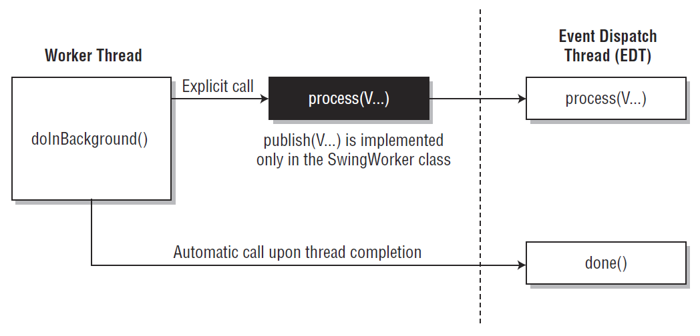

# Swing 并发

- [Swing 并发](#swing-并发)
  - [简介](#简介)
  - [启动线程](#启动线程)
  - [事件派发线程](#事件派发线程)
    - [判断是否在 EDT](#判断是否在-edt)
    - [添加任务到 EDT](#添加任务到-edt)
    - [在 EDT 外可调用方法](#在-edt-外可调用方法)
  - [工作线程](#工作线程)
    - [简单后台线程](#简单后台线程)
    - [获得执行结果](#获得执行结果)
    - [中间结果](#中间结果)
    - [取消任务](#取消任务)
    - [绑定属性和状态方法](#绑定属性和状态方法)
      - [progress](#progress)
      - [state](#state)
  - [参考](#参考)

***

## 简介

为提供效率并降低复杂性，所有 Swing 组件都设计成非线程安全的。即所有对 Swing 组件的访问都需要从单个线程（事件分派线程）完成。

Swing 程序涉及如下线程：

- 初始线程（initial thread），执行初始应用代码的线程
- 事件分派线程（event dispatch thread, EDT），执行所有事件处理代码。与 Swing 框架交互的大多数代码都必须在这个线程执行
- 工作线程（worker thread），也称为后台线程（background thread），执行耗时的后台任务。

我们一般不需要显式创建这些线程，它们由 runtime 或 Swing 框架提供。程序员的任务是利用这些线程创建响应性好、易于维护的 Swing 程序。

与其它在 Java 平台运行的程序 一样，Swing 程序中也可以创建额外的线程和线程池。不过对基础的 Swing 程序，这个描述的线程足够使用。

## 启动线程

在标准程序中，只有调用 `main` 方法的线程，该线程称为**启动线程**。

在 Swing 中，启动线程只有一个任务：创建一个初始化 GUI 的 `Runnable` 对象，并安排该对象在 EDT 线程上执行。

创建 GUI 后，程序主要由 GUI 事件驱动，每个 GUI 事件对应一个 EDT 线程上的短时任务。对**额外任务**，有两种处理方式：

- 可以快速完成的任务，可以直接在 EDT 上执行
- 需要长时间运行的耗时任务，在工作线程执行

初始线程通过调用 `javax.swing.SwingUtilities.invokeLater` 或 `javax.swing.SwingUtilities.invokeAndWait` 调度 GUI 创建任务。这两个方法都有一个 `Runnable` 参数，包含分配到 EDT 上的任务：

- `invokeLater` 调度任务并立刻返回
- `invokeAndWait` 等待任务完成再返回

在 Swing 中常能看到如下代码：

```java
SwingUtilities.invokeLater(new Runnable() {
    public void run() {
        createAndShowGUI();
    }
});
```

将创建 GUI 任务调度到 EDT 通常是初始线程做的最后一件事，所以使用 `invokeLater` 还是 `invokeAndWait` 并不重要。

## 事件派发线程

Swing 事件处理代码在专门的事件派发线程（Event Dispatch Thread, EDT）上 运行。大多数调用 Swing 方法的代码也在 EDT 运行。这是因为大多数 Swing 对象方法不是线程安全的，从多个线程调用会有线程干扰或内存不一致的风险。对所有 Swing 组件，除了明确标记为线程安全的方法，其它组件方法必须在 EDT 调用。

> 不遵守这条规则的程序，可能大多数情况下运行正常，但有可能出现无法重现、不可预测的错误。

可以将 EDT 上运行的代码看作一系列的短任务。大多数任务是调用事件处理方法，如 `ActionListener.actionPerformed`。其它任务可以由应用代码通过 `invokeLater` 或 `invokeAndWait` 调度。EDT 上的任务必须**快速完成**，否则导致界面无响应。

Swing 的线程模式规则：EDT负责执行任何修改组件的方法。Swing 不是一个线程安全的API，它应该只在 EDT 中调用。

`javax.swing.SwingUtilities` 类提供了三个处理 EDT 的方法：

- `invokeLater()` 用于在 EDT 中发布一个新任务，并让它排队等待，用于不需要任务执行返回值、不关心完成的确切时间的情况；
- `isEventDispatchThread()`，判断当前线程是否为 EDT 线程；
- `invokeAndWait()`类似于 `invokeLater()`。

`invokeAndWait` 方法使用较少，它和 `invokeLater` 一样，可以发布新任务到 EDT，区别在于 `invokeAndWait` 会阻塞当前线程，直到 EDT 完成发布的任务。`invokeAndWait` 可以抛出 `InterruptedException` 或 `InvocationTargetException`。

假设有一个检测读取文件是否超时的程序。该程序在一个单独的线程读取文件，并在 10 秒后询问用户是继续还是取消操作。要实现这个特性，通常需要初始化一个锁来停止读文件线程，然后在 EDT 中显示一个对话框。

编写这段代码是可能的，但是很危险，容易引入死锁。下面展示如何使用 `invokeAndWait()` 安全地完全该任务：

```java
try {
    final int[] answer = new int[1];
    SwingUtilities.invokeAndWait(() -> answer[0] =
            JOptionPane.showConfirmDialog(SwingThreadingWait.this,
                    "Abort long operation?",
                    "Abort?",
                    JOptionPane.YES_NO_OPTION));
    if (answer[0] == JOptionPane.YES_OPTION) {
        return;
    }
} catch (InterruptedException e1) {
} catch (InvocationTargetException e1) {
}
```

需要知道，`invokeAndWait` 可能导致死锁。如果调用代码持有 `invokeAndWait` 调用中所需的锁，则 EDT 代码会等待 non-EDT 代码释放该锁，但这是不可能的，因为 non-EDT 代码在等待 EDT 代码完成，导致程序挂起。

一般来说，`invokeAndWait` 用起来比 `invokeLater` 更简单，因为它是同步执行 `Runnable` 任务，似乎也不需要担心多个线程同时执行。不过一定要明确正在创建的线程和锁的依赖关系，确保无死锁出现。

### 判断是否在 EDT

判断当前代码是否在 EDT 线程，可以使用 `EventQueue` 的：

```java
public static boolean isDispatchThread()
```

也可以使用 `SwingUtilities` 的：

```java
public static boolean isEventDispatchThread()
```

`SwingUtilities` 调用的是 `EventQueue` 的方法。

### 添加任务到 EDT

使用 `EventQueue` 的 `invokeLater` 提交任务到 EDT：

```java
public static void invokeLater(Runnable runnable)
```

以这种方法提交的任务在 EDT 排队等待执行，并立刻返回。

如果需要等待任务完成，使用 `invokeAndWait` 方法，该方法会阻塞当前线程，直到任务在 EDT 完成并返回：

```java
public static void invokeAndWait(Runnable runnable)
```

下面是一个简单实例：

```java
public class ButtonSample{
    public static void main(String[] args){
        Runnable runner = () -> {
            JFrame frame = new JFrame("Button Sample");
            frame.setDefaultCloseOperation(JFrame.EXIT_ON_CLOSE);
            JButton button = new JButton("Select Me");
            // Attach listeners
            button.addActionListener(e -> System.out.println("I was selected."));
            frame.add(button, BorderLayout.SOUTH);
            frame.setSize(300, 100);
            frame.setVisible(true);
        };
        EventQueue.invokeLater(runner); // 参数为 Runnable 类型
    }
}
```

> `invokeLater()`, `invokeAndWait()` 方法在 `EventQueue` 中，在 `SwingUtilities` 也有它们的代理调用方法。`SwingUtilities` 是为早期 Swing 版本服务的，当时还没有 `EventQueue` 类，因此推荐直接使用 `EventQueue`。

### 在 EDT 外可调用方法

除了上面提到的三个工具方法：`invokeLater`、`invokeAndWait` 和 `isDispatchThread`。每个 Swing 组件提供了三个可以在 EDT 外面调用的方法：

- `revalidate()` 强制一个组件布置它的子组件；
- `repaint()` 刷新显示；
- `revalidate()`。

三个方法都是在 EDT 上执行，不管在哪个线程调用它们。

`repaint` 方法在 Swing 中使用十分广泛，用来同步组件的属性和屏幕展示。例如，调用 `JButton.setForeground(Color)` 更改按钮的前景色，Swing 会存储新颜色，并调用 `repaint()` 显示新颜色。调用 `repaint()` 会触发 EDT 上其它几个方法的执行，包括 `paint()` 和 `paintComponent()`。

## 工作线程

在 Swing 程序中，耗时任务需要在工作线程运行，也称为**后台线程**。在工作线程运行的任务由 `javax.swing.SwingWorker` 实例方式。SwingWorker 是抽象类，因此创建 SwingWorker 需要定义子类。对简单任务可以采用匿名内部类。

`SwingWorker` 提供了许多通信和控制功能：

- `SwingWorker` 的 `done` 方法在后台任务完成后，自动在 EDT 执行（可以再 done 里更新 UI）
- `SwingWorker` 实现了 `java.util.concurrent.Future` 接口，因此可以再任务完成后为其它线程提供返回值、取消任务、检查任务是否完成、是否取消等功能
- 后台任务调用 `SwingWorker.publish` 可以提供临时结果，触发在 EDT 调用 `SwingWorker.process`
- 后台任务可以定义绑定属性，修改这些属性可以触发事件，从而触发 EDT 上的事件处理方法的调用



### 简单后台线程

`SwingUtilities` 对确保程序平稳、正确运行十分有用，但是需要创建大量的匿名 `Runnable` 类，使得代码难以维护。为了解决该问题，Swing 团队创建了 `SwingWorker`，它简化了创建需要更新用户界面的耗时任务。使用 `SwingWorker` 可以在后台线程执行特定任务，在 EDT 上更新结果。

下面来看一个简单的用例以更好地理解 `SwingWorker`。假设需要要从硬盘加载图像，并在 UI 显示这些图像。为了避免阻塞 UI，需要将加载图像放在后台线程。

同时，我们希望通过显示已加载图像的名称，向用户展示进度信息。当后台线程完成时，要求返回它加载的图像列表。要在 `SwingWorker` 实现该任务，需要继承 `SwingWorker` 并覆盖 `doInBackground()` 方法。`doInBackground()` 在后台线程执行。

`SwingWorker` 是泛型类，有两个泛型参数 `T` 和 `V`：

- `T` 是 `doInBackground()` 的返回值
- `V` 是中间值类型，可以使用 `publish(V...)` 发送到 EDT。

然后 `SwingWorker` 在 EDT 上调用 `process(V...)` 方法。需要覆盖 `process` 方法从而在 GUI 上显示中间值。任务完成后，`SwingWorker` 在 EDT 上调用 `done()` 方法。

通常还会覆盖 `done()` 方法以显示最终结果。`doInBackground()` 完成后，`SwingWorker` 会自动在 EDT 中调用 `done()`。在 `done()` 中，可以使用 `get()` 方法获得 `doInBackground` 的返回值。

下面是载入图像的 `SwingWorker` 实现：

```java
public class ImageLoadingWorker extends SwingWorker<List<Image>, String>{
    private JTextArea log;
    private JPanel viewer;
    private String[] filenames;

    public ImageLoadingWorker(JTextArea log, JPanel viewer, String... filenames){
        this.log = log;
        this.viewer = viewer;
        this.filenames = filenames;
    }

    // EDT 中执行：doInBackground() 结束后，使用 get() 获得图像列表
    @Override
    protected void done(){
        try {
            for (Image image : get()) {
                viewer.add(new JLabel(new ImageIcon(image)));
                viewer.revalidate();
            }
        } catch (Exception e) {}
    }

    // In the EDT
    @Override
    protected void process(List<String> messages){
        for (String message : messages) {
            log.append(message);
            log.append("\n");
        }
    }

    // 后台线程执行，载入图像
    @Override
    public List<Image> doInBackground(){
        List<Image> images = new ArrayList<Image>();
        for (String filename : filenames) {
            try {
                images.add(ImageIO.read(new File(filename)));
                publish("Loaded " + filename); // 分布中间结果
            } catch (IOException ioe) {
                publish("Error loading " + filename);
            }
        }
        return images;
    }
}
```

### 获得执行结果

使用 `SwingWorker` 的 `get()` 方法获得 `doInBackground` 执行的返回值。

之所以不直接在 `doInBackground` 直接使用计算结果，是因为 `doInBackground` 中的代码是在后台线程执行，而 `done` 方法是在 EDT 执行，所以为了线程安全，专门设计了 `get` 方法，`get` 是线程安全的。

获得 `doInBackground` 返回结果的`get` 方法有两个重载：

- 无参数 `SwingWorker.get`，如果后台线程没执行完，`get` 阻塞直到获得返回值；
- `Swing.get(long timeout, TimeUnit unit)`，如果后台线程没执行完，`get` 阻塞到指定时间，然后抛出 `java.util.concurrent.TimeoutException`。

在 EDT 线程中调用 `get` 存在风险，很可能阻塞EDT。如果不确定任务执行进度，最好在 `done` 方法中调用。

### 中间结果

后台线程在执行过程中提供已计算出来的结果有时候很有用:

- 通过调用 `SwingWorker.publish` 方法发送结果。该方法接受可变参数，参数类型为 `SwingWorker` 的第二个泛型参数类型。
- 覆盖 `SwingWorker.process` 方法收集 `publish` 发布的结果。该方法在 EDT 中执行。出于性能考虑，往往多次调用的 `publish` 结果累计到一次 `process` 调用中。

下面使用一个实例来演示该功能，该程序 `java.util.Random` 在后台生成一系列随机 `boolean` 值测试 `java.util.Random` 的公平性，和抛硬币一样，所以命名为 `Flipper`。后台任务使用 `FlipPair` 发布结果。

```java
public class Flipper extends JFrame implements ActionListener{

    private final GridBagConstraints constraints;
    private final JTextField headsText, totalText, devText;
    private final Border border = BorderFactory.createLoweredBevelBorder();
    private final JButton startButton, stopButton;
    private FlipTask flipTask;

    private JTextField makeText(){
        JTextField t = new JTextField(20);
        t.setEditable(false);
        t.setHorizontalAlignment(JTextField.RIGHT);
        t.setBorder(border);
        getContentPane().add(t, constraints);
        return t;
    }

    private JButton makeButton(String caption){
        JButton b = new JButton(caption);
        b.setActionCommand(caption);
        b.addActionListener(this);
        getContentPane().add(b, constraints);
        return b;
    }

    public Flipper(){
        super("Flipper");
        setDefaultCloseOperation(JFrame.EXIT_ON_CLOSE);

        //Make text boxes
        getContentPane().setLayout(new GridBagLayout());
        constraints = new GridBagConstraints();
        constraints.insets = new Insets(3, 10, 3, 10);
        headsText = makeText();
        totalText = makeText();
        devText = makeText();

        //Make buttons
        startButton = makeButton("Start");
        stopButton = makeButton("Stop");
        stopButton.setEnabled(false);

        //Display the window.
        pack();
        setVisible(true);
    }

    private static class FlipPair
    {
        private final long heads, total;

        FlipPair(long heads, long total)
        {
            this.heads = heads;
            this.total = total;
        }
    }

    private class FlipTask extends SwingWorker<Void, FlipPair>
    {
        @Override
        protected Void doInBackground()
        {
            long heads = 0; // 结果为 true 的次数
            long total = 0; // 总随机次数
            Random random = new Random();
            while (!isCancelled()) {
                total++;
                if (random.nextBoolean()) {
                    heads++;
                }
                publish(new FlipPair(heads, total)); // 发布目前的 heads 数和总试验次数
            }
            return null;
        }

        @Override
        protected void process(List<FlipPair> pairs)
        {
            // 处理临时结果
            FlipPair pair = pairs.get(pairs.size() - 1);
            headsText.setText(String.format("%d", pair.heads));
            totalText.setText(String.format("%d", pair.total));
            devText.setText(String.format("%.10g",
                    ((double) pair.heads) / ((double) pair.total) - 0.5));
        }
    }


    public void actionPerformed(ActionEvent e)
    {
        if ("Start" == e.getActionCommand()) {
            startButton.setEnabled(false);
            stopButton.setEnabled(true);
            (flipTask = new FlipTask()).execute();
        } else if ("Stop" == e.getActionCommand()) {
            startButton.setEnabled(true);
            stopButton.setEnabled(false);
            flipTask.cancel(true);
            flipTask = null;
        }

    }

    public static void main(String[] args)
    {
        SwingUtilities.invokeLater(Flipper::new);
    }
}
```

后台线程以 `FlipTask` 实现：

```java
private class FlipTask extends SwingWorker<Void, FlipPair> {
```

由于该任务不用返回最终结果，因此第一个参数为 `Void`。每生成一个随机数，该任务使用 `publish` 发布一次结果：

```java
@Override
protected Void doInBackground() {
    long heads = 0;
    long total = 0;
    Random random = new Random();
    while (!isCancelled()) {
        total++;
        if (random.nextBoolean()) {
            heads++;
        }
        publish(new FlipPair(heads, total));
    }
    return null;
}
```

其中 `isCancelled` 方法用于判断当前任务是否取消。

由于调用 `publish` 十分频繁，在 EDT 中调用 `process` 前会累计许多 `FlipPair` 值传递给。`process` 每次只对最后一个值感兴趣，并用该值更新 UI：

```java
protected void process(List<FlipPair> pairs) {
    FlipPair pair = pairs.get(pairs.size() - 1);
    headsText.setText(String.format("%d", pair.heads));
    totalText.setText(String.format("%d", pair.total));
    devText.setText(String.format("%.10g", 
            ((double) pair.heads)/((double) pair.total) - 0.5));
}
```

如果 `Random` 足够公平，随着 `Flipper` 运行 `devText` 值会接近 0.

### 取消任务

调用 `SwingWorker.cancel` 取消正在运行的后台任务。需要自定义取消逻辑，实现方式有两种：

- 收到 interrupt 通知时终止；
- 频繁调用 `SwingWorker.isCancelled` 检查打断通知。

`cancel` 方法接收单个 `boolean` 参数。如果参数为 `true`，`cancel` 方法发送后台任务 interrupt 通知。不管 `cancel` 的参数是 `true` 还是 `false`，调用 `cancel` 都会将对象的取消状态设置为 `true`。

上面的 `Flipper` 例子使用了检查状态的习惯用法，当 `isCancelled` 返回 `true` 时，`doInBackground` 退出主循环。在用户点击 `Cancel` 按钮时触发该方法：

```java
if ("Stop" == e.getActionCommand()) {
    startButton.setEnabled(true);
    stopButton.setEnabled(false);
    flipTask.cancel(true);
    flipTask = null;
}
```

使用检查状态的方法对 `Flipper` 有效，是因为 `SwingWorker.doInBackground` 中不包含任何会抛出 `InterruptedException` 的代码。

如果要线程打断进行响应，后台线程需要经常使用 `Thread.isInterrupted` 检查。和使用 `SwingWorker.isCancelled` 一样简单。

### 绑定属性和状态方法

`SwingWorker` 支持绑定属性，便于和其它线程通信。

预定义了两个属性：

- progress
- state

与其它绑定属性一样，`progress` 和 `state` 可用于触发 EDT 上的事件处理任务，

#### progress

绑定变量 `progress` 是一个 0 到 100 的 int 值。它有一个预定义的 setter 方法（`SwingWorker.setProgress`）和一个预定义的 getter 方法（`SwingWorker.getProgress`）。

使用基本流程是，在 `doInBackground` 中更新进度，用 `setProgress` 发布进度：

```java
public Void doInBackground()
{
    Random random = new Random();
    int progress = 0;
    //Initialize progress property.
    setProgress(0);
    while (progress < 100) {
        //Sleep for up to one second.
        try {
            Thread.sleep(random.nextInt(1000));
        } catch (InterruptedException ignore) {}
        //Make random progress.
        progress += random.nextInt(10);
        setProgress(Math.min(progress, 100));
    }
    return null;
}
```

对 `SwingWorker` 事件添加 `PropertyChangeListener`：

```java
task = new Task();
task.addPropertyChangeListener(this);
```

实现 `PropertyChangeListener` 的一般是 GUI 组件，在监听器类 `propertyChange` 中提取进度值，更新到 UI：

```java
public void propertyChange(PropertyChangeEvent evt)
{
    if ("progress" == evt.getPropertyName()) {
        int progress = (Integer) evt.getNewValue();
        progressBar.setValue(progress);
        taskOutput.append(String.format("Completed %d%% of task.\n", task.getProgress()));
    }
}
```

#### state

绑定属性 `state` 表示 `SwingWorker` 在其生命周期中的位置。生命周期可能值以 enum `SwingWorker.StateValue` 表示，包括：

- PENDING，从构造 `SwingWorker` 到调用 `doInBackground` 之间的这一段；
- STARTED，从 `doInBackground` 调用到 `done` 被调用之间；
- DONE，`done` 被调用后的状态。

可以使用 `SwingWorker.getState` 获得 `state` 的当前值。

## 参考

- The Definitive Guide to Java Swing, 3ed
- https://docs.oracle.com/javase/tutorial/uiswing/concurrency/index.html
