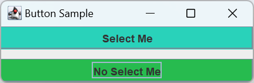
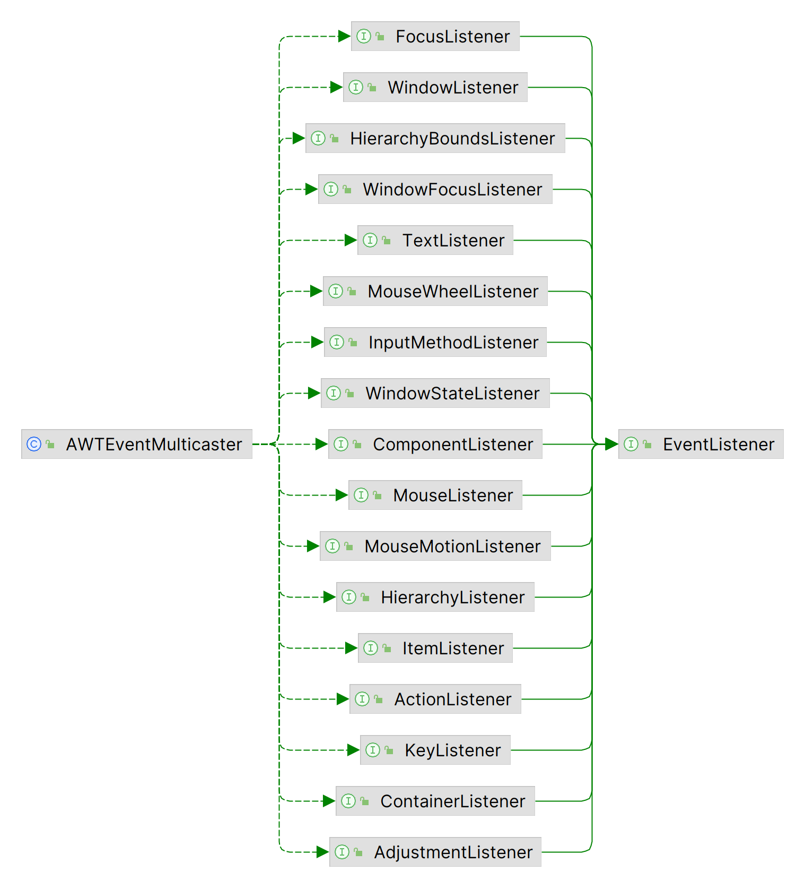
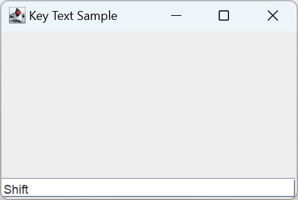

# 基于委托的事件处理

2024-04-07⭐⭐
@author Jiawei Mao
***

## 简介

Swing 采用基于**委托**（delegation-based）的事件处理，并采用 MVC（Model-View-Controller）将用户界面与底层数据模型分离。

JDK 1.1 引入了基于委托的事件处理机制。

## 事件委托模型

基于委托的事件处理机制是一个特殊的 Observer 设计模型。当需要监视对象的状态何时发生什么变化，用 Observer 设计模型。在基于委托的事件处理中，使用 Observer 监听事件的发生。如下图所示：

- Observer 对象必须实现 `java.util.EventListener` 接口；
- 发生的事件必须扩展 `java.util.EventObject` 类。


GUI 组件和 JavaBeans 管理一组 listeners，对每种 listener 类型提供一对方法：`addXXXListener()` 和 `removeXXXListener()`。当事件发生，组件会将该事件通知所有已注册的 listeners。任何对这类事件感兴趣的 Observer 类需要向组件注册一个特定接口的实现类，然后在事件发生时执行该实现类。

## EventListener 作为 Observer

使用 `EventListener` 处理事件分为三步：

1. 定义一个实现特定 listener 接口的类；
2. 创建 listener 实例；
3. 将此 listener 注册到感兴趣事件所属组件。

下面创建一个简单的按钮，对按下按钮的事件打印一条消息。

### 1. 定义 Listener

对处理按钮事件，需要创建一个 `ActionListener`，`JButton` 在被选中时生成 `ActionEvent` 对象。

```java
public class AnActionListener implements ActionListener {
    @Override
    public void actionPerformed(ActionEvent e) {
        System.out.println("I was selected.");
    }
}
```

### 2. 创建 Listener 实例

创建一个 `AnActionListener` 的实例：

```java
ActionListener actionListener = new AnActionListener();
```

如果使用匿名内部类，步骤 1 和 2 可以合并为一步：

```java
ActionListener actionListener = new ActionListener() {
    @Override
    public void actionPerformed(ActionEvent e) {
        System.out.println("I was selected.");
    }
};
```

### 3. 在组件上注册 Listener

创建 Listener 后，可以将其与适当的组件关联起来。例如，为 `JButton` 添加 Listener：

```java
button.addActionListener(actionListener);
```

如果是当前类实现 `ActionListener` 接口，则不需要单独创建 Listener 实例，只需要将该类注册为组件的 listener，例如：

```java
public class YourClass implements ActionListener {
  ... // Other code for your class
  public void actionPerformed(ActionEvent actionEvent) {
    System.out.println("I was selected.");
  }
  // Code within some method
   JButton button = new JButton(...);
   button.addActionListener(this);
  // More code within some method
}
```

## PropertyChangeListener 作为 Observer

除了基本的事件委托机制，JavaBeans 框架引入了另一种 Observer 设计模式，即 property-change-listener。

`PropertyChangeListener` 通用实现了 Observer 设计模式。每个 Observer 监视主体属性的变化，当属性发生变化时，Observer 会收到通知。相关类：

- `java.beans.PropertyChangeEvent extends EventObject`
- `java.beans.PropertyChangeListener extends EventListener`
- `java.beans.PropertyChangeSupport`

注册的 `PropertyChangeListener` 由 `PropertyChangeSupport` 管理。当监听的属性值发生变化，`PropertyChangeSupport` 通知所有注册的 listeners 属性的原始值和新值。

**示例：** 演示如何使用 `PropertyChangeListener`

创建两个按钮，当选择任意按钮，所选按钮的背景更改为一个随机颜色：

- 第二个按钮监听第一个按钮的属性变化，当第一个按钮背景发生变化，第二个按钮随之变化；
- 第一个按钮没有监听第二个按钮的属性，因此选择第二个按钮，其背景颜色发生变化，第一个按钮不会随之变化。

```java
import javax.swing.*;
import java.awt.*;
import java.awt.event.ActionEvent;
import java.awt.event.ActionListener;
import java.beans.PropertyChangeEvent;
import java.beans.PropertyChangeListener;
import java.util.Random;

public class BoundSample {

    public static void main(String[] args) {
        Runnable runner = new Runnable() {
            @Override
            public void run() {
                JFrame frame = new JFrame("Button Sample");
                frame.setDefaultCloseOperation(JFrame.EXIT_ON_CLOSE);
                final JButton button1 = new JButton("Select Me");
                final JButton button2 = new JButton("No Select Me");
                final Random random = new Random();

                ActionListener actionListener = new ActionListener() {
                    @Override
                    public void actionPerformed(ActionEvent e) {
                        JButton button = (JButton) e.getSource();
                        int red = random.nextInt(255);
                        int green = random.nextInt(255);
                        int blue = random.nextInt(255);
                        button.setBackground(new Color(red, green, blue));
                    }
                };

                PropertyChangeListener propertyChangeListener =
                        new PropertyChangeListener() {
                            @Override
                            public void propertyChange(PropertyChangeEvent evt) {
                                String propertyName = evt.getPropertyName();
                                if ("background".equals(propertyName)) {
                                    button2.setBackground((Color) evt.getNewValue());
                                }
                            }
                        };
                button1.addActionListener(actionListener);
                button1.addPropertyChangeListener(propertyChangeListener);
                button2.addActionListener(actionListener);

                frame.add(button1, BorderLayout.NORTH);
                frame.add(button2, BorderLayout.SOUTH);
                frame.setSize(300, 100);
                frame.setVisible(true);

            }
        };
        EventQueue.invokeLater(runner);
    }
}
```



虽然这个示例的 `PropertyChangeListener` 只修改了一个按钮的颜色，但也可以在里面修改上百个按钮的颜色，`PropertyChangeListener` 会自动将属性修改传递到所有 Observer。如果没有 `PropertyChangeListener`，该功能实现起来会很复杂。

Swing 库还支持 `ChangeEvent`/`ChangeListener` 来表示状态变化。虽然它与 `PropertyChangeEvent`/`PropertyChangeListener` 功能类似，但是 `ChangeEvent` 不包含属性值信息，可以将其看作轻量级的 `PropertyChangeListener`。当不止一个属性值发生变化，可以使用 `ChangeEvent`，因为此时不需要打包这些属性值信息。

!!! tip
    Swing 组件使用 `SwingPropertyChangeSupport` 类管理和通知 `PropertyChangeListener`，而不是 `PropertyChangeSupport`。Swing 版本的 `SwingPropertyChangeSupport` 不是线程安全的，但是更快，消耗内存更小。由于只在 EDT 线程使用，因此缺乏线程安全性也无所谓。

## 管理 Listeners

如果需要创建自己的组件，并希望这些组件能够触发事件，就需要维护要通知的 listener 列表。

对 AWT 事件（`java.awt.event`），可以使用 `AWTEventMulticaster`。在 Swing 出现之前，如果不是预定义的 AWT 事件类型，则必须自己管理对应的 listener 列表。Swing 引入的 `javax.swing.event.EventListenerList` 解决了该问题，不再需要手动管理 listener 列表，也不需要担心线程安全问题。获取 listener 的方式：

- `Component` 的 `public EventListener[] getListeners(Class listenerType)`
- 特定类型的方法，如 `JButton` 的 `getActionListeners()`

### AWTEventMulticaster

所有 AWT 组件都使用 `AWTEventMulticaster` 类管理 listener 列表。该类实现了所有 AWT event-listeners，如下图所示：



每当调用组件的方法来添加或删除 listener 时，都会使用 `AWTEventMulticaster` 类提供支持。

如果需要自定义组件并管理 AWT 事件的 listener，可以使用 `AWTEventMulticaster`。

**示例：** 创建一个通用组件

- 每当在组件内按下一个键，它都会生成一个 `ActionEvent`；
- 组件使用 `KeyEvent` 的 `public static String getKeyText(int keyCode)` 将按键代码转换为相应的文本字符串，并将该字符串作为 `ActionEvent` 的操作命令传回去；
- 因为组件要作为 `ActionListener` 的事件源，因此需要一对 add/remove 方法处理 listener 的注册问题，此时就要用到 `AWTEventMulticaster`。

使用 `AWTEventMulticaster` 添加和删除 listener：

```java
private ActionListener actionListenerList = null;
public void addActionListener(ActionListener actionListener) {
    actionListenerList = AWTEventMulticaster.add(
        actionListenerList, actionListener);
}
public void removeActionListener(ActionListener actionListener) {
    actionListenerList = AWTEventMulticaster.remove(
        actionListenerList, actionListener);
}
```

余下部分就是处理内部事件。为了向 `ActionListener` 发送按键事件，需要注册一个内部的 `KeyListener`。另外，组件必须能够获得输入焦点，否则，所有按键事件将被转到其它组件。下面是组件的完整代码：

```java
import javax.swing.*;
import java.awt.*;
import java.awt.event.*;

public class KeyTextComponent extends JComponent {

    private ActionListener actionListenerList = null;

    public KeyTextComponent() {
        setBackground(Color.CYAN);
        KeyListener internalKeyListener = new KeyAdapter() {
            @Override
            public void keyPressed(KeyEvent e) {
                if (actionListenerList != null) {
                    int keyCode = e.getKeyCode();
                    String keyText = KeyEvent.getKeyText(keyCode);
                    ActionEvent actionEvent = new ActionEvent(
                            this,
                            ActionEvent.ACTION_PERFORMED,
                            keyText);
                    actionListenerList.actionPerformed(actionEvent);
                }
            }
        };
        MouseListener internalMouseListener = new MouseAdapter() {
            @Override
            public void mousePressed(MouseEvent e) {
                requestFocusInWindow();
            }
        };

        addKeyListener(internalKeyListener);
        addMouseListener(internalMouseListener);
    }

    public void addActionListener(ActionListener actionListener) {
        actionListenerList = AWTEventMulticaster.add(actionListenerList, actionListener);
    }

    public void removeActionListener(ActionListener actionListener) {
        actionListenerList = AWTEventMulticaster.remove(actionListenerList, actionListener);
    }

    public boolean isFocusable() {
        return true;
    }
}
```

演示代码：

```java
import javax.swing.*;
import java.awt.*;
import java.awt.event.ActionEvent;
import java.awt.event.ActionListener;

public class KeyTextTester {

    public static void main(String[] args) {
        Runnable runner = new Runnable() {
            @Override
            public void run() {
                JFrame frame = new JFrame("Key Text Sample");
                frame.setDefaultCloseOperation(JFrame.EXIT_ON_CLOSE);
                KeyTextComponent keyTextComponent = new KeyTextComponent();
                final JTextField textField = new JTextField();
                ActionListener actionListener = new ActionListener() {
                    @Override
                    public void actionPerformed(ActionEvent e) {
                        String keyText = e.getActionCommand();
                        textField.setText(keyText);
                    }
                };
                keyTextComponent.addActionListener(actionListener);

                frame.add(keyTextComponent, BorderLayout.CENTER);
                frame.add(textField, BorderLayout.SOUTH);
                frame.setSize(300, 200);
                frame.setVisible(true);
            }
        };
        EventQueue.invokeLater(runner);
    }
}
```



### EventListenerList

虽然 `AWTEventMulticaster` 很容易使用，但是它不支持自定义 event-listener，也不支持 `javax.swing.event` 中的 swing event-listener。虽然你可以使用 `Vector` 或 `LinkedList` 存储，但需要考虑同步问题。

为了简化该问题，Swing 库包含了一个特殊的 event-listener 支持类 `EventListenerList`。该类可以管理组件所有类型的 Event-listener。

**示例：** 使用 `EventListenerList` 替代 `AWTEventMulticaster` 重写上面的示例。

在这个特定示例，使用 `AWTEventMulticaster` 实际上更简单，但使用 `EventListenerList` 支持更多事件类型，可扩展性更好。

`EventListenerList` 添加和删除 listener 的方法与 `AWTEventMulticaster` 类似。只是 `EventListenerList` 初始非 `null`。因为 `EventListenerList` 可以管理任何类型的 listener，所以在添加和删除 listener 时，必须提供 listener 类型：

```java
EventListenerList actionListenerList = new EventListenerList();
public void addActionListener(ActionListener actionListener) {
    actionListenerList.add(ActionListener.class, actionListener);
}
public void removeActionListener(ActionListener actionListener) {
    actionListenerList.remove(ActionListener.class, actionListener);
}
```

这样就只剩下处理通知 listeners 的问题。`EventListenerList` 不存在通知特定类型 listener 的通用方法，因此需要自己创建代码。即将：

```java
actionListenerList.actionPerformed(actionEvent) 
```

替换为：

```java
protected void fireActionPerformed(ActionEvent actionEvent) {
    EventListener listenerList[] = actionListenerList.getListeners(ActionListener.class);
    for (int i=0, n=listenerList.length; i<n; i++) {
        ((ActionListener)listenerList[i]).actionPerformed(actionEvent);
    }
}
```

完整代码：

```java
import javax.swing.*;
import javax.swing.event.EventListenerList;
import java.awt.*;
import java.awt.event.*;
import java.util.EventListener;

public class KeyTextComponent2 extends JComponent {

    private EventListenerList actionListenerList = new EventListenerList();

    public KeyTextComponent2() {
        setBackground(Color.CYAN);
        KeyListener internalKeyListener = new KeyAdapter() {
            @Override
            public void keyPressed(KeyEvent e) {
                int keyCode = e.getKeyCode();
                String keyText = KeyEvent.getKeyText(keyCode);
                ActionEvent actionEvent = new ActionEvent(
                        this,
                        ActionEvent.ACTION_PERFORMED,
                        keyText
                );
                fireActionPerformed(actionEvent);
            }
        };
        MouseListener internalMouseListener = new MouseAdapter() {
            public void mousePressed(MouseEvent mouseEvent) {
                requestFocusInWindow();
            }
        };

        addKeyListener(internalKeyListener);
        addMouseListener(internalMouseListener);
    }

    public void addActionListener(ActionListener actionListener) {
        actionListenerList.add(ActionListener.class, actionListener);
    }

    public void removeActionListener(ActionListener actionListener) {
        actionListenerList.remove(ActionListener.class, actionListener);
    }

    protected void fireActionPerformed(ActionEvent actionEvent) {
        EventListener[] listenerList =
                actionListenerList.getListeners(ActionListener.class);
        for (EventListener eventListener : listenerList) {
            ((ActionListener) eventListener).actionPerformed(actionEvent);
        }
    }

    public boolean isFocusable() {
        return true;
    }
}
```

## 示例

示例：点击按钮，发出哔哔声。

```java
public class Beeper extends JPanel implements ActionListener {

    JButton button;

    public Beeper() {
        super(new BorderLayout());
        button = new JButton("Click Me");
        button.setPreferredSize(new Dimension(200, 80));
        add(button, BorderLayout.CENTER);
        button.addActionListener(this);
    }

    @Override
    public void actionPerformed(ActionEvent e) {
        Toolkit.getDefaultToolkit().beep();
    }

    private static void createAndShowGUI() {
        JFrame frame = new JFrame("Beeper");
        frame.setDefaultCloseOperation(JFrame.EXIT_ON_CLOSE);

        Beeper contentPane = new Beeper();
        contentPane.setOpaque(true);
        frame.setContentPane(contentPane);

        frame.pack();
        frame.setVisible(true);
    }

    public static void main(String[] args) {
        EventQueue.invokeLater(Beeper::createAndShowGUI);
    }
}
```

下面是实现 button 事件处理的关键部分：

```java
public class Beeper ... implements ActionListener {
    ...
        button.addActionListener(this);
    ...
    public void actionPerformed(ActionEvent e) {
        ...//Make a beep sound...
    }
}
```

`Beeper` 类实现 `ActionListener` 接口，表明它可以作为 action-event 的 listener，当它接收到这类事件，会自动执行 `actionPerformed` 方法。

上例将 `Beeper` 注册为 button 触发的 action-event 的 listener，因此每次点击 button，都会调用 `Beeper` 的 `actionPerformed` 方法。

## 一个更复杂的例子

上例看到的事件模型强大而灵活。任意多的事件监听器可以监听来自任意多的事件源的任意类型事件。事件源和 listener 可以一一对应，也可以一对多，多对一。


即可以为特定事件源的特定类型事件注册多个 listeners，也可以一个 listener 监听多个对象的事件。

- 每种类型的事件由特定对象表示，该对象提供事件的信息和事件源
- 事件源通常是组件或模型，不过其它类型的对象也可以是事件源

下面演示如何在多个对象上注册 event-listener，如何将相同事件发送到多个 listeners。该示例包含两个事件源（`JButton`）和两个 event-listeners：

- `MultiListener` 同时监听两个按钮的事件：接收事件后，将事件的 action-command（被设置为 button 的文本）添加到上面 text-area
- `Eavesdropper` 只监听一个按钮的事件：接收到事件后，将事件的 action-command 添加的底部的 text-area


事件处理的代码：

```java
public class MultiListener ... implements ActionListener {
    ...
    //where initialization occurs:
        button1.addActionListener(this);
        button2.addActionListener(this);

        button2.addActionListener(new Eavesdropper(bottomTextArea));
    }

    public void actionPerformed(ActionEvent e) {
        topTextArea.append(e.getActionCommand() + newline);
    }
}

class Eavesdropper implements ActionListener {
    ...
    public void actionPerformed(ActionEvent e) {
        myTextArea.append(e.getActionCommand() + newline);
    }
}
```

`MultiListener` 和 `Eavesdropper` 都实现了 `ActionListener` 接口，并通过 `JButton.addActionListener` 注册。两者 `actionPerformed` 的实现也类似，即将事件的 action-command 添加到 text-area。完整代码：

```java
import javax.swing.*;
import java.awt.*;
import java.awt.event.ActionEvent;
import java.awt.event.ActionListener;

public class MultiListener extends JPanel implements ActionListener {

    JTextArea topTextArea;
    JTextArea bottomTextArea;
    JButton button1, button2;
    final static String newline = "\n";

    public MultiListener() {
        super(new GridBagLayout());
        GridBagLayout gridbag = (GridBagLayout) getLayout();
        GridBagConstraints c = new GridBagConstraints();

        JLabel l = null;

        c.fill = GridBagConstraints.BOTH;
        c.gridwidth = GridBagConstraints.REMAINDER;
        l = new JLabel("What MultiListener hears:");
        gridbag.setConstraints(l, c);
        add(l);

        c.weighty = 1.0;
        topTextArea = new JTextArea();
        topTextArea.setEditable(false);
        JScrollPane topScrollPane = new JScrollPane(topTextArea);
        Dimension preferredSize = new Dimension(200, 75);
        topScrollPane.setPreferredSize(preferredSize);
        gridbag.setConstraints(topScrollPane, c);
        add(topScrollPane);

        c.weightx = 0.0;
        c.weighty = 0.0;
        l = new JLabel("What Eavesdropper hears:");
        gridbag.setConstraints(l, c);
        add(l);

        c.weighty = 1.0;
        bottomTextArea = new JTextArea();
        bottomTextArea.setEditable(false);
        JScrollPane bottomScrollPane = new JScrollPane(bottomTextArea);
        bottomScrollPane.setPreferredSize(preferredSize);
        gridbag.setConstraints(bottomScrollPane, c);
        add(bottomScrollPane);

        c.weightx = 1.0;
        c.weighty = 0.0;
        c.gridwidth = 1;
        c.insets = new Insets(10, 10, 0, 10);
        button1 = new JButton("Blah blah blah");
        gridbag.setConstraints(button1, c);
        add(button1);

        c.gridwidth = GridBagConstraints.REMAINDER;
        button2 = new JButton("You don't say!");
        gridbag.setConstraints(button2, c);
        add(button2);

        button1.addActionListener(this);
        button2.addActionListener(this);

        button2.addActionListener(new Eavesdropper(bottomTextArea));

        setPreferredSize(new Dimension(450, 450));
        setBorder(BorderFactory.createCompoundBorder(
                BorderFactory.createMatteBorder(
                        1, 1, 2, 2, Color.black),
                BorderFactory.createEmptyBorder(5, 5, 5, 5)));
    }

    public void actionPerformed(ActionEvent e) {
        topTextArea.append(e.getActionCommand() + newline);
        topTextArea.setCaretPosition(topTextArea.getDocument().getLength());
    }

    private static void createAndShowGUI() {
        //Create and set up the window.
        JFrame frame = new JFrame("MultiListener");
        frame.setDefaultCloseOperation(JFrame.EXIT_ON_CLOSE);

        //Create and set up the content pane.
        JComponent newContentPane = new MultiListener();
        newContentPane.setOpaque(true); //content panes must be opaque
        frame.setContentPane(newContentPane);

        //Display the window.
        frame.pack();
        frame.setVisible(true);
    }

    public static void main(String[] args) {
        //Schedule a job for the event-dispatching thread:
        //creating and showing this application's GUI.
        javax.swing.SwingUtilities.invokeLater(new Runnable() {
            public void run() {
                createAndShowGUI();
            }
        });
    }
}

class Eavesdropper implements ActionListener {
    JTextArea myTextArea;

    public Eavesdropper(JTextArea ta) {
        myTextArea = ta;
    }

    public void actionPerformed(ActionEvent e) {
        myTextArea.append(e.getActionCommand()
                + MultiListener.newline);
        myTextArea.setCaretPosition(myTextArea.getDocument().getLength());
    }
}
```

## 参考

- https://docs.oracle.com/javase/tutorial/uiswing/events/intro.html