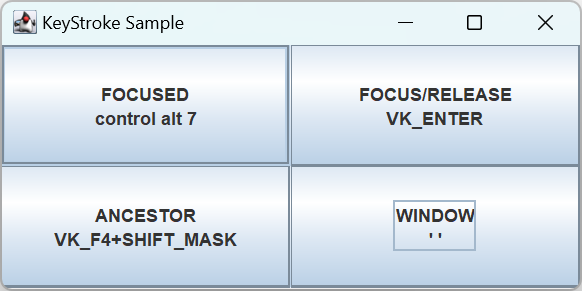

# Swing 特有事件

2024-04-09
@author Jiawei Mao
***
## 简介

Swing 在 AWT 基础上构建，改进了 AWT 的事件处理和焦点功能等特征。

为了简化事件处理，Swing 用 `Action` 接口扩展 `ActionListener` 接口，添加了可视属性。从而可以创建独立于可视组件的 event-handler。当 `Action` 稍后与组件关联时，组件可以直接从 event-handler 获取信息（如标签按钮）。

Swing 还添加了 `KeyStroke` 类，简化对按键事件的响应。甚至可以监听特定顺序的按键序列。keystroke-to-action 映射保存到 `InputMap` 和 `ActionMap` 中。当组件窗口持有焦点，`InputMap` 就是一个 `ComponentInputMap`。


## Action 接口

`Action` 接口扩展 `ActionListener`，提供独立于组件的 event-handler。`Action` 定义了一个 lookup-table，用于存储属性，当 `Action` 与组件关联，这些属性会自动转移到组件。其定义如下：

```java
public interface Action extends ActionListener {
    // 常量
    public static final String DEFAULT = "Default";
    public static final String NAME = "Name";
    public static final String SHORT_DESCRIPTION = "ShortDescription";
    public static final String LONG_DESCRIPTION = "LongDescription";
    public static final String SMALL_ICON = "SmallIcon";
    public static final String ACTION_COMMAND_KEY = "ActionCommandKey";
    public static final String ACCELERATOR_KEY="AcceleratorKey";
    public static final String MNEMONIC_KEY="MnemonicKey";
    public static final String SELECTED_KEY = "SwingSelectedKey";
    public static final String DISPLAYED_MNEMONIC_INDEX_KEY =
                                 "SwingDisplayedMnemonicIndexKey";
    public static final String LARGE_ICON_KEY = "SwingLargeIconKey";

    // 其它方法
    public Object getValue(String key);
    public void putValue(String key, Object value);

    // 属性
    public void setEnabled(boolean b);
    public boolean isEnabled();

    // Listeners
    public void addPropertyChangeListener(PropertyChangeListener listener);
    public void removePropertyChangeListener(PropertyChangeListener listener);
}
```

`Action` 毕竟只是接口，所有 Swing 提供了抽象实现 `AbstractAction`。

## AbstractAction

`AbstractAction` 提供 `Action` 接口的默认实现，实现**绑定属性**。

### 使用 Actions

扩展 `AbstractAction` 并实现 `public void actionPerformed(ActionEvent actionEvent)`，就可以将其传递给一些特殊的 Swing 组件。`JButton`, `JCheckBox`, `JRadioButton`, `JToggleButton`, `JMenuItem`, `JCheckBoxMenuItem` 和 `JRadioButtonMenuItem` 都提供了以 `Action` 为参数的构造函数。Swing 文本组件则通过 `Keymap`, `InputMap` 和 `ActionMap` 支持 `Action`。

将包含关联 `Action` 的组件添加到容器，选择组件将触发 `Action` 的 `actionPerformed(ActionEvent actionEvent)` 方法的调用。组件外观由 `Action` 传入的属性定义。

**示例：** 定义 `Action` 包含一个 "Print" 标签和 icon，触发时输出 "Hello, World"。

```java
import org.kordamp.ikonli.fontawesome5.FontAwesomeSolid;
import org.kordamp.ikonli.swing.FontIcon;

import javax.swing.*;
import java.awt.event.ActionEvent;

public class PrintHelloAction extends AbstractAction {

    private static final Icon printIcon = FontIcon.of(FontAwesomeSolid.PRINT, 24);

    public PrintHelloAction() {
        super("Print", printIcon);
        putValue(Action.SHORT_DESCRIPTION, "Hello, World");
    }

    @Override
    public void actionPerformed(ActionEvent e) {
        System.out.println("Hello, World");
    }
}
```

定义好 `Action`，就可以将其与任意数量的其它组件绑定。

```java
Action printAction = new PrintHelloAction();
menu.add(new JMenuItem(printAction));
toolbar.add(new JButton(printAction));
```

当 `Action` 与各种组件绑定，只需要修改 `Action` 属性，其它地方随之而变。例如：

```java
import javax.swing.*;
import java.awt.*;
import java.awt.event.ActionEvent;
import java.awt.event.ActionListener;

public class ActionTester {

    public static void main(String[] args) {
        Runnable runner = new Runnable() {
            @Override
            public void run() {
                JFrame frame = new JFrame("Action Sample");
                frame.setDefaultCloseOperation(JFrame.EXIT_ON_CLOSE);
                final Action printAction = new PrintHelloAction();

                JMenuBar menuBar = new JMenuBar();

                JMenu menu = new JMenu("File");
                menuBar.add(menu);
                menu.add(new JMenuItem(printAction));

                JToolBar toolBar = new JToolBar();
                toolBar.add(new JButton(printAction));

                JButton enableButton = new JButton("Enable");
                ActionListener enableActionListener = new ActionListener() {
                    @Override
                    public void actionPerformed(ActionEvent e) {
                        printAction.setEnabled(true);
                    }
                };
                enableButton.addActionListener(enableActionListener);

                JButton disableButton = new JButton("Disable");
                ActionListener disableActionListener = new ActionListener() {
                    @Override
                    public void actionPerformed(ActionEvent e) {
                        printAction.setEnabled(false);
                    }
                };
                disableButton.addActionListener(disableActionListener);

                JButton relabelButton = new JButton("Relabel");
                ActionListener relabelActionListener = new ActionListener() {
                    @Override
                    public void actionPerformed(ActionEvent e) {
                        printAction.putValue(Action.NAME, "Hello, World");
                    }
                };
                relabelButton.addActionListener(relabelActionListener);

                JPanel buttonPanel = new JPanel();
                buttonPanel.add(enableButton);
                buttonPanel.add(disableButton);
                buttonPanel.add(relabelButton);

                frame.setJMenuBar(menuBar);

                frame.add(toolBar, BorderLayout.SOUTH);
                frame.add(buttonPanel, BorderLayout.NORTH);
                frame.setSize(300, 200);
                frame.setVisible(true);
            }
        };
        EventQueue.invokeLater(runner);
    }
}
```


- 使用 `printAction.setEnabled(false)` 禁用 `Action` 会同时禁用 `JMenuItem` 和 `JButton`；
- 使用 `printAction.putValue(Action.NAME, "Hello, World")` 修改 `Action` 名称会同时修改 `JMenuItem` 和 `JButton` 的 text-label。

### AbstractAction 属性

`AbstractAction` 包含三个属性：

|属性名|数据类型|权限|
|---|---|---|
|enabled|boolean|Read-write bound|
|keys |Object []|Read-only|
|propertyChangeListeners|PropertyChangeListener[]|Read-only|

余下的绑定属性使用 `putValue(String key, Object value)` 放在查询表中。`keys` 属性返回当前已设置的属性。

下表是 Action 中预定量的 key 常量。也可以自定义 key 常量：

|常量|说明|
|---|---|
|NAME|Action 名词，作为 button-label|
|SMALL_ICON|Action 的 icon，用作 button-label|
|SHORT_DESCRIPTION|Action 的简短描述，用作 tooltip，但非默认|
|LONG_DESCRIPTION |Action 的描述，可 用作 accessibility|
|ACCELERATOR|`KeyStroke` 字符串，可用作Action 的快捷键|
|ACTION_COMMAND_KEY |InputMap key，映射到关联的 JComponent 的 ActionMap 中的 Action|
|MNEMONIC_KEY |key code，可以用作Action 的助记符|
|DEFAULT|未使用，可用于自定义属性|

将属性放入 lookup-table 后，可以使用 `getValue(String key)` 获取值。

## KeyStroke

`KeyStroke` 类结合 `JComponent` 的 `inputMap`、`actionMap` 属性，提供注册 `KeyListener` 的简洁替代。

`KeyStroke` 可以定义按键组合，如 Shift-Ctrl-P 或 F4.

触发 keystroke 的方法有三种，`JComponent` 有 4 个常量提供帮助。

> 表 4. `KeyStroke` 注册条件

|常量|说明|
|---|---|
|`WHEN_FOCUSED`|要求组件持有输入焦点|
|`WHEN_IN_FOCUSED_WINDOW` |要求该组件或其所在的 Window 持有输入焦点|
|`WHEN_ANCESTOR_OF_FOCUSED_COMPONENT`|要求组件或其包含的子组件持有输入焦点|
|`UNDEFINED_CONDITION`|未定义激活条件|

### 创建 KeyStroke

`KeyStroke` 是 `AWTKeyStroke` 的子类，没有 public 构造函数。使用如下方法创建：

```java
public static KeyStroke getKeyStroke(char keyChar)
public static KeyStroke getKeyStroke(String representation)
public static KeyStroke getKeyStroke(int keyCode, int modifiers)
public static KeyStroke getKeyStroke(int keyCode, int modifiers,
    boolean onKeyRelease)
public static KeyStroke getKeyStrokeForEvent(KeyEvent keyEvent)
```

1. 第一个版本，从 `char` 创建 `KeyStroke`，例如：

```java
KeyStroke space = KeyStroke.getKeyStroke('Z');
```

!!! note
    这个方法不好区分大小写，不推荐使用。

2. 第二个版本

```java
public static KeyStroke getKeyStroke(String representation)
```

这个版本比较有意思，通过字符串指定 keystroke，例如 "control F4"：

- 修饰符包括 "shift", "control", "meta", "alt", "button1", "button2" 和 "button3"；
- 可以指定多个修饰符；
- 字符串余下部分为 `KeyEvent` 中的 `VK_*` 常量。

例如，定义 Ctrl-Alt-7 的 keystroke 定义：

```java
KeyStroke controlAlt7 = KeyStroke.getKeyStroke("control alt 7");
```

3. 下面两个方法比较直接

```java
public static KeyStroke getKeyStroke(int keyCode, int modifiers)
public static KeyStroke getKeyStroke(int keyCode, int modifiers,
    boolean onKeyRelease)
```

可以通过 `InputEvent` 中的 `VK_*` 常量和修饰符创建 keystroke（0 表示无）。`onKeyRelease` 默认为 false。

```java
KeyStroke enter = KeyStroke.getKeyStroke(KeyEvent.VK_ENTER, 0, true);
KeyStroke shiftF4 = KeyStroke.getKeyStroke(KeyEvent.VK_F4, InputEvent.SHIFT_MASK);
```

4. 最后一个版本直接将 `KeyEvent` 映射到 `KeyStroke`

```java
public static KeyStroke getKeyStrokeForEvent(KeyEvent keyEvent)
```

该版本让用户可以用 keystroke 触发事件。

```java
KeyStroke fromKeyEvent = KeyStroke.getKeyStrokeForEvent(keyEvent);
```

### 注册 KeyStroke

步骤：

1. 创建 `KeyStroke`
2. 创建 `Action`
3. 通过 `InputMap`，将 `KeyStroke` 映射到 action-string
4. 通过 `ActionMap`，将 action-string 映射到 `Action`

注册过程，就是实现从 keystroke 到 `Action` 的映射。在按下或释放 keystroke 时触发 `Action`。

按下或释放 keystroke 能够触发 Action，还需要考虑焦点持有情况（表 4）。`getInputMap(condition)` 获得组件的 `InputMap`，其参数指定焦点条件，默认为 `WHEN_FOCUSED`，即组件持有输入焦点时按下或释放 keystroke 出发 `Action`。

`component.getInputMap()` 使用默认 `condition` 返回 `InputMap`，添加从 keystroke 到文本字符串的映射：

```java
component.getInputMap().put(keystroke, string)
```

其中 action-string 需要提前定义。

然后使用 `ActionMap` 将 action-string 映射到 `Action`:

```java
component.getActionMap.put(string, action)
```

通过共享 `ActionMap` 实例可以在组件之间**共享操作**。

**实例：** 创建 4 个按钮，每个按钮注册不同的 keystroke，并且设置不同的焦点激活条件。

button-label 显示 keystroke 激活条件。`Action` 只是输出一条消息和激活按钮的标签。

```java
import javax.swing.*;
import java.awt.*;
import java.awt.event.ActionEvent;
import java.awt.event.InputEvent;
import java.awt.event.KeyEvent;

public class KeyStrokeSample {
    private static final String ACTION_KEY = "theAction";

    public static void main(String[] args) {
        Runnable runner = new Runnable() {
            @Override
            public void run() {
                JFrame frame = new JFrame("KeyStroke Sample");
                frame.setDefaultCloseOperation(JFrame.EXIT_ON_CLOSE);

                JButton buttonA = new JButton("<html><center>FOCUSED<br>control alt 7");
                JButton buttonB = new JButton("<html><center>FOCUS/RELEASE<br>VK_ENTER");
                JButton buttonC = new JButton("<html><center>ANCESTOR<br>VK_F4+SHIFT_MASK");
                JButton buttonD = new JButton("<html><center>WINDOW<br>' '");

                // 创建 Action，即按下快捷键触发的操作
                Action actionListener = new AbstractAction() {
                    @Override
                    public void actionPerformed(ActionEvent e) {
                        JButton source = (JButton) e.getSource();
                        System.out.println("Activated: " + source.getText());
                    }
                };

                // 定义 KeyStroke: Ctrl-Alt-7
                KeyStroke controlAlt7 = KeyStroke.getKeyStroke("control alt 7");
                
                // InputMap，将 KeyStroke 映射到 action-string
                InputMap inputMap = buttonA.getInputMap(); // 默认 WHEN_FOCUSED
                inputMap.put(controlAlt7, ACTION_KEY);

                // ActionMap，将 action-string 映射到 Action
                // 所有按钮共享这个 ActionMap
                ActionMap actionMap = buttonA.getActionMap();
                actionMap.put(ACTION_KEY, actionListener);
                
                // Enter，释放时触发
                KeyStroke enter = KeyStroke.getKeyStroke(KeyEvent.VK_ENTER, 0, true);
                inputMap = buttonB.getInputMap();// 默认 WHEN_FOCUSED
                inputMap.put(enter, ACTION_KEY);
                buttonB.setActionMap(actionMap);

                // Shift-F4
                KeyStroke shiftF4 = KeyStroke.getKeyStroke(KeyEvent.VK_F4, InputEvent.SHIFT_MASK);
                // 条件：该组件或其子组件持有焦点
                inputMap = buttonC.getInputMap(JComponent.WHEN_ANCESTOR_OF_FOCUSED_COMPONENT);
                inputMap.put(shiftF4, ACTION_KEY);
                buttonC.setActionMap(actionMap);

                // 空格
                KeyStroke space = KeyStroke.getKeyStroke(' ');
                // 条件：该组件或其所在 Window 持有焦点
                inputMap = buttonD.getInputMap(JComponent.WHEN_IN_FOCUSED_WINDOW);
                inputMap.put(space, ACTION_KEY);
                buttonD.setActionMap(actionMap);

                frame.setLayout(new GridLayout(2, 2));
                frame.add(buttonA);
                frame.add(buttonB);
                frame.add(buttonC);
                frame.add(buttonD);

                frame.setSize(400, 200);
                frame.setVisible(true);
            }
        };
        EventQueue.invokeLater(runner);
    }
}
```



!!! tip
    对 text-component，可以获得 `Keymap`，然后用 `addActionForKeyStroke(KeyStroke, Action)` 一步将 `KeyStroke` 映射到 `Action`。

## 快捷键和助记符

Swing 对几个内部功能也使用了 `KeyStroke`，其中就包括助记符和快捷键：

- 快捷键（accelerator-key）：通过键盘的几个键组合触发一个动作，只用于菜单。
- 助记符（mnemonic-key）：指菜单、按钮、文本标签等文本中带下划线的一个字符，用来提示用户可以通过按下 Alt+字符触发相应动作。

两个功能类似，不过 accelerator-key 只有菜单有，mnemonic-key 除了菜单，还能用于 JButton, JCheckBox, JRadioButton 等。
