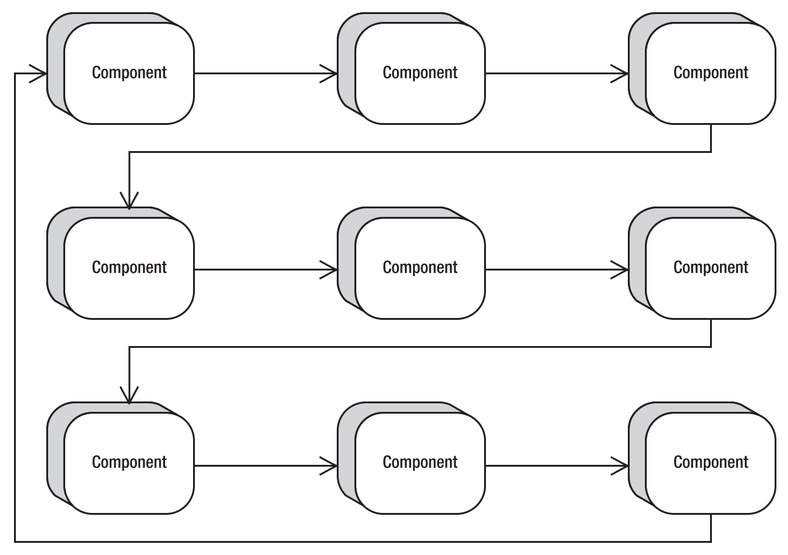

# Swing 焦点管理

2024-04-10
@author Jiawei Mao
***

## 简介

焦点（focus）指组件获得输入焦点，简称焦点组件。焦点组件是所有 key-events 的事件源，如文本输入。部分组件会显示特殊标记，表明它是焦点组件。如下图所示：


对焦点组件，除了可以使用鼠标进行选择，还可以使用键盘触发选择（通常是空格键或 Enter 键）。例如，对按钮，按下空格键可以触发它。

!!! note
    焦点系统在 J2SE 1.4 进行了重大更新。所有老版本依然存在，但应该避免使用。老版本有很多 bug，不能很好工作。于是 Sun 完全丢弃老版本，新开发了一个版本，但老 api 仍然存在。在使用焦点系统时，要避免使用过时的 api，像 `javax.swing.FocusManager` 和 `javax.swing.DefaultFocusManager` 都已过时。

焦点管理中一个重要的概念是**焦点循环**，指特定容器内组件集合的焦点遍历顺序。焦点管理的主要类：

- `java.awt.FocusTraversalPolicy`：确定下一个和上一个焦点组件的算法；
- `java.awt.KeyboardFocusManager`：控制键盘导航和焦点修改。

通过注册 `FocusListener` 发现 Swing 组件何时获得输入焦点：

- 组件何时获得或失去焦点；
- 当一个组件获得焦点，哪个组件失去焦点；
- 当一个组件丢失焦点，哪个组件获得焦点。

此外，弹出菜单可能会发生临时焦点变化。失去焦点的组件在下拉菜单时会再次获得焦点。

`FocusTraversalPolicy` 算法描述如何在窗口的可聚焦组件之间移动焦点。默认为容器中组件的添加顺序。对 Swing 应用，默认的焦点遍历从左上角开始，向右下角移动，对应 `LayoutFocusTraversalPolicy` 类。如下图所示：



当所有组件在同一个容器中，这种遍历顺序称为焦点循环。

!!! note
    对容器中的组件，用户可以按 Tab 或 Shift-Tab 键向前或向后移动焦点。

## 移动焦点

**示例：** 创建两个 listener 来处理输入焦点。

- `MouseListener` 将焦点移到鼠标下的组件；
- `ActionListener` 将焦点移到下一个组件。

`MouseListener` 只需要在鼠标进入组件时调用 `requestFocusInWindow()`：

```java
public class MouseEnterFocusMover extends MouseAdapter {

    @Override
    public void mouseEntered(MouseEvent e) {
        Component component = e.getComponent();
        if (!component.hasFocus()) {
            component.requestFocusInWindow();
        }
    }
}
```

对 `ActionListener`，需要调用 `KeyboardFocusManager` 的 `focusNextComponent()` 方法：

```java
import java.awt.*;
import java.awt.event.ActionEvent;
import java.awt.event.ActionListener;

public class ActionFocusMover implements ActionListener {

    @Override
    public void actionPerformed(ActionEvent e) {
        KeyboardFocusManager manager =
                KeyboardFocusManager.getCurrentKeyboardFocusManager();
        manager.focusNextComponent();
    }
}
```

`ActionFocusMover` 和 `MouseEnterFocusMover` 展示了两种不同用代码移动焦点的方式：

- `ActionFocusMover` 用 `KeyboardFocusManager` 进行遍历；
- `MouseEnterFocusMover` 中调用 `requestFocusInWindow()`，表示如果当前组件所在的顶层 Window 持有焦点，就将输入焦点移到该组价。

不过，持有焦点的功能可以关闭。如果组件不可聚焦，要么组件的 `focusable` 属性默认为 `false`，要么调用 `component.setFocusable(false)` 关闭了组件的聚焦能力，在移动焦点时这类组件被跳过，即从 tab 焦点循环中移除。

**示例：** 使用两个 event-handlers 移动焦点。

创建 3x3=9 个 buttons，每个 button 添加一个 mouse-listener 和一个 focus-listener。奇数 buttons 可以选择但不能聚焦。

```java
import javax.swing.*;
import java.awt.*;
import java.awt.event.ActionListener;
import java.awt.event.MouseListener;

public class FocusSample {

    public static void main(String[] args) {
        Runnable runner = new Runnable() {
            @Override
            public void run() {
                JFrame frame = new JFrame("Focus Sample");
                frame.setDefaultCloseOperation(JFrame.EXIT_ON_CLOSE);

                // 鼠标移到组件上即聚焦
                ActionListener actionListener = new ActionFocusMover();
                // 移到下一个可聚焦组件
                MouseListener mouseListener = new MouseEnterFocusMover();

                frame.setLayout(new GridLayout(3, 3));
                for (int i = 1; i < 10; i++) {
                    JButton button = new JButton(Integer.toString(i));
                    button.addActionListener(actionListener);
                    button.addMouseListener(mouseListener);

                    if ((i % 2) != 0) {
                        button.setFocusable(false);
                    }
                    frame.add(button);
                }
                frame.setSize(300, 300);
                frame.setVisible(true);
            }
        };
        EventQueue.invokeLater(runner);
    }
}
```


效果：

- 点击任意按钮，焦点移到到下一个可聚焦组件（在 2, 4, 6,8 四个按钮之间循环）
- 鼠标移到任意按钮上，该按钮被激活

## 检查焦点循环

Swing 容器的焦点循环可以自定义。焦点循环指容器内组件焦点遍历顺序。

将 `focusCycleRoot` 属性设置为 `true`，可以将焦点循环限制在容器内，即焦点不会遍历到容器外的组件：

- 到容器的最后一个组件，按 Tab 键将绕回容器的第一个组件，而不是移动到容器外的第一个组件；
- 在容器的第一个组件，按 Shift-Tab 焦点到容器内最后一个组件，而不是容器外的前一个组件。

如图所示，将中间的 3 个 buttons 放到一个容器，`focusCycleRoot=true` 时的遍历状态：


在此循环中：

- 按 Tab 键永远无法到达第三行的 buttons；
- 要进入第二行的容器，需要设置 `focusTraversalPolicyProvider` 为 `true`

**示例：** 演示上图的行为

```java
import javax.swing.*;
import java.awt.*;

public class FocusCycleSample {

    public static void main(String[] args) {
        Runnable runner = new Runnable() {
            @Override
            public void run() {
                JFrame frame = new JFrame("Focus Cycle Sample");
                frame.setDefaultCloseOperation(JFrame.EXIT_ON_CLOSE);

                frame.setLayout(new GridBagLayout());
                GridBagConstraints constraints = new GridBagConstraints();
                constraints.weightx = 1.0;
                constraints.weighty = 1.0;
                constraints.gridwidth = 1;
                constraints.gridheight = 1;
                constraints.fill = GridBagConstraints.BOTH;
                // Row One
                constraints.gridy = 0;
                for (int i = 0; i < 3; i++) {
                    JButton button = new JButton(String.valueOf(i));
                    constraints.gridx = i;
                    frame.add(button, constraints);
                }

                // Row Two
                JPanel panel = new JPanel();
                panel.setFocusCycleRoot(true);
                panel.setFocusTraversalPolicyProvider(true);
                panel.setLayout(new GridLayout(1, 3));
                for (int i = 0; i < 3; i++) {
                    JButton button = new JButton(String.valueOf(i + 3));
                    panel.add(button);
                }
                constraints.gridx = 0;
                constraints.gridy = 1;
                constraints.gridwidth = 3;
                frame.add(panel, constraints);

                // Row Three
                constraints.gridy = 2;
                constraints.gridwidth = 1;
                for (int i = 0; i < 3; i++) {
                    JButton button = new JButton(String.valueOf(i + 6));
                    constraints.gridx = i;
                    frame.add(button, constraints);
                }

                frame.setSize(300, 200);
                frame.setVisible(true);
            }
        };
        EventQueue.invokeLater(runner);
    }
}
```

## FocusTraversalPolicy

`FocusTraversalPolicy` 负责确定焦点遍历顺序。该类提供了 6 个方法来控制遍历顺序：

- `getComponentAfter(Container aContainer, Component aComponent)`
- `getComponentBefore(Container aContainer, Component aComponent)`
- `getDefaultComponent(Container aContainer)`
- `getFirstComponent(Container aContainer)`
- `getInitialComponent(Window window)`
- `getLastComponent(Container aContainer)`

Swing 提供了 5 个预定的遍历策略。如下表所示：

|策略|说明|
|---|---|
|ContainerOrderFocusTraversalPolicy|按照添加到容器的顺序遍历组件。该组件必须可见、可显示、启用的、可聚焦的，才能成为焦点循环的一部分|
|DefaultFocusTraversalPolicy|AWT 的默认策略，该策略扩展 ContainerOrderFocusTraversalPolicy，检查组件的系统对等组件是否设置可聚焦性。系统的对等组件是否可聚焦取决于 Java runtime 实现|
|InternalFrameFocusTraversalPolicy|用于 JInternalFrame 的特殊策略。主要根据 frame 的默认组件确定 frame 里的初始聚焦组件|
|SortingFocusTraversalPolicy|在构造函数中提供一个 Comparator 来定义遍历顺序|
|LayoutFocusTraversalPolicy|Swing 的默认遍历策略，即根据组件的几何设置，按照从上到下，从左到右的顺序遍历。上下、左右关系根据与 locale 对应的当前 ComponentOrientation 确定。例如，希伯来语是按照从右到左的顺序|

**示例：** 颠倒 Tab 和 Shift-Tab 的功能。

依然是 3x3 个 buttons，但是初始焦点组件为第 9 个 button，按 Tab 到 8, 7, 6 反过来的顺序遍历，Shift-Tab 则变成正向遍历。

```java
import javax.swing.*;
import java.awt.*;
import java.util.Arrays;
import java.util.Comparator;

public class NextComponentSample {

    public static void main(String[] args) {
        Runnable runner = new Runnable() {
            @Override
            public void run() {
                JFrame frame = new JFrame("Reverse Sample");
                frame.setDefaultCloseOperation(JFrame.EXIT_ON_CLOSE);

                frame.setLayout(new GridLayout(3, 3));
                // for (int i=1; i<10; i++) {
                for (int i = 9; i > 0; i--) {
                    JButton button = new JButton(Integer.toString(i));
                    frame.add(button, 0);
                }

                final Container contentPane = frame.getContentPane();
                Comparator<Component> comp = (c1, c2) -> {
                    Component[] comps = contentPane.getComponents();
                    java.util.List<Component> list = Arrays.asList(comps);
                    int first = list.indexOf(c1);
                    int second = list.indexOf(c2);
                    return second - first;
                };

                FocusTraversalPolicy policy = new SortingFocusTraversalPolicy(comp);
                frame.setFocusTraversalPolicy(policy);

                frame.setSize(300, 200);
                frame.setVisible(true);
            }
        };
        EventQueue.invokeLater(runner);
    }
}
```

## KeyboardFocusManager

抽象类 `KeyboardFocusManager` 用于焦点控制，`DefaultKeyboardFocusManager` 是具体实现类。通过 `KeyboardFocusManager` 能以编程方式发现当前焦点组件，并能更改焦点。

当前持有输入焦点的组件成为 focus-owner，我们就简称为焦点组件。`KeyboardFocusManager` 的 `focusOwner` 属性返回焦点组件。另外还有 `focusedWindow` 和 `activeWindow` 属性。`focusedWindow` 是包含 focus-owner 的窗口，`activeWindow` 则要么是 `focusedWindow`，要么是包含 `focusOwner` 的 frame 或 dialog。

移动到上一个或下一个组件的方式有很多。首先，可以使用 Component 和 Container 的快捷 api：

- `Component.transferFocus()`
- `Component.transferFocusBackward()`
- `Component.transferFocusUpCycle()`
- `Container.transferFocusDownCycle()`

前两个方法分别将焦点移到下一个或上一个组件。后两个方法将焦点移到到上一个或下一个循环。

以下为 KeyboardFocusManager 中移动焦点方法：

- `focusNextComponent()`
- `focusPreviousComponent()`
- `upFocusCycle()`
- `downFocusCycle()`

这 4 个方法都有一个重载方法，如 `focusNextComponent(Component aComponent)`。如果未指定组件，则根据当前 focusOwner 修改焦点，否则根据提供的组件修改焦点。

Tab 和 Shift-Tab 用于键盘焦点遍历，是大多组组件默认的焦点遍历快捷键。可以通过 `Component.setFocusTraversalKeys()` 自定义遍历快捷键。 4 个遍历方式对应 KeyboardFocusManager 的 4 个常量：

- FORWARD_TRAVERSAL_KEYS
- BACKWARD_TRAVERSAL_KEYS
- UP_CYCLE_TRAVERSAL_KEYS
- DOWN_CYCLE_TRAVERSAL_KEYS

对每个组件都可以设置。例如，将 F3 设置为组件的 up-cycle 快捷键：

```java
Set<AWTKeyStroke> set = component.getFocusTraversalKeys(
    KeyboardFocusManager.UP_CYCLE_TRAVERSAL_KEYS);
KeyStroke stroke = KeyStroket.getKeyStroke("F3");
set.add(stroke);
component.setFocusTraversalKeys(KeyboardFocusManager.UP_CYCLE_TRAVERSAL_KEYS, set);
```

## 遍历焦点时验证输入

Swing 提供了 `InputVerifier` 抽象类用于在遍历焦点时验证组件内容。

**示例：** 一个简单的数字文本验证

显示 3 个文本字段，其中1 和 3 具有验证，如果字段无效，则无法 tab 选择它们。

```java
import javax.swing.*;
import java.awt.*;

public class VerifierSample {

    public static void main(String[] args) {
        Runnable runner = new Runnable() {
            public void run() {
                JFrame frame = new JFrame("Verifier Sample");
                frame.setDefaultCloseOperation(JFrame.EXIT_ON_CLOSE);
                JTextField textField1 = new JTextField();
                JTextField textField2 = new JTextField();
                JTextField textField3 = new JTextField();

                InputVerifier verifier = new InputVerifier() {
                    public boolean verify(JComponent comp) {
                        boolean returnValue;
                        JTextField textField = (JTextField) comp;
                        try {
                            Integer.parseInt(textField.getText());
                            returnValue = true;
                        } catch (NumberFormatException e) {
                            returnValue = false;
                        }
                        return returnValue;
                    }
                };

                // 设置 InputVerifier
                textField1.setInputVerifier(verifier);
                textField3.setInputVerifier(verifier);

                frame.add(textField1, BorderLayout.NORTH);
                frame.add(textField2, BorderLayout.CENTER);
                frame.add(textField3, BorderLayout.SOUTH);
                frame.setSize(300, 100);
                frame.setVisible(true);
            }
        };
        EventQueue.invokeLater(runner);
    }
}
```

!!! tip
    为了确保取消类型的按钮在使用 InputVerifier 时无论如何都能获得输入焦点，可以在组件中使用 `setVerifyInputWhenFocusTarget(false)`。