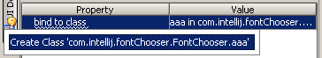

# GUI Designer

- [GUI Designer](#gui-designer)
  - [简介](#简介)
    - [绑定类](#绑定类)
  - [使用流程](#使用流程)
    - [创建 form](#创建-form)
    - [Form 和代码绑定](#form-和代码绑定)
      - [form 与新类绑定](#form-与新类绑定)
      - [form 与已有类绑定](#form-与已有类绑定)
      - [Groups of Components 与字段绑定](#groups-of-components-与字段绑定)
    - [创建和打开 form](#创建和打开-form)

## 简介

IntelliJ IDEA 的 GUI Designer (GD) 使用 Swing 库控件创建 GUI。该工具可用于快速创建对话框或控件组。使用 GD 创建的是 pane，不是 frame。

使用 GD 创建的对话框和控件组可以与直接使用 Java 代码创建的控件同时使用。

使用 GD 的限制：

- 只支持 Swing 控件；
- 不支持创建 frame，也不支持创建菜单。

在设计时，GUI 信息保存在 **.form** 文件中，该文件是 XML 格式。

### 绑定类

IDEA 默认会在创建新的 form 时同时创建一个 Java 类。新的 form 通过 bind to class属性自动绑定到类。当将组件添加到 form 中，对应的字段会自动插入对应的源文件。

字段名称出现在组件的字段名属性中，从而将组件绑定到类中的代码。剩下就只需要实现 form 的行为和功能。

## 使用流程

设计一个 GUI 需要如下步骤：

- 创建新的 form 或 dialog；

### 创建 form

### Form 和代码绑定

如果在创建新 form 时默认没有创建绑定类，可以按如下方式显式创建。

显式绑定的方法有两种：

- 将 form 绑定到已有类，将组件绑定到类的字段；
- 将 form 及其组件绑定到还不存在的类和字段。

#### form 与新类绑定

当没有组件，或者在 Component Treeview 中选择 form node，在 properties 会显示 form 的属性。

将 form 和不存在类绑定：

1. 选择 form；
2. 在 `bind to class` 字段中，输入新类的完整名称。出现创建新类的建议；
3. 点击按钮，或 `Alt+Enter`，期望类在指定位置创建。

#### form 与已有类绑定

1. 选择 form
2. 使用两种方式之一：
   1. 在 `bind to class` 字段，输入绑定类的完整名称
   2. 点击 **Browser** 在 **Choose Class to Bind** 选择绑定类

#### Groups of Components 与字段绑定

在 绑定到源代码中 form 中创建按钮组时，默认不为该组创建字段。如果需要在代码中引用该分组，则必须显式将该组绑定到字段。

1. 在 Component Treeview 中选择 button group；
2. 确定 **Name** 属性与源码中字段名称一致；
3. 勾选 **Custom Create** 在源码文件中生成字段声明。

### 创建和打开 form

GUI Designer 