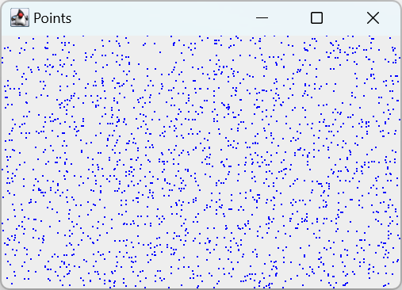
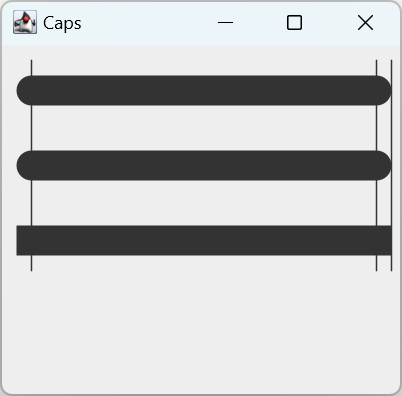
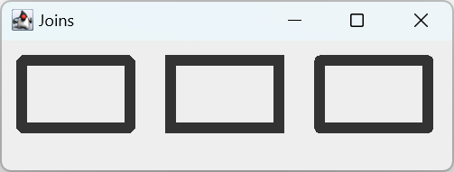

# 绘制基本图形

- [绘制基本图形](#绘制基本图形)
  - [点](#点)
  - [线](#线)
  - [BasicStroke - 虚线](#basicstroke---虚线)
  - [Caps](#caps)
  - [Joins](#joins)

2023-12-26, 17:58⭐
***

## 点

**点**是最简单的几何图元。不过 `Graphics2D` 没有绘制点的方法，但我们可以用 `drawLine`，将起点和终点使用相同参数：

```java
import javax.swing.*;
import java.awt.*;
import java.awt.event.ActionEvent;
import java.awt.event.ActionListener;
import java.awt.event.WindowAdapter;
import java.awt.event.WindowEvent;
import java.util.Random;

class PointSurface extends JPanel implements ActionListener {

    private final int DELAY = 150;
    private Timer timer;

    public PointSurface() {
        initTimer();
    }

    private void initTimer() {
        timer = new Timer(DELAY, this);
        timer.start();
    }

    public Timer getTimer() {
        return timer;
    }

    private void doDrawing(Graphics g) {
        Graphics2D gd = (Graphics2D) g;

        gd.setPaint(Color.blue);
        int w = getWidth();
        int h = getHeight();

        Random r = new Random();
        for (int i = 0; i < 2000; i++) {
            int x = Math.abs(r.nextInt()) % w;
            int y = Math.abs(r.nextInt()) % h;
            gd.drawLine(x, y, x, y);
        }
    }

    @Override
    protected void paintComponent(Graphics g) {
        super.paintComponent(g);
        doDrawing(g);
    }

    @Override
    public void actionPerformed(ActionEvent e) {
        repaint();
    }
}

public class PointsEx extends JFrame {

    public PointsEx() {
        initUI();
    }

    private void initUI() {
        PointSurface surface = new PointSurface();
        add(surface);

        addWindowListener(new WindowAdapter() {
            @Override
            public void windowClosing(WindowEvent e) {
                Timer timer = surface.getTimer();
                timer.stop();
            }
        });

        setTitle("Points");
        setSize(350, 250);
        setLocationRelativeTo(null);
        setDefaultCloseOperation(WindowConstants.EXIT_ON_CLOSE);
    }

    public static void main(String[] args) {
        EventQueue.invokeLater(() -> {
            PointsEx ex = new PointsEx();
            ex.setVisible(true);
        });
    }
}
```



该示例随机在窗口绘制 2000 个点，用 `Timer` 动态绘制。`Timer` 根据指定的 `ActionEvent` 周期更新：

```java
private void initTimer() {
    timer = new Timer(DELAY, this);
    timer.start();
}
```

- 点颜色设置为蓝色

```java
gd.setPaint(Color.blue);
```

- 获取组件的尺寸，在其中计算随机点，并绘制该点

```java
int w = getWidth();
int h = getHeight();

Random r = new Random();
for (int i = 0; i < 2000; i++) {
    int x = Math.abs(r.nextInt()) % w;
    int y = Math.abs(r.nextInt()) % h;
    gd.drawLine(x, y, x, y);
}
```

对每个 `ActionEvent` 调用 `repaint`，重绘整个区域：

```java
@Override
public void actionPerformed(ActionEvent e) {
    repaint();
}
```

- 监听关闭窗口事件，关闭时主动关闭 Timer

```java
addWindowListener(new WindowAdapter() {
    @Override
    public void windowClosing(WindowEvent e) {
        Timer timer = surface.getTimer();
        timer.stop();
    }
});
```

## 线

使用 `drawLine` 划线。

```java
import javax.swing.*;
import java.awt.*;

class LinesSurface extends JPanel {

    private void doDrawing(Graphics g) {
        Graphics2D gd = (Graphics2D) g;

        gd.drawLine(30, 30, 200, 30);
        gd.drawLine(200, 30, 30, 200);
        gd.drawLine(30, 200, 200, 200);
        gd.drawLine(200, 200, 30, 30);
    }

    @Override
    protected void paintComponent(Graphics g) {
        super.paintComponent(g);
        doDrawing(g);
    }
}

public class LinesEx extends JFrame {

    public LinesEx() {
        initUI();
    }

    private void initUI() {
        add(new LinesSurface());

        setTitle("Lines");
        setSize(350, 250);
        setLocationRelativeTo(null);
        setDefaultCloseOperation(WindowConstants.EXIT_ON_CLOSE);
    }

    public static void main(String[] args) {
        EventQueue.invokeLater(() -> {
            LinesEx ex = new LinesEx();
            ex.setVisible(true);
        });
    }
}
```


## BasicStroke - 虚线

`BasicStroke` 为几何图元的轮廓定义了一组基本属性，包括 lineWidth, lineJoin, miterLimit, dash 等。

**线段宽度**

`BasicStroke` 的一个参数为线条宽度，`float` 类型。单位：`72.0f=72pt=1 英寸=25.4 mm`。

虚线由 gap 分隔的多个线段，即包含线段和空白两部分，其定义也包含两部分：

- 虚线数组(dash array)，`float[]` 类型：

如 `float[] array`, 则 array[0] 是第1个线段长度，array[1]是第一个空白长度，依次下去，根据线条长度循环使用数组。

- 起始处(dash phase):

定义虚线开始位置和线条起始位置的距离。

下面展示不同虚线模式：

```java
import javax.swing.*;
import java.awt.*;

class BasicStrokesSurface extends JPanel {

    private void doDrawing(Graphics g) {
        // 除了 font, color, 渲染提示外的属性，修改其它属性都需要创建副本
        Graphics2D gd = (Graphics2D) g.create();

        // 定义 4 种虚线模式
        float[] dash1 = {2f, 0f, 2f};
        float[] dash2 = {1f, 1f, 1f};
        float[] dash3 = {4f, 0f, 2f};
        float[] dash4 = {4f, 4f, 1f};

        gd.drawLine(20, 40, 250, 40);

        BasicStroke bs1 = new BasicStroke(1, BasicStroke.CAP_BUTT, BasicStroke.JOIN_ROUND, 1.0f, dash1, 2f);
        BasicStroke bs2 = new BasicStroke(1, BasicStroke.CAP_BUTT, BasicStroke.JOIN_ROUND, 1.0f, dash2, 2f);
        BasicStroke bs3 = new BasicStroke(1, BasicStroke.CAP_BUTT, BasicStroke.JOIN_ROUND, 1.0f, dash3, 2f);
        BasicStroke bs4 = new BasicStroke(1, BasicStroke.CAP_BUTT, BasicStroke.JOIN_ROUND, 1.0f, dash4, 2f);

        gd.setStroke(bs1);
        gd.drawLine(20, 80, 250, 80);

        gd.setStroke(bs2);
        gd.drawLine(20, 120, 250, 120);

        gd.setStroke(bs3);
        gd.drawLine(20, 160, 250, 160);

        gd.setStroke(bs4);
        gd.drawLine(20, 200, 250, 200);

        // 回收 graphics 副本
        gd.dispose();
    }

    @Override
    protected void paintComponent(Graphics g) {
        super.paintComponent(g);
        doDrawing(g);
    }
}

public class BasicStrokesEx extends JFrame {

    public BasicStrokesEx() {
        initUI();
    }

    private void initUI() {
        add(new BasicStrokesSurface());
        setTitle("Basic strokes");
        setSize(280, 270);
        setLocationRelativeTo(null);
        setDefaultCloseOperation(WindowConstants.EXIT_ON_CLOSE);
    }

    public static void main(String[] args) {
        EventQueue.invokeLater(() -> {
            BasicStrokesEx ex = new BasicStrokesEx();
            ex.setVisible(true);
        });
    }
}
```


## Caps

Cap 是应用于未封闭路径和虚线末端的装饰。Java 2D 支持三种 Caps：

|CAP 类型|说明|
|---|---|
|`CAP_BUTT`|无装饰|
|`CAP_ROUND`|半径等于 `strokeWidth` 一半的半圆|
|`CAP_SQUARE`|向外延伸 strokeWidth 一半的矩形|

```java
import javax.swing.*;
import java.awt.*;

class CapsSurface extends JPanel {

    private void doDrawing(Graphics g) {
        Graphics2D gd = (Graphics2D) g.create();

        RenderingHints rh = new RenderingHints(RenderingHints.KEY_ANTIALIASING, RenderingHints.VALUE_ANTIALIAS_ON);
        rh.put(RenderingHints.KEY_RENDERING, RenderingHints.VALUE_RENDER_QUALITY);

        gd.setRenderingHints(rh);

        // 创建三种 CAP 类型的 Stroke
        BasicStroke bs1 = new BasicStroke(20, BasicStroke.CAP_ROUND, BasicStroke.JOIN_BEVEL);
        gd.setStroke(bs1);
        gd.drawLine(20, 30, 250, 30);


        BasicStroke bs2 = new BasicStroke(20, BasicStroke.CAP_ROUND, BasicStroke.JOIN_BEVEL);
        gd.setStroke(bs2);
        gd.drawLine(20, 80, 250, 80);

        BasicStroke bs3 = new BasicStroke(20, BasicStroke.CAP_SQUARE, BasicStroke.JOIN_BEVEL);
        gd.setStroke(bs3);
        gd.drawLine(20, 130, 250, 130);

        // 三条垂直线解释三种 CAP 的差异
        BasicStroke bs4 = new BasicStroke();
        gd.setStroke(bs4);
        gd.drawLine(20, 10, 20, 150);
        gd.drawLine(250, 10, 250, 150);
        gd.drawLine(260, 10, 260, 150);

        gd.dispose();
    }

    @Override
    protected void paintComponent(Graphics g) {
        super.paintComponent(g);
        doDrawing(g);
    }
}

public class CapsEx extends JFrame {

    public CapsEx() {
        initUI();
    }

    private void initUI() {
        add(new CapsSurface());

        setTitle("Caps");
        setSize(280, 270);
        setLocationRelativeTo(null);
        setDefaultCloseOperation(WindowConstants.EXIT_ON_CLOSE);
    }

    public static void main(String[] args) {
        EventQueue.invokeLater(() -> {
            CapsEx ex = new CapsEx();
            ex.setVisible(true);
        });
    }
}
```



## Joins

Join 指定线段交叉位置的装饰，也有三种类型。

|Join 类型|说明|
|---|---|
|JOIN_BEVEL|直接用直线连接|
|JOIN_MITER|延伸外边直到相交|
|JOIN_ROUND|以线宽一半的圆弧连接|

```java
import javax.swing.*;
import java.awt.*;

class JoinsSurface extends JPanel {

    private void doDrawing(Graphics g) {
        Graphics2D gd = (Graphics2D) g.create();

    
        // 创建不同 JOIN 的 BasicStroke
        BasicStroke bs1 = new BasicStroke(10, BasicStroke.CAP_ROUND, BasicStroke.JOIN_BEVEL);
        gd.setStroke(bs1);
        gd.drawRect(15, 15, 80, 50);

        BasicStroke bs2 = new BasicStroke(10, BasicStroke.CAP_ROUND, BasicStroke.JOIN_MITER);
        gd.setStroke(bs2);
        gd.drawRect(125, 15, 80, 50);

        BasicStroke bs3 = new BasicStroke(10, BasicStroke.CAP_ROUND, BasicStroke.JOIN_ROUND);
        gd.setStroke(bs3);
        gd.drawRect(235, 15, 80, 50);

        gd.dispose();
    }

    @Override
    protected void paintComponent(Graphics g) {
        super.paintComponent(g);
        doDrawing(g);
    }
}

public class JoinsEx extends JFrame {

    public JoinsEx() {
        initUI();
    }

    private void initUI() {
        add(new JoinsSurface());

        setTitle("Joins");
        setSize(340, 110);
        setLocationRelativeTo(null);
        setDefaultCloseOperation(JFrame.EXIT_ON_CLOSE);
    }

    public static void main(String[] args) {
        EventQueue.invokeLater(() -> {
            JoinsEx ex = new JoinsEx();
            ex.setVisible(true);
        });
    }
}
```



