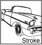
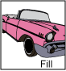
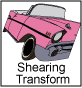
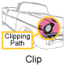
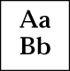
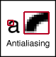

# Graphics2D

- [Graphics2D](#graphics2d)
  - [简介](#简介)
  - [Graphics2D 方法](#graphics2d-方法)
  - [Graphics2D 属性](#graphics2d-属性)

***

## 简介

`paintComponent()` 的唯一参数为 `Graphics` 类型，该类包含许多绘制 2D 图形以及设置绘图参数的方法。

`Graphics2D` 类扩展 `Graphics`，它提供更多图形绘制、坐标轴转换、颜色管理、文本布局等更为精细的控制。Swing 几乎始终使用 `Graphics2D`。

`Graphics2D` 对 `Graphics` 的扩展主要体现在：

- 对渲染质量的控制：消除锯齿以平滑绘制对象的边缘；
- 裁剪、合成和透明度：它们允许使用任意形状来限定绘制操作的边界。它们还提供对图形进行分层以及控制透明度等。
- 控制和填充形状：这种功能提供了一个Stroke代理和一个Paint代理，前者用来绘制形状轮廓的笔，后者允许用纯色、渐变色和图案来填充形状。

`Graphics` 在传递给 `paintComponent()` 方法前已初始化，然后依次传递给 `paintBorder()` 和 `paintChildren()`。这样重用 `Graphics` 可提高性能，不过当参数设置不当，会导致问题。所以，要么恢复 `Graphics` 设置，要么创建 `Graphics` 的副本使用，使用 `Graphics` 的 `create()` 方法创建副本，记得最后用 `dispose()` 方法释放。

实际上，只使用 font, color, rendering-hints 属性不需要创建 `Graphics` 副本。其它属性，特别是剪辑(clip)、合成操作(composite)和转换(transformations)，则必须创建 `Graphics` 副本，使用后 `dispose` 掉。

## Graphics2D 方法

|方法|功能|
|---|---|
|`draw`|使用 `stroke` 和 `paint` 属性绘制基本图形|
|`fill`|使用 `paint` 属性以颜色或 pattern 填充图形|
|`drawString`|渲染文本，`font` 将文本转换为 glyph，然后用 color 或 pattern 填充|
|`drawImage`|渲染图像| 
|`drawOval`|渲染椭圆|
|`fillRect`|渲染矩形|

`Graphics2D` 的方法可以分为两类：

1. 画图
2. 影响画图的方法

影响画图的方法，指设置 `Graphics2D` 的状态属性，包括：

- 笔画宽度
- 笔画连接方式
- 剪辑路径，限制渲染区域
- 渲染时对象的平移、旋转、缩放和剪切
- 填充的颜色和图案
- 如何组合多个图形

## Graphics2D 属性

|属性|说明|
|---|---|
||`stroke` 属性，指定绘制线条时的线宽、虚线模式、末端连接方式和末端样式|
||`fill` 属性，图形内部填充方式，包括纯色、渐变色和图案等填充方式|
||`compositing` 属性，用于重叠对象的渲染|
||`transform` 属性，制定渲染对象从用户空间转到设备空间的变换。包括平移、旋转、缩放和剪切等|
| |`clip` 属性，通过 `Shape` 对象指定需要渲染的区域|
||`font` 属性，文本转换为字形（glyph）|
||渲染提示，指定速度和质量之间权衡的选项|

