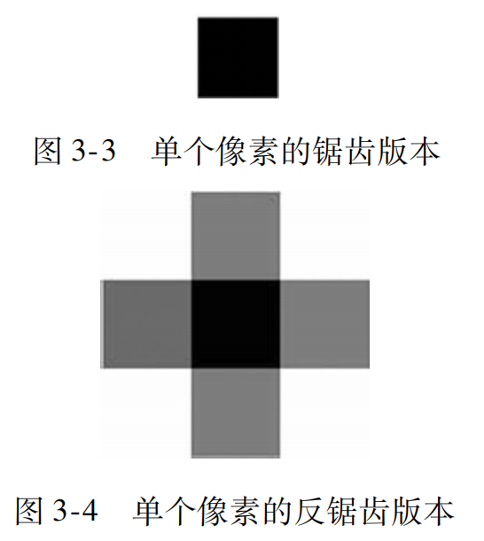

# Graphics2D

- [Graphics2D](#graphics2d)
  - [简介](#简介)
  - [获取 Graphics 对象](#获取-graphics-对象)
  - [Graphics2D 方法](#graphics2d-方法)
  - [Graphics2D 属性](#graphics2d-属性)
    - [渲染提示](#渲染提示)
      - [图像缩放提示](#图像缩放提示)
      - [反锯齿](#反锯齿)
    - [clip](#clip)
    - [Composite](#composite)
    - [Paint](#paint)
    - [Transform](#transform)

2024-01-11, 09:33
***

## 简介

`paintComponent()` 的唯一参数为 `Graphics` 类型，该类包含许多绘制 2D 图形以及设置绘图参数的方法。

`Graphics2D` 类扩展 `Graphics`，它提供更多图形绘制、坐标轴转换、颜色管理、文本布局等更为精细的控制。Swing 几乎始终使用 `Graphics2D`。

`Graphics2D` 对 `Graphics` 的扩展主要体现在：

- 对渲染质量的控制：消除锯齿以平滑绘制对象的边缘；
- 裁剪、合成和透明度：它们允许使用任意形状来限定绘制操作的边界。它们还提供对图形进行分层以及控制透明度等。
- 控制和填充形状：这种功能提供了一个Stroke代理和一个Paint代理，前者用来绘制形状轮廓的笔，后者允许用纯色、渐变色和图案来填充形状。

`Graphics` 在传递给 `paintComponent()` 方法前已初始化，然后依次传递给 `paintBorder()` 和 `paintChildren()`。这样重用 `Graphics` 可提高性能，不过当参数设置不当，会导致问题。所以，要么恢复 `Graphics` 设置，要么创建 `Graphics` 的副本使用，使用 `Graphics` 的 `create()` 方法创建副本，记得最后用 `dispose()` 方法释放。

实际上，只使用 font, color, rendering-hints 属性不需要创建 `Graphics` 副本。其它属性，特别是剪辑(clip)、合成操作(composite)和转换(transformations)，则必须创建 `Graphics` 副本，使用后 `dispose` 掉。

## 获取 Graphics 对象

在 Swing 程序中，渲染的典型应用发生在类似于 `paintComponent()` 的方法中，这些方法中 Graphics 对象作为参数传入，即不需要创建一个 `Graphics` 对象。

- 复制 `Graphics` 对象

使用 `Graphics.create()` 创建 Graphics 副本，可以避免修改原 Graphics，不容易出错。

```java
protected void paintComponent(Graphics g) {
    // 创建副本
    Graphics gTemp = g.create();
    
    // 设置 gTemp 状态
    gTemp.translate(x, y);
    
    // 使用 gTemp 渲染组件
    gTemp.dispose();    
}
```

- 渲染到图像

很多时候需要把图形（graphics）渲染到图像（image）。Image 对象没有可复写的 paintComponent() 方法，所以 Swing 不会自动创建一个 Graphics 对象。此时可以向 Image 要求一个：

```java
Image img = createImage(w, h);
Graphics g = img.getGraphics();
```

`getGraphics()` 返回一个直接渲染这个图像的 Graphics 对象。

!!! note
    有些 Image 是只读的，例如，通过 Toolkit.getImage() 装载图像数据创建的 Image，这些 Image 不能渲染。所以建议使用 BufferedImage。

从 BufferedImage 获取 Graphics2D:

```java
BufferedImage bImg;
Graphics2D g2d = gImg.createGraphics();
```


## Graphics2D 方法

|方法|功能|
|---|---|
|`draw`|使用 `stroke` 和 `paint` 属性绘制基本图形|
|`fill`|使用 `paint` 属性以颜色或 pattern 填充图形|
|`drawString`|渲染文本，`font` 将文本转换为 glyph，然后用 color 或 pattern 填充|
|`drawImage`|渲染图像| 
|`drawOval`|渲染椭圆|
|`fillRect`|渲染矩形|

`Graphics2D` 的方法可以分为两类：

1. 画图
2. 影响画图的方法

影响画图的方法，指设置 `Graphics2D` 的状态属性，包括：

- 笔画宽度
- 笔画连接方式
- 剪辑路径，限制渲染区域
- 渲染时对象的平移、旋转、缩放和剪切
- 填充的颜色和图案
- 如何组合多个图形

## Graphics2D 属性

Graphics 属性，也称为图形状态。

|属性|说明|
|---|---|
|前景色（foreground color）|绘制基本元素的颜色|
|背景色（background color）|当抹去某一区域时使用的颜色|
|字体（font）|在文本基本元素中使用的字体|
|笔画（stroke）|用在基于线的基本元素，指定绘制线条时的线宽、虚线模式、末端连接方式和末端样式|
|填充（fill）|图形内部填充方式，包括纯色、渐变色和图案等填充方式|
|渲染提示（rendering hint）|Java 2D 用来确定渲染各种基本元素的**品质和性能**的信息|
|剪辑（clip）|通过 `Shape` 对象指定图画所在区域|
|合成（Composite）|把图像基本元素的颜色数据和目标中的颜色数据合成起来的方法|
|着色（Paint）|类似颜色（color），Paint 确定如何给像素着色（通过绘制基本元素）|
|转换（transform）|基本元素的大小、位置和方向|

- 设置和获取前景颜色

```java
public void setColor(Color c)
public Color getColor()
```

`setColor` 和 `setPaint` 很类似，不过 `setPaint` 除了纯色，还支持渐变色，图案等方式。

用法：绘制一根红线

```java
public void paintComponent(Graphics g){
    g.setColor(Color.RED);
    g.drawLine(0, 0, 10, 10);
}
```

- 设置和获取 Graphics 对象的背景颜色

```java
public void setBackground(Color color);
public Color getBackground();
```

在调用 Graphics 的 clearRect() 方法时使用的就是这个颜色。

用法：把组件的背景清理为白色

```java
public void paintComponent(Graphics g){
    g.setBackground(Color.WHITE);
    g.clearRect(0, 0, getWidth(), getHeight());
}
```

- 字体

```java
public Font getFont();
public void setFont(Font font);
```

当调用 Graphics 对象的 drawString() 时，文本字符串会按 Graphics 对象当前 Font 属性来渲染。

用法：用粗体、Graphics 对象默认字体的 24 号绘制字符串

```java
protected void paintComponent(Graphics g) {
    Font newFont = g.getFont().deriveFont(Font.BOLD, 24);
    g.setFont(newFont);
    g.drawString("String with new font", 20, 20);
}
```

- 线条属性

```java
public void setStroke(Stroke s)
public Stroke getStroke()
```

Stroke 包含基于线条的绘图基本元素的属性，如 drawLine()。控制线条宽度，线条末端样式，多段线的连接方式。

末端样式和连接方式对默认宽度为 1 的线条没影响，它们在粗线时比较重要。

用法：绘制一条末端为圆形的线条

此时，JOIN_MITER 参数没有任何影响，因为只有一条线段

```java
protected void paintComponent(Graphics g) {
    Graphics2D g2d = (Graphics2D) g.create();
    g2d.setStroke(new BasicStroke(10f, BasicStroke.CAP_ROUND, BasicStroke.JOIN_MITER));

    g2d.drawLine(0, 0, 10, 10);
    g2d.dispose();
}
```

!!! tip
    Java 2D 默认使用宽度为 1 的线，这样渲染会快很多。一旦绘制粗线，Java 2D 就需要考虑宽度、尾端、接合点，然后进行非常多的相关计算，就会慢很多。因此，建议尽量避免使用粗线。

**示例：** 演示 font, color 和 background 属性

```java
import javax.swing.*;
import java.awt.*;

public class SimpleAttributes extends JComponent
{

    public void paintComponent(Graphics g) {
        // 创建临时 Graphics2D
        Graphics2D g2d = (Graphics2D) g.create();

        // 设置背景为灰色，并清除背景
        g2d.setBackground(Color.GRAY);
        g2d.clearRect(0, 0, getWidth(), getHeight());

        // 使用默认 font 和 color 画字符串
        g2d.drawString("Default Font", 10, 20);

        // 使用默认 color 和 stroke 画直线
        g2d.drawLine(10, 22, 80, 22);

        // 修改字体
        g2d.setFont(g.getFont().deriveFont(Font.BOLD | Font.ITALIC, 24f));
        // 修改 color
        g2d.setColor(Color.WHITE);
        // 修改 stroke
        g2d.setStroke(new BasicStroke(10f,
                BasicStroke.CAP_ROUND, BasicStroke.JOIN_MITER));

        // 使用新的 font 和 color 画字符串和直线
        g2d.drawString("New Font", 10, 50);
        g2d.drawLine(10, 57, 120, 57);
        g2d.dispose();
    }

    private static void createAndShowGUI() {
        JFrame f = new JFrame();
        f.setDefaultCloseOperation(JFrame.EXIT_ON_CLOSE);
        f.setSize(150, 100);
        JComponent test = new SimpleAttributes();
        f.add(test);
        f.setVisible(true);
    }

    public static void main(String[] args) {
        Runnable doCreateAndShowGUI = SimpleAttributes::createAndShowGUI;
        SwingUtilities.invokeLater(doCreateAndShowGUI);
    }
}
```


### 渲染提示

```java
public void setRenderingHint(RenderingHints.Key key, Object value)
public Object getRenderingHint(RenderingHints.Key key)
```

渲染提示用于控制品质和性能之间的平衡。

渲染提示信息存储在 `RenderingHints` 的键/值对中。

#### 图像缩放提示

使用 `RenderingHints.KEY_INTERPOLATION` 键和下面三个值控制图像缩放的品质。

**RenderingHints.VALUE_INTERPOLATION_NEAREST_NEIGHBOR**

这是默认设置，速度最快的缩放方法。在图像缩放操作中，该方法在确定目标像素时，从那个位置最近的源像素中选择一个颜色。该技术有可能丢失原始图像的许多信息。例如，假设把一个高清晰的图像从 100x100 缩小到 10x10。将从每 100 个像素的颜色信息中去掉 99 个，这个结果可能和原始图像的品质相差很多。

然而，这种方式在许多情况下已经足够了，尤其是如果这个图像时临时的；或者缩放因子很小，修饰颜色信息不多。这种方式的性能要比其它方式好很多。

**RenderingHints.VALUE_INTERPOLATION_BILINEAR**

在确定目标像素时，混合最接近那个位置的 4 个像素的值。该技术比 NEAREST_NEIGHBOR 缩放更平滑，结果更好。如果图像品质很重要，考虑使用该提示。

**RenderingHints.VALUE_INTERPOLATION_BICUBIC**

类似 BILINEAR，但使用了最接近目标位置的 4x4 格的像素。该提示比 BILINEAR 品质更好，但缩放算法的复杂度增加了。

#### 反锯齿

反锯齿使基本渲染元素的硬边界变得平滑。如下图所示：



反锯齿使用边界像素和背景颜色相混合填充周围以消除非反锯齿的基本元素的硬边界效果。

**示例：** 绘制两条线，第一条使用默认属性，第二个启用反锯齿渲染提示

```java
public class AntiAliasingDemo extends JComponent
{
    public void paintComponent(Graphics g) {
        // we will need a Graphics2D Object to set the RenderingHint
        Graphics2D g2d = (Graphics2D) g;

        // Erase to white
        g2d.setBackground(Color.WHITE);
        g2d.clearRect(0, 0, getWidth(), getHeight());

        //Draw line with default setting.
        g2d.drawLine(0, 0, 50, 50);

        //Enable antialiasing
        g2d.setRenderingHint(RenderingHints.KEY_ANTIALIASING, RenderingHints.VALUE_ANTIALIAS_ON);

        //Draw line with new setting
        g2d.drawLine(50, 0, 100, 50);

    }

    private static void createAndShowGui() {
        JFrame frame = new JFrame();
        frame.setDefaultCloseOperation(JFrame.EXIT_ON_CLOSE);
        frame.setSize(150, 100);
        JComponent component = new AntiAliasingDemo();

        frame.add(component);
        frame.setVisible(true);
    }

    public static void main(String[] args) {
        Runnable doCreateAndShowGui = () -> createAndShowGui();
        EventQueue.invokeLater(doCreateAndShowGui);
    }
}
```


> 左边使用默认属性绘制的线，右边是开启反锯齿后绘制的线

绘图和文本有不同的反锯齿提示。

- 形状反锯齿提示

Java 2D 中绘图元素默认非反锯齿。`KEY_ANTIALIASING` 对应的值有两个：`VALUE_ANTIALIAS_ON` 和 `VALUE_ANTIALIAS_OFF`。

默认为 `VALUE_ANTIALIAS_OFF`，即禁用反锯齿渲染。反锯齿试试一个比较费时的渲染操作，所以启用可能对性能有影响。

- 文本反锯齿提示

`KEY_TEXT_ANTIALIASING` 控制文本反锯齿。文本反锯齿技术与图形相同：通过混合文本字符边界和背景颜色值来使锯齿现象变得平滑。

文本反锯齿有如下可选值：

**RenderingHints.VALUE_TEXT_ANTIALIAS_DEFAULT**

默认值，等同于 `VALUE_TEXT_ANTIALIAS_OFF`。不过，如果将文本反锯齿设置为 DEFAULT，将 `KEY_ANTIALIASING` 设置为 `VALUE_ANTIALIAS_ON` 会导致文本反锯齿。

**RenderingHints.VALUE_TEXT_ANTIALIAS_OFF**

关闭反锯齿。

**RenderingHints.VALUE_TEXT_ANTIALIAS_ON**

开启反锯齿。在 Java SE 6 之前这是唯一可用的文本反锯齿类型，大多时候足够好了。但是，有时候反锯齿后效果变得更差。例如，当字符很小时，反锯齿引起模糊。

**RenderingHints.VALUE_TEXT_ANTIALIAS_GASP**

使用来自字体的信息，来确定是否对字体进行反锯齿。

**RenderingHints.VALUE_TEXT_ANTIALIAS_LCD_HBGR**, **RenderingHints.VALUE_TEXT_ANTIALIAS_LCD_HRGB**, **RenderingHints.VALUE_TEXT_ANTIALIAS_LCD_VBGR**, **RenderingHints.VALUE_TEXT_ANTIALIAS_LCD_VRGB** 用于液晶显示器文本的设置。对这 4 个提示，反锯齿算法在液晶显示器中采用红色、绿色和蓝色条纹的倾向不同。RGB 这个提示按照红-绿-蓝的顺序；HRGB 和 HBGR 提示假设条纹按照水平方向，VRGB 和 VBGR 提示假设条纹是垂直的。

液晶显示器最典型的配置是 HRGB，所以这个提示的最典型配置是 `VALUE_TEXT_ANTIALIAS_LCD_HRGB`。然而，即使知道用户使用液晶显示器，而且知道这个屏幕的设置是 HRGB（运行时很难确定这两点），自动强制这种渲染提示可能产生错误。替代地，应该尽可能使用下面的 FontHints 例子中的方法。

**示例：** 为定制组件匹配桌面设置

先用默认 Graphics 渲染一个字符串；然后设置 RenderingHints 以匹配桌面设置，用修改后的 Graphics 渲染另一个字符串。

```java
import javax.swing.*;
import java.awt.*;
import java.util.Map;

public class FontHints extends JComponent
{

    Map desktopHints = null;

    /**
     * Creates a new instance of FontHints
     */
    public FontHints() {
        Toolkit tk = Toolkit.getDefaultToolkit();
        desktopHints = (Map) (tk.getDesktopProperty("awt.font.desktophints"));
    }

    protected void paintComponent(Graphics g) {
        Graphics2D g2d = (Graphics2D) g;
        g2d.setColor(Color.WHITE);
        g2d.fillRect(0, 0, getWidth(), getHeight());
        g2d.setColor(Color.BLACK);

        g2d.drawString("Unhinted string", 10, 20);
        if (desktopHints != null) {
            g2d.addRenderingHints(desktopHints);
        }
        g2d.drawString("Desktop-hinted string", 10, 40);
    }

    private static void createAndShowGUI() {
        JFrame f = new JFrame("FontHints");
        f.setDefaultCloseOperation(JFrame.EXIT_ON_CLOSE);
        f.setSize(200, 90);
        FontHints component = new FontHints();
        f.add(component);
        f.setVisible(true);
    }

    public static void main(String[] args) {
        Runnable doCreateAndShowGUI = FontHints::createAndShowGUI;
        SwingUtilities.invokeLater(doCreateAndShowGUI);
    }
}
```


为了在构造器中获得桌面属性，这里使用 `awt.font.desktophints` 查询，它返回包含所有这些属性的 Map。然后通过 Graphics2D.addRenderingHints() 简单地添加所有提示。现在，我们的 Graphics 对象设置为采用和本地应用程序一样的方式渲染文本。

### clip

```java
public void clipRec(int x, int y, int width, int height)
public void clip(Shape s)
public void setClip(int x, int y, int width, int height)
public void setClip(Shape s)
public Shape getClip()
public Rectangle getClipBounds()
```

剪辑属性把渲染操作的限制在一个形状内部。即对 Graphics 对象，将来的渲染操作都在剪辑范围内。

`setClip()` 把剪辑设置为指定区域，而 `clipRec()` 和 `clip()` 把指定区域与当前设置在 Graphics 上的剪辑组合起来。

通常应该使用组合剪辑方式，不要创建一个全新剪辑而忽视之前设置在 Graphics 上的剪辑。

Swing 内部使用这些剪辑方法限制任何组件层次的渲染的可见区域。例如，如果由于某一窗口事件或一个程序的更新请求，Swing 后台的缓冲图像的左上区域需要重新绘制，那么，一个剪辑将被设置到那个 Graphics 对象上把这个操作限制在那个区域。

渲染过程中设置剪辑有两个理由：

1. 内容保存：窗口在一个特定区域之外可能还有不应该改变的内容。限制这个剪辑以确保不改变这些内容，因为渲染操作将限制在这个剪辑区域。
2. 性能：为什么做不需要做的事情呢？如果只有窗口的一小块区域需要重新绘制，绘制窗口的其他部分是浪费时间。

我们应该只操心绘制位于当前剪辑中的那些项。代码或许不必设置这个剪辑。Swing 为 `paintComponent()` 设置的 Graphics 对象中得到的剪辑对于大部分需求已经足够了。但是可能经常需要通过调用 `getClip()` 得到这个剪辑，然后相应地渲染。

### Composite

```java
public void setComposite(Composite c)
public Composite getComposite()
```

### Paint

### Transform

```java
public void rotate(double theta)
public void rotate(double theta, double x, double y)
public void scale(double sx, double sy)
public void translate(double tx, double ty)
public void translate(int x, int y)
public void transform(AffineTransform Tx)
public void setTransform(AffineTransform Tx)
public AffineTransform getTransform()
```

