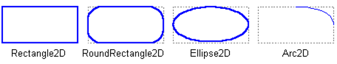
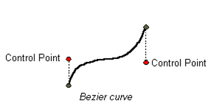
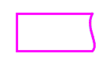

# 图形

- [图形](#图形)
  - [简介](#简介)
  - [图形类](#图形类)
    - [Points](#points)
    - [Lines](#lines)
    - [Rectangle](#rectangle)
    - [二次曲线和三次曲线](#二次曲线和三次曲线)
    - [任意形状](#任意形状)
    - [Area](#area)
  - [绘制 Image](#绘制-image)
  - [copyArea](#copyarea)
  - [填充和绘制](#填充和绘制)

## 简介

核心内容，使用 `Graphics2D` 类绘制几何图形：

- 图像（Image）：复制和缩放图像
- 绘制标准几何图形，如点、直线、曲线、弧线、矩形和椭圆等。
- 绘制任意图形：通过 `GeneralPath` 类实现。
- 自定义：通过 `stroke` 和 `paint` 属性，设置图形的边框和填充风格。
- 复制区域：把内容从一个地方复制到另一个地方

Java 2D API提供了点、线、矩形、弧线、椭圆、曲线等一套标准的几何图形。这些基本图形都定义在 `java.awt.gemo` 包中。任何其他的形状都可以通过这些基本图形进行组合获得。

## 图形类

`Shape` 接口表示一个几何图形，包含边框和内部区域。该接口定义的方法功能包括：描述和检查二维几何对象，支持曲线片段和图形子片段，而 `Graphics` 类只支持直线片段。

下面是对java.awt.geom 包中各个类的简介。

(AffineTransform, Arc2D, Area, CubicCurve, Dimension2D, Ellipse2D, FlatteningPathIterator, GeneralPath, Line2D, Path2D, QuadCurve, Rectangle2D, RectangularShape, RoundRectangle2D)


黄色部分是遗留类。

### Points

最基本的几何图元是点，`Point2D` 类定义了一个 (x,y) 坐标空间的点。

`Point` 类创建一个点，子类 `Point2D.Float` 和 `Point2D.Double` 提供了对应的 float 和 double 精度的实现。

在Java 2D API中 "point"不等价于 pixel。"point" 没有面积，不包含颜色，并且不能被渲染。

Points 用于创建其他的图形。 `Point2D中` 包含一个计算两点之间距离的方法

绘制方法：

1. Graphics.drawLine(x, y, x, y)，采用drawLine方法，设置起始点和末端点相同。
2. Point2D.Double point = new Point2D.Double(x, y);

### Lines

`Line2D` 是用于表示“线”的抽象类。线的坐标可以用 double 表示。`Line2D` 类包含多个用于设置“线”终点的方法。也可以使用 `GeneralPath` 类创建直线。

### Rectangle

`Rectangle2D`, `RoundRectangle2D`, `Arc2D` 和 `Ellipse2D` 都扩展自 `RectangularShape` 类，该类实现了 `Shape` 接口。



### 二次曲线和三次曲线

`QuadCurve2D` 用于创建二次曲线。二次曲线通过两个端点和一个控制点定义，如下：


`CubicCurve2D` 类用于创建三次曲线。三次曲线通过两个端点和两个控制点定义。



### 任意形状

`GeneralPath` 类可用于创建任意形状。该类通过指定图形的边框创建任意形状。如，下图用三条直线和一条三次曲线创建曲线：



### Area

通过 `Area` 类，可以对两个 `Shape` 对象执行布尔操作，如(合并、交叉、相减)。该技术，也被称为区域几何学(Constructive area geometry)，可用来迅速创建复杂的图形。

## 绘制 Image

```java
public void drawImage(...)
```

`drawImage()` 是 Swing 程序（包括应用程序代码和 Swing内部）中使用得最普遍的图形基本元素之一。它的用途是把一个 Java Image 对象复制到当前 Graphics 对象使用的目标表面。这个方法可以用于把一个后台缓冲复制到窗口、把图标或其他图像复制到 GUI、 把一个 Image 类型的内容复制到另一个 Image 类型和把一个图像从它的最初的大小缩放到新的大小。

!!! note
    所有 `drawImage()` 方法都有一个 ImageObserver 变量作为最后的参数。对于在调用 `drawImage()` 时还没有完全装载的图像或活动的图像 （例如活动的 GIF 图像）来说，这个变量是有用的。但是一般而言，如果使用已经装载完的图像（例如任何 BufferedImage），就不需要这个变量。在那些情况下应该在最后的参数位置传入 null，如下所示：

```java
drawImage(image, x, y, null);
```

```java
public boolean drawImage(Image img, int x, int y,
                                      ImageObserver observer);
```

这个变体是 `drawImage()` 最简单的版本。它仅仅把源图像复制给位于由 (x, y) 指定位置的目标 Graphics。在复制过程中没有进行缩放或其他操作，除非由于在 Graphics 对象上设置的 转换而发生的任何缩放。

```java
public boolean drawImage(Image img, int x, int y,
                                    int width, int height,
                                    ImageObserver observer);
```

这个变体和前面一个类似，除了（如果必要的话）它会对源图像执行一个缩放操作以适应给定的宽度和高度。不管最初的图像的大小，结果是整个源图像调整为目标文件中的高度和宽度。由这个操作引起的任何缩放都使用 KEY_INTERPOLATION 渲染提示的值，以确定在缩放过程中应该应用的算法。

## copyArea

```java
Graphics.copyArea(int x, int y, int width, int height, int dx, int dy)
```

`copyArea()` 用于把来自一个图像或窗口的内容副本快速显示到同一个表面的其他区域。 Swing 使用这个方法，例如，当用户到处拖动 JInternalFrame 时或当一个滚动面板的内容向上或向下滚动时。内容从 (x, y, width, height) 定义的区域被复制到偏移原始位置 (dy, dy) 的相同大小的一个区域。

在一些情况下考虑使用 `copyArea()` 的一个原因是性能。复制现有的内容比在不同的位置重新渲染这些内容来得更快和更容易。

## 填充和绘制

绘制操作使用当前的 Stroke 设置确定要涉及的像素。标准的 BasicStroke 像钢笔一样沿着边界绘制一根线，钢笔的一半在边界内部，一半在边界外部。由于线的默认宽度为 1，这导致半个像素在这个形状边界的内部，半个像素在外部，这种使用不连续的像素的情况不能被描绘出来。必须使用四舍五入来确定选择边界内部或外部的像素，Swing 选择偏向**右下**的像素。

要解释填充和绘制之间的区别，假设我们需要一个中间为灰色、轮廓为黑色的 ３×３的正方形，

```java
g.setColor(Color.LIGHT_GRAY);
g.fillRect(x, y, w, h);
g.setColor(Color.BLACK);
g.drawRect(x, y, w, h);
```


> fillRect(x, y, 3, 3) 和随后进行的 drawRect(x, y, 3, 3)

如果将顺序倒过来：

```java
g.setColor(Color.BLACK);
g.drawRect(x, y, w, h);
g.setColor(Color.LIGHT_GRAY);
g.fillRect(x, y, w, h);
```


> drawRect(x, y, 3, 3) 和随后的 fillRect(x, y, 3, 3)

可以看到，最初的边界实际上绘制在已填充方块的左边和顶部，但是右边和底部的边界则超出了填充区域。如果只要在受绘制影响的像素中执行填充，我们将不得不把填充范围更改如下：

```java
g.setColor(Color.BLACK);
g.drawRect(x, y, 3, 3);
g.setColor(Color.LIGHT_GRAY);
g.fillRect(x + 1, y + 1, 2, 2);
```

这里需要注意的关键事情是填充和绘制操作都处理了沿着这个矩形顶部和左边的相同的像素，但是填充覆盖（宽度 ×高度）像素，而绘制则影响那个区域四周的边界的像素。在许多情况下这个行为实际上没有问题。但是在一些情况下需要精确地排列制图和填充操作。例如，如果正在绘制一个半透明的边界，在那里 每个操作的颜色都将和目标中的颜色混合，这种情下可能不希望边界颜色受底层填充颜色的 影响。

!!! summary
    填充是完全按照设置参数来，而绘制由于线宽问题，向右下增加了线宽像素。