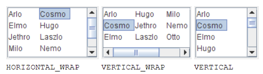
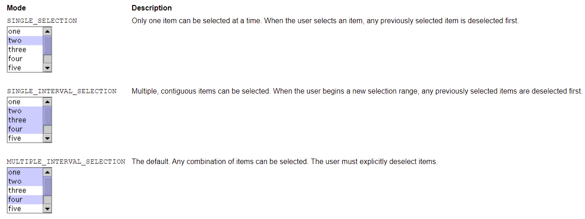

# JList

- [JList](#jlist)
  - [创建 Model](#创建-model)
  - [创建 List](#创建-list)
  - [选择 Item](#选择-item)
  - [添加和删除项](#添加和删除项)
  - [自定义单元格渲染](#自定义单元格渲染)
  - [List Selection Listener](#list-selection-listener)
  - [参考](#参考)

2021-11-25, 09:29
***

## 创建 Model

创建 list model 的方法有三种：

- `DefaultListModel`，所有都实现好了，可以直接用；
- `AbstractListModel`，自己管理数据，调用 `fire` 方法。对这种方式，需要继承 `AbstractListModel` 类，实现 `getSize` 和 `getElementAt` 方法；
- `ListModel`，所有都自己处理。

## 创建 List

如下是一段初始化 List 的代码：

```java
list = new JList(data); //data has type Object[]
list.setSelectionMode(ListSelectionModel.SINGLE_INTERVAL_SELECTION);
list.setLayoutOrientation(JList.HORIZONTAL_WRAP);
list.setVisibleRowCount(-1);
...
JScrollPane listScroller = new JScrollPane(list);
listScroller.setPreferredSize(new Dimension(250, 80));
```

将元素数组传递给 `JList` 构造函数。

使用数组或 `Vector` 初始化 `JList`，构造函数隐式创建一个默认的 list model，该模型 是 **immutable** 的，即不可以添加、删除或替换列表中的元素。

如果要创建可修改的模型，可以设置 mutable list model 类，如 `DefaultListModel`。在初始化 `JList` 时或调用 `setModel` 方法可以设置模型。

调用 `setSelectionMode` 可以设置选择模型。

调用 `setLayoutOrientation` 可以让列表多列显示:

- `JList.HORIZONTAL_WRAP` 指定列表先填充行，填满后再换行；
- `JList.VERTICAL_WRAP` 指定列表先填充列，填满后换列；
- `JList.VERTICAL` 单列显示，默认选项。



和 `setLayoutOrientation` 结合使用，调用 `setVisibleRowCount(-1)` 使得 `JList` 尽可能多显示项目。`setVisibleRowCount` 还常用于指定带滚动窗格的 List 一次显示多少项。

## 选择 Item

`JList` 使用 `ListSelectionModel` 管理 item 选择。`JList` 默认支持一次选择任意 item。调用 `setSelectionMode` 方法可以设置选择模型。支持的三种选择模型如下：



不管使用哪种选择模式，在选择项发生改变时都会触发事件。可以添加 `ListSelectionListener` 监听该事件。`ListSelectionListener` 必须实现 `valueChanged` 方法，例如：

```java
public void valueChanged(ListSelectionEvent e) {
    if (e.getValueIsAdjusting() == false) {

        if (list.getSelectedIndex() == -1) {
        //No selection, disable fire button.
            fireButton.setEnabled(false);

        } else {
        //Selection, enable the fire button.
            fireButton.setEnabled(true);
        }
    }
}
```

单个用户操作（如点击鼠标）可产生许多列表选择事件。如果用户仍在操作选择，`getValueIsAdjusting` 返回 true。上例的程序只感兴趣最终的选择结果，所以只在 `getValueIsAdjusting` 返回 false 时操作。

上例中是单选模式，所以 `getSelectionIndex` 返回单个选择的项。`JList` 提供了多个设置和获取选项的方法。

另外，可以直接在 `ListSelectionModel` 上监听事件，而不是 `JList` 本身。如下展示在 `ListSelectionModel` 上添加 `ListSelectionListener`，并可以动态选择列表的选择模式：

```java
public class ListSelectionDemo extends JPanel
{
    JTextArea output;
    JList list;
    String newline = "\n";
    ListSelectionModel listSelectionModel;

    public ListSelectionDemo()
    {
        super(new BorderLayout());

        String[] listData = {"one", "two", "three", "four",
                "five", "six", "seven"};
        list = new JList(listData);

        listSelectionModel = list.getSelectionModel();
        listSelectionModel.addListSelectionListener(new SharedListSelectionHandler());
        JScrollPane listPane = new JScrollPane(list);

        JPanel controlPane = new JPanel();
        String[] modes = {"SINGLE_SELECTION",
                "SINGLE_INTERVAL_SELECTION",
                "MULTIPLE_INTERVAL_SELECTION"};

        final JComboBox comboBox = new JComboBox(modes);
        comboBox.setSelectedIndex(2);
        comboBox.addActionListener(e -> {
            String newMode = (String) comboBox.getSelectedItem();
            if (newMode.equals("SINGLE_SELECTION")) {
                listSelectionModel.setSelectionMode(
                        ListSelectionModel.SINGLE_SELECTION);
            } else if (newMode.equals("SINGLE_INTERVAL_SELECTION")) {
                listSelectionModel.setSelectionMode(
                        ListSelectionModel.SINGLE_INTERVAL_SELECTION);
            } else {
                listSelectionModel.setSelectionMode(
                        ListSelectionModel.MULTIPLE_INTERVAL_SELECTION);
            }
            output.append("----------"
                    + "Mode: " + newMode
                    + "----------" + newline);
        });
        controlPane.add(new JLabel("Selection mode:"));
        controlPane.add(comboBox);

        //Build output area.
        output = new JTextArea(1, 10);
        output.setEditable(false);
        JScrollPane outputPane = new JScrollPane(output,
                ScrollPaneConstants.VERTICAL_SCROLLBAR_ALWAYS,
                ScrollPaneConstants.HORIZONTAL_SCROLLBAR_AS_NEEDED);

        //Do the layout.
        JSplitPane splitPane = new JSplitPane(JSplitPane.VERTICAL_SPLIT);
        add(splitPane, BorderLayout.CENTER);

        JPanel topHalf = new JPanel();
        topHalf.setLayout(new BoxLayout(topHalf, BoxLayout.LINE_AXIS));
        JPanel listContainer = new JPanel(new GridLayout(1, 1));
        listContainer.setBorder(BorderFactory.createTitledBorder(
                "List"));
        listContainer.add(listPane);

        topHalf.setBorder(BorderFactory.createEmptyBorder(5, 5, 0, 5));
        topHalf.add(listContainer);
        //topHalf.add(tableContainer);

        topHalf.setMinimumSize(new Dimension(100, 50));
        topHalf.setPreferredSize(new Dimension(100, 110));
        splitPane.add(topHalf);

        JPanel bottomHalf = new JPanel(new BorderLayout());
        bottomHalf.add(controlPane, BorderLayout.PAGE_START);
        bottomHalf.add(outputPane, BorderLayout.CENTER);
        //XXX: next line needed if bottomHalf is a scroll pane:
        //bottomHalf.setMinimumSize(new Dimension(400, 50));
        bottomHalf.setPreferredSize(new Dimension(450, 135));
        splitPane.add(bottomHalf);
    }

    /**
     * Create the GUI and show it.  For thread safety,
     * this method should be invoked from the
     * event-dispatching thread.
     */
    private static void createAndShowGUI()
    {
        //Create and set up the window.
        JFrame frame = new JFrame("ListSelectionDemo");
        frame.setDefaultCloseOperation(JFrame.EXIT_ON_CLOSE);

        //Create and set up the content pane.
        ListSelectionDemo demo = new ListSelectionDemo();
        demo.setOpaque(true);
        frame.setContentPane(demo);

        //Display the window.
        frame.pack();
        frame.setVisible(true);
    }

    public static void main(String[] args)
    {
        //Schedule a job for the event-dispatching thread:
        //creating and showing this application's GUI.
        javax.swing.SwingUtilities.invokeLater(ListSelectionDemo::createAndShowGUI);
    }

    class SharedListSelectionHandler implements ListSelectionListener
    {
        public void valueChanged(ListSelectionEvent e)
        {
            ListSelectionModel lsm = (ListSelectionModel) e.getSource();

            int firstIndex = e.getFirstIndex();
            int lastIndex = e.getLastIndex();
            boolean isAdjusting = e.getValueIsAdjusting();
            output.append("Event for indexes "
                    + firstIndex + " - " + lastIndex
                    + "; isAdjusting is " + isAdjusting
                    + "; selected indexes:");

            if (lsm.isSelectionEmpty()) {
                output.append(" <none>");
            } else {
                // Find out which indexes are selected.
                int minIndex = lsm.getMinSelectionIndex();
                int maxIndex = lsm.getMaxSelectionIndex();
                for (int i = minIndex; i <= maxIndex; i++) {
                    if (lsm.isSelectedIndex(i)) {
                        output.append(" " + i);
                    }
                }
            }
            output.append(newline);
            output.setCaretPosition(output.getDocument().getLength());
        }
    }
}
```

## 添加和删除项

创建可变列表模型的方式如下：

```java
listModel = new DefaultListModel();
listModel.addElement("Jane Doe");
listModel.addElement("John Smith");
listModel.addElement("Kathy Green");


list = new JList(listModel);
```

上面使用的 `DefaultListModel`，虽然名字叫 default，其实不是默认模型，`JList` 默认使用内部实现的 immutable 模型。

余下的删除和添加操作都在 `DefaultListModel` 上进行。

## 自定义单元格渲染

实现步骤：

- 实现 `ListCellRenderer` 接口；
- 调用 `setCellRenderer` 设置。

## List Selection Listener

## 参考

- https://docs.oracle.com/javase/tutorial/uiswing/components/list.html
