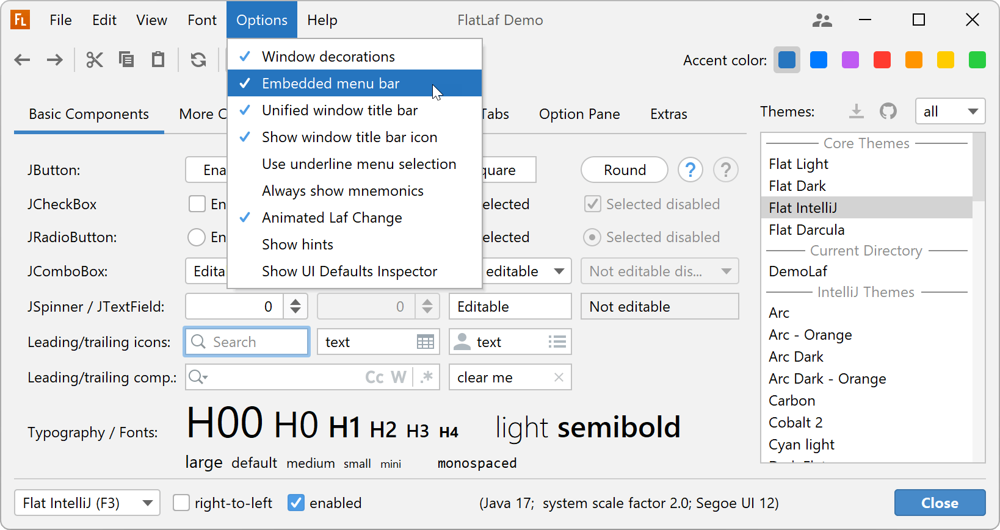

# 第三方 LaF

## FlatLaf

[FlatLaf](https://github.com/JFormDesigner/FlatLaf) 是面向 Java Swing 的开源跨平台 LaF。

扁平化设计，没有阴影和渐变，干净、简单、优雅。

FlatLaf 具有 Light, Dark, Intelli J 和 Durcula 主题，支持 HiDPI 设备，需 Java 8+。

该设计很大程度上收到 Intellij IDEA 2019.2+ 的 Darcula 和 IntelliJ 主题的启发，并使用了几乎相同的颜色和图标。

- FlatLaf Light


- FlatLaf Dark


- FlatLaf Light


- FlatLaf IntelliJ



- FlatLaf Darcula


- FlatLaf macOS Light


- FlatLaf macOS Dark


### 使用

添加 Maven 依赖：

```xml
<dependency>
    <groupId>com.formdev</groupId>
    <artifactId>flatlaf</artifactId>
    <version>3.2.5</version>
    <scope>runtime</scope>
</dependency>
```

然后在 main 方法中，创建任何 Swing 组件之前调用：

```java
FlatLightLaf.setup();

// create UI here...
```

或者：

```java
try {
    UIManager.setLookAndFeel( new FlatLightLaf() );
} catch( Exception ex ) {
    System.err.println( "Failed to initialize LaF" );
}

// create UI here...
```


\- [WebLaf](https://github.com/mgarin/weblaf)

WebLaf 是一个开源的 Swing lnf 库。

\- [Radiance](https://github.com/kirill-grouchnikov/radiance)

需要 Java 9+。

原来比较流行的 substance 现在是 Radiance 的一部分。

https://blog.csdn.net/j379832526/article/details/112994461