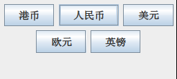

# 局部管理器

- [局部管理器](#局部管理器)
  - [简介](#简介)
  - [布局管理器的种类](#布局管理器的种类)
  - [BorderLayout](#borderlayout)
  - [FlowLayout](#flowlayout)
  - [GridLayout](#gridlayout)
  - [GridBagLayout](#gridbaglayout)
  - [BoxLayout](#boxlayout)
  - [SpringLayout](#springlayout)
  - [GroupLayout](#grouplayout)
  - [AbsoluteLayout](#absolutelayout)

## 简介


手动编写 layout 十分麻烦，如果对布局细节不感兴趣，可以使用`GroupLayout` 结合使用GUI builder(如WindowBuilder)。如果想手动编写layout，又不想用 `GroupLayout`，则推荐使用 `GridBagLayout`，灵活而强大。

## 布局管理器的种类

|种类|说明|
|---|---|
|BorderLayout|将容器分为东南西北中5个区域，每个区域可以容纳一个组件|
|FlowLayout|按先后顺序从左到右排列，一行排满换行。每一行的组件都是居中排列|
|GridLayout|将布局空间划分为若干行和列的网络区域，组件放在小区域内|
|GridBagLayout|通过网格进行划分，一个组件可以占据一个或多个网格|
|CardLayout|将容器中的每个组件当作一个卡片，一次仅有一个卡片可见|
|BoxLayout|在水平或垂直方向安排多个组件|
|SpringLayout|通过定义组件边沿的关系来实现布局|
|GroupLayout|指定在一个窗体上组件彼此的关系，如位置关系或对齐关系|

## BorderLayout

```java
public class BorderLayoutDemo
{
    static final int WIDTH = 300;
    static final int HEIGHT = 200;

    public static void main(String[] args)
    {

        JFrame jf = new JFrame("测试程序");
        jf.setSize(WIDTH, HEIGHT);
        jf.setDefaultCloseOperation(JFrame.EXIT_ON_CLOSE);
        jf.setVisible(true);
        JPanel contentPane = new JPanel();
        jf.setContentPane(contentPane);

        JButton b1 = new JButton("生活");
        JButton b2 = new JButton("工作");
        JButton b3 = new JButton("睡觉");
        JButton b4 = new JButton("购物");
        JButton b5 = new JButton("饮食");

        BorderLayout lay = new BorderLayout();//创建一个布局管理器对象，将中间容器设置为此布局管理
        jf.setLayout(lay);

        contentPane.add(b1, "North");//将五个普通按钮组件分别按照东、南、西、北、中五个方位添加到中间容器中
        contentPane.add(b2, "South");
        contentPane.add(b3, "East");
        contentPane.add(b4, "West");
        contentPane.add(b5, "Center");
    }
}
```

## FlowLayout

按照控件加入的先后顺序从左到右排列，一行排满了，再换下一行，然后继续从左到右排列。**每行的组件都是居中排列**，如下所示：



## GridLayout

## GridBagLayout

`GridBagLayout` 是自由度较高的布局管理器，通过网格划分，一个组件可以占据一个或多个网格。

组件在网格中的位置由 4 个参数控制：

- `gridX` 和 `gridY` 定义组件左上角行和列的位置；
- `gridwidth` 和 `gridheight` 定义组件占据的行数和列数。

`fill` 指定组件不能填满单元格时的行为：

- `GridBagConstraints.NONE`，每个方向都不填充，即保持原状；
- `GridBagConstraints.HORIZONTAL`，水平方向填充；
- `GridBagConstraints.VERTICAL`，垂直方向填充；
- `GridBagConstraints.BOTH`，两个方向都填充。

`anchor` 指定组件大于分配区域时的行为：

- `GridBagConstraints.CENTER`，居中缩小；
- `GridBagConstraints.NORTH`，顶部缩小；
- `GridBagConstraints.NORTHEASY`，左上角缩小；
- `GridBagConstraints`，右侧缩小。

## BoxLayout

BoxLayout 提供三种填充物：

- 支柱（）
- 固定区
- 弹簧

## SpringLayout

Spring 通过定义组件的边距实现布局。边距使用 Spring 对象表示，每个 Spring 对象具有 4 个属性值：minimum, maximum, preferred, value，其中 value 是真实值。

## GroupLayout

把多个组件按区域划分到不同的 Group，再根据各个 Group 相对于水平轴和垂直轴的排列来管理。


## AbsoluteLayout

Absolute Layout或者Null Layout，以坐标x,y定制组件的绝对位置。

设置方法
- 选择Absolute Layout，拖放到 `JFrame` 或 `JPanel` 中。
- 界面上会实时显示当前的位置和组件大小。

