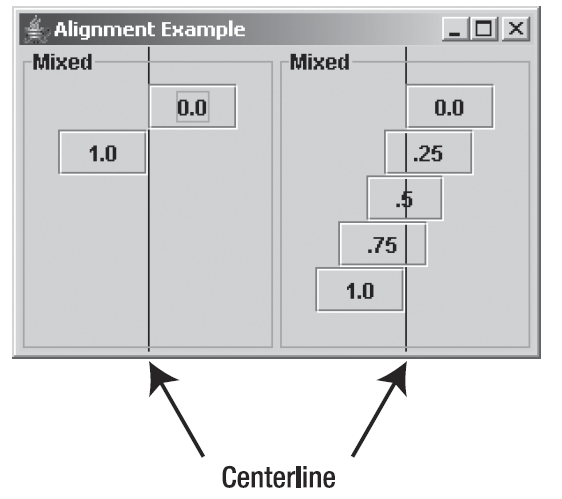
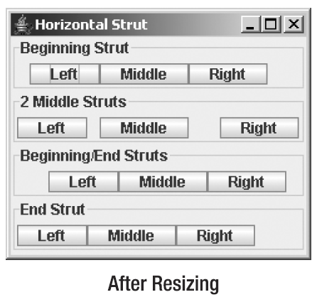

# BoxLayout

- [BoxLayout](#boxlayout)
  - [简介](#简介)
  - [创建](#创建)
  - [布局组件](#布局组件)
    - [对齐](#对齐)
    - [布局对齐属性相同的组件](#布局对齐属性相同的组件)
    - [布局对齐属性不同的组件](#布局对齐属性不同的组件)
    - [布局大组件](#布局大组件)
  - [Box](#box)
    - [创建 Box](#创建-box)
    - [Box.Filler](#boxfiller)
    - [glue](#glue)
    - [rigid](#rigid)
  - [参考](#参考)

***

## 简介

`BoxLayout` 垂直或水平布置组件。除了在自己的容器中使用 `BoxLayout`，`Box` 类提供的容器默认使用 `BoxLayout`。

`BoxLayout` 相对 `FlowLayout` 或 `GridLayout` 的好处是，`BoxLayout` 尊重每个组件的 `x` 和 `y` 对齐属性，以及它们的最大尺寸。

## 创建

`BoxLayout` 只有一个构造函数：

```java
public BoxLayout(Container target, int axis)
```

构造函数包含两个参数：

- `target` 是和布局管理器关联的目标容器；
- `axis` 指定方向。

`axis` 有四个选择：

- `X_AXIS`：从左到右水平布置组件
- `Y_AXIS`：从上到下垂直布置组件
- `LINE_AXIS`：根据容器的 `ComponentOrientation` 属性，按照文字在一行中的排列方式布置组件。
- `PAGE_AXIS`：根据容器的 `ComponentOrientation` 属性，按照文本行在一页中的排列方法布置组件。

**例1**，创建水平 `BoxLayout`：

```java
JPanel panel = new JPanel();
LayoutManager layout = new BoxLayout (panel, BoxLayout.X_AXIS);
panel.setLayout(layout);
```


## 布局组件

向容器添加组件：

- `add(Component component)`
- `add(Component component, int index)`

虽然 `BoxLayout` 实现了 `LayoutManager2` 接口，这意味着使用了 constraints，但是 `BoxLayout` 没有使用任何 constraints，所以不需要使用 `add(Component component, Object constraints)` 方法。

添加组件后，`BoxLayout` 会视图满足容器内组件的最小和最大尺寸，以及水平对齐和垂直对齐属性，对齐值范围为 0.0f 到 1.0f。

通过 `horizontal` 和 `vertical` 的组合使用，可以得到类似于 `GridBagLayout` 的效果，但是更为简单。

箱式布局管理器最关键的是每个组件的3个尺寸：

- preferredSize，即组件显示时的宽度和高度
- maximumSize，即组件能被显示的最大宽度和高度
- minimumSize，即组件能被显示的最小宽度和高度


### 对齐

|设置|设置值|
|---|---|
|**垂直对齐**||
|`Component.TOP_ALIGNMENT`|0.0f|
|`Component.CENTER_ALIGNMENT`|0.5f|
|`Component.BOTTOM_ALIGNMENT`|1.0f|
|**水平对齐**||
|`Component.LEFT_ALIGNMENT`|0.0f|
|`Component.CENTER_ALIGNMENT`|0.5f|
|`Component.RIGHT_ALIGNMENT`|1.0f|

默认所有 `Component` 的子类：

- 水平对齐方式（x 轴）为 `Component.CENTER_ALIGNMENT`
- 垂直对齐方式（y 轴）为 `Component.CENTER_ALIGNMENT`

不过，所有 `AbstractButton` 子类和 `JLabel` x 轴对齐为 `Component.LEFT_ALIGNMENT`。

设置对齐方法：

```java
setAlignmentX(float newValue)
setAlignmentY(float newValue).
```

`BoxLayout` 有时候会出现两类对齐问题：

- 一组组件对齐方式相同，但是你希望更改它们的对齐方式。例如，对水平 `BoxLayout`，在垂直方向将中心对齐修改为底部对齐：


- 一组组件对齐方式不同，导致它们的对齐方式不正确。如下所示，如果 label 和 panel 处在垂直的 `BoxLayout` 中，label 的左侧默认和 panel 的中心对齐：


通常：

- 在垂直 `BoxLayout` 中所有对象应该具有相同的水平对齐方式
- 在水平 `BoxLayout` 中所有对象应该具有相同的垂直对齐方式

设置对象方式：

- 调用 `JComponent` 的 `setAlignmentX` 设置水平对齐，或者在子类中覆盖 `getAlignmentX` 方法；
- 调用 `setAlignmentY` 或覆盖 `getAlignmentY` 设置组件垂直对齐方式。

默认情况下，大多数组件水平和垂直中心对齐，但是 button, combo box, label, menu item 默认水平对齐为 `LEFT_ALIGNMENT`。


### 布局对齐属性相同的组件

根据容器内组件的对齐方式不同，`BoxLayout` 的行为有所不同。

如果所有组件的对齐属性相同，那么 maximum size 小于容器尺寸的组件根据对齐属性排列。例如，如果在足够宽的容器内使用 `BoxLayout` 布局 buttons，则水平对齐将根据 button 的水平对齐属性向左、居中或向右排列，如下图：


这里的关键是，所有组件的对齐属性相同。

```java
public class YAxisAlignX{
    private static Container makeIt(String title, float alignment){
        String[] labels = {"--", "----", "--------", "------------"};
        JPanel container = new JPanel();
        container.setBorder(BorderFactory.createTitledBorder(title));

        BoxLayout layout = new BoxLayout(container, BoxLayout.Y_AXIS);
        container.setLayout(layout);

        // 添加 4 个对齐方式相同的按钮
        for (String label : labels) {
            JButton button = new JButton(label);
            button.setAlignmentX(alignment);
            container.add(button);
        }
        return container;
    }

    public static void main(String[] args){
        Runnable runner = () -> {
            JFrame frame = new JFrame("Alignment Example");
            frame.setDefaultCloseOperation(JFrame.EXIT_ON_CLOSE);
            Container panel1 = makeIt("Left", Component.LEFT_ALIGNMENT);
            Container panel2 = makeIt("Center", Component.CENTER_ALIGNMENT);
            Container panel3 = makeIt("Right", Component.RIGHT_ALIGNMENT);

            frame.setLayout(new FlowLayout());
            frame.add(panel1);
            frame.add(panel2);
            frame.add(panel3);
            frame.pack();
            frame.setVisible(true);
        };
        EventQueue.invokeLater(runner);
    }
}
```

对**垂直对齐属性**，如果所有组件对齐属性相同，其行为类似。如下：

```java
public class XAxisAlignY{
    private static Container makeIt(String title, float alignment){
        String[] labels = {"-", "-", "-"};
        JPanel container = new JPanel();
        container.setBorder(BorderFactory.createTitledBorder(title));
        BoxLayout layout = new BoxLayout(container, BoxLayout.X_AXIS);
        container.setLayout(layout);

        for (String label : labels) {
            JButton button = new JButton(label);
            button.setAlignmentY(alignment);
            container.add(button);
        }
        return container;
    }

    public static void main(String[] args){
        Runnable runner = () -> {
            JFrame frame = new JFrame("Alignment Example");
            frame.setDefaultCloseOperation(JFrame.EXIT_ON_CLOSE);
            Container panel1 = makeIt("Top", Component.TOP_ALIGNMENT);
            Container panel2 = makeIt("Center", Component.CENTER_ALIGNMENT);
            Container panel3 = makeIt("Bottom", Component.BOTTOM_ALIGNMENT);
            frame.setLayout(new GridLayout(1, 3));
            frame.add(panel1);
            frame.add(panel2);
            frame.add(panel3);
            frame.setSize(423, 171);
            frame.setVisible(true);
        };
        EventQueue.invokeLater(runner);
    }
}
```

效果：


### 布局对齐属性不同的组件

布局对齐属性不同的组件相对更复杂。组件可能不以你期望的方式显示。对垂直布局：

- 如果组件水平对齐为 `Component.LEFT_ALIGNMENT`，组件左边缘与容器中心对齐；
- 如果组件水平对齐为 `Component.RIGHT_ALIGNMENT`，组件右边缘和容器中心对齐；
- 如果组件水平对齐为 `Component.CENTER_ALIGNMENT`，组件居中；
- 其它对齐值，同上，都是相同容器中线的位置。

下图展示了 `BoxLayout` 的这种混合对齐行为：



左侧容器包含两个 button 组件，一个左对齐（标记为 0.0），一个右对齐（标记为 1.0），从图示上看，是不是和想象中不一样。

右侧容器展示了不同对齐值的 button 组件。

对水平布局，和垂直布局类型，也是相同中线的位置：


### 布局大组件

上面的示例中，组件的尺寸都小于可用空间。如果组件尺寸比可用空间大呢？

Swing 组件和 AWT 组件在这方面有细微差别。Swing 组件的 maximum size 默认为 preferred size，而 AWT 组件默认的 maximum size 为 `Short.MAX_VALUE`。

## Box

`Box` 为 `JComponent` 子类，是一个和 `JPanel` 类似的容器，但是使用 `BoxLayout` 作为布局管理器。`Box` 简化了 `BoxLayout` 的使用。

除了构造起来更简单，使用 `Box` 的内部类 `Box.Filler` 可以更好的定位组件。

### 创建 Box

创建 `Box` 有三种方式：

```java
public Box(int direction) // 构造函数方式
Box horizontalBox = new Box(BoxLayout.X_AXIS);
Box verticalBox = new Box(BoxLayout.Y_AXIS);

public static Box createHorizontalBox() // 工厂方法
Box horizontalBox = Box.createHorizontalBox();

public static Box createVerticalBox() // 工厂方法
Box verticalBox = Box.createVerticalBox();
```

水平 `Box` 从左到右排列，垂直 `Box` 从上到下排列。

### Box.Filler

`Box.Filler` 用于创建不可见组件（填充组件），辅助容器内组件定位。

> 从技术上来说，`Box.Filler` 可以在 `BoxLayout` 外使用，在任何支持 `Component` 的地方都能使用，它们只是不可见组件。

一般不直接使用 `Box.Filler`，而是使用 `Box` 的静态方法创建填充组件。

### glue

如果一个组件具有 minimumSize 和 preferredSize，其 maximumSize 大于屏幕的最大尺寸，那么该组件将增长以填充未使用的空间。

这种自动增长的填充组件一般称为胶水（glue）。

两种类型的胶水，一种方向无法，一种是方向相关。创建方法如下：

```java
public static Component createGlue()
// 方向无关
Component glue = Box.createGlue();
aBox.add(glue);

public static Component createHorizontalGlue();
// Direction dependent: horizontal
Component horizontalGlue = Box.createHorizontalGlue();
aBox.add(horizontalGlue);

public static Component createVerticalGlue()
// Direction dependent: vertical
Component verticalGlue = Box.createVerticalGlue();
aBox.add(verticalGlue);
```

创建胶水后，可以像一般组件一样添加到容器，以辅助其它组件的定位。如下：


可以将胶水添加到任何尊重组件最小、最大和首选尺寸属性的容器，如 `BoxLayout`。因为 `JMenuBar` 的布局管理器为 `BoxLayout`，所以可以添加胶水到 `JMenuBar`，如下，在 "Edit" 和 "Help" 之间添加胶水组件：


> 不推荐在菜单栏中使用胶水。

### rigid

因为 glue 会增长以填充可用空间，如果希望组件之间有固定距离，就需要使用刚性组件，即 strut。`strut` 可以是一维或二维，固定高度/宽度。

创建方式如下：

```java
public static Component createRigidArea(Dimension dimension)
// 二维 strut
Component rigidArea = Box. createRigidArea(new Dimension(10, 10));
aBox.add(rigidArea);

public static Component createHorizontalStrut(int width)
// 一维：水平
Component horizontalStrut = Box. createHorizontalStrut(10);
aBox.add(horizontalStrut);

public static Component createVerticalStrut(int height)
// 一维：垂直
Component verticalStrut = Box. createVerticalStrut(10);
aBox.add(verticalStrut);
```

strut 展示如下:




## 参考

- https://docs.oracle.com/javase/tutorial/uiswing/layout/box.html