# MigLayout

2024-04-11⭐
@author Jiawei Mao

***

## 简介

`MigLayout` 是一个通用且强大的 layout-manager。`MigLayout` 基于 grid，但也支持 docking 和 grouping。


相对其它 layout-managers，`MigLayout` 有如下优势：

- column/row 中组件默认对齐；
- 可以指定 column width 或 row height 的最小和最大值；
- 支持不同单位：LogicalPixel, Pixel, Point, Millimeter, Centimeter, Inch, Percent and ScreenPercent，其中 LogicalPixel 对创建随屏幕分辨率缩放的布局非常有用；
- 支持 columns, rows 以及 components 之间的 gaps；
- 灵活的 growing and shrinking；
- column/row grouping；
- in-cell flow 支持将多个 component 放入单个 grid-cell；
- 将组件 docking 到容器边缘；

`MigLayout` 支持通过**字符串**和链式 API 指定约束。API 和 String 约束效果是相同的，有些细微差异会在 JavaDoc 中说明。下面主要解释 String 约束格式，API 可以参考 JavaDoc。

使用 `MigLayout` 布局组件主要有三种方式，这三种方式可以在容器中自由组合：

- **Grid Based**，这是默认模式，基于网格布局组件，但是比 `GridBagLayout` 和 JGoodies FormLayout 更灵活；
- **Docking Components**，将组件固定到容器边缘或中心，但是比 `BorderLayout` 更灵活，也更容易使用；
- **Absolute positioning with Links**，组件可以使用绝对坐标定位，并链接到其它组件、容器的便捷。

`MigLayout` 使用网格自动处理基本组件布局和 gap，非常灵活。例如，可以拆分每个 cell，从而一个 cell 包含多个组件，也可以一个组件跨越多个 cells。从而可以实现几乎所有布局。

如果一个 cell 包含多个组件，它们像 `FlowLayout` 一样布局，但是可以更多设置。Flow 包含 vertical(y) 和 horizontal(x) 两种类型，默认为水平。

`MigLayout` 可以使用绝对定位和相对定位，即相对容器边界或视觉边界（即边界减去 insets）。这在网格边界之外完成。甚至可以将组件链接到彼此的边界。

`MigLayout` 可以使用许多不同的单位类型，如毫米、英寸。还包含许多特性，从而可以创建稳定而美观的布局，其中许多特性来自 `FormLayout` 和 `GroupLayout`。

`MigLayout` 提供平台特异性功能，无需代码，会根据平台不同自动调整。包括：

- panel border insets;
- 组件之间的 gap;
- label 的对齐；
- button 的顺序和位置

!!! help
    `MigLayout` 有大量选项，但是不要害怕，在正常布局中许多选项基本用不到，在需要精确和复杂布局时，这些选项会提供帮助。

**总结**：`MigLayout` 可以替代 `FormLayout`, `GridBagLayout`, `BorderLayout` 和 `FlowLayout`，且功能更强。

## 示例

创建 2 行网格，每行有一个右对齐的 `JLabel` 和一个默认 grow 的 `JTextField`：

```java
// Layout, Column and Row constraints as arguments.
MigLayout layout = new MigLayout("fillx", "[right]rel[grow,fill]", "[]10[]");
JPanel panel = new JPanel(layout);

panel.add(new JLabel("Enter size:"),   "");
panel.add(new JTextField(""),          "wrap");
panel.add(new JLabel("Enter weight:"), "");
panel.add(new JTextField(""),          "");
```

`MigLayout` 的构造函数包含三个参数，分别为：

- `layoutConstraints`：与整个布局相关的约束，`null` 对应 ""；
- `colConstraints`：column 约束，`null` 对应 ""；
- `rowConstraints`：row 约束，`null` 对应 ""；

使用 API 约束构建相同的 layout：

```java
// Layout, Column and Row constraints as arguments.
MigLayout layout = new MigLayout(
    new LC().fillX(),
    new AC().align("right").gap("rel").grow().fill(),
    new AC().gap("10");

JPanel panel = new JPanel(layout);

panel.add(new JLabel("Enter size:"));
panel.add(new JTextField(""),            new CC().wrap());
panel.add(new JLabel("Enter weight:"));
panel.add(new JTextField(""));
```

### 添加组件到网格

```java
panel.add(comp1)
panel.add(comp2)
panel.add(comp3, "wrap")   // Wrap to next row
panel.add(comp4)
```

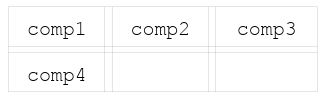

也可以在 layout 约束中指定多少个 column 后换行，例如，指定 3 个 columns 后换行：

```java
MigLayout layout = new MigLayout("wrap 3");
```

可以在 `wrap` 关键字后面直接指定下一行的 gap：

```java
panel.add(comp3, "wrap 15")
```

### Merging and Splitting Cells

```java
panel.add(comp1)
panel.add(comp2, "span 2") // The component will span two cells.
panel.add(comp3, "wrap")   // Wrap to next row 
panel.add(comp4, "span")   // Span without "count" means span whole row.
```


`span` 可以带两个参数 `x` 和 `y`，对应水平和垂直的 cell 数。例如：

```java
panel.add(comp1);
panel.add(comp2, "span 2 2");  // The component will span 2x2 cells.
panel.add(comp3, "wrap");      // Wrap to next row 
panel.add(comp4);
panel.add(comp5, "wrap");      // Note that it "jumps over" the occupied cells.
panel.add(comp6);
panel.add(comp7);
```

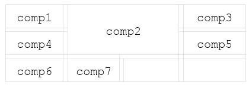

拆分 cell：

```java
 panel.add(comp1);
 panel.add(comp2, "split 2");  // Split the cell in two
 panel.add(comp3);             // Will be in same cell as previous
 panel.add(comp4, "wrap");     // Wrap to next row
 panel.add(comp5);
```

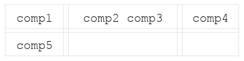

### Using Absolute Cell Coordinates

使用坐标指定组件位置：

```java
 panel.add(comp1, "cell 0 0"); // "cell column row"
 panel.add(comp2, "cell 1 0");
 panel.add(comp3, "cell 2 0");
 panel.add(comp4, "cell 0 1");
```


这里也可以指定 span 和 split。将组件放入一个已有组件的 cell，会导致该 cell split。示例：

```java
panel.add(comp1, "cell 0 0");
panel.add(comp2, "cell 1 0 2 1");  // "cell column row width height"
panel.add(comp3, "cell 3 0");
panel.add(comp4, "cell 0 1 4 1");
```


### component size

Swing 支持 minimum/preferred/maximum 大小，SWT 只支持 preferred-size。

组件大小以 "min:pref:max" 格式指定，例如 "10:20:40"。未指定的 size 默认为组件对应 size，例如 "10::40" 将设置组件 min-size 和 max-size，保留组件的 pref-size。设置 size 的快捷方式有许多，例如 "40!" 表示将三个 sizes 都设置为 40，详情可参考 [BoundSize](#boundsize)。

示例：

```java
panel.add(comp, "width 10:20:40");
panel.add(comp, "height ::40");    // Same as "hmax 40".
panel.add(comp, "w 40!");          // w is short for width
```

### row/column size

row/column size 默认为最大组件的 size。可以覆盖默认值，其工作方式与 component-size 完全相同。通常在创建 layout 时在对应的约束中指定 column/row size。例如：

```java
MigLayout layout = new MigLayout(
      "",                            // Layout Constraints
      "[10][20:30:40][40!][::40]",   // Column constraints
      "[min!][10::20][40mm!]");      // Row constraint
```

### Panel insets

除了 docking 组件，在 layout 周围默认有一个不可见的 border。在不同平台，border 的默认大小不同。

在 layout 约束中指定 border 尺寸。例如：

```java
MigLayout layout = new MigLayout("insets 10");
MigLayout layout = new MigLayout("insets 0 10 10 20"); // T, L, B, R
```

### component alignment

可以在 column/row 约束中指定组件的默认对齐方式，也可以单独在组件约束中指定组件的对齐方式。

指定默认对齐方式：

```java
MigLayout layout = new MigLayout(
  "",                         // Layout Constraints
  "[center][right][left][c]", // Column constraints with default align
  "[top][center][b]");        // Row constraints with default align
```

为单个组件指定对齐方式：

```java
panel.add(comp, "align left");
```

可以使用对齐方式的第一个字母作为简写。

如果一个 cell 中有多个组件，此时指定 align 无效。但是可以通过指定组件前后的 gap 实现相同效果。例如，`"gapleft push"` 效果与 `"align right"` 相同，还适用于多组件的 cell。

### Docking Components

`MigLayout` 支持 dock 组件，效果与 BorderLayout 类似。docking 组件放在网格布局之外，可以在一个布局中混用网格和 docking 组件。

```java
panel.add(comp1)
panel.add(comp2)
panel.add(comp3,  "wrap")   // Wrap to next row
panel.add(comp4)
panel.add(comp1N, "dock north")
panel.add(comp2W, "dock west")
panel.add(comp3S, "dock south")
panel.add(comp4E, "east")
// "dock" keyword are actually optional
```

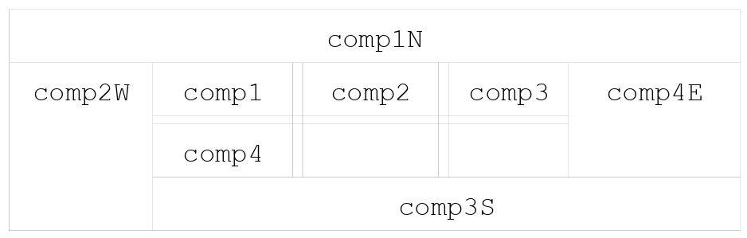

需要注意的是，docking 组件切断了对应的边，所以指定 docking 组件的顺序很重要。如果在代码中最先指定 `comp4E`，则视图为：

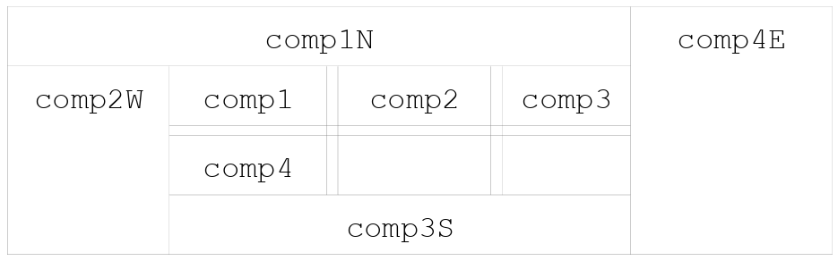

### MigLayout vs GridBagLayout


## 基本概念

`MigLayout` 对布局管理器和组件可以设置三种类型的约束：

- **Layout 约束**，这类约束用于指定布局管理器如何工作。例如，一组组件如何对其，组件是否应该填充满容器。该约束直接在 `MigLayout` 上设置，可以直接在构造函数中指定，也可以使用 get/get 属性设置。例如，`"align center, fill"`；
- **Row/Column 约束**，指定网格 rows 和 columns 属性。如 size，默认对其方式。这类约束也是直接在 `MigLayout` 上设置。例如，`"[35px]10px[50:pref]"`；
- **Component 约束**，指定组件的属性和边界。可用来覆盖组件的 minSize, prefSize 和 maxSize 等。还可以设置对齐方式，cell 是否应该分割或跨越多个 cell 等。通常在将组件添加到容器时设置改约束。例如，`"width 100px, left"`。

### Grid Flow

通常将组件布置在网格中。哪个组件进入哪个网格，有两种指定方式，或者混合使用。

将第一个组件添加到容器，`MigLayout` 将其放在 (0,0) cell，第二个放在 (1,0)，以此类推。这是默认 flow，也可以修改方向。

也可以在组件约束中指定网格坐标，例如 `"grid 2 4"`。组件会放到指定 cell，下一个组件将从这里开始 flow。

另外还有 flow 约束来控制 flow 过程，例如 `"wrap"`, `"newline"`, `"skip"`, `"span"` 和 `"split"`。

### In-cell Flow

`MigLayout` 支持在一个 cell 里放置多个组件。这对使用 radioButtonGroup 非常有用，避免嵌套容器。

|1|2|3|
|---|---|---|
|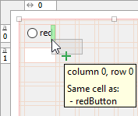|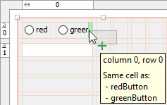|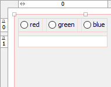|

如果多个组件占用同一个 cell（cell 被拆分，或多个组件约束指向同一个 cell），则该 cell 中的组件将沿垂直或水平方向 flow。默认方向与整个布局使用的方向相同，但可以对每个 cell 进行单独设置。组件彼此挨着，可以在非 flow 方向对其，例如，水平 flow 可以在垂直方向对齐 `"aligny"`。

### gap

gap 有两种类型:

- grid gap
- 组件 gap

默认 gap 具有平台依赖性，对应 `"related"` gap 默认值。例如，Mac OS X 的 gap 通常比 Windows 和 Linux 要大。可以在 layout 约束中覆盖整个 layout 的默认 gap，也可以在 row/column 约束中分别指定。

gap 不会累加，例如，如果组件 1 后面的 gap 为 10px，下一个组件 2 前面的 gap 为 20px，那么最终的 gap 为 20px，而不是 30px。

gap 可以按照 min/pref/max 格式指定，使得它们可以随着可用空间的变化而变化。

gap 后添加 `:push`，表示 gap 占据余下所有空间：

- cell 中的 pushing-gap 使得 cell 不会过大；
- columns/rows 中的 pushing-gap 使得布局填充整个容器。

#### grid gap

在创建 `MigLayout` 时，可以在 column/row 约束中指定 gap。例如：

```java
MigLayout layout = new MigLayout(
    "",           // Layout Constraints
    "[][]20[]",   // Column constraints
    "[]20[]");    // Row constraints
```


其中较大的 gap 为 20px。这里也可以使用其它单位，如 20mm。

#### component gap

当一个 cell 里有多个组件，才会用到组件 gap。gap 是到最近边缘的距离，可以是 cell 的边界，也可以是到相同 cell 里其它组件的距离。

在添加组件时指定组件 gap。例如：

```java
 panel.add(comp1)
 panel.add(comp2, "gapleft 30")
 panel.add(comp3, "wrap")   // Wrap to next row
 panel.add(comp4)
```

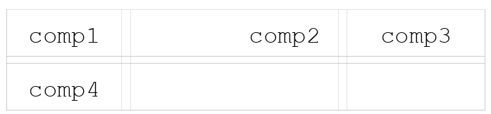

有许多 gap 相关约束，可以查询[组件约束](#组件约束)。

### Absolute Positioning

在组件约束中，支持以任意单位指定组件的绝对坐标，因此组件**不会**定位到网格中。

这些坐标值相对父容器。对需要独立于其它组件、并可能重叠的组件，这是一种强大的布局方式。例如，可以在容器上创建一个类似于 GlassPane 的本地组件。

绝对约束中的坐标，即 (x, y, x2, y2)，可以绑定到其它组件、父组件或其视觉边界。因为坐标为 `UnitValue` 类型，因此可以是完整表达式。例如，x 坐标 `(b1.x + indent)` 表示将组件左侧相对 `"b1"` 缩进。

### Expressions

`UnitValue` 可以用类似 Java 表达式的语句指定。例如，`(button1.x + 1cm - (parent.w*0.2))` 与 Java 代码一样，有相同的运行有优先级，并支持括号。

如果在表达式中使用空格，就必须用圆括号括起来。

### Docking Components

MigLayout 支持将组件停靠在它的边缘（类似 `BorderLayout`）。可以将多个组件停靠在一个边。中间为 grid 分布。

|Order:north,west,south,east|Order:east,south,west,north|
|---|---|
|||

MigLayout 比 `BorderLayout` 更灵活，且支持 5 个以上组件。组件可以粘附到 5 个位置：`"north"`, `"west"`, `"south"`, `"east"` 以及 `"center"`。

中间区域采用正常的网格布局，除非组件设置为 `"dock center"`。

docking 用来布局 panels 非常灵活，但也可以用于其它布局需求。

### Button Bars and Button Order

`MigLayout` 可以根据平台特性重新组织 buttons。例如，**OK** 和 **Cancel** 按钮在 Windows 和 Mac OS X 中有不同顺序。虽然其它布局管理器可以使用 factories 和 button-builder 实现这一点，`MigLayout` 只通过标记就可以实现。只需将 OK 按钮标记为 `"ok"`，Cancel 按钮标记为 `"cancel"`，如果将它们放在相同的 cell 中，`MigLayout` 将根据平台正确设置顺序。

`MigLayout` 提供了大约 10 种不同的标签和格式，用来设置 button 的顺序，以及 buttons 之间的间距。

通过 `PlatformDefaults.setButtonOrder(String)` 设置按钮顺序。

### 单位

`MigLayout` 支持许多不同的单位，内置的单位包括：**Pixel**, **Millimeter**, **Centimeter**, **Points**, **Inch**, **LogicalPixel**, **Percent** 和 **ScreenPercent**。

还有一些特殊的关键词提供类似功能：`"related"`, `"unrelated"`, `"indent"` 和 `"paragraph"`。它们用于更便捷的设置 gaps。

通过创建单位到像素的映射，可以**自定义单位**。

### 伸缩

`MigLayout` 中 column/row 和 component 的 grow 和 shrink 行为都可以定制。当没有设置组件的 prefSize，其缩放行为高度可定制。

- 可以将组件划分为 grow/shrink 优先组，在调整大小时，优先级高的组件先缩放。
- 可以设置组件的缩放权重，以确定该优先级组中组件如何划分空间。

如果需要，有许多内容需要设置，不过大多时候，采用默认配置就足够了。`MigLayout` 完全遵循组件的 minSize, prefSize 和 maxSize。

当空间不足，组件和 row/column 默认收缩到 minSize。column/row 的 minSize 默认为所含组件的 minSize 的最大值。

通常只需知道如何使组件或 row/column 增长，或者不允许收缩即可。例如：

```java
MigLayout layout = new MigLayout(
    "",                 // Layout Constraints
    "[grow][][grow]",   // Column constraints
    "[][shrink 0]");    // Row constraints
```

对组件：

```java
panel.add(comp, "growx")    // Grow horizontally. Same as "growx 100"
panel.add(comp, "growy")    // Grow vertically. Same as "growy 100"
panel.add(comp, "grow")     // Grow both. Same as "grow 100 100"
panel.add(comp, "shrink 0") // Will not shrink.
```

### Size Groups

有时需要 components/columns/rows 具有相同的 width 或 height。通过 size-groups 很容易实现。

例如，在 button-bar 中，所有 buttons 应该具有相同的 minWidth。

### End Groups

对绝对布局，有时需要将相关组件的末端设置为 group 中最大的一个。通过为 components 设置 `endgroup` 可以实现。

同一个 end-group 中的所有组件自动将其右侧设置为该 group 中最大的组件。

### Component Sizes

组件有 minSize, prefSize 和 maxSize，通常由组件的 UI-delegate 或用户显式设置。

在组件约束中可以覆盖这些 sizes，因此很少需要直接在组件上显式设置 size。如果没有覆盖，则使用原始值。

对没有 minSize 和 maxSize 概念的 GUI 工具包，如 SWT 中，该功能非常有用。使用 MigLayout，可以在组件约束中设置组件的 minSize 和 maxSize，这与直接在组件上设置效果相同。

### Visual Bounds

有些组件，如 Windows XP 主题中的 JTabbedPane，有阴影效果。这意味着，人的视觉边界和组件数学意义上的边界不同。

MigLayout 提供了一种处理该问题的方法，未来会扩展到更多组件。

### Baseline Support

从 JDK 6+ 开始 MigLayout 支持 baseline 对齐。它使用反射来实现这一点，以便 JDK 6 之前的版本可以使用。

如果 JDK 不支持，baseline 默认居中对齐。在同一个 grid-row 中的组件可以 baseline 对齐。默认为 baseline 对齐，也可以为每个组件分别设置。

### Visual Guide Lines for Debugging Layouts

在 layout 约束中添加 `"debug"` 约束表示开启调试。，这将显示容器中的网格和组件 bounds。这对于理解组件为什么出现在当前位置非常有帮助。

### Insets

所有 MigLayout 容器默认在网格周围插入 insets。类似于为容器设置 `EmptyBorder`。

|Default insets(panel)|Zero insets|
|---|---|
||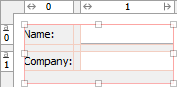|

设置界面：

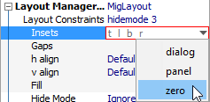

## 常用参数类型

!!! note
    参数用斜体字表示，方括号表示可选参数。

### UnitValue

UnitValue 用于表示尺寸，通常由值和单位组成。

MigLayout 支持自定义单位类型，并且内置了一些特殊单位类型。UnitValue 可以用表达式表示。

内置单位类型：

- "" - 未指定单位，对应默认单位**像素**。默认单位可以通过 `PlatformDefaults.setDefaultUnit(int)` 设置；
- **px** - 像素，直接映射到屏幕，如 `"10px"` 或 `"10"`；
- **%** - 相对容器的百分比。也可以用来对齐，例如 `50%` 表示居中；
- **lp** - 逻辑像素。如果在平台上使用普通字体，则使用 1:1 映射到像素。如果使用较大的字体，则逻辑像素按比例增大，如 `"10lp"`；
- **pt** - 点，1/72 英寸。通常用于印刷。会考虑屏幕 DPI。例如 `"10pt"`；
- **mm** - 毫米。会考虑屏幕 DPI。例如 `"10 mm"`；
- **cm** - 厘米。会考虑屏幕 DPI。例如 `"10 cm"`；
- **in** - 英寸。会考虑屏幕 DPI。例如 `"10in"`；
- **sp** - 相对屏幕的百分比。会考虑屏幕 DPI。`100.0` 为屏幕右/下边。例如 `"sp 70"` 或 `"sp 73.627123"`；
- **al** - visual-bounds 对齐。`"0al"` 表示左对齐，`"0.5al"` 为居中，`"1al"` 为由对齐。该单位与绝对定位一起使用；
- **n/null** - Null 值。表示缺失值。例如 `"n"` 或 `"null"`。

这些单位通过 `PlatformConverter` 转换为像素值。垂直和水平维度转换的像素大小可能不同。

- **r/rel/related** - 表示两个 components/columns/rows 被认为是相关的。具体像素大小由平台默认值决定。例如，`"r"` 或 `"related"` ；
- **u/unrel/unrelated** - 表示两个 components/columns/rows 不相关。具体像素大小由平台默认值决定。例如，`"u"` 或 `"unrelated"`；
- **p/para/paragraph** - 段落间距。具体像素大小由平台默认值决定。例如，`"para"` 或 `"paragraph"`；
- **i/ind/indent** - 被认为适合缩进的间距。具体像素大小由平台默认值决定。例如 `"i"` 或 `"indent"`。

还可以指定为组件的尺寸。可以用于 column/row 约束尺寸，也可以用于组件约束表达式中：

- **min/minimum** - column/row 中最大 minSize。例如，`"min"` 或 `"minimum"`；
- **p/pref/preferred** - column/row 中最大 prefSize。例如，`"p"` 或 `"pref"` 或 `"preferred"`；
- **max/maximum** - column/row 中最小 maxSize 的引用。例如，`"max"` 或 `"maximum"`。

还有一个单位可用来指定宽度。只能用于指定组件的宽度约束：

- **button** - 平台中 button 的 minSize。例如，`"min button"`。

### BoundSize

`BoundSize` 指具有可选上限和下限的 size。实际上，`BoundSize` 包含 minimum/preferred/maximum size，但都不是强制性的。

如果缺少某个 size，如没有设置 prefSize，则默认为 null，会自动计算一个合适的值：

- 对组件，该值与组件属性对应，在 Swing 上为 `Component.getPreferredSize()`；
- 对 columns/rows，它是 row 中组件的 size。

`BoundSize` 格式为：

```
"min:preferred:max"
```

但也有更简洁的版本，因为很少指定 maxSize：

- 单个值，如 `"10"` 表示 prefSize，等价于 `"null:10:null"`，`":10:"` 或 `"n:10:n"`；
- 两个值，如 `"10:20"` 表示 minSize 和 prefSize，等价于 `"10:20:null"`，`"10:20:"` 或 `"10:20:n"`；
- 感叹号，如 `"20!"` 表示该值应用于所有 size，里面不能包含冒号，等价于 `"20:20:20"`。

**push**：可以添加到 gap，表示该 gap 占据所有剩余空间。即属性为 `"push"` 会将 components/rows/columns 推开，使其占用尽可能多的空间。gap-push 是对 `BoundSize` 的补充。例如，`"gap rel:push"`, `"[][]push[][]"`, `"10cm!:push"` 或 `"10:10:10:push"`。

!!! note
    对 row/column 约束，可以使用 minimum, preferred 和 maximum 关键字。

### AlignKeyword

用于对齐的关键字有：**t/top**, **l/left**, **b/bottom**, **r/right**, **lead/leading**, **trail/trailing** 和 **base/baseline**:

- Leading/trailing，取决于组件方向是从左到右还是从右到左；
- 还有一个 `"align label"`，对 columns/rows 只需要用 `"label"`：它会根据平台的样式将组件（通常为 label）左对齐、居中或右对齐。目前，除了 OS X 外，标签都是左对齐。

## Layout 约束

约束分三个级别：

- layout 约束
- row/column 约束
- component 约束

对三个级别同时存在的约束选项，优先级 component 约束 > row/column 约束 > layout 约束。

大多数配置可以在添加每个组件时完成。然而，熟悉 `FormLayout` 可能会发现使用 row/column 约束更容易，这样可以预先在一个位置指定大部分布局。使用 row/column 约束的另一个优点是，它们可以覆盖整个 row/column 的默认大小和 gap。

### wrap [count]

设置自动换行模式，即在一定数目的 column/row 之后换行。这里 `count` 表示单个 column/row 包含的 cell 数。

可以在此关键字后面直接指定数字，否则直接根据使用的 column/row 约束数量确定。

如果关闭 `wrap`（默认），还可以使用组件约束 `"wrap"` 和 `"newline"` 来控制自动换行。

示例：`"wrap"` 或 `"wrap 4"`。

### `fill` or `fillx` or `filly`

表示 columns 和/或 rows 填满整个容器空间：

- 至少需要一个组件声明为 "grow"，才能填充容器；
- 空间被平均划分，但会遵守 "growpriority"；
- 如果没有 columns/rows 设置为 "grow"，则采用组件的 grow-weight 设置对应 row/column。

## Column/Row 约束

column 和 row 约束工作原理相同，因此下面说明时 **row** 同时适用于 column 和 row。

每个 `[]` 对应一个 row 约束。两个 `[]` 之间的值为 gapSize，即两行之间的空隙。格式为：

```
[constraint1, constraint2, ...]gap size[constraint1, constraint2, ...]gap size[...]...
```

例如：

- `"[fill]10[top,10:20]"`
- `"[fill]push[]"`
- `"[fill]10:10:100:push[top,10:20]"`

!!! tip
    如果使用默认 gap，竖直线 `|` 可以替代 `][` 使用，例如 `"[100|200|300]"` 等价于 `"[100][200][300]"`。

## 组件约束

**组件约束**用在 Swing 的 `Container.add(...)` 方法，SWT 的 `Control.setLayoutData(...)` 方法。

组件约束可以用来指定组件大小和 cell-flow。其格式与 layout 约束相同，即采用逗号作为分隔符逐个指定。

例如：`"width 100px!, grid 3 2, wrap"`。

### wrap [gapsize]

换行或换列，即 wrap 后的下一个组件会放到新的 row/column。这个 wrap 可以看作换行符。

如果指定 `gapsize`，它会覆盖当下 row/column 到下一个 row/column 的 gap。即指定组件所在 row 到下一个 row 的 gap。

**示例：**：

- `"wrap"`
- `"wrap 15px"`
- `"wrap push"`
- `"wrap 15:push"`

### span

- `span [countx [county]]`
- `spany/sy [count]`
- `spanx/sx [count]`

当前 cell 跨越（合并）多个 cells。`count` **默认值**很大，以跨越到 row/column 末尾。

一个 cell 可以同时 span 和 split。例如，可以 span 2 个 cell，然后将合并后的空间分为 3 部分。

将第一个 cell 设为 span 等价于将 row 约束设为 `"nogrid"`。

示例：

- `"span"`
- `"span 4"`
- `"span 2 2"`
- `"spanx"`
- `"spanx 10"`
- `"spanx 2, spany 2"`

### split

- `split [count]`

拆分 cell 为多个 sub-cells。即下面 `count` 个组件放到一个 cell 中，彼此挨着，没有 gap。

只能为 cell 中的第一个组件设置 `split`，cell 中余下组件的 `split` 设置被忽略。

`count` 默认无限大，即余下组件都放到同一个 cell 中。

`"skip"`, `"wrap"` 和 `"newline"` 会跳出 split-cell。`"wrap"` 和 `"newline"` 会移动到新的 row/column。

示例：

- "split"
- "split 4"

### cell

```
cell col row [span x [span y]]
```

设置放置组件的 cell。如果 cell 中已有组件，它们共享 cell。

- 如果包含两个整数，对应 column 和 row 索引，flow 在此 cell 后继续；
- 后面可以继续指定 span x 和 span y，等价于 `spanx` 和 `spany` 关键字。

示例：

- "cell 2 2"
- "cell 0 1 2 "
- "cell 1 1 3 3"

### w/width or h/height

```
w/width size
h/height size
```

覆盖 UI-delegate 或由开发人员代码设置的组件 size。size 格式为 `BoundSize`。

这里支持表达式，因此可以使用 `"width pref+10px"` 使组件比正常宽 10px，或使用 `"width max(100, 10%)"` 使其为容器宽度的 10%，但最大为 100px>

示例：

- `"width 10!"`
- `"width 10"`
- `"h 10:20"`
- `"height pref!"`
- `"w min:100:pref"`
- `"w 100!,h 100!"`
- `"width visual.x2-pref"`

### wmin/wmax or hmin/hmax

```
wmin/wmax x-size 
hmin/hmax y-size
```

覆盖 UI-delegate 或由开发人员代码设置的组件 min-size 或 max-size。size 格式为 `BoundSize`。

这里支持表达式，因此可以使用 `"wmin pref-10px"` 使 min-width 比 pref-width 小 10px。 

示例：

- "wmin 10"
- "hmax pref+100"

### sizegroup

```
sizegroup/sg [name]
sizegroupx/sgx [name]
sizegroupy/sgy [name]
```

设置组件的 size-group 名称。同一个 size-group 里的组件具有相同 `BoundSize`（min/pref/max）。该功能用于确保相同 group 中的所有组件获得相同的 min/pref/max 尺寸，即 group 最大组件的 size。可以用空名词 `""`。

示例：

- "sg"
- "sg group1"
- "sizegroup props"
- "sgx"
- "sizegroupy grp1"

### gap

```
gap left [right [top [bottom]]]
gaptop gap
gapleft gap
gapbottom gap
gapright gap
gapbefore gap
gapafter gap
```

指定组件之间以及组件和 cell 边缘的 gap。缺失表示 gap 为 0px。gap 格式为 `BoundSize`。

示例：

- `"gap 5px 10px 5px 7px"`
- `"gap unrel rel"`: unrelated, related
- `"gapx 5dlu"`
- `"gapx 10:20:50:push"`
- `"gapy 0:rel:null"`
- `"gap 10! 10!"`
- `"gapafter push"`

## 参考

- https://www.formdev.com/jformdesigner/doc/layouts/miglayout/
- https://www.formdev.com/jformdesigner/doc/layouts/miglayout-whitepaper/#button-bars-and-button-order
- https://objectcomputing.com/resources/publications/sett/may-2009-miglayout-the-one-java-layout-manager-that-does-it-all