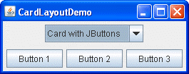
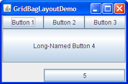
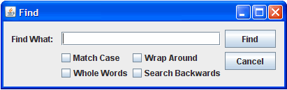
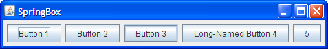
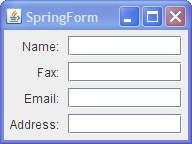

# 布局管理器

- [布局管理器](#布局管理器)
  - [简介](#简介)
  - [种类](#种类)
    - [BorderLayout](#borderlayout)
    - [BoxLayout](#boxlayout)
    - [CardLayout](#cardlayout)
    - [FlowLayout](#flowlayout)
    - [GridBagLayout](#gridbaglayout)
    - [GridLayout](#gridlayout)
    - [GroupLayout](#grouplayout)
    - [SpringLayout](#springlayout)
  - [参考](#参考)

2023-12-22, 00:51⭐
****

## 简介

布局管理器，能够对顶层容器中的组件按照指定规则进行排列。对复杂布局的建议：

- GUI builder: 使用 `GroupLayout`
- 代码编写：`GridBagLayout`

手动编写 layout 十分麻烦，如果对布局细节不感兴趣，可以使用 **`GroupLayout`** 结合 GUI builder，如 WindowBuilder，NetBeans IDE，Intellij IDEA 等。如果想手动编写 layout，又不想用 `GroupLayout`，则推荐使用 `GridBagLayout`，其灵活性仅次于 `GroupLayout`。

## 种类

Swing 提供的布局管理器种类如下：

|种类|说明|
|---|---|
|`BorderLayout`|将容器分为东南西北中 5 个区域，每个区域可以容纳一个组件|
|`FlowLayout`|按先后顺序从左到右排列，一行排满换行。每一行的组件都是居中排列|
|`GridLayout`|将布局空间划分为若干行和列的网络区域，组件放在网格中|
|`GridBagLayout`|通过网格进行划分，一个组件可以占据一个或多个网格|
|`CardLayout`|将容器中的每个组件当作一个卡片，一次仅有一个卡片可见|
|`BoxLayout`|在水平或垂直方向排序组件|
|`SpringLayout`|通过定义组件边沿的关系来实现布局|
|`GroupLayout`|指定在一个窗体上组件彼此的关系，如位置关系或对齐关系|

### BorderLayout

`BorderLayout` 是 content-pane 的默认 layout，它将容器分为五个区域：top, bottom, left, right, center。

使用 `JToolBar` 创建的工具栏必须放在 `BorderLayout` 中。

### BoxLayout

`BoxLayout` 单行或单列排列组件。它满足组件所要求的最大尺寸，可以设置对齐方式。

### CardLayout

`CardLayout` 可以在一个区域切换显示不同面板，通常由 combo-box 控制显示哪个面板。

`CardLayou`t 的另一个选择是 tabbed-pane，它提供了类似的功能。

### FlowLayout

`FlowLayout` 是 `JPanel` 的默认 layout。单行排列组件，如果宽度不够，就换行。

### GridBagLayout

`GridBagLayout` 是一个复杂灵活的 layout：

- 通过网格对齐组件
- 允许组件占用多个网格
- 不同 row 的高度可以不同
- 不同 column 的宽度可以不同

### GridLayout

`GridLayout` 将所有组件放在相同大小的网格中。

### GroupLayout

`GroupLayout` 是专门为 GUI builder 工具开发的，但也可以手动使用。

`GroupLayout` 单独处理水平和垂直布局。因此，每个组件需要在布局中定义两次。

### SpringLayout

`SpringLayout` 也是为 GUI builder 工具设计的。

`SpringLayout` 通过指定组件边缘之间的距离来设置布局。

## 参考

- https://docs.oracle.com/javase/tutorial/uiswing/layout/index.html