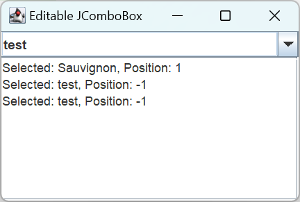

# JComboBox

2025-05-20, update 
2024-01-03 ⭐
@author Jiawei Mao 
***
## 简介

`JComboBox` 为用户提供选项，有两种形式：

- 不可编辑（默认），包含按钮、下拉列表和 label
- 可编辑，包含按钮、下拉列表和 text-field，用户可以在 text-field 中输入值，不过 text-field 默认禁用，即默认不可编辑

combo-box 只需少量空间就能提供大量选择。其它类似组件：

- radio-button，适合少量选择，空间有限或选项太多，combo-box 更合适
- list，当选项很多（>20）或需要多选

`JComboBox` 实现包含四部分：

- 数据模型：由 `ComboBoxModel` 接口定义
- 渲染器：用于绘制 `JComboBox` 元素，由 `ListCellRenderer` 接口定义
- 编辑器：用于输入不在预定义数据模型中的选项，由 `ComboBoxEditor` 接口定义
- keystroke 管理器：用于支持通过键盘输入选择 `JComboBox` 元素，由 `KeySelectionManager` 接口定义

`JComboBox` 的许多功能与 `JList` 共享。

> [!TIP]
>
> 调用 `setEditable` 设置为可编辑。编辑功能仅影响所选项目，不改变列表。
>
> `getSelectedItem` 返回当前选项，如果 combo-box 是可编辑的，则返回选项可能是编辑过的。

## 创建 JComboBox

和 `JList` 一样，`JComboBox` 有 4 个构造函数。和 `JList` 不同的是，其默认模型支持添加和删除元素。

1. `JComboBox()`：默认 data-model，可以添加和删除元素，默认选择第一个元素

```java
JComboBox comboBox = new JComboBox();
```

2. `JComboBox(E[] items)`：提供初始元素，默认选择第一个元素

```java
String[] labels = {"Chardonnay", "Sauvignon", "Riesling",
        "Cabernet", "Zinfandel", "Merlot", "Pinot Noir",
        "Sauvignon Blanc", "Syrah", "Gewürztraminer"};
JComboBox<String> comboBox = new JComboBox<>(labels);
```

3. `JComboBox(Vector<E> items)`：用向量提供初始元素

```java
Vector vector = aBufferedImage.getSources();
JComboBox comboBox = new JComboBox(vector);
```

4. `JComboBox(ComboBoxModel<E> aModel)`：提供 data-model

```java
ResultSet results = aJDBCStatement.executeQuery("SELECT columnName FROM tableName");
DefaultComboBoxModel model = new DefaultComboBoxModel();
while (result.next())
    model.addElement(results.getString(1));
JComboBox comboBox = new JComboBox(model);
```

## JComboBox 属性

`JComboBox` 有 22 个属性。

|属性|类型|权限|
|---|---|---|
|accessibleContext|AccessibleContext|Read-only|
|action|Action|Read-write bound|
|actionCommand|String|Read-write|
|actionListeners|ActionListener[]|Read-only|
|editable|boolean|Read-write bound|
|editor|ComboBoxEditor|Read-write bound|
|enabled|boolean|Write-only bound|
|itemCount|int|Read-only|
|itemListeners|ItemListener[]|Read-only|
|keySelectionManager|JComboBox.KeySelectionManager|Read-write|
|lightWeightPopupEnabled|boolean|Read-write|
|maximumRowCount|int|Read-write bound|
|model|ComboBoxModel|Read-write bound|
|popupMenuListeners|PopupMenuListener[]|Read-only|
|popupVisible|boolean|Read-write|
|prototypeDisplayValue|Object|Read-write bound|
|renderer|ListCellRenderer|Read-write bound|
|selectedIndex|int|Read-write|
|selectedItem|Object|Read-write|
|selectedObjects|Object[]|Read-only|
|UI|ComboBoxUI|Read-write|
|UIClassID|String|Read-only|

- `maximumRowCount`：弹出列表最大 row 数
- `lightWeightPopupEnabled`，确定弹出菜单的窗口类型，即采用轻量级还是重量级组件，如果混用 AWT 和 Swing 组件，将 `lightWeightPopupEnabled` 设置为 true 可以强制使用重量级弹出菜单
- `popupVisible`，支持以编程方式显示弹出列表

另外，使用 `hidePopup()` 和 `showPopup()` 也可以切换弹出列表的可见性。

## 渲染 JComboBox 元素

`JComboBox` 使用 `ListCellRenderer` 渲染数据，和 `JList` 相同。

因此对 `JList` 自定义的 cell-renderer，也可以在 `JComboBox` 中使用。在 `JList` 笔记有[示例](./JList.md#复杂的-listcellrenderer-实现)。其中创建 `JComboBox` 的代码：

```java
JComboBox comboBox = new JComboBox(elements);
comboBox.setRenderer(renderer);
frame.add(comboBox, BorderLayout.NORTH);
```

当然，相同的 cell-renderer 在 `JComboBox` 和 `JList` 中的行为不完全相同。例如，在 `JList` 中演示的 [FocusedTitleListCellRenderer](./JList.md#渲染-jlist-元素) 在 `JComboBox` 中不会显示 "Focused" 标题边框，因为 `JComboBox` 元素没有输入焦点。

此外，不同组件的默认颜色也可能不同。

## 选择 JComboBox 元素

`JComboBox` 支持至少三种与选择相关的事件：

1. 使用 `JComboBox.KeySelectionManager` 监听键盘输入

2. 监听选择元素的改变：`ActionListener`

3. 监听选择元素改变：`ItemListener`

编程选择：

```java
public void setSelectedItem(Object element)
public void setSelectedIndex(int index)
```

使用 `setSelectedIndex(-1)` 取消选择。

### KeySelectionManager

`JComboBox` 内部接口 `KeySelectionManager` 及其实现用于管理使用键盘选择元素。

默认 manager 选择与按键匹配的元素。如果多个元素前缀相似，可以继续输入，直到精确匹配。如果不喜欢该行为，可以关闭，或创建一个新的 `KeySelectionManager`。

> [!WARNING]
>
> `KeySelectionManager` 只能在不可编辑的 `JComboBox` 中使用。

如果想关闭 `KeySelectionManager`，直接将 `keySelectionManager` 设置为 `null` 不行。需要自定义实现接口，该接口只有一个方法：

```java
public interface KeySelectionManager {
    int selectionForKey(char aKey,ComboBoxModel<?> aModel);
}
```

`selectionForKey` 当按下的键与任何元素不匹配，返回 -1；否则返回匹配元素的位置。因此，为了忽略键盘输入，应该总是返回 -1：

```java
JComboBox.KeySelectionManager manager =
    new JComboBox.KeySelectionManager() {
        public int selectionForKey(char aKey, ComboBoxModel aModel) {
            return -1;
        }
    };
aJcombo.setKeySelectionManager(manager);
```

### ActionListener

`ActionListener` 是监听选择事件的常用 listener，然而 `ActionListener` 只能告诉你选择了元素，却不知道选择了哪个元素。

由于 `ActionListener` 不知道选中的元素，所以它必须询问事件源 `JComboBox`。可以用 `getSelectedItem()` 或 `getSelectedIndex()` 查询选择元素，当选择的元素不是模型的一部分，索引为 -1。当 `JComboBox` 可编辑，且用户输入的值不是原模型的一部分，就会出现该情况。

> [!NOTE]
>
> 当 `JComboBox` 中的元素发生变化，发送给 `ActionListener` 的 `ActionEvent` 的 action-command 为 `comboBoxChanged`。    

### ItemListener

`ItemListener` 可以看到 `JComboBox` 选择的变化。

**示例：** 演示 `JComboBox` 中的 `ActionListener` 和 `ItemListener`

`ActionListener` 打印 action-command 和当前选择元素，`ItemListener` 输出受影响的元素、状态变化和当前选择元素

```java
import javax.swing.*;
import java.awt.*;
import java.awt.event.ActionListener;
import java.awt.event.ItemEvent;
import java.awt.event.ItemListener;
import java.io.PrintWriter;
import java.io.StringWriter;

public class SelectingComboSample {

    private static String selectedString(ItemSelectable is) {
        Object[] selected = is.getSelectedObjects();
        return ((selected.length == 0) ? "null" : (String) selected[0]);
    }

    public static void main(String[] args) {
        Runnable runner = () -> {
            String[] labels = {"Chardonnay", "Sauvignon", "Riesling", "Cabernet",
                    "Zinfandel", "Merlot", "Pinot Noir", "Sauvignon Blanc",
                    "Syrah", "Gewürztraminer"};
            JFrame frame = new JFrame("Selecting JComboBox");
            frame.setDefaultCloseOperation(JFrame.EXIT_ON_CLOSE);

            JComboBox comboBox = new JComboBox(labels);
            frame.add(comboBox, BorderLayout.SOUTH);

            final JTextArea textArea = new JTextArea();
            textArea.setEditable(false);
            JScrollPane sp = new JScrollPane(textArea);
            frame.add(sp, BorderLayout.CENTER);

            ItemListener itemListener = itemEvent -> {
                StringWriter sw = new StringWriter();
                PrintWriter pw = new PrintWriter(sw);
                int state = itemEvent.getStateChange();
                String stateString =
                        ((state == ItemEvent.SELECTED) ? "Selected" : "Deselected");
                pw.print("Item: " + itemEvent.getItem());
                pw.print(", State: " + stateString);
                ItemSelectable is = itemEvent.getItemSelectable();
                pw.print(", Selected: " + selectedString(is));
                pw.println();
                textArea.append(sw.toString());
            };
            comboBox.addItemListener(itemListener);

            ActionListener actionListener = actionEvent -> {
                StringWriter sw = new StringWriter();
                PrintWriter pw = new PrintWriter(sw);
                pw.print("Command: " + actionEvent.getActionCommand());
                ItemSelectable is = (ItemSelectable) actionEvent.getSource();
                pw.print(", Selected: " + selectedString(is));
                pw.println();
                textArea.append(sw.toString());
            };
            comboBox.addActionListener(actionListener);

            frame.setSize(400, 200);
            frame.setVisible(true);
        };
        EventQueue.invokeLater(runner);
    }
}

```


### ListDataListener

将 `ListDataListener` 注册到 `JComboBox` 的数据模型，除了模型选择的变化，listener 还会收到其它变化的通知，因此 `ListDataListener` 不适合用来监听选择的元素。

`JComboBox` 中移动鼠标和光标不会改变所选元素，释放鼠标会改变选项。

## 编辑 JComboBox 元素

设置 `JComboBox` 的 `editable` 属性可启用编辑功能。

**示例：** 可编辑 `JComboBox`

text-area 显示当前选项和位置。当输入数据模型中没有的值，`getSelectedIndex()` 返回 -1.

```java
import javax.swing.*;
import java.awt.*;
import java.awt.event.ActionListener;

public class EditComboBox {

    public static void main(String[] args) {
        Runnable runner = () -> {
            String[] labels = {"Chardonnay", "Sauvignon", "Riesling", "Cabernet",
                    "Zinfandel", "Merlot", "Pinot Noir", "Sauvignon Blanc",
                    "Syrah", "Gewürztraminer"};
            JFrame frame = new JFrame("Editable JComboBox");
            frame.setDefaultCloseOperation(JFrame.EXIT_ON_CLOSE);

            final JComboBox<String> comboBox = new JComboBox<>(labels);
            comboBox.setMaximumRowCount(5);
            comboBox.setEditable(true);
            frame.add(comboBox, BorderLayout.NORTH);

            final JTextArea textArea = new JTextArea();
            JScrollPane scrollPane = new JScrollPane(textArea);
            frame.add(scrollPane, BorderLayout.CENTER);

            ActionListener actionListener = actionEvent -> {
                textArea.append("Selected: " + comboBox.getSelectedItem());
                textArea.append(", Position: " + comboBox.getSelectedIndex());
                textArea.append(System.getProperty("line.separator"));
            };
            comboBox.addActionListener(actionListener);

            frame.setSize(300, 200);
            frame.setVisible(true);
        };
        EventQueue.invokeLater(runner);
    }
}

```



`JComboBox` 提供的默认输入组件为 `JTextField`，用于字符串数据。对其它类型数据，如 colors，则需要提供不同的 editor。

从技术上讲，如果能够将 String 转换为合适类型，大多时候不需要其它 editor。但是如果希望限制输入，如只允许数字，则必须提供自己的 editor。定义 editor 需要实现 `ComboBoxEditor` 接口：

```java
public interface ComboBoxEditor {

  public Component getEditorComponent();

  public void setItem(Object anObject);

  public Object getItem();

  public void selectAll();

  public void addActionListener(ActionListener l);

  public void removeActionListener(ActionListener l);
}
```

默认 editor 为 javax.swing.plaf.basic 包中的 `BasicComboBoxEditor`。

- add/remove listener 方法用于通知 listeners `ComboBoxEditor` 的值发生了变化。通常不需要添加 listener。
- `getEditorComponent()` 返回编辑组件，如 `JColorChooser` 用于选择颜色。
- `selectAll()`，第一次显示编辑器时被调用，它告诉编辑器选择其中所有内容，选择所有内容使得用户可以直接在 `JTextField` 中输入，部分 editors 可能不需要该方法
- 


```java
public class ColorComboBoxEditor implements ComboBoxEditor {

    final protected JButton editor;
    protected EventListenerList listenerList = new EventListenerList();

    public ColorComboBoxEditor(Color initialColor) {
        editor = new JButton("");
        editor.setBackground(initialColor);
        ActionListener actionListener = new ActionListener() {
            public void actionPerformed(ActionEvent e) {
                Color currentBackground = editor.getBackground();
                Color color = JColorChooser.showDialog(
                        editor, "Color Chooser", currentBackground);
                if ((color != null) && (currentBackground != color)) {
                    editor.setBackground(color);
                    fireActionEvent(color);
                }
            }
        };
        editor.addActionListener(actionListener);
    }

    @Override
    public void addActionListener(ActionListener l) {
        listenerList.add(ActionListener.class, l);
    }

    @Override
    public Component getEditorComponent() {
        return editor;
    }

    @Override
    public Object getItem() {
        return editor.getBackground();
    }

    @Override
    public void removeActionListener(ActionListener l) {
        listenerList.remove(ActionListener.class, l);
    }

    @Override
    public void selectAll() {
        // ignore
    }

    @Override
    public void setItem(Object newValue) {
        if (newValue instanceof Color) {
            Color color = (Color) newValue;
            editor.setBackground(color);
        } else {
            // Try to decode
            try {
                Color color = Color.decode(newValue.toString());
                editor.setBackground(color);
            } catch (NumberFormatException e) {
                // ignore - value unchanged
            }
        }
    }

    protected void fireActionEvent(Color color) {
        Object listeners[] = listenerList.getListenerList();
        for (int i = listeners.length - 2; i >= 0; i -= 2) {
            if (listeners[i] == ActionListener.class) {
                ActionEvent actionEvent =
                        new ActionEvent(editor, ActionEvent.ACTION_PERFORMED,
                                color.toString());
                ((ActionListener) listeners[i + 1]).actionPerformed(actionEvent);
            }
        }
    }
}
```

```java
public class ColorComboBox {

    static class ColorCellRenderer implements ListCellRenderer {

        protected DefaultListCellRenderer defaultRenderer =
                new DefaultListCellRenderer();
        // width doesn't matter as combobox will size
        private final static Dimension preferredSize = new Dimension(0, 20);

        public Component getListCellRendererComponent(JList list, Object value,
                int index, boolean isSelected, boolean cellHasFocus) {
            JLabel renderer = (JLabel) defaultRenderer.getListCellRendererComponent(
                    list, value, index, isSelected, cellHasFocus);
            if (value instanceof Color) {
                renderer.setBackground((Color) value);
            }
            renderer.setPreferredSize(preferredSize);
            return renderer;
        }
    }

    public static void main(String args[]) {
        Runnable runner = new Runnable() {
            public void run() {
                Color colors[] = {Color.BLACK, Color.BLUE, Color.CYAN, Color.DARK_GRAY,
                        Color.GRAY, Color.GREEN, Color.LIGHT_GRAY, Color.MAGENTA,
                        Color.ORANGE, Color.PINK, Color.RED, Color.WHITE, Color.YELLOW};
                JFrame frame = new JFrame("Color JComboBox");
                frame.setDefaultCloseOperation(JFrame.EXIT_ON_CLOSE);

                final JComboBox comboBox = new JComboBox(colors);
                comboBox.setMaximumRowCount(5);
                comboBox.setEditable(true);
                comboBox.setRenderer(new ColorCellRenderer());
                Color color = (Color) comboBox.getSelectedItem();
                ComboBoxEditor editor = new ColorComboBoxEditor(color);
                comboBox.setEditor(editor);
                frame.add(comboBox, BorderLayout.NORTH);

                final JLabel label = new JLabel();
                label.setOpaque(true);
                label.setBackground((Color) comboBox.getSelectedItem());
                frame.add(label, BorderLayout.CENTER);

                ActionListener actionListener = new ActionListener() {
                    public void actionPerformed(ActionEvent actionEvent) {
                        Color selectedColor = (Color) comboBox.getSelectedItem();
                        label.setBackground(selectedColor);
                    }
                };
                comboBox.addActionListener(actionListener);

                frame.setSize(300, 200);
                frame.setVisible(true);
            }
        };
        EventQueue.invokeLater(runner);
    }
}
```


## 参考

- https://docs.oracle.com/javase/tutorial/uiswing/components/combobox.html