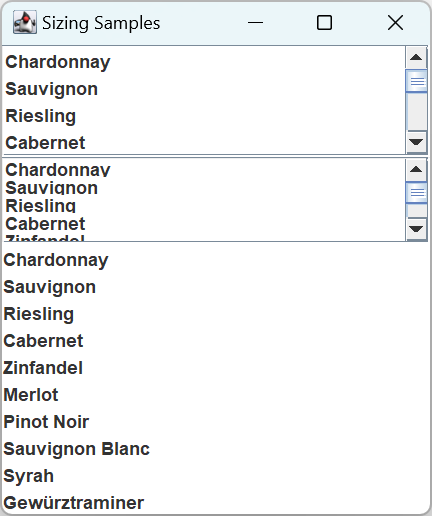
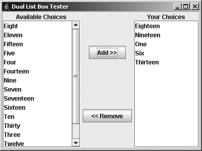
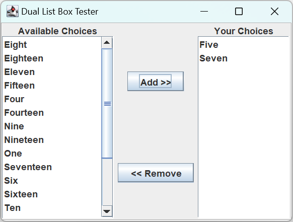

# JList

- [JList](#jlist)
  - [简介](#简介)
  - [创建 JList](#创建-jlist)
  - [JList 属性](#jlist-属性)
  - [滚动 JList](#滚动-jlist)
  - [渲染 JList 元素](#渲染-jlist-元素)
    - [更复杂的 ListCellRenderer 实现](#更复杂的-listcellrenderer-实现)
  - [选择 JList 元素](#选择-jlist-元素)
    - [ListSelectionModel 接口和 DefaultListSelectionModel 类](#listselectionmodel-接口和-defaultlistselectionmodel-类)
    - [ListSelectionListener](#listselectionlistener)
    - [手动选择 JList 事件](#手动选择-jlist-事件)
  - [显示多个 columns](#显示多个-columns)
  - [自定义 JList Laf](#自定义-jlist-laf)
  - [示例：Dual List](#示例dual-list)
  - [添加 Tooltip](#添加-tooltip)
  - [参考](#参考)

2021-11-25, 09:29⭐
***

## 简介

`JList` 组件提供从一组选项中单选和多选的功能。`JList` 结构特征有三点：

- 数据模型 `ListModel` 用于保存数据
- `ListCellRenderer` 用于渲染列表 cell
- `ListSelectionModel` 用于元素选择模型

## 创建 JList

`JList` 提供了 4 个构造函数：

- 创建空的 `JList`，只读模型

```java
public JList()
```

- 创建包含指定元素的 `JList`，只读模型

```java
public JList(final E[] listData)
```

- 以指定数据创建 `JList`，只读模型

```java
public JList(final Vector<? extends E> listData)
```

- 以指定 `ListModel` 创建 `JList`，其它构造函数都是在此基础上构造的

```java
public JList(ListModel<E> dataModel)
```

说明：

- 如果使用无参构造函数，则可以稍后填充数据。
- 使用数组或 `Vector` 初始化 `JList`，构造函数隐式创建一个默认的 `ListModel`，该模型是 **immutable** 的，即不可以添加、删除或替换列表中的元素。
- 如果要创建可修改的模型，可以设置 mutable list model 类，如 `DefaultListModel`。在初始化 `JList` 时或调用 `setModel` 方法可以设置模型。


该构造函数将列表注册到 `ToolTipManager`，所以可以给 cell 提供 tooltips 功能。

## JList 属性

|属性|类型|权限|
|---|---|---|
|`accessibleContext`|AccessibleContext|Read-only|
|`anchorSelectionIndex`|int|Read-only|
|`cellRenderer`|ListCellRenderer|Read-write bound|
|`dragEnabled`|boolean|Read-write|
|`firstVisibleIndex`|int|Read-only|
|`fixedCellHeight`|int|Read-write bound|
|`fixedCellWidth`|int|Read-write bound|
|lastVisibleIndex|int|Read-only|
|layoutOrientation|int|Read-write bound|
|leadSelectionIndex|int|Read-only|
|listData|Vector|Write-only|
|listSelectionListeners|ListSelectionListener[]|Read-only|
|maxSelectionIndex|int|Read-only|
|minSelectionIndex|int|Read-only|
|model|ListModel|Read-write bound|
|`preferredScrollableViewportSize`|`Dimension`|Read-only|
|`prototypeCellValue`|`Object`|Read-write bound|
|scrollableTracksViewportHeight|boolean|Read-only|
|scrollableTracksViewportWidth|boolean|Read-only|
|selectedIndex|int|Read-write|
|selectedIndices|int[]|Read-write|
|selectedValue|Object|Read-only|
|selectedValues|Object[]|Read-only|
|selectionBackground|Color|Read-write bound|
|selectionEmpty|boolean|Read-only|
|selectionForeground|Color|Read-write bound|
|selectionMode|int|Read-write|
|selectionModel|ListSelectionModel|Read-write bound|
|UI|ListUI|Read-write|
|UIClassID|String|Read-only|
|valueIsAdjusting|boolean|Read-write|
|visibleRowCount|int|Read-write bound|

`JList` 的大多属性与选择有关。例如，`anchorSelectionIndex`, `leadSelectionIndex`, `maxSelectionIndex`, `minSelectionIndex`, `selectedIndex` 和 `selectedIndices` `处理所选行的索引；selectedValue` 和 `selectedValues` 与所选元素的内容有关。

`anchorSelectionIndex` 是 `ListDataEvent` 最近的 `index0` 值；`leadSelectionIndex` 是最近的 `index1` 值。

`visibleRowCount` 属性控制限制的 row 数目，默认为 8。

## 滚动 JList

使用 `JList` 时，如果希望允许用户从所有可选项中选择，则必须将 `JList` 放在 `JScrollPane` 中。如果不将 JList 放在 `JScrollPane`，且默认显示的 rows 数小于数据个数，或没有足够空间，则无法显示余下选项。

> 实现 `Scrollable` 接口的组件，都推荐放在 `JScrollPane` 中。

`JScrollPane` 通过 `preferredScrollableViewportSize` 属性确定尺寸：

- 当 JList 的数据模型为空，每个 row 默认尺寸为高 16 pixels，宽 256 pixels
- 否则遍历所有数据，宽度设置为最宽的 cell 的宽度，高度为第一个 cell 的高度

可以通过设置 `prototypeCellValue` 属性定义原型 cell 来加快 `JScrollPane` 调整大小过程。你必须确保原型 cell 的 toString() 值足够宽和高，以容纳 `JList` 的所有内容。`JScrollPane` 根据原型确定其 viewport 大小，不需要遍历所有数据。

也可以通过设置 `fixedCellHeight` 和 `fixedCellWidth` 属性分配大小来提高性能。设置这两个属性也能避免 JList 遍历所有数据来确定 cell 尺寸，是让 JList 确定 viewport 最快的方式，但也最不灵活。因此它不会根据内容调整 cell 大小。但是，如果数据模型中有大量选项，那么损失这种灵活性来提高性能是值得的。

**示例：** 调整尺寸策略

- 中间的 `JList` 包含 1000 个固定大小的 cells
- 顶部的 `JList` 的使用 `setVisibleRowCount()` 设置可见 row 数
- 下面的 `JList` 也用 `setVisibleRowCount()` 设置可选 row 数，但是 `JList` 没放在 `JScrollPane` 中，因此设置无效

```java
import javax.swing.*;
import java.awt.*;

public class SizingSamples {
    public static void main(String[] args) {
        Runnable runner = () -> {
            String labels[] = {"Chardonnay", "Sauvignon", "Riesling", "Cabernet",
                    "Zinfandel", "Merlot", "Pinot Noir", "Sauvignon Blanc", "Syrah",
                    "Gewürztraminer"};
            JFrame frame = new JFrame("Sizing Samples");
            frame.setDefaultCloseOperation(JFrame.EXIT_ON_CLOSE);

            JList jlist1 = new JList(labels);
            jlist1.setVisibleRowCount(4);
            JScrollPane scrollPane1 = new JScrollPane(jlist1);
            frame.add(scrollPane1, BorderLayout.NORTH);

            DefaultListModel model = new DefaultListModel();
            model.ensureCapacity(1000);
            for (int i = 0; i < 100; i++) {
                for (int j = 0; j < 10; j++) {
                    model.addElement(labels[j]);
                }
            }
            JList jlist2 = new JList(model);
            jlist2.setVisibleRowCount(4);
            jlist2.setFixedCellHeight(12);
            jlist2.setFixedCellWidth(200);
            JScrollPane scrollPane2 = new JScrollPane(jlist2);
            frame.add(scrollPane2, BorderLayout.CENTER);

            JList jlist3 = new JList(labels);
            jlist3.setVisibleRowCount(4);
            frame.add(jlist3, BorderLayout.SOUTH);
            frame.setSize(300, 350);
            frame.setVisible(true);
        };

        EventQueue.invokeLater(runner);
    }
}
```



除了将 `JList` 放在 `JScrollPane` 中，还可以设置哪些选项可见，或者使特定元素可见：

- `firstVisibleIndex` 和 `lastVisibleIndex` 属性设置 `JScrollPane` 中当前可见选项，如果都不可见，两个方法都返回 -1，通常是因为数据模型为空；
- `ensureIndexIsVisible(int index)` 使特定元素可见，例如，以编程方式将列表移到顶部

```java
jlist.ensureIndexIsVisible(0);
```

## 渲染 JList 元素

`JList` 中的每个元素称为 cell。每个 `JList` 都有一个 `ListCellRenderer`，在需要时绘制列表中的 cell。默认 renderer 实现为 `DefaultListCellRenderer`，它是 `JLabel` 子类，因此可以设置 icon 和 text。这足以满足大多数用户的需求。

由于每个 `JList` 只能有一个 `ListCellRenderer`，因此自定义 renderer 意味着替换默认的 `DefaultListCellRenderer`。

`ListCellRenderer` 接口十分简单：

```java
public interface ListCellRenderer<E>{

    Component getListCellRendererComponent(
        JList<? extends E> list,
        E value,
        int index,
        boolean isSelected,
        boolean cellHasFocus);
}
```

在需要绘制 cell 时将调用该接口的唯一方法。返回的 `Component` 为 `JList` 的单元格提供特定的渲染。

- `value` 为数据模型在 `index` 位置的值
- `isSelected` 和 `cellHasFocus` 用于辅助定制 cell 外观，如突出显示选择的和持有焦点的 cell

自定义 cell-render 的步骤：

- 实现 `ListCellRenderer` 接口
- 调用 `setCellRenderer` 设置

**示例：** 自定义 cell-renderer

该 renderer 与 `DefaultListCellRenderer` 的唯一不同，持有焦点的 cell 有一个标题边框。

```java
import javax.swing.*;
import javax.swing.border.Border;
import javax.swing.border.EmptyBorder;
import javax.swing.border.LineBorder;
import javax.swing.border.TitledBorder;
import java.awt.*;

public class FocusedTitleListCellRenderer implements ListCellRenderer {

    protected static Border noFocusBorder =
            new EmptyBorder(15, 1, 1, 1);
    protected static TitledBorder focusBorder =
            new TitledBorder(LineBorder.createGrayLineBorder(), "Focused");
    protected DefaultListCellRenderer defaultRenderer = new DefaultListCellRenderer();

    public String getTitle() {
        return focusBorder.getTitle();
    }

    public void setTitle(String newValue) {
        focusBorder.setTitle(newValue);
    }

    public Component getListCellRendererComponent(JList list, Object value, int index,
            boolean isSelected, boolean cellHasFocus) {
        JLabel renderer = (JLabel) defaultRenderer.getListCellRendererComponent(
                list, value, index, isSelected, cellHasFocus);
        renderer.setBorder(cellHasFocus ? focusBorder : noFocusBorder);
        return renderer;
    }
}
```

!!! note
    出于性能考虑，最好不要在 `getListCellRendererComponent()` 中创建组件。建议创建一个类变量持有 `Component`，在需要时返回。

!!! attention
    自定义 cell-renderer 一个常见错误，是忘记将 renderer 组件设置 opaque。导致没有渲染 renderer 的背景，因此显示的是 list 的背景。使用 `DefaultListCellRenderer` 类，渲染组件已经设置 opaque。

**示例：** 演示上例创建的 cell-renderer

```java
import javax.swing.*;
import java.awt.*;

public class CustomBorderSample {
    public static void main(String[] args) {
        Runnable runner = () -> {
            String[] labels = {"Chardonnay", "Sauvignon", "Riesling", "Cabernet",
                    "Zinfandel", "Merlot", "Pinot Noir", "Sauvignon Blanc", "Syrah",
                    "Gewürztraminer"};
            JFrame frame = new JFrame("Custom Border");
            frame.setDefaultCloseOperation(JFrame.EXIT_ON_CLOSE);

            JList jlist = new JList(labels);
            ListCellRenderer renderer = new FocusedTitleListCellRenderer();
            jlist.setCellRenderer(renderer);

            JScrollPane sp = new JScrollPane(jlist);
            frame.add(sp, BorderLayout.CENTER);
            frame.setSize(300, 200);
            frame.setVisible(true);
        };
        EventQueue.invokeLater(runner);
    }
}
```


### 更复杂的 ListCellRenderer 实现

当数据模型中的数据较复杂时，自定义 cell-renderer 是必要的。

**示例：** 自定义 cell-renderer

数据模型的元素包括 font、foreground-color、icon, text。

下面通过定制 `DefaultListCellRenderer` 返回的组件来实现新的 cell-renderer。

```java
import javax.swing.*;
import java.awt.*;

public class ComplexCellRenderer implements ListCellRenderer {

    protected DefaultListCellRenderer defaultRenderer = new DefaultListCellRenderer();

    public Component getListCellRendererComponent(JList list, Object value, int index,
            boolean isSelected, boolean cellHasFocus) {
        Font theFont = null;
        Color theForeground = null;
        Icon theIcon = null;
        String theText = null;

        JLabel renderer = (JLabel) defaultRenderer.getListCellRendererComponent(
                list, value, index, isSelected, cellHasFocus);

        if (value instanceof Object[]) {
            Object values[] = (Object[]) value;
            theFont = (Font) values[0];
            theForeground = (Color) values[1];
            theIcon = (Icon) values[2];
            theText = (String) values[3];
        } else {
            theFont = list.getFont();
            theForeground = list.getForeground();
            theText = "";
        }
        if (!isSelected) {
            renderer.setForeground(theForeground);
        }
        if (theIcon != null) {
            renderer.setIcon(theIcon);
        }
        renderer.setText(theText);
        renderer.setFont(theFont);
        return renderer;
    }
} 
```

使用：

```java
import javax.swing.*;
import java.awt.*;

public class ComplexRenderingSample {

    public static void main(String[] args) {
        Runnable runner = () -> {
            Object[][] elements = {
                    {new Font("Helvetica", Font.PLAIN, 20), Color.RED,
                            new DiamondIcon(Color.BLUE), "Help"},
                    {new Font("TimesRoman", Font.BOLD, 14), Color.BLUE,
                            new DiamondIcon(Color.GREEN), "Me"},
                    {new Font("Courier", Font.ITALIC, 18), Color.GREEN,
                            new DiamondIcon(Color.BLACK), "I'm"},
                    {new Font("Helvetica", Font.BOLD | Font.ITALIC, 12), Color.GRAY,
                            new DiamondIcon(Color.MAGENTA), "Trapped"},
                    {new Font("TimesRoman", Font.PLAIN, 32), Color.PINK,
                            new DiamondIcon(Color.YELLOW), "Inside"},
                    {new Font("Courier", Font.BOLD, 16), Color.YELLOW,
                            new DiamondIcon(Color.RED), "This"},
                    {new Font("Helvetica", Font.ITALIC, 8), Color.DARK_GRAY,
                            new DiamondIcon(Color.PINK), "Computer"}
            };

            JFrame frame = new JFrame("Complex Renderer");
            frame.setDefaultCloseOperation(JFrame.EXIT_ON_CLOSE);

            JList jlist = new JList(elements);
            ListCellRenderer renderer = new ComplexCellRenderer();
            jlist.setCellRenderer(renderer);
            JScrollPane scrollPane = new JScrollPane(jlist);
            frame.add(scrollPane, BorderLayout.CENTER);

            JComboBox comboBox = new JComboBox(elements);
            comboBox.setRenderer(renderer);
            frame.add(comboBox, BorderLayout.NORTH);

            frame.setSize(300, 200);
            frame.setVisible(true);
        };
        EventQueue.invokeLater(runner);
    }
}
```


!!! tip
    创建自定义 renderer 组件时，最好从 DefaultListCellRenderer 开始。这样可以专注于感兴趣的细节，其它内容由 DefaultListCellRenderer 处理。

## 选择 JList 元素

`JList` 默认为多选模式。当然，如何选择多个元素取决于 Laf，多数以 Ctrl+点击多选，Shift+点击范围选择。

### ListSelectionModel 接口和 DefaultListSelectionModel 类

`ListSelectionModel` 接口实现 `JList` 的选择机制。其定义包括：

- 定义选择模式的常量
- 不同选择方式
- 管理 `ListSelectionListener`

```java
public interface ListSelectionModel{

    // 选择模式
    int SINGLE_SELECTION = 0;
    int SINGLE_INTERVAL_SELECTION = 1;
    int MULTIPLE_INTERVAL_SELECTION = 2;

    // 不同选择方法
    void setSelectionInterval(int index0, int index1);
    void addSelectionInterval(int index0, int index1);

    void removeSelectionInterval(int index0, int index1);

    int getMinSelectionIndex();
    int getMaxSelectionIndex();

    boolean isSelectedIndex(int index);

    int getAnchorSelectionIndex();
    void setAnchorSelectionIndex(int index);

    int getLeadSelectionIndex();
    void setLeadSelectionIndex(int index);

    void clearSelection();
    boolean isSelectionEmpty();

    void insertIndexInterval(int index, int length, boolean before);

    void removeIndexInterval(int index0, int index1);

    void setValueIsAdjusting(boolean valueIsAdjusting);
    boolean getValueIsAdjusting();

    void setSelectionMode(int selectionMode);
    int getSelectionMode();

    // listeners
    void addListSelectionListener(ListSelectionListener x);
    void removeListSelectionListener(ListSelectionListener x);

    default int[] getSelectedIndices() {
        int iMin = getMinSelectionIndex();
        int iMax = getMaxSelectionIndex();

        if ((iMin < 0) || (iMax < 0)) {
            return new int[0];
        }

        int[] rvTmp = new int[1+ (iMax - iMin)];
        int n = 0;
        for(int i = iMin; i <= iMax; i++) {
            if (isSelectedIndex(i)) {
                rvTmp[n++] = i;
            }
        }
        int[] rv = new int[n];
        System.arraycopy(rvTmp, 0, rv, 0, n);
        return rv;
    }

    default int getSelectedItemsCount() {
        int iMin = getMinSelectionIndex();
        int iMax = getMaxSelectionIndex();
        int count = 0;

        for(int i = iMin; i <= iMax; i++) {
            if (isSelectedIndex(i)) {
                count++;
            }
        }
        return count;
    }
}
```

|选择模式|说明|
|---|---|
|`SINGLE_SELECTION`|单选|
|`SINGLE_INTERVAL_SELECTION`|单个连续范围选择|
|`MULTIPLE_INTERVAL_SELECTION`|任意范围选择，默认|

如下图所示：


调用 `setSelectionMode` 设置选择模式：

```java
JList list = new JList(...);
list.setSelectionMode(ListSelectionModel.SINGLE_SELECTION);
```

`DefaultListSelectionModel` 是 `ListSelectionModel` 的默认实现。通过如下 9 个属性可以了解当前选择范围。

|属性|类型|权限|
|---|---|---|
|anchorSelectionIndex|int|Read-write|
|leadAnchorNotificationEnabled|boolean|Read-write|
|leadSelectionIndex|int|Read-write|
|listSelectionListeners|ListSelectionListener[]|Read-only|
|maxSelectionIndex|int|Read-only|
|minSelectionIndex|int|Read-only|
|selectionEmpty|boolean|Read-only|
|selectionMode|int|Read-write|
|valueIsAdjusting|boolean|Read-write|

### ListSelectionListener

如果需要监听 `JList` 的选择事件，需要为 `JList` 或 `ListSelectionModel` 添加 `ListSelectionListener`。`JList` 的 `addListSelectionListener()` 和 `removeListenerListener()` 也是委托给底层的 `ListSelectionModel`。

当选择的元素发生变化，注册的 listeners 受到通知。其定义如下：

```java
public interface ListSelectionListener extends EventListener{
    void valueChanged(ListSelectionEvent e);
}
```

`ListSelectionEvent` 包含受选择影响的元素范围，以及选择是否仍在变化。当用户仍在修改所选元素，valueIsAdjusting 为 true。对昂贵操作，如绘制高分辨率的图形，此时可能希望延迟操作。因此，在 valueIsAdjusting 为 false 时执行操作，例如：

```java
public void valueChanged(ListSelectionEvent e) {
    if (e.getValueIsAdjusting() == false) {

        if (list.getSelectedIndex() == -1) {
        //No selection, disable fire button.
            fireButton.setEnabled(false);

        } else {
        //Selection, enable the fire button.
            fireButton.setEnabled(true);
        }
    }
}
```

ListSelectionEvent 属性：

|属性|类型|权限|
|---|---|---|
|firstIndex|int|Read-only|
|lastIndex|int|Read-only|
|valueIsAdjusting|boolean|Read-only|

**示例：** JList 中选择事件

```java
import javax.swing.*;
import javax.swing.event.ListSelectionListener;
import java.awt.*;
import java.awt.event.MouseAdapter;
import java.awt.event.MouseEvent;
import java.awt.event.MouseListener;
import java.io.PrintWriter;
import java.io.StringWriter;

public class SelectingJListSample {

    public static void main(String[] args) {
        Runnable runner = () -> {
            String[] labels = {"Chardonnay", "Sauvignon", "Riesling", "Cabernet",
                    "Zinfandel", "Merlot", "Pinot Noir", "Sauvignon Blanc", "Syrah",
                    "Gewürztraminer"};
            JFrame frame = new JFrame("Selecting JList");
            frame.setDefaultCloseOperation(JFrame.EXIT_ON_CLOSE);

            JList<String> jlist = new JList<>(labels);
            JScrollPane scrollPane1 = new JScrollPane(jlist);
            frame.add(scrollPane1, BorderLayout.WEST);

            final JTextArea textArea = new JTextArea();
            textArea.setEditable(false);
            JScrollPane scrollPane2 = new JScrollPane(textArea);
            frame.add(scrollPane2, BorderLayout.CENTER);

            ListSelectionListener listSelectionListener = listSelectionEvent -> {
                StringWriter sw = new StringWriter();
                PrintWriter pw = new PrintWriter(sw);
                pw.print("First index: " + listSelectionEvent.getFirstIndex());
                pw.print(", Last index: " + listSelectionEvent.getLastIndex());
                boolean adjust = listSelectionEvent.getValueIsAdjusting();
                pw.println(", Adjusting? " + adjust);
                if (!adjust) {
                    JList list = (JList) listSelectionEvent.getSource();
                    int selections[] = list.getSelectedIndices();
                    Object selectionValues[] = list.getSelectedValues();
                    for (int i = 0, n = selections.length; i < n; i++) {
                        if (i == 0) {
                            pw.print("  Selections: ");
                        }
                        pw.print(selections[i] + "/" + selectionValues[i] + " ");
                    }
                    pw.println();
                }
                textArea.append(sw.toString());
            };
            jlist.addListSelectionListener(listSelectionListener);

            frame.setSize(350, 200);
            frame.setVisible(true);
        };
        EventQueue.invokeLater(runner);
    }
}
```


!!! note
    如果知道 JList 是单选模式，可以直接用 selectedIndex 或 selectedValue 属性获得当前选项。

说明：

- 在用鼠标选择时：鼠标按下，`getValueIsAdjusting` 为 true，松开，变化为 false。
- 上例仅在 valueIsAdjusting 为 false 时输出所选元素，否则仅报告选择范围
- 通过 getSelectedIndices 和 getSelectedValues 获得所需元素的有序列表

JList 中对鼠标双击事件没有特殊支持，如果对其感兴趣，则需要注册对应事件。例如，将下面代码添加到上例中：

```java
MouseListener mouseListener = new MouseAdapter() {
    public void mouseClicked(MouseEvent mouseEvent) {
        JList theList = (JList) mouseEvent.getSource();
        if (mouseEvent.getClickCount() == 2) {
            int index = theList.locationToIndex(mouseEvent.getPoint());
            if (index >= 0) {
                Object o = theList.getModel().getElementAt(index);
                textArea.append("Double-clicked on: " + o.toString());
                textArea.append(System.getProperty("line.separator"));
            }
        }
    }
};
jlist.addMouseListener(mouseListener);
```

这里的关键方法是 JList 的 public int locationToIndex(Point location)，该方法将屏幕坐标映射到 JList 元素位置。

JList 还提供了  `public Point indexToLocation(int index)`，具有相反行为。

### 手动选择 JList 事件

除了检测用户选择列表元素，也可以通过编程方式进行选择。通过编程方式进行的选择，也会通知注册的 `ListSelectionListener`，下面是常用的选择方法：

- 单选

```java
public void setSelectedValue(Object element, boolean shouldScroll)
```

选择第一个匹配 element 的元素。如果 element 之前没有被选中，则先取消之前所选元素。

- 范围选择

```java
public void setSelectedInterval(int index0, int index1)
```

- 在已有选项的基础上继续添加选项

```java
public void addSelectedInterval(int index0, int index1)
```

- 清除选择

```java
public void clearSelection()
```

- 清除指定范围的选择

```java
public void removeSelectedInterval(int index0, int index1)
```

## 显示多个 columns

使用 JList，通常单列显示。不过 JList 还是提供了多列显示功能。通过调用 `setLayoutOrientation` 可以让列表多列显示:

- `JList.HORIZONTAL_WRAP` 先填充行，填满后再换行；
- `JList.VERTICAL_WRAP` 先填充列，填满后换列；
- `JList.VERTICAL` 单列显示，默认选项。

数据模型按字母顺序，不同模式的效果：


使用 `visibleRowCount` 属性控制 row 数。否则根据 `JList` 宽度决定 `HORIZONTAL_WRAP` 的行数和 `VERTICAL_WRAP` 的高度。调用 `setVisibleRowCount(-1)` 使得 `JList` 尽可能多显示项目。

## 自定义 JList Laf

每个 Swing Laf 都为 JList 提供了不同的外观和一组 `UIResource` 设置。

JList 中可用的 `UIResource` 相关属性如下表所示。

|属性|类型|
|---|---|
|List.actionMap|ActionMap|
|List.background|Color|
|List.border|Border|
|List.cellHeight|Integer|
|List.cellRenderer|ListCellRenderer|
|List.focusCellHighlightBorder|Border|
|List.focusInputMap|InputMap|
|List.focusInputMap.RightToLeft|InputMap|
|List.font|Font|
|List.foreground|Color|
|List.lockToPositionOnScroll|Boolean|
|List.rendererUseListColors|Boolean|
|List.rendererUseUIBorder|Boolean|
|List.selectionBackground|Color|
|List.selectionForeground|Color|
|List.timeFactor|Long|
|ListUI|String|

大多数 `UIResource` 属性的含义不言自明。

JList 默认自带键盘选择行为，即在键入时，JList 将找到与目前键入内容匹配的 items。该行为通过 `public int getNextMatch(String prefix, int startIndex, Position.Bias bias)` 方法实现。`List.timeFactor` 指定延迟毫秒（默认 1000），只要按键之间的延迟不超过该值，就将新键添加到原来的输入。一旦超出该与之，搜索字符串被重置。

## 示例：Dual List

下面创建一个名为 `DualListBox` 的 Swing 组件。DualListBox 创建两个 JList，一个包含可选项，一个包含所选项。

当可选项列表非常大时，这个组件非常有用。图示：



操作：

- 通过 `DualListBox sdual = new DualListBox()` 创建 `DualListBox`
- 通过 `setSourceElements()` 或 `addSourceElements()` 填充数据
- `destinationIterator()` 查询所选元素

另外还支持设置：

- 包含可选项部分的标题
- 所选项部分的标题
- list-cell-renderer
- visible row count
- 前景和背景色

**实现：** `SortedListModel`，采用 TreeSet 实现排序

```java
import javax.swing.*;
import java.util.*;

public class SortedListModel extends AbstractListModel {

    SortedSet<Object> model;

    public SortedListModel() {
        model = new TreeSet<Object>();
    }

    public int getSize() {
        return model.size();
    }

    public Object getElementAt(int index) {
        return model.toArray()[index];
    }

    public void add(Object element) {
        if (model.add(element)) {
            fireContentsChanged(this, 0, getSize());
        }
    }

    public void addAll(Object elements[]) {
        Collection<Object> c = Arrays.asList(elements);
        model.addAll(c);
        fireContentsChanged(this, 0, getSize());
    }

    public void clear() {
        model.clear();
        fireContentsChanged(this, 0, getSize());
    }

    public boolean contains(Object element) {
        return model.contains(element);
    }

    public Object firstElement() {
        return model.first();
    }

    public Iterator iterator() {
        return model.iterator();
    }

    public Object lastElement() {
        return model.last();
    }

    public boolean removeElement(Object element) {
        boolean removed = model.remove(element);
        if (removed) {
            fireContentsChanged(this, 0, getSize());
        }
        return removed;
    }
}
```

```java
import javax.swing.*;
import java.awt.*;
import java.awt.event.ActionEvent;
import java.awt.event.ActionListener;
import java.util.Iterator;

public class DualListBox extends JPanel {

    private static final Insets EMPTY_INSETS = new Insets(0, 0, 0, 0);
    private static final String ADD_BUTTON_LABEL = "Add >>";
    private static final String REMOVE_BUTTON_LABEL = "<< Remove";
    private static final String DEFAULT_SOURCE_CHOICE_LABEL =
            "Available Choices";
    private static final String DEFAULT_DEST_CHOICE_LABEL =
            "Your Choices";
    private JLabel sourceLabel;
    private JList sourceList;
    private SortedListModel sourceListModel;
    private JList destList;
    private SortedListModel destListModel;
    private JLabel destLabel;
    private JButton addButton;
    private JButton removeButton;

    public DualListBox() {
        initScreen();
    }

    public String getSourceChoicesTitle() {
        return sourceLabel.getText();
    }

    public void setSourceChoicesTitle(String newValue) {
        sourceLabel.setText(newValue);
    }

    public String getDestinationChoicesTitle() {
        return destLabel.getText();
    }

    public void setDestinationChoicesTitle(String newValue) {
        destLabel.setText(newValue);
    }

    public void clearSourceListModel() {
        sourceListModel.clear();
    }

    public void clearDestinationListModel() {
        destListModel.clear();
    }

    public void addSourceElements(ListModel newValue) {
        fillListModel(sourceListModel, newValue);
    }

    public void setSourceElements(ListModel newValue) {
        clearSourceListModel();
        addSourceElements(newValue);
    }

    public void addDestinationElements(ListModel newValue) {
        fillListModel(destListModel, newValue);
    }

    private void fillListModel(SortedListModel model, ListModel newValues) {
        int size = newValues.getSize();
        for (int i = 0; i < size; i++) {
            model.add(newValues.getElementAt(i));
        }
    }

    public void addSourceElements(Object newValue[]) {
        fillListModel(sourceListModel, newValue);
    }

    public void setSourceElements(Object newValue[]) {
        clearSourceListModel();
        addSourceElements(newValue);
    }

    public void addDestinationElements(Object newValue[]) {
        fillListModel(destListModel, newValue);
    }

    private void fillListModel(SortedListModel model, Object newValues[]) {
        model.addAll(newValues);
    }

    public Iterator sourceIterator() {
        return sourceListModel.iterator();
    }

    public Iterator destinationIterator() {
        return destListModel.iterator();
    }

    public void setSourceCellRenderer(ListCellRenderer newValue) {
        sourceList.setCellRenderer(newValue);
    }

    public ListCellRenderer getSourceCellRenderer() {
        return sourceList.getCellRenderer();
    }

    public void setDestinationCellRenderer(ListCellRenderer newValue) {
        destList.setCellRenderer(newValue);
    }

    public ListCellRenderer getDestinationCellRenderer() {
        return destList.getCellRenderer();
    }

    public void setVisibleRowCount(int newValue) {
        sourceList.setVisibleRowCount(newValue);
        destList.setVisibleRowCount(newValue);
    }

    public int getVisibleRowCount() {
        return sourceList.getVisibleRowCount();
    }

    public void setSelectionBackground(Color newValue) {
        sourceList.setSelectionBackground(newValue);
        destList.setSelectionBackground(newValue);
    }

    public Color getSelectionBackground() {
        return sourceList.getSelectionBackground();
    }

    public void setSelectionForeground(Color newValue) {
        sourceList.setSelectionForeground(newValue);
        destList.setSelectionForeground(newValue);
    }

    public Color getSelectionForeground() {
        return sourceList.getSelectionForeground();
    }

    private void clearSourceSelected() {
        Object selected[] = sourceList.getSelectedValues();
        for (int i = selected.length - 1; i >= 0; --i) {
            sourceListModel.removeElement(selected[i]);
        }
        sourceList.getSelectionModel().clearSelection();
    }

    private void clearDestinationSelected() {
        Object selected[] = destList.getSelectedValues();
        for (int i = selected.length - 1; i >= 0; --i) {
            destListModel.removeElement(selected[i]);
        }
        destList.getSelectionModel().clearSelection();
    }

    private void initScreen() {
        setBorder(BorderFactory.createEtchedBorder());
        setLayout(new GridBagLayout());
        sourceLabel = new JLabel(DEFAULT_SOURCE_CHOICE_LABEL);
        sourceListModel = new SortedListModel();
        sourceList = new JList(sourceListModel);
        add(sourceLabel,
                new GridBagConstraints(0, 0, 1, 1, 0, 0, GridBagConstraints.CENTER,
                        GridBagConstraints.NONE, EMPTY_INSETS, 0, 0));
        add(new JScrollPane(sourceList),
                new GridBagConstraints(0, 1, 1, 5, .5, 1, GridBagConstraints.CENTER,
                        GridBagConstraints.BOTH, EMPTY_INSETS, 0, 0));

        addButton = new JButton(ADD_BUTTON_LABEL);
        add(addButton,
                new GridBagConstraints(1, 2, 1, 2, 0, .25, GridBagConstraints.CENTER,
                        GridBagConstraints.NONE, EMPTY_INSETS, 0, 0));
        addButton.addActionListener(new AddListener());
        removeButton = new JButton(REMOVE_BUTTON_LABEL);
        add(removeButton,
                new GridBagConstraints(1, 4, 1, 2, 0, .25, GridBagConstraints.CENTER,
                        GridBagConstraints.NONE, new Insets(0, 5, 0, 5), 0, 0));
        removeButton.addActionListener(new RemoveListener());

        destLabel = new JLabel(DEFAULT_DEST_CHOICE_LABEL);
        destListModel = new SortedListModel();
        destList = new JList(destListModel);
        add(destLabel,
                new GridBagConstraints(2, 0, 1, 1, 0, 0, GridBagConstraints.CENTER,
                        GridBagConstraints.NONE, EMPTY_INSETS, 0, 0));
        add(new JScrollPane(destList),
                new GridBagConstraints(2, 1, 1, 5, .5, 1.0, GridBagConstraints.CENTER,
                        GridBagConstraints.BOTH, EMPTY_INSETS, 0, 0));
    }

    private class AddListener implements ActionListener {

        public void actionPerformed(ActionEvent e) {
            Object selected[] = sourceList.getSelectedValues();
            addDestinationElements(selected);
            clearSourceSelected();
        }
    }

    private class RemoveListener implements ActionListener {

        public void actionPerformed(ActionEvent e) {
            Object selected[] = destList.getSelectedValues();
            addSourceElements(selected);
            clearDestinationSelected();
        }
    }

    public static void main(String args[]) {
        Runnable runner = new Runnable() {
            public void run() {
                JFrame frame = new JFrame("Dual List Box Tester");
                frame.setDefaultCloseOperation(JFrame.EXIT_ON_CLOSE);
                DualListBox dual = new DualListBox();
                dual.addSourceElements(
                        new String[]{"One", "Two", "Three"});
                dual.addSourceElements(
                        new String[]{"Four", "Five", "Six"});
                dual.addSourceElements(
                        new String[]{"Seven", "Eight", "Nine"});
                dual.addSourceElements(
                        new String[]{"Ten", "Eleven", "Twelve"});
                dual.addSourceElements(
                        new String[]{"Thirteen", "Fourteen", "Fifteen"});
                dual.addSourceElements(
                        new String[]{"Sixteen", "Seventeen", "Eighteen"});
                dual.addSourceElements(
                        new String[]{"Nineteen", "Twenty", "Thirty"});
                frame.add(dual, BorderLayout.CENTER);
                frame.setSize(400, 300);
                frame.setVisible(true);
            }
        };
        EventQueue.invokeLater(runner);
    }
}
```



## 添加 Tooltip

所有 Swing 组件都支持 tooltip。通过 Component 的 `setToolTipText()` 可以在组件上显示单个文本字符串。对 JList, JTree 或 JTable 这类复合组件，单个 tooltip 可能时不够的。如何为 JList 的每个元素显示 tooltip。

要在每个 item 上显示 tooltip，需要创建 JList 的子类，然后在子类中使用 `ToolTipManager` 手动注册 tooltip。如下所示：

```java
ToolTipManager.sharedInstance().registerComponent(this);
```

当鼠标移动到组件上，`ToolTipManager` 会通知组件。通过覆盖 JList 的 `getToolTipText(MouseEvent mouseEvent)` 可以为鼠标下的 item 提供合适的 tooltip。

**示例：** 为鼠标下的元素提供 tooltip

```java
import javax.swing.*;
import java.awt.*;
import java.awt.event.MouseEvent;
import java.util.Enumeration;
import java.util.Properties;

public class PropertiesList extends JList {

    SortedListModel model;
    Properties tipProps;

    public PropertiesList(Properties props) {
        model = new SortedListModel();
        setModel(model);
        ToolTipManager.sharedInstance().registerComponent(this);

        tipProps = props;
        addProperties(props);
    }

    private void addProperties(Properties props) {
        // Load
        Enumeration names = props.propertyNames();
        while (names.hasMoreElements()) {
            model.add(names.nextElement());
        }
    }

    @Override
    public String getToolTipText(MouseEvent event) {
        Point p = event.getPoint();
        int location = locationToIndex(p);
        String key = (String) model.getElementAt(location);
        String tip = tipProps.getProperty(key);
        return tip;
    }

    public static void main(String args[]) {
        Runnable runner = () -> {
            JFrame frame = new JFrame("Custom Tip Demo");
            frame.setDefaultCloseOperation(JFrame.EXIT_ON_CLOSE);
            Properties props = System.getProperties();
            PropertiesList list = new PropertiesList(props);
            JScrollPane scrollPane = new JScrollPane(list);
            frame.add(scrollPane);
            frame.setSize(300, 300);
            frame.setVisible(true);
        };
        EventQueue.invokeLater(runner);
    }
}
```


## 参考

- https://docs.oracle.com/javase/tutorial/uiswing/components/list.html
