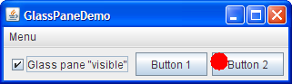

# JRootPane

- [JRootPane](#jrootpane)
  - [简介](#简介)
  - [Glass Pane](#glass-pane)
  - [Layered Pane](#layered-pane)
  - [参考](#参考)

2023-12-28, 16:46
***

## 简介

每个顶层容器都依赖于一个称为 root-pane 的中间容器。root-pane 负责管理 content-pane、菜单栏，以及其它几个容器。使用 Swing 组件通常不需要了解 root-pane。但是，如果需要拦截鼠标事件或绘制多个组件，就需要熟悉 root-pane。

下面是 root-pane 提供给 `JFrame` 以及其它顶层容器的组件列表：


content-pane 和可选的菜单栏不再赘述。root-pane 还添加了 layered-pane 和 glass-pane。即 root-pane 分为 4 部分：

**glass-pane**

glass-pane 默认隐藏。如果使 glass-pane 可见，它就像一块玻璃覆盖在 root-pane 其它部分上。它完全透明，除非你实现 glass-pane 的 `paintComponent` 方法。通常用于拦截 root-pane 的输入事件。

**layered-pane**

layered-pane 包含菜单栏和 content-pane，支持组件的 Z-order 排列。

**content-pane**

root-pane 的可见组件的容器，不包括菜单栏。

**menu-bar**

root-pane 的菜单。如果一个容器由菜单栏，通过使用容器的 `setJMenuBar` 将菜单栏放在适当的位置。

## Glass Pane

如果需要捕获事件，或在已经包含组件的区域上绘制，就可以采用 glass-pane。例如:

- 通过 glass-pane 拦截事件来停用多组件区域的鼠标事件
- 使用 glass-pane 在组件上面显示图像

例如，下面包含一个复选框，设置 glass-pane 是否可见，glass-pane 可见时，它会阻止所有输入事件到达 content-pane 的组件，并在鼠标按下的地方画一个红点：



操作：

1. 点击 Button1

按钮的外观会随之变化，显示它被点击。

2. 勾选 check-box，再点击 Button 1

由于 glass-pane 拦截了所有鼠标事件，因此按钮不会被单击。当你释放鼠标，glass-pane 上会画出一个红色圆圈。

3. 再次单击 check-box，隐藏 glass-pane

当 glass-pane 检测到 check-box 上的事件，它会将事件转发给 check-box。

下面是显示和隐藏 glass-pane 的代码。这个程序创建了自己的 glass-pane，但是，如果 glass-pane 不执行任何绘制，则可以使用 `getGlassPane` 返回的默认 glass-pane。

```java
myGlassPane = new MyGlassPane(...);
changeButton.addItemListener(myGlassPane);
frame.setGlassPane(myGlassPane);
...
class MyGlassPane extends JComponent
                  implements ItemListener {
    ...
    //React to change button clicks.
    public void itemStateChanged(ItemEvent e) {
        setVisible(e.getStateChange() == ItemEvent.SELECTED);
    }
...
}
```

下面实现 glass-pane 鼠标事件处理。如果 check-box 上发生鼠标事件，则 glass-pane 会重新调度该事件，使 check-box 能收到：

```java
...//In the implementation of the glass pane's mouse listener:
public void mouseMoved(MouseEvent e) {
    redispatchMouseEvent(e, false);
}

.../* The mouseDragged, mouseClicked, mouseEntered,
    * mouseExited, and mousePressed methods have the same
    * implementation as mouseMoved. */...

public void mouseReleased(MouseEvent e) {
    redispatchMouseEvent(e, true);
}

private void redispatchMouseEvent(MouseEvent e,
                                  boolean repaint) {
    Point glassPanePoint = e.getPoint();
    Container container = contentPane;
    Point containerPoint = SwingUtilities.convertPoint(
                                    glassPane,
                                    glassPanePoint,
                                    contentPane);

    if (containerPoint.y < 0) { //we're not in the content pane
        //Could have special code to handle mouse events over
        //the menu bar or non-system window decorations, such as
        //the ones provided by the Java look and feel.
    } else {
        //The mouse event is probably over the content pane.
        //Find out exactly which component it's over.
        Component component =
            SwingUtilities.getDeepestComponentAt(
                                    container,
                                    containerPoint.x,
                                    containerPoint.y);

        if ((component != null)
            && (component.equals(liveButton))) {
            //Forward events over the check box.
            Point componentPoint = SwingUtilities.convertPoint(
                                        glassPane,
                                        glassPanePoint,
                                        component);
            component.dispatchEvent(new MouseEvent(component,
                                                 e.getID(),
                                                 e.getWhen(),
                                                 e.getModifiers(),
                                                 componentPoint.x,
                                                 componentPoint.y,
                                                 e.getClickCount(),
                                                 e.isPopupTrigger()));
        }
    }

    //Update the glass pane if requested.
    if (repaint) {
        glassPane.setPoint(glassPanePoint);
        glassPane.repaint();
    }
}
```

下面是 MyGlassPane 中自定义绘制内容：

```java
protected void paintComponent(Graphics g) {
    if (point != null) {
        g.setColor(Color.red);
        g.fillOval(point.x - 10, point.y - 10, 20, 20);
    }
}
```

完整代码：

```java
import javax.swing.*;
import javax.swing.event.MouseInputAdapter;
import java.awt.*;
import java.awt.event.ItemEvent;
import java.awt.event.ItemListener;
import java.awt.event.MouseEvent;

public class GlassPaneDemo {

    static private MyGlassPane myGlassPane;

    private static void createAndShowGUI() {
        JFrame frame = new JFrame("GlassPaneDemo");
        frame.setDefaultCloseOperation(JFrame.EXIT_ON_CLOSE);

        JCheckBox changeButton = new JCheckBox("Glass pane \"visible\"");
        changeButton.setSelected(false);

        //Set up the content pane, where the "main GUI" lives.
        Container contentPane = frame.getContentPane();
        contentPane.setLayout(new FlowLayout());
        contentPane.add(changeButton);
        contentPane.add(new JButton("Button 1"));
        contentPane.add(new JButton("Button 2"));

        //Set up the menu bar, which appears above the content pane.
        JMenuBar menuBar = new JMenuBar();
        JMenu menu = new JMenu("Menu");
        menu.add(new JMenuItem("Do nothing"));
        menuBar.add(menu);
        frame.setJMenuBar(menuBar);

        // 设置 glass-pane，它在 menu-bar 和 content-pane 上方，item-listener
        myGlassPane = new MyGlassPane(changeButton, menuBar, frame.getContentPane());
        changeButton.addItemListener(myGlassPane);
        frame.setGlassPane(myGlassPane);

        frame.pack();
        frame.setVisible(true);
    }

    public static void main(String[] args) {
        SwingUtilities.invokeLater(GlassPaneDemo::createAndShowGUI);
    }
}

// 自定义 glass-pane，以实现自定义绘制
class MyGlassPane extends JComponent implements ItemListener {

    Point point;

    /**
     * @param aButton     check-box
     * @param menuBar     menu-bar
     * @param contentPane content-pane
     */
    public MyGlassPane(JCheckBox aButton, JMenuBar menuBar, Container contentPane) {
        CBListener listener = new CBListener(aButton, menuBar, this, contentPane);
        addMouseListener(listener);
        addMouseMotionListener(listener);
    }

    // 响应点击 check-box
    public void itemStateChanged(ItemEvent e) {
        setVisible(e.getStateChange() == ItemEvent.SELECTED);
    }

    // 在 glass-pane 上画个圆
    protected void paintComponent(Graphics g) {
        if (point != null) {
            g.setColor(Color.red);
            g.fillOval(point.x - 10, point.y - 10, 20, 20);
        }
    }

    // 画圆的位置
    public void setPoint(Point p) {
        point = p;
    }
}

// 监听所有 check-box 可能感兴趣的事件，并分配给 check-box
class CBListener extends MouseInputAdapter {

    Toolkit toolkit;
    JCheckBox liveButton;
    JMenuBar menuBar;
    MyGlassPane glassPane;
    Container contentPane;

    public CBListener(JCheckBox liveButton, JMenuBar menuBar,
            MyGlassPane glassPane, Container contentPane) {
        toolkit = Toolkit.getDefaultToolkit();
        this.liveButton = liveButton;
        this.menuBar = menuBar;
        this.glassPane = glassPane;
        this.contentPane = contentPane;
    }

    public void mouseMoved(MouseEvent e) {
        redispatchMouseEvent(e, false);
    }

    public void mouseDragged(MouseEvent e) {
        redispatchMouseEvent(e, false);
    }

    public void mouseClicked(MouseEvent e) {
        redispatchMouseEvent(e, false);
    }

    public void mouseEntered(MouseEvent e) {
        redispatchMouseEvent(e, false);
    }

    public void mouseExited(MouseEvent e) {
        redispatchMouseEvent(e, false);
    }

    public void mousePressed(MouseEvent e) {
        redispatchMouseEvent(e, false);
    }

    public void mouseReleased(MouseEvent e) {
        redispatchMouseEvent(e, true);
    }

    //A basic implementation of redispatching events.
    private void redispatchMouseEvent(MouseEvent e, boolean repaint) {
        Point glassPanePoint = e.getPoint();
        Container container = contentPane;
        Point containerPoint = SwingUtilities.convertPoint(
                glassPane,
                glassPanePoint,
                contentPane);
        if (containerPoint.y < 0) { // 不在 content-pane 里面
            if (containerPoint.y + menuBar.getHeight() >= 0) {
                // 鼠标在菜单栏
            } else {
                // 鼠标在非系统窗口装饰，如 Java Laf提供的装饰
            }
        } else {
            // 鼠标可能在 content-pane 上面，找到它下面的组件
            Component component = SwingUtilities.getDeepestComponentAt(
                    container,
                    containerPoint.x,
                    containerPoint.y);

            if ((component != null) && (component.equals(liveButton))) {
                // 转给 check box
                Point componentPoint = SwingUtilities.convertPoint(
                        glassPane,
                        glassPanePoint,
                        component);
                component.dispatchEvent(new MouseEvent(component,
                        e.getID(),
                        e.getWhen(),
                        e.getModifiers(),
                        componentPoint.x,
                        componentPoint.y,
                        e.getClickCount(),
                        e.isPopupTrigger()));
            }
        }

        //Update the glass pane if requested.
        if (repaint) {
            glassPane.setPoint(glassPanePoint);
            glassPane.repaint();
        }
    }
}
```

## Layered Pane

layered-pane 具有深度，其包含的组件可以互相重叠。


## 参考

- https://docs.oracle.com/javase/tutorial/uiswing/components/rootpane.html