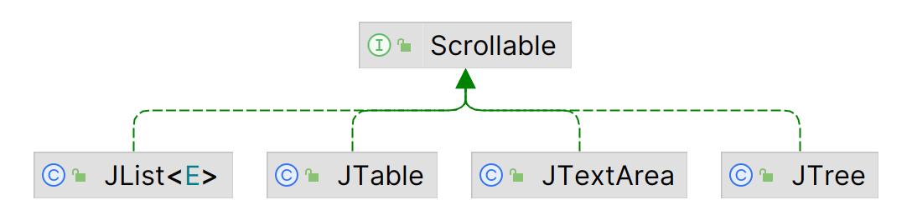

# 滚动

## 简介

Swing 的滚动功能包含：

-  2 个轻量级容器：`JViewport` 和 `JScrollPane`；
- `Scrollable` 接口，由需要滚动需求的组件实现，如下图所示；
- `JScrollBar` 类：滚动条实现。



`JViewport` 很少直接实例化使用，但是它是滚动组件的基础。

## JViewport

名词说明：

- viewport：在滚动窗口里的可见区域；
- view：被显示的组件；

通过 viewport 可以看到底层信息。滚动窗口时，移动的是 viewport。向上移动 viewport，使上面的内容出现在 viewport，而底部的内容会消失。

`JViewport` 默认不透明，通过 `setOpaque` 可修改。

`JViewport` 不需要缓冲绘制，而是采用了一个更快的滚动算法：

1. 查看 view 和 parent-view 是否为 `JComponent`，如果不是，则**停止**并重绘整个 viewport；
2. 如果 viewport 被 parent-view 遮挡，**停止**并重绘整个 viewport；
3. 计算将变得可见的区域，如果它和 viewport 一样大，**停止**并重绘整个 viewport；
4. 获取组件 `Window` 的 graphics 并对滚动区域执行 `copyArea` 操作；
5. 重绘新的可见区域。

一把来说，这种方法要快很多。

`JViewport` 很少在 `JScrollPane` 之外单独使用，它通常位于 `JScrollPane` 的中心，并使用 `ViewportLayout` 响应定位请求，从而在较小的空间显示较大组件的一部分。另外，`JViewport` 还用于显示 `JScrollPane` 的行标题和列标题。

### 创建 JViewport

`JViewport` 只有一个无参构造函数：

```java
public JViewport()
```

创建 `JViewport` 后，可以使用 `setView(Component)` 在其中放置组件。

### JViewport 属性

下表列出了 `JViewport` 的 13 个属性。可以将 `JViewport` 的 layout 设置为 `ViewportLayout` 以外的 layout-manager，但不推荐。

|属性名|数据类型|权限|
|---|---|---|
|accessibleContext|AccessibleContext|Read-only|
|`border`| `Border` |Write-only|
|changeListeners |ChangeListener[]| Read-only|
|extentSize|Dimension |Read-write|
|`insets` |`Insets` |Read-only|
|optimizedDrawingEnabled |boolean |Read-only|
|scrollMode |int |Read-write|
|UI |ViewportUI |Read-write bound|
|UIClassID |String |Read-only|
|`view` |`Component`| Read-write|
|`viewPosition`| `Point`|Read-write|
|`viewRect` |`Rectangle`|Read-only|
|`viewSize` |`Dimension`|Read-write|

由于滚动的复杂性和性能原因，`JViewport` 不支持 border，使用非 `null` 参数调用 `setBorder(Border)` 抛出 `IllegalArgumentException`。因为没有 border，所以 insets 属性值总是 (0,0,0,0)。

虽然 `JViewport` 不支持 border，但是可以为 view 内的组件设置 border。只需为组件添加一个 border，或者将组件添加到 `JViewport` 之前将其添加到带 border 的 `JPanel` 中。

- 如果为组件添加 border，那么只有组件的该部分可见时，才会显示 border；
- 如果不希望 border 随着滚动，则可以将 `JViewport` 放在具有 border 的组件中，如 `JScrollPane`。

!!! tip
    要设置 `JScrollPane` 可见部分的背景颜色，需要设置 viewport 的背景颜色：`ScrollPane.getViewport().setBackground(newColor)`

说明：

- `viewSize` 属性取决于 `JViewport` 中组件（`view` 属性）的大小；
- view 位置（`viewPosition` 属性）是 `viewRect` 属性的左上角；
- `viewRect` 的大小是 viewport 的 `extentSize`。

如下图所示：


`scrollMode` 属性可以设置为如下三类值：

|Scroll Mode|说明|
|---|---|
|BACKINGSTORE_SCROLL_MODE|使用一个 offscreen image 绘制 viewport 内容。这种模式比 blit-mode 更有优势，但需要大量额外 RAM|
|BLIT_SCROLL_MODE|默认模式，依赖于 `Graphics.copyArea()`|
|SIMPLE_SCROLL_MODE|重绘整个区域|

要移动 view 的可见部分，只需改变 `viewPosition` 属性，从而移动 `viewRect`，以查看 view 的不同部分。

**示例：** 为 `JViewport` 设置快捷键，以便使用方向键移动 view。

