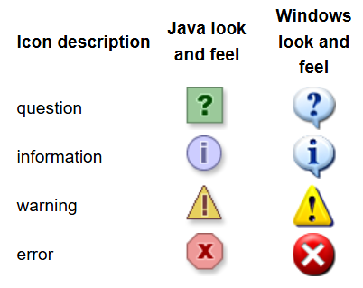

# JDialog

2024-01-02⭐
@author Jiawei Mao
***

## 简介

`JDialog` 是类似 `JFrame` 的顶层容器类，是一个标准弹窗组件，常用于向用户显示错误或警告消息。其结构类似于 `JFrame`，即 `JRootPane` 包含 content-pane 和可选的 `JMenuBar`。

为了方便使用，有几个类可以直接实例化对话框：

- `JOptionPane` 简单标准对话框
- `ProgressMonitor` 显示进度的对话框
- `JColorChooser` 和 `JFileChooser` 也是提供标准对话框
- 使用 Printing API 可以显示打印对话框
- 自定义对话框，则直接使用 `JDialog`

最简单的对话框，只需要很少的代码，例如：

```java
JOptionPane.showMessageDialog(frame, "Eggs are not supposed to be green.");
```


每个对话框都依赖于 frame 组件，当 frame 被销毁，对话框随之被销毁。当 frame 最小化，依赖它的 dialog 也会从屏幕消失。当 frame 恢复，dialog 也回复。

对话框支持**模态**。模态对话框显示时，将阻止用户与程序的其它窗口交互。`JOptionPane` 创建的 `JDialog` 是模态的，要创建非模态对话框，需要直接使用 `JDialog`。

从 JDK7 开始，可以使用新的模态 API 修改 dialog 的模态行为。

`JDialog` 继承自 AWT 的 `java.awt.Dialog` 类，添加了 `RootPane` 容器饼支持默认关闭操作。这些功能与 `JFrame` 相同，直接使用 `JDialog` 与使用 `JFrame` 非常相似。

即使使用 `JOptionPane` 实现对话框，在后台依然是使用 `JDialog`。`JOptionPane` 只是一个容器，它可以自动创建 `JDialog` 并将其添加到 `JDialog` 的 content-pane 中。

## 示例

```java
import javax.swing.*;
import javax.swing.border.Border;
import java.awt.*;
import java.awt.event.ActionEvent;
import java.awt.event.ActionListener;
import java.awt.event.WindowAdapter;
import java.awt.event.WindowEvent;
import java.beans.PropertyChangeEvent;
import java.beans.PropertyChangeListener;
import java.util.Objects;

public class DialogDemo extends JPanel {

    JLabel label;
    ImageIcon icon = createImageIcon("images/middle.gif");
    JFrame frame;
    String simpleDialogDesc = "Some simple message dialogs";
    String iconDesc = "A JOptionPane has its choice of icons";
    String moreDialogDesc = "Some more dialogs";
    CustomDialog customDialog;

    /**
     * Creates the GUI shown inside the frame's content pane.
     */
    public DialogDemo(JFrame frame) {
        super(new BorderLayout());
        this.frame = frame;
        customDialog = new CustomDialog(frame, "geisel", this);
        customDialog.pack();

        //Create the components.
        JPanel frequentPanel = createSimpleDialogBox();
        JPanel featurePanel = createFeatureDialogBox();
        JPanel iconPanel = createIconDialogBox();
        label = new JLabel("Click the \"Show it!\" button"
                + " to bring up the selected dialog.",
                JLabel.CENTER);

        //Lay them out.
        Border padding = BorderFactory.createEmptyBorder(20, 20, 5, 20);
        frequentPanel.setBorder(padding);
        featurePanel.setBorder(padding);
        iconPanel.setBorder(padding);

        JTabbedPane tabbedPane = new JTabbedPane();
        tabbedPane.addTab("Simple Modal Dialogs", null,
                frequentPanel,
                simpleDialogDesc); //tooltip text
        tabbedPane.addTab("More Dialogs", null,
                featurePanel,
                moreDialogDesc); //tooltip text
        tabbedPane.addTab("Dialog Icons", null,
                iconPanel,
                iconDesc); //tooltip text

        add(tabbedPane, BorderLayout.CENTER);
        add(label, BorderLayout.PAGE_END);
        label.setBorder(BorderFactory.createEmptyBorder(10, 10, 10, 10));
    }

    /**
     * Sets the text displayed at the bottom of the frame.
     */
    void setLabel(String newText) {
        label.setText(newText);
    }

    /**
     * Returns an ImageIcon, or null if the path was invalid.
     */
    protected static ImageIcon createImageIcon(String path) {
        java.net.URL imgURL = DialogDemo.class.getResource(path);
        if (imgURL != null) {
            return new ImageIcon(imgURL);
        } else {
            System.err.println("Couldn't find file: " + path);
            return null;
        }
    }

    /**
     * Creates the panel shown by the first tab.
     */
    private JPanel createSimpleDialogBox() {
        final int numButtons = 4;
        JRadioButton[] radioButtons = new JRadioButton[numButtons];
        final ButtonGroup group = new ButtonGroup();

        JButton showItButton = null;

        final String defaultMessageCommand = "default";
        final String yesNoCommand = "yesno";
        final String yeahNahCommand = "yeahnah";
        final String yncCommand = "ync";

        radioButtons[0] = new JRadioButton("OK (in the L&F's words)");
        radioButtons[0].setActionCommand(defaultMessageCommand);

        radioButtons[1] = new JRadioButton("Yes/No (in the L&F's words)");
        radioButtons[1].setActionCommand(yesNoCommand);

        radioButtons[2] = new JRadioButton("Yes/No "
                + "(in the programmer's words)");
        radioButtons[2].setActionCommand(yeahNahCommand);

        radioButtons[3] = new JRadioButton("Yes/No/Cancel "
                + "(in the programmer's words)");
        radioButtons[3].setActionCommand(yncCommand);

        for (int i = 0; i < numButtons; i++) {
            group.add(radioButtons[i]);
        }
        radioButtons[0].setSelected(true);

        showItButton = new JButton("Show it!");
        showItButton.addActionListener(new ActionListener() {
            public void actionPerformed(ActionEvent e) {
                String command = group.getSelection().getActionCommand();

                //ok dialog
                if (Objects.equals(command, defaultMessageCommand)) {
                    JOptionPane.showMessageDialog(frame,
                            "Eggs aren't supposed to be green.");

                    //yes/no dialog
                } else if (command == yesNoCommand) {
                    int n = JOptionPane.showConfirmDialog(
                            frame, "Would you like green eggs and ham?",
                            "An Inane Question",
                            JOptionPane.YES_NO_OPTION);
                    if (n == JOptionPane.YES_OPTION) {
                        setLabel("Ewww!");
                    } else if (n == JOptionPane.NO_OPTION) {
                        setLabel("Me neither!");
                    } else {
                        setLabel("Come on -- tell me!");
                    }

                    //yes/no (not in those words)
                } else if (command == yeahNahCommand) {
                    Object[] options = {"Yes, please", "No way!"};
                    int n = JOptionPane.showOptionDialog(frame,
                            "Would you like green eggs and ham?",
                            "A Silly Question",
                            JOptionPane.YES_NO_OPTION,
                            JOptionPane.QUESTION_MESSAGE,
                            null,
                            options,
                            options[0]);
                    if (n == JOptionPane.YES_OPTION) {
                        setLabel("You're kidding!");
                    } else if (n == JOptionPane.NO_OPTION) {
                        setLabel("I don't like them, either.");
                    } else {
                        setLabel("Come on -- 'fess up!");
                    }

                    //yes/no/cancel (not in those words)
                } else if (command == yncCommand) {
                    Object[] options = {"Yes, please",
                            "No, thanks",
                            "No eggs, no ham!"};
                    int n = JOptionPane.showOptionDialog(frame,
                            "Would you like some green eggs to go "
                                    + "with that ham?",
                            "A Silly Question",
                            JOptionPane.YES_NO_CANCEL_OPTION,
                            JOptionPane.QUESTION_MESSAGE,
                            null,
                            options,
                            options[2]);
                    if (n == JOptionPane.YES_OPTION) {
                        setLabel("Here you go: green eggs and ham!");
                    } else if (n == JOptionPane.NO_OPTION) {
                        setLabel("OK, just the ham, then.");
                    } else if (n == JOptionPane.CANCEL_OPTION) {
                        setLabel("Well, I'm certainly not going to eat them!");
                    } else {
                        setLabel("Please tell me what you want!");
                    }
                }
                return;
            }
        });

        return createPane(simpleDialogDesc + ":",
                radioButtons,
                showItButton);
    }

    /**
     * Used by createSimpleDialogBox and createFeatureDialogBox to create a pane containing a description, a single
     * column of radio buttons, and the Show it! button.
     */
    private JPanel createPane(String description,
            JRadioButton[] radioButtons,
            JButton showButton) {

        int numChoices = radioButtons.length;
        JPanel box = new JPanel();
        JLabel label = new JLabel(description);

        box.setLayout(new BoxLayout(box, BoxLayout.PAGE_AXIS));
        box.add(label);

        for (int i = 0; i < numChoices; i++) {
            box.add(radioButtons[i]);
        }

        JPanel pane = new JPanel(new BorderLayout());
        pane.add(box, BorderLayout.PAGE_START);
        pane.add(showButton, BorderLayout.PAGE_END);
        return pane;
    }

    /**
     * Like createPane, but creates a pane with 2 columns of radio buttons.  The number of buttons passed in *must* be
     * even.
     */
    private JPanel create2ColPane(String description,
            JRadioButton[] radioButtons,
            JButton showButton) {
        JLabel label = new JLabel(description);
        int numPerColumn = radioButtons.length / 2;

        JPanel grid = new JPanel(new GridLayout(0, 2));
        for (int i = 0; i < numPerColumn; i++) {
            grid.add(radioButtons[i]);
            grid.add(radioButtons[i + numPerColumn]);
        }

        JPanel box = new JPanel();
        box.setLayout(new BoxLayout(box, BoxLayout.PAGE_AXIS));
        box.add(label);
        grid.setAlignmentX(0.0f);
        box.add(grid);

        JPanel pane = new JPanel(new BorderLayout());
        pane.add(box, BorderLayout.PAGE_START);
        pane.add(showButton, BorderLayout.PAGE_END);

        return pane;
    }

    /*
     * Creates the panel shown by the 3rd tab.
     * These dialogs are implemented using showMessageDialog, but
     * you can specify the icon (using similar code) for any other
     * kind of dialog, as well.
     */
    private JPanel createIconDialogBox() {
        JButton showItButton = null;

        final int numButtons = 6;
        JRadioButton[] radioButtons = new JRadioButton[numButtons];
        final ButtonGroup group = new ButtonGroup();

        final String plainCommand = "plain";
        final String infoCommand = "info";
        final String questionCommand = "question";
        final String errorCommand = "error";
        final String warningCommand = "warning";
        final String customCommand = "custom";

        radioButtons[0] = new JRadioButton("Plain (no icon)");
        radioButtons[0].setActionCommand(plainCommand);

        radioButtons[1] = new JRadioButton("Information icon");
        radioButtons[1].setActionCommand(infoCommand);

        radioButtons[2] = new JRadioButton("Question icon");
        radioButtons[2].setActionCommand(questionCommand);

        radioButtons[3] = new JRadioButton("Error icon");
        radioButtons[3].setActionCommand(errorCommand);

        radioButtons[4] = new JRadioButton("Warning icon");
        radioButtons[4].setActionCommand(warningCommand);

        radioButtons[5] = new JRadioButton("Custom icon");
        radioButtons[5].setActionCommand(customCommand);

        for (int i = 0; i < numButtons; i++) {
            group.add(radioButtons[i]);
        }
        radioButtons[0].setSelected(true);

        showItButton = new JButton("Show it!");
        showItButton.addActionListener(new ActionListener() {
            public void actionPerformed(ActionEvent e) {
                String command = group.getSelection().getActionCommand();

                //no icon
                if (command == plainCommand) {
                    JOptionPane.showMessageDialog(frame,
                            "Eggs aren't supposed to be green.",
                            "A plain message",
                            JOptionPane.PLAIN_MESSAGE);
                    //information icon
                } else if (command == infoCommand) {
                    JOptionPane.showMessageDialog(frame,
                            "Eggs aren't supposed to be green.",
                            "Inane informational dialog",
                            JOptionPane.INFORMATION_MESSAGE);

                    //XXX: It doesn't make sense to make a question with
                    //XXX: only one button.
                    //XXX: See "Yes/No (but not in those words)" for a better solution.
                    //question icon
                } else if (command == questionCommand) {
                    JOptionPane.showMessageDialog(frame,
                            "You shouldn't use a message dialog "
                                    + "(like this)\n"
                                    + "for a question, OK?",
                            "Inane question",
                            JOptionPane.QUESTION_MESSAGE);
                    //error icon
                } else if (command == errorCommand) {
                    JOptionPane.showMessageDialog(frame,
                            "Eggs aren't supposed to be green.",
                            "Inane error",
                            JOptionPane.ERROR_MESSAGE);
                    //warning icon
                } else if (command == warningCommand) {
                    JOptionPane.showMessageDialog(frame,
                            "Eggs aren't supposed to be green.",
                            "Inane warning",
                            JOptionPane.WARNING_MESSAGE);
                    //custom icon
                } else if (command == customCommand) {
                    JOptionPane.showMessageDialog(frame,
                            "Eggs aren't supposed to be green.",
                            "Inane custom dialog",
                            JOptionPane.INFORMATION_MESSAGE,
                            icon);
                }
            }
        });

        return create2ColPane(iconDesc + ":",
                radioButtons,
                showItButton);
    }

    /**
     * Creates the panel shown by the second tab.
     */
    private JPanel createFeatureDialogBox() {
        final int numButtons = 5;
        JRadioButton[] radioButtons = new JRadioButton[numButtons];
        final ButtonGroup group = new ButtonGroup();

        JButton showItButton = null;

        final String pickOneCommand = "pickone";
        final String textEnteredCommand = "textfield";
        final String nonAutoCommand = "nonautooption";
        final String customOptionCommand = "customoption";
        final String nonModalCommand = "nonmodal";

        radioButtons[0] = new JRadioButton("Pick one of several choices");
        radioButtons[0].setActionCommand(pickOneCommand);

        radioButtons[1] = new JRadioButton("Enter some text");
        radioButtons[1].setActionCommand(textEnteredCommand);

        radioButtons[2] = new JRadioButton("Non-auto-closing dialog");
        radioButtons[2].setActionCommand(nonAutoCommand);

        radioButtons[3] = new JRadioButton("Input-validating dialog "
                + "(with custom message area)");
        radioButtons[3].setActionCommand(customOptionCommand);

        radioButtons[4] = new JRadioButton("Non-modal dialog");
        radioButtons[4].setActionCommand(nonModalCommand);

        for (int i = 0; i < numButtons; i++) {
            group.add(radioButtons[i]);
        }
        radioButtons[0].setSelected(true);

        showItButton = new JButton("Show it!");
        showItButton.addActionListener(new ActionListener() {
            public void actionPerformed(ActionEvent e) {
                String command = group.getSelection().getActionCommand();

                //pick one of many
                if (command == pickOneCommand) {
                    Object[] possibilities = {"ham", "spam", "yam"};
                    String s = (String) JOptionPane.showInputDialog(
                            frame,
                            "Complete the sentence:\n"
                                    + "\"Green eggs and...\"",
                            "Customized Dialog",
                            JOptionPane.PLAIN_MESSAGE,
                            icon,
                            possibilities,
                            "ham");

                    //If a string was returned, say so.
                    if ((s != null) && (s.length() > 0)) {
                        setLabel("Green eggs and... " + s + "!");
                        return;
                    }

                    //If you're here, the return value was null/empty.
                    setLabel("Come on, finish the sentence!");

                    //text input
                } else if (command == textEnteredCommand) {
                    String s = (String) JOptionPane.showInputDialog(
                            frame,
                            "Complete the sentence:\n"
                                    + "\"Green eggs and...\"",
                            "Customized Dialog",
                            JOptionPane.PLAIN_MESSAGE,
                            icon,
                            null,
                            "ham");

                    //If a string was returned, say so.
                    if ((s != null) && (s.length() > 0)) {
                        setLabel("Green eggs and... " + s + "!");
                        return;
                    }

                    //If you're here, the return value was null/empty.
                    setLabel("Come on, finish the sentence!");

                    //non-auto-closing dialog
                } else if (command == nonAutoCommand) {
                    final JOptionPane optionPane = new JOptionPane(
                            "The only way to close this dialog is by\n"
                                    + "pressing one of the following buttons.\n"
                                    + "Do you understand?",
                            JOptionPane.QUESTION_MESSAGE,
                            JOptionPane.YES_NO_OPTION);

                    //You can't use pane.createDialog() because that
                    //method sets up the JDialog with a property change
                    //listener that automatically closes the window
                    //when a button is clicked.
                    final JDialog dialog = new JDialog(frame,
                            "Click a button",
                            true);
                    dialog.setContentPane(optionPane);
                    dialog.setDefaultCloseOperation(
                            JDialog.DO_NOTHING_ON_CLOSE);
                    dialog.addWindowListener(new WindowAdapter() {
                        public void windowClosing(WindowEvent we) {
                            setLabel("Thwarted user attempt to close window.");
                        }
                    });
                    optionPane.addPropertyChangeListener(
                            new PropertyChangeListener() {
                                public void propertyChange(PropertyChangeEvent e) {
                                    String prop = e.getPropertyName();

                                    if (dialog.isVisible()
                                            && (e.getSource() == optionPane)
                                            && (JOptionPane.VALUE_PROPERTY.equals(prop))) {
                                        //If you were going to check something
                                        //before closing the window, you'd do
                                        //it here.
                                        dialog.setVisible(false);
                                    }
                                }
                            });
                    dialog.pack();
                    dialog.setLocationRelativeTo(frame);
                    dialog.setVisible(true);

                    int value = ((Integer) optionPane.getValue()).intValue();
                    if (value == JOptionPane.YES_OPTION) {
                        setLabel("Good.");
                    } else if (value == JOptionPane.NO_OPTION) {
                        setLabel("Try using the window decorations "
                                + "to close the non-auto-closing dialog. "
                                + "You can't!");
                    } else {
                        setLabel("Window unavoidably closed (ESC?).");
                    }

                    //non-auto-closing dialog with custom message area
                    //NOTE: if you don't intend to check the input,
                    //then just use showInputDialog instead.
                } else if (command == customOptionCommand) {
                    customDialog.setLocationRelativeTo(frame);
                    customDialog.setVisible(true);

                    String s = customDialog.getValidatedText();
                    if (s != null) {
                        //The text is valid.
                        setLabel("Congratulations!  "
                                + "You entered \""
                                + s
                                + "\".");
                    }

                    //non-modal dialog
                } else if (command == nonModalCommand) {
                    //Create the dialog.
                    final JDialog dialog = new JDialog(frame,
                            "A Non-Modal Dialog");

                    //Add contents to it. It must have a close button,
                    //since some L&Fs (notably Java/Metal) don't provide one
                    //in the window decorations for dialogs.
                    JLabel label = new JLabel("<html><p align=center>"
                            + "This is a non-modal dialog.<br>"
                            + "You can have one or more of these up<br>"
                            + "and still use the main window.");
                    label.setHorizontalAlignment(JLabel.CENTER);
                    Font font = label.getFont();
                    label.setFont(label.getFont().deriveFont(font.PLAIN,
                            14.0f));

                    JButton closeButton = new JButton("Close");
                    closeButton.addActionListener(new ActionListener() {
                        public void actionPerformed(ActionEvent e) {
                            dialog.setVisible(false);
                            dialog.dispose();
                        }
                    });
                    JPanel closePanel = new JPanel();
                    closePanel.setLayout(new BoxLayout(closePanel,
                            BoxLayout.LINE_AXIS));
                    closePanel.add(Box.createHorizontalGlue());
                    closePanel.add(closeButton);
                    closePanel.setBorder(BorderFactory.
                            createEmptyBorder(0, 0, 5, 5));

                    JPanel contentPane = new JPanel(new BorderLayout());
                    contentPane.add(label, BorderLayout.CENTER);
                    contentPane.add(closePanel, BorderLayout.PAGE_END);
                    contentPane.setOpaque(true);
                    dialog.setContentPane(contentPane);

                    //Show it.
                    dialog.setSize(new Dimension(300, 150));
                    dialog.setLocationRelativeTo(frame);
                    dialog.setVisible(true);
                }
            }
        });

        return createPane(moreDialogDesc + ":",
                radioButtons,
                showItButton);
    }

    /**
     * Create the GUI and show it.  For thread safety, this method should be invoked from the event-dispatching thread.
     */
    private static void createAndShowGUI() {
        //Create and set up the window.
        JFrame frame = new JFrame("DialogDemo");
        frame.setDefaultCloseOperation(JFrame.EXIT_ON_CLOSE);

        //Create and set up the content pane.
        DialogDemo newContentPane = new DialogDemo(frame);
        newContentPane.setOpaque(true); //content panes must be opaque
        frame.setContentPane(newContentPane);

        //Display the window.
        frame.pack();
        frame.setVisible(true);
    }

    public static void main(String[] args) {
        javax.swing.SwingUtilities.invokeLater(new Runnable() {
            public void run() {
                createAndShowGUI();
            }
        });
    }
}
```

## JOptionPane 特点

使用 `JOptionPane` 可以快速创建和自定义多种不同类型的 dialog，其结构如下：


`JOptionPane` 提供了 icon, 标题和文本信息，以及自定义按钮文本功能。另外还支持自定义对话框显示的组件，以及制定 dialog 在屏幕上的位置。甚至可以指定 `JOptionPane` 将自身放入 `JInternalFrame`，而不是 `JDialog`。

`JOptionPane` 提供了几个标准对话框实现，以下 4 个静态方法展示单条信息：

- `showMessageDialog`，显示一条信息，并等到用户单击 OK
- `showConfirmDialog`，显示信息并获得确认结果（如 Ok/Cancel）
- `showOptionDialog`，显示消息并从一组选项中获取用户选择
- `showInputDialog`，显示消息并获取一行用户输入

`JOptionPane` 可以自定义 icon，不适用 icon 或使用 4 个标准 icon （question, information, warning, error）。不同 laf 的标准 icon 外观不同。下面是 Java 中使用的默认 icon：



## 创建简单 dialogs

对大多数简单的模式 dialogs，可以使用 `JOptionPane` 的 `showXXXDialog` 来创建和现实对话框。如果是在 `JInternalFrame` 显示 dialog，则调用 `showInternalXXXDialog`。

如果需要控制 dialog 的关闭行为，或者不希望 dialog 是模态的，则应该直接实例化 `JOptionPane` 并将其添加到 `JDialog`。然后在 `JDialog` 上调用 `setVisible(true)` 来显示。

Swing 提供了两种创建 `JOptionPane` 的方式：

- 构造函数
- 工厂方法

`JOptionPane` 有 7 个构造函数，其中包含所有配置参数的构造函数如下：

```java
public JOptionPane(Object message, int messageType, int optionType,
                   Icon icon, Object[] options, Object initialValue)
```

Icon：图标用于指示消息类型。使用 laf 会根据消息类型提供对应图标，

`message` 参数为 `Object` 类型，而不是 `String`，所以这部分理论可以显示任何内容，不限于文本。

`messageType` 指定信息类型。如果不提供自定义图标，laf 会根据 `messageType` 在图标区域展示不同的图标。`JOptionPane` 支持 5 种 `messageType`：

- ERROR_MESSAGE
- INFORMATION_MESSAGE
- QUESTION_MESSAGE
- WARNING_MESSAGE
- PLAIN_MESSAGE

`optionType` 用于确定按钮区域的按钮配置，包含 4 个可选项；

- `DEFAULT_OPTION`，单个 OK 按钮；
- `OK_CANCEL_OPTION`，OK 和 Cancel 两个按钮；
- `YES_NO_CANCEL_OPTION`，Yes, No, Cancel 三个按钮；
- `YES_NO_OPTION`，Yes，No 两个按钮。

`options` 是 `Object` 数组，用于为 `JOptionPane` 的按钮区域构建一组按钮对象。如果按参数为 `null`，则根据 `optionType` 参数确定按钮。否则，`options` 的工作方式与 `message` 参数类似，但不支持递归：

- 如果 `options` 数组元素为 `Component`，则将其放在按钮区域；
- 如果 `options` 数组为 `Icon`，则将 `Icon` 放到 `JButton` 中，然后将 `JButton` 放到按钮区域；
- 如果 `options` 数组为 `Object`，则调用其 `toString()` 方法转换为字符串，将字符串放到 `JButton`，然后将按钮放到按钮区域。

使用字符串或 `Icon` 显示文本或图标，如果两者都想要，则传入定制好的 `Component` 数组。

如果指定了 `options` 参数，`initialValue` 参数指定默认选择的按钮。如果 `initialValue` 为 `null`，选择第一个按钮。

**工厂方法**中，`showMessageDialog` 和 `showOptionDialog` 最常用。

`showMessageDialog` 显示一个包含单个按钮的 dialog。`showOptionDialog` 显示一个自定义 dialog，


## 创建 JDialog

`JDialog` 提供了多达 16 个构造函数：

```java
public JDialog()
public JDialog(Dialog owner)
public JDialog(Dialog owner, boolean modal)
public JDialog(Dialog owner, String title)
public JDialog(Dialog owner, String title, boolean modal)
public JDialog(Dialog owner, String title, boolean modal, GraphicsConfiguration gc)
public JDialog(Frame owner)
...
```

不同构造函数提供不同形式的定制功能。参数说明：

- `owner`，对话框所属容器；
- `modal`，模态，是否为模态；
- `title`，标题

除了手动创建 `JDialog`，`JOptionPane` 提供了标准对话框实现。

## JDialog 属性

`JDialog` 属性和 `JFrame` 基本一样。

|Property Name|Data Type|Access|
|---|---|---|
|accessibleContext|AccessibleContext|Read-only|
|contentPane|Container|Read-write|
|defaultCloseOperation|int|Read-write|
|glassPane|Component|Read-write|
|jMenuBar|JMenuBar|Read-write|
|layeredPane|JLayeredPane|Read-write|
|layout|LayoutManager|Write-only|
|rootPane|JRootPane|Read-only|

- `defaultCloseOperation` 和 `JFrame` 的功能一样，默认为 `HIDE_ON_CLOSE`，这是对话框的合理默认行为。
- `defaultLookAndFeelDecorated` 属性指定新创建的 `JDialog` 的装饰由当前的 laf 提供。

不过这只是一个提示，如果 laf 不支持此功能，设置为 `true` 也没有任何效果。

- `layout` 属性

在此处说明是因为 `JDialog` 覆盖了 `setLayout` 方法，将其调用转到对 `contentPane` 的 `setLayout` 方法的调用。

### owner

`owner` 可以是另一个 `JDialog`, `JFrame` 或 `JWidnow`。

- 指定 `owner`，创建了父子关闭，当 `JDialog` 的 `owner` 被关闭，`JDialog` 也被关闭；
- 当 owner 最小化或最大化，`JDialog` 也随之最小化或最大化；
- `JDialog` 总是在其 `owner` 上方显示；

## JDialog 事件处理

`JDialog` 的事件处理和 `JFrame` 完全一样。

针对对话框，我们常希望按 `Escape` 键可以取消对话框。实现该功能的最简单方式是对 `JRootPane` 中的键盘操作注册 `Escape` 按钮。实现：

```java
import javax.swing.*;
import java.awt.*;
import java.awt.event.ActionEvent;

public class EscapeDialog extends JDialog {

    public EscapeDialog() {
        this((Frame) null, false);
    }

    public EscapeDialog(Frame owner) {
        this(owner, false);
    }

    public EscapeDialog(Frame owner, boolean modal) {
        this(owner, null, modal);
    }

    public EscapeDialog(Frame owner, String title) {
        this(owner, title, false);
    }

    public EscapeDialog(Frame owner, String title, boolean modal) {
        super(owner, title, modal);
    }

    public EscapeDialog(Frame owner, String title, boolean modal,
            GraphicsConfiguration gc) {
        super(owner, title, modal, gc);
    }

    public EscapeDialog(Dialog owner) {
        this(owner, false);
    }

    public EscapeDialog(Dialog owner, boolean modal) {
        this(owner, null, modal);
    }

    public EscapeDialog(Dialog owner, String title) {
        this(owner, title, false);
    }

    public EscapeDialog(Dialog owner, String title, boolean modal) {
        super(owner, title, modal);
    }

    public EscapeDialog(Dialog owner, String title, boolean modal,
            GraphicsConfiguration gc) {
        super(owner, title, modal, gc);
    }

    protected JRootPane createRootPane() {
        JRootPane rootPane = new JRootPane();
        KeyStroke stroke = KeyStroke.getKeyStroke("ESCAPE");
        Action actionListener = new AbstractAction() {
            public void actionPerformed(ActionEvent actionEvent) {
                setVisible(false);
            }
        };
        InputMap inputMap = rootPane.getInputMap(JComponent.WHEN_IN_FOCUSED_WINDOW);
        inputMap.put(stroke, "ESCAPE");
        rootPane.getActionMap().put("ESCAPE", actionListener);
        return rootPane;
    }
}
```

## 参考

- https://docs.oracle.com/javase/tutorial/uiswing/components/dialog.html