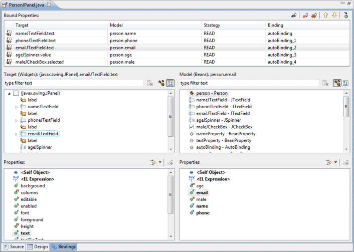
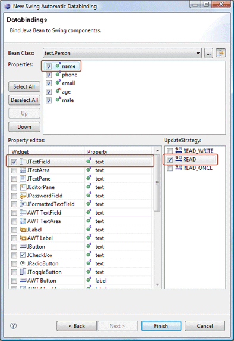

# Swing Data Binding

- [Swing Data Binding](#swing-data-binding)
  - [简介](#简介)
    - [Data Binding Tab](#data-binding-tab)
    - [Data Binding Menu](#data-binding-menu)
    - [Bindings Property](#bindings-property)
    - [Automatic Data Binding Wizard](#automatic-data-binding-wizard)
    - [IconDecorator](#icondecorator)
    - [Source](#source)
  - [Swing Data Bindings](#swing-data-bindings)

2021-11-18, 17:07
***

## 简介

要使用 Swing Data Binding (JSJR 295)，需要将 Swing Datat Binding jar 添加到 classpath。

该工具可以用多种方式创建数据绑定:

- 点击编辑器上的 `Bindings` 栏；
- 右键组件，选择 Data Bindind 菜单；
- 展开属性栏的 bindings 属性；
- 使用 Swing Automatic Data Binding。

该工具会生成或更新必要的数据绑定代码。

### Data Binding Tab

该窗口支持创建 JSR 295 Swing 数据绑定。

### Data Binding Menu

Data Binding Menu 为控件提供了快速创建或编辑数据绑定的功能：

- 如果控件没有任何绑定数据，菜单会显示该控件可以绑定到模型的属性；
- 如果控件已有绑定数据，则已绑定数据在顶部显示。

点击未绑定属性将打开 "Create Data Binding" 向导，而单击已绑定数据打开 "Edit Data Binding" 对话框。

### Bindings Property

属性栏的 `bindings` 属性显示控件的所有可绑定属性列表。点击属性右侧的 `...` 按钮可以打开 "Create Data Binding" 向导，对已绑定属性则打开 "Edit Data Binding" 对话框。

### Automatic Data Binding Wizard

使用 `Automatic Data Binding` 向导可以创建新的用户界面类，自动生成的代码包含组件、layout以及和任意模型（bean）类的数据绑定。

### IconDecorator

带有绑定数据的组件在 component tree 视图上会有特殊的图标装饰：

### Source

WindowBuilder 会自动生成或更新数据绑定代码。如果源码中没有 `initDataBindings()` 方法，会首先创建该方法，并将对该方法的调用放到控件创建代码的末尾。

在 `initDataBindings` 方法中，会创建必要的 bean 属性，并随后创建对应绑定。

## Swing Data Bindings

> 支持 JDK 1.5+.

点击 Bindings 选项卡切换到数据绑定的创建和编辑。

