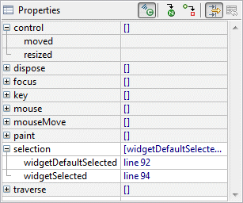

# 事件处理

- [事件处理](#事件处理)
  - [简介](#简介)
  - [添加 Event Handler](#添加-event-handler)
  - [删除 Event Handler](#删除-event-handler)

## 简介

当用户与UI交互时，发生事件。然后执行适当的事件处理代码。为了知道事件何时发生，需要先将事件处理程序添加到族健脑。

## 添加 Event Handler

添加 event handle 的方法有两种。

第一种是在 Property Pane中，在 Component Tree 或 Design View 中选择组件，点击 **Show Events** 按钮。



此时在属性列表可以看到事件列表。展开事件，双击或者回车对事件进行处理。

第二种是在 Design View 或 Component Tree 中对组件点击右键，选择 **Add event handler > [name of the event] > [name of the event handler to implement]**


对按钮（包括 check 和 radio button）以及 menu item 可以直接双击添加 event listener。双击创建的为 selection event listener。

不管采用哪种方法添加事件，WindowBuilder都会对选择的事件自动创建 event handler。编辑器会自动切换到 Source View，用于编辑 event handler。生成的代码样式如下：

```java
browseButton = new Button(shell, SWT.NONE);
browseButton.addSelectionListener(new SelectionListener() {     
    public void widgetDefaultSelected(SelectionEvent arg0) {}
    public void widgetSelected(SelectionEvent arg0) {}
});
browseButton.setText("Browse...");
```

从 Design View 快速切换到事件处理代码的方法也有两种：

- 在属性栏，点击 **Show Events** 按钮，展开事件后双击或者回车到对应代码；
- 另一种是右击组件，选择实现的方法，如下图所示。


## 删除 Event Handler

删除 Event Handler 的方法只有一种。选择组件，在属性栏展开事件，点击要删除的事件，然后按 Delete。
