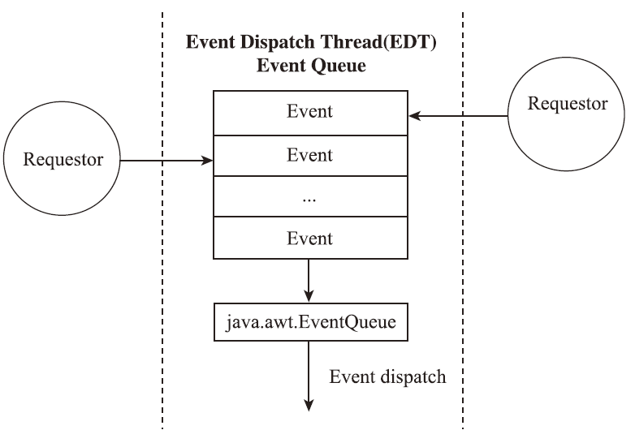
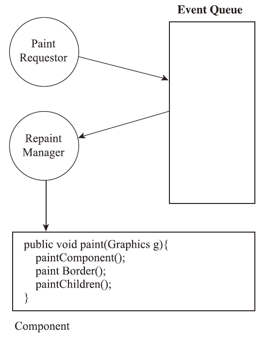

# Swing 渲染原理

- [Swing 渲染原理](#swing-渲染原理)
  - [事件](#事件)
  - [Swing 绘制](#swing-绘制)
    - [异步重绘请求](#异步重绘请求)
    - [同步的绘制请求](#同步的绘制请求)
  - [Swing 渲染](#swing-渲染)
    - [paintComponent](#paintcomponent)
    - [paint](#paint)
  - [双缓冲](#双缓冲)

2021-11-13, 09:15
***

## 事件

Swing 事件都放置在一个队列中，`java.awt.EventQueue` 负责从这个队列中取出并派发事件。`EventQueue` 的派发由一个单独的线程管理，这个线程称为事件派发线程（Event Dispatch Thread, EDT）。如下图所示：

在 Swing 中，**所有与 GUI 相关的工作都必须在 EDT 中发生**。应用程序需要做的涉及修改 GUI 的任何工作也必须在 EDT 中处理。

## Swing 绘制

Swing 中的绘制是应用程序用来更新显示的过程。

- 如果有自定义的绘制行为，该过程可以调用自定义代码；
- 如果没有自定义的绘制行为，就只调用重新绘制标准组件的 Swing 内部代码。

这个过程由发布在事件队列中的绘制请求组成，绘制请求导致调用 EDT 中每个受到影响的 Swing 组件的 `paint()` 和 `paintComponent()` 方法。

发起绘制请求的方法有两种：

- Swing 或 AWT 库自身可以发起一个绘制请求；
- 应用程序代码发起这样的请求。

Swing 或 AWT 库自身发起重新绘制请求以响应本地系统或 GUI 组件中的事件。例如，当一个应用程序窗口第一次显示在屏幕上时，或者当它改变大小或暴露在屏幕上时，AWT 收到一个本地的暴露事件并发起一个 Java 事件使这个窗口重绘自己。同样，当一个组件的状态改变时，如按住一个按钮，Swing 发起一个绘制请求以确保按钮显示为按住的状态。

应该程序也可以直接对 Swing 发起一个绘制请求。

### 异步重绘请求

异步重绘请求是告诉 Swing 需要更新的内容，让 Swing 处理这些请求的细节。

所有的异步请求都是 `repaint()` 方法的变体。它们基本分为两种类型：

- 请求整个组件更新；
- 指定需要更新的区域。

1. `Component.repaint()`

这是最容易处理的方法：告诉 Swing 整个组件都要更新。

如果这个组件是一个容器，后续的 `paint()` 方法调用会导致每个子组件更新自身。对不经常发生重绘或者 GUI 不是很复杂的情况，这样做还好。但是在性能敏感的情况下，要避免绘制不需要绘制的组件，可以使用下面的方法。

2. `Component.repaint(int x, int y, int width, int height)`

该方法要求 Swing 重新绘制组件中指定的矩形。使用该方法可以减少绘制工作量，提高性能。

### 同步的绘制请求

要谨慎使用同步绘制方法。

Swing 组件的绘制必须在 EDT 中进行。所以调用同步的绘制方法，代码必须在正确的线程中执行。例如处理一个输入事件，需要作为那个请求的一部分来重新沪指。此时不用把请求放到 `EventQueue` 中，可以立刻处理这个绘制并继续工作。`paintImmediately()` 方法适用于该情况：

1. `JComponent.paintImmediately(int x, int y, int w, int h)` 和 `JComponent.paintImmediately(Rectangle r)`

这两个方法是相同的，都执行需要更新的区域。要强制一个组件内容同步绘制，`paintImmediately()` 是唯一需要调用的方法。该方法告诉这个组件指定区域必须更新，Swing 内部调用所有适当组件的 `paint()` 方法进行更新。

调用 `paintImmediately()` 方法的缺点：

- 必须在 EDT 中调用；
- 立刻执行 paint 调用，所有没有合并绘制的请求。

2. `Component.paint(Graphics)`

Swing 程序中通常不用显式调动 `paint()`。在需要定制组件时会用到。

## Swing 渲染

Swing 渲染以 EDT 为中心，简单易懂。首先，将绘制请求放到事件队列，通过 EDT，事件派发到 Swing RepaintManager，该对象调用需要重绘组件的 `paint()` 方法，该方法导致一个组件先绘制它自己的内容，然后绘制它的边界，最后绘制它包含的组件。如下：

整个组件的层次，从 `JFrame` 到最低的按钮，都得到渲染。应用程序需要关注下面三个方法：

1. `JComponent.paintComponent(Graphics)`

需要定制组件的程序需要覆盖该方法。

2. `Component.paint(Graphics)`

在需要组件和它的子组件的图形状态时，需要覆盖该方法。

3. `JComponent.setOpaque(Boolean)`

设置透明度，除 `JLabel` 外，所有 Swing 组件默认不透明。

### paintComponent

`paintComponent()` 是定制 Swing 组件最重要的方法。

### paint

## 双缓冲

双缓冲使用一个屏幕之外的，称为后台缓冲的图像作为它的渲染操作的目的地。在适当的时候，把这个后台缓冲复制到屏幕。这个更新屏幕的过程通常比来自所有渲染操作单独的更新更平滑，因为它同时发生。下图是单缓冲和双缓冲的差别：

双缓冲的优势有两点：

- 对游戏或其它动态的、图形密集的应用程序，双缓冲使其更新更平滑；
- Swing 程序的分层绘制的方式，双缓冲可以对用户隐藏中间层渲染，只用这个窗口的最终内容更新屏幕。

