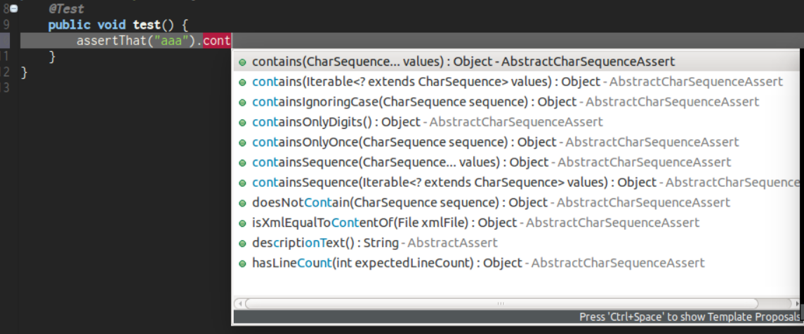

# AssertJ

## 简介

AssertJ 提供丰富且直观的强类型断言，以丰富单元测试框架，如 JUnit 的断言功能。

AssertJ 包含 6 个模块：

- core，提供 JDK 类型断言
- guava，提供 Guava 类型断言（`Multimap`, Optional 等）
- Joda Time，提供 Joda Time 类型断言，如 DateTime, LocalDateTime 等；
- Neo4J，提供 Neo4J 类型断言，如 Path, Node, Relationship 等；
- DB，提供关系数据库类型断言，如 Table, Row, Column 等；
- Swing，提供 Swing 用户界面的功能测试。

## 快速入门

`Assertions` 是 AssertJ 的核心类，相关断言都在里面。

测试类实现 `WithAssertions` 接口，也提供相同断言方法。

一次导入所有断言方法：

```java
import static org.assertj.core.api.Assertions.*;
```

或者分次导入：

```java
import static org.assertj.core.api.Assertions.assertThat;  // main one
import static org.assertj.core.api.Assertions.atIndex; // for List assertions
import static org.assertj.core.api.Assertions.entry;  // for Map assertions
import static org.assertj.core.api.Assertions.tuple; // when extracting several properties at once
import static org.assertj.core.api.Assertions.fail; // use when writing exception tests
import static org.assertj.core.api.Assertions.failBecauseExceptionWasNotThrown; // idem
import static org.assertj.core.api.Assertions.filter; // for Iterable/Array assertions
import static org.assertj.core.api.Assertions.offset; // for floating number assertions
import static org.assertj.core.api.Assertions.anyOf; // use with Condition
import static org.assertj.core.api.Assertions.contentOf; // use with File assertions
```

### 其它断言入口

AssertJ 还提供了 `WithAssertions` 接口和 BDD 样式的 `BDDAssertions`，即将 `assertThat` 替换为 `then`。

`WithAssertions` 示例：

```java
import org.assertj.core.api.WithAssertions;

public class WithAssertionsExamples extends AbstractAssertionsExamples implements WithAssertions {

  // the data used are initialized in AbstractAssertionsExamples.

  @Test
  public void withAssertions_examples() {

    // assertThat methods come from WithAssertions - no static import needed
    assertThat(frodo.age).isEqualTo(33);
    assertThat(frodo.getName()).isEqualTo("Frodo").isNotEqualTo("Frodon");

    assertThat(frodo).isIn(fellowshipOfTheRing);
    assertThat(frodo).isIn(sam, frodo, pippin);
    assertThat(sauron).isNotIn(fellowshipOfTheRing);

    assertThat(frodo).matches(p -> p.age > 30 && p.getRace() == HOBBIT);
    assertThat(frodo.age).matches(p -> p > 30);
  }
}
```

`BDDAssertions` 示例：

```java
import static org.assertj.core.api.BDDAssertions.then;

public class BDDAssertionsExamples extends AbstractAssertionsExamples {

  // the data used are initialized in AbstractAssertionsExamples.

  @Test
  public void withAssertions_examples() {

    // then methods come from BDDAssertions.then static
    then(frodo.age).isEqualTo(33);
    then(frodo.getName()).isEqualTo("Frodo").isNotEqualTo("Frodon");

    then(frodo).isIn(fellowshipOfTheRing);
    then(frodo).isIn(sam, frodo, pippin);
    then(sauron).isNotIn(fellowshipOfTheRing);

    then(frodo).matches(p -> p.age > 30 && p.getRace() == HOBBIT);
    then(frodo.age).matches(p -> p > 30);
  }
}
```

### IDE 配置

Intellij Idea 不需要配置即可提示，Eclipse 需要设置一下：

1. Window -> Preferences -> Java -> Editor -> Content Assist > Favorites > New Type
2. 输入 `org.assertj.core.api.Assertions` 

### 代码完成

```java
assertThat(objectUnderTest).
```

在 IDE 中，`.` 后面有代码自动完成，以 String 为例：



## AssertJ Core

Javadoc 提供了每个断言的解释和示例。

### 简单示例


1. 静态导入 `org.assertj.core.api.Assertions.assertThat`；
2. `assertThat()` 的参数是要测试的对象；
3. 使用代码完成发现和调用断言；
4. 链式调用多个断言。

除了 `isNotNull()` 是基础断言，余下几个是 `String` 专用断言。

### 支持断言类型

#### 通用类型

| BigDecimal                                          | BigInteger              |
| --------------------------------------------------- | ----------------------- |
| CharSequence                                        | Class                   |
| Date                                                | File                    |
| Future / CompletableFuture                          | InputStream             |
| Iterable (including any kind of Collection)         | Iterator                |
| List                                                | Map                     |
| Object                                              | Object[] and Object[][] |
| OptionalOptionalInt / OptionalLong / OptionalDouble | Path                    |
| Predicate                                           | Stream                  |
| String                                              | Throwable / Exception   |

#### Primitive types

| Primitive types and their wrapper | Primitive type arrays | Primitive type 2D arrays |
| --------------------------------- | --------------------- | ------------------------ |
| short/Short                       | `short[]`             | `short[][]`              |
| int/Integer                       | `int[]`               | `int[][]`                |
| long/Long                         | `long[]`              | `long[][]`               |
| byte/Byte                         | `byte[]`              | `byte[][]`               |
| char/Character                    | `char[]`              | `char[][]`               |
| float/Float                       | `float[]`             | `float[][]`              |
| double/Double                     | `double[]`            | `double[][]`             |

