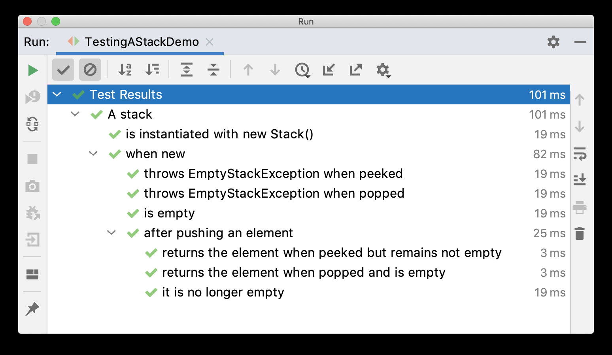

# 嵌套测试

2023-09-11, 11:36
@author Jiawei Mao
****

`@Nested` 利用 Java 嵌套类对测试进行分组。

**示例：** Stack 嵌套测试

```java{.line-numbers}
import static org.junit.jupiter.api.Assertions.assertEquals;
import static org.junit.jupiter.api.Assertions.assertFalse;
import static org.junit.jupiter.api.Assertions.assertThrows;
import static org.junit.jupiter.api.Assertions.assertTrue;

import java.util.EmptyStackException;
import java.util.Stack;

import org.junit.jupiter.api.BeforeEach;
import org.junit.jupiter.api.DisplayName;
import org.junit.jupiter.api.Nested;
import org.junit.jupiter.api.Test;

@DisplayName("A stack")
class TestingAStackDemo {

    Stack<Object> stack;

    @Test
    @DisplayName("is instantiated with new Stack()")
    void isInstantiatedWithNew() {
        new Stack<>();
    }

    @Nested
    @DisplayName("when new")
    class WhenNew {

        @BeforeEach
        void createNewStack() {
            stack = new Stack<>();
        }

        @Test
        @DisplayName("is empty")
        void isEmpty() {
            assertTrue(stack.isEmpty());
        }

        @Test
        @DisplayName("throws EmptyStackException when popped")
        void throwsExceptionWhenPopped() {
            assertThrows(EmptyStackException.class, stack::pop);
        }

        @Test
        @DisplayName("throws EmptyStackException when peeked")
        void throwsExceptionWhenPeeked() {
            assertThrows(EmptyStackException.class, stack::peek);
        }

        @Nested
        @DisplayName("after pushing an element")
        class AfterPushing {

            String anElement = "an element";

            @BeforeEach
            void pushAnElement() {
                stack.push(anElement);
            }

            @Test
            @DisplayName("it is no longer empty")
            void isNotEmpty() {
                assertFalse(stack.isEmpty());
            }

            @Test
            @DisplayName("returns the element when popped and is empty")
            void returnElementWhenPopped() {
                assertEquals(anElement, stack.pop());
                assertTrue(stack.isEmpty());
            }

            @Test
            @DisplayName("returns the element when peeked but remains not empty")
            void returnElementWhenPeeked() {
                assertEquals(anElement, stack.peek());
                assertFalse(stack.isEmpty());
            }
        }
    }
}
```

在 IDE 中执行该测试，GUI 中测试执行树类似下图：



在示例中，在外部类中定义的生命周期方法可以在内部类中使用。例如，`createNewStack()` 是一个 `@BeforeEach` 生命周期方法，它在定义它的测试类中，以及其嵌套下的所有类中使用。

外部测试的设置代码在执行内部测试之前运行。

!!! info
    只有非静态嵌套类（即内部类）可以作为 `@Nested` 测试类。可以嵌套任意深度，这些内部类受到完整生命周期的支持，但有一个例外：`@BeforeAll` 和 `@AfterAll` 方法默认无效。因为在 Java 16 之前，Java 不允许在内部类中声明静态成员。不过该限制可以用 `@TestInstance(Lifecycle.PER_CLASS)` 注释 @Nested 测试类来规避。如果使用的是 Java 16+，则可以在 @Nested 测试类中声明 static 的 @BeforeAll 和 @AfterAll 方法，不再受限。