# 在 GitHub 上与人合作

2025-04-01 add: Git 命令
2025-04-01
@author Jiawei Mao
***
## 简略流程

- fork 项目
- clone 到本地
- 切换到 dev 分支，下拉最新版本
- 合并 dev 分支的最新更新到本地

开发新功能

- 切换到 dev 分支
- 以 dev 为基线**创建** feature-mod **分支**
- 将 feature-mod 分支 push 到 GitHub
- 编写代码，添加新功能
  - commit 到本地库
  - push 到 GitHub

已完成新功能开发

- 将 feature-mod 分支先合并到 dev，再提交 PR 合并到主仓库的 dev 分支
- 切换到 dev 分支

- 合并 feature-mode 分支

- push 到 GitHub

- 创建 PR

## Forking a Repository

fork 操作会在自己的 GitHub 账户下创建 repository 的副本。从而可以自由修改，而不影响原始 repository。操作步骤：

1. 到 GitHub 原始仓库，例如 https://github.com/cdk/cdk
2. 点击 Fork 按钮

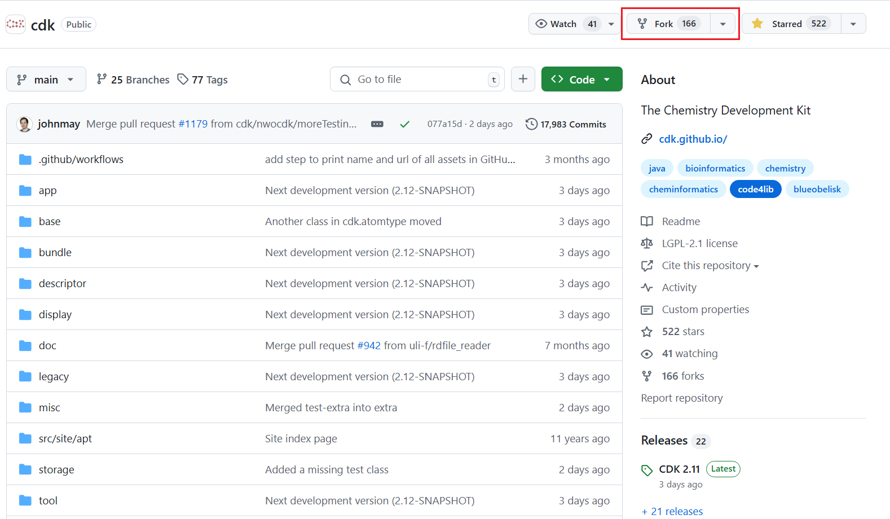

3. GitHub 会自动在你个人账户下创建 cdk 副本，fork 完成后，就可以 clone 到本地

> [!NOTE]
>
> 一个 Team 协作的项目，不需要 fork，直接到下一步。
>
> Fork 主要用于对其他人的项目提出修改建议。

## Cloning a Repository

将代码 clone 到本地，便于编辑。命令：

```sh
$git clone <repository-url>
```

也可以使用 IDE 提供的工具，以 IDEA 为例：

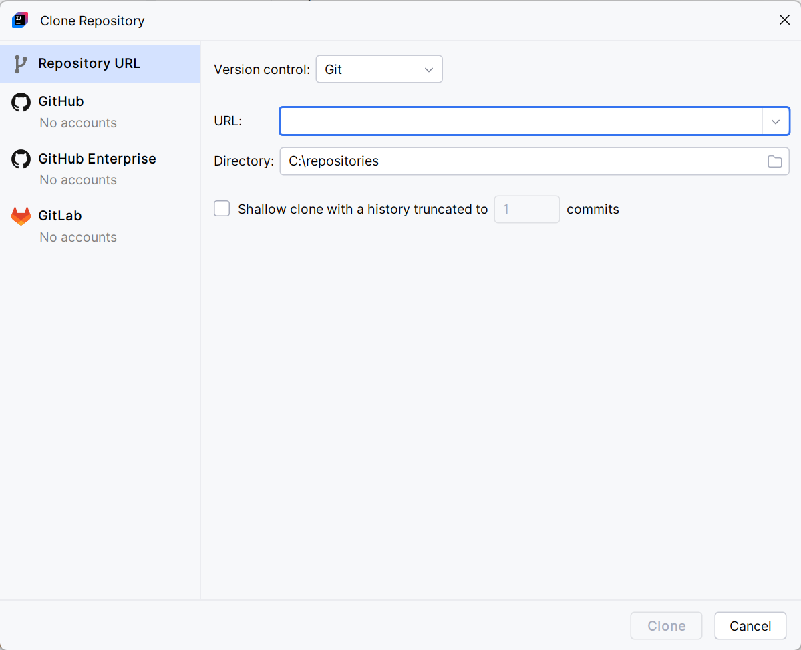

## Making Changes & Creating Branch

Clone 到本地后，就可以根据自己的需要修改或添加代码。

最佳实践：为每个新功能或 bug fix 创建新分支（branch）。这样可以隔离你的修改，便于管理和审查修改内容。创建分支命令：

```sh
$git checkout -b <branch-name>
```

比如，你想添加一个修饰注释功能，可以新建一个 branch：

```sh
$git checkout -b modification_annotation
```

IDEA 操作：

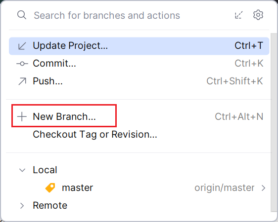

修改完成后，提交到 branch：

```sh
$git add .
$git commit -m "commit message"
```

IDEA 操作：

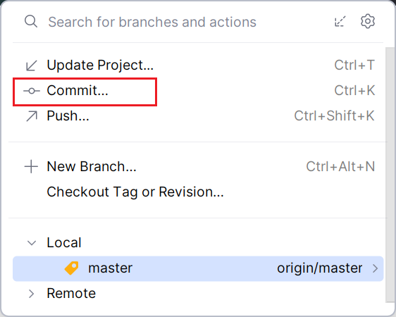

> [!TIP]
>
> 在完成一个小的功能后，比如添加了一个计算肽段子序列的方法，就应该 commit 一次，这样可以保证修改历史比较清晰。
>
> 在 commit 信息中，应当具体描述所做修改。参考 [commit 信息规范](#commit-msg-格式)。

branch 常见分类：

- **main** 分支
  - 主分支，经过测试、稳定、没有 bug、可以直接部署的分支
  - 只能由 release 和 hotfix 分支合并，不应该直接修改 main 分支代码
- **dev** 分支
  - 开发分支，贯穿整个项目的生命周期
  - 最新版本，功能模块开发交给 feature 分支，测试任务交给 release 分支
- **hotfix** 分支
  - 热修复认知，当 main 分支部署到生产环境后发现紧急情况，需要及时处理，该分支负责热修复，即在保证应用不下线的前提下，对 bug 进行紧急修复
  - 该分支以 main 分支为基础，修复 bug 后，合并到 main 分支，同时也合并到 dev 分支以保持最新进度
  - 命名规则：hotfix/NAME 或 hoffix-NAME
- **feature** 分支
  - 功能开发分支，对应特定功能模块
  - 该分支以 dev 分支为基线，完成开发后再合并到 dev 分支
  - 命名规则：feature-NAME
- **release** 分支
  - 预发布分支，在发布正式版前进行全面测试
  - 该分支以 dev 分支为基础，若发现 bug 则直接在该分支修复提交
  - 经过测试没有问题后，合并到 main 分支，同时也合并到 dev 分支保持最新进度
  - 命名规则：release-NAME

| 分支名称 | 分支指责   | 基线分支 | 合并分支  |
| -------- | ---------- | -------- | --------- |
| main     | 主分支     | -        | -         |
| dev      | 开发分支   | main     | -         |
| hotfix   | 热修复分支 | main     | main, dev |
| feature  | 功能分支   | dev      | dev       |
| release  | 预发布分支 | dev      | main, dev |

图示：


## Pushing Changes & Making a Pull Request

commit 更改后，就是 push 到 GitHub 上 fork 的仓库。便于其他人审查和协助。push 命令：

```sh
$git push origin <branch-name>
```

IDEA 操作：

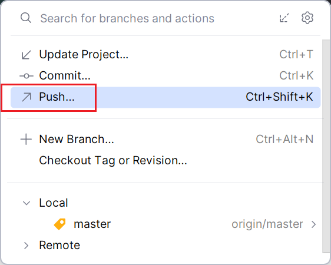

导航到 GitHub 上的仓库，切换到你创建的 branch，可以看到一个 "Compare & pull request" 按钮：

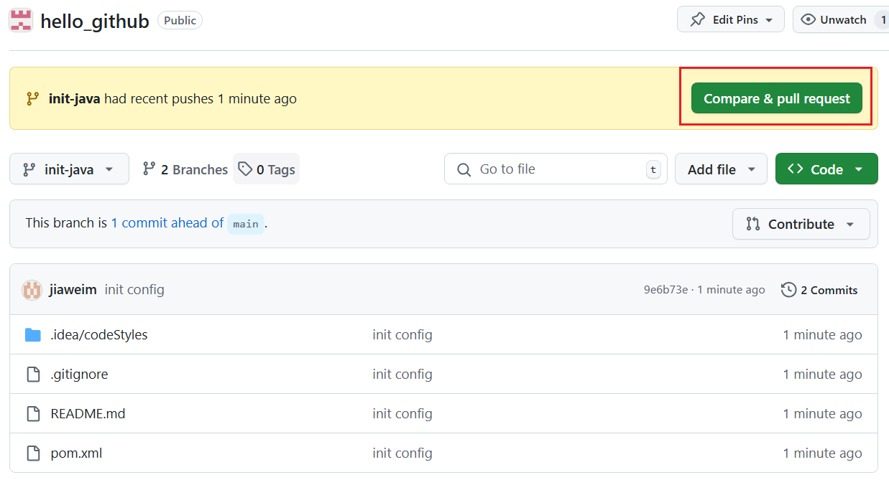

点击该按钮，出现如下界面：

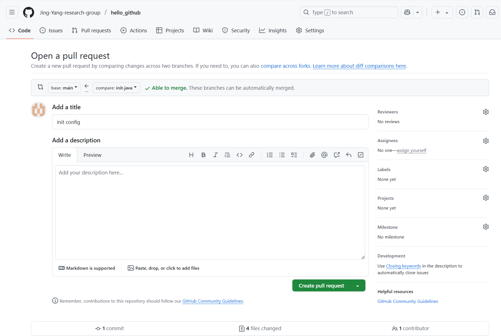

在其中详细描述你所修改的内容，在右侧 Reviewers 勾选 reviewers，即负责审查代码的人。完成后点击右下方的 "Create pull request" 按钮。

创建 pull request 后，其他人就可以查看你修改的内容，提供反馈和修改建议。

## Resolving Conflits

> [!NOTE]
>
> 如果你是 Collaborator，可以自己合并 pull request。但是在一个团队中，最好让一个人进行合并，其他人提交 pull request，并将  master merger 作为 reviewer，以减少合并过程中的冲突。

在 pull requests 页面，可以看到待处理的 pull requests：

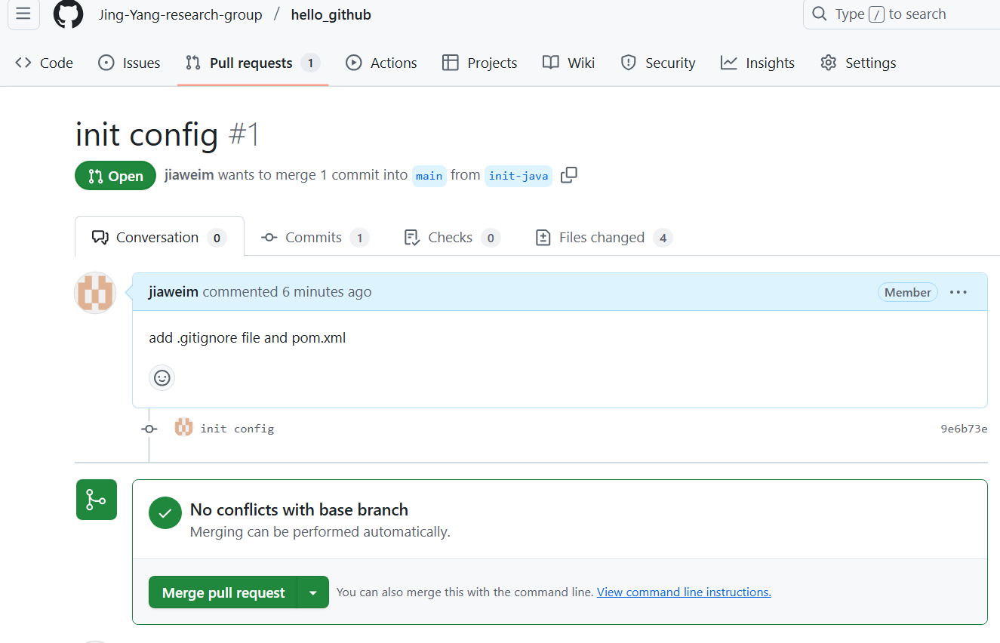

如图显示，我刚提交的 pull request 与 base-branch 没有冲突，可以直接合并。

在 File changed 页面，可以查看所有被修改的文件：

- 如果是线下办公，则可以直接讨论，决定是否 merge，可能不需要写带多评论
- 如果是线上办公，则应该添加相关描述，让 requester 直到是否 merger 他们修改的内容，以及是否需要改进

分别查看每个被修改的文件，添加评论等。

在协作环境中，当多个人对同一个文件进行修改，可能出现冲突。在 pull request 中解决冲突的流程：

1. 在 pull request 中查看冲突文件和高亮的 lines
2. 在本地，切换到包含冲突文件的 branch
3. 编辑冲突文件，git 会将冲突 lines 用特殊符号标记，类似

```
<<<<<<< HEAD
This is the code from the current branch.
=======
This is the code from the branch you're merging.
>>>>>>> branch-name
```

4. 编辑代码，合并更改，删除冲突标记
5. 解决冲突后，在本地提交更改
6. 将更高 push 到 Github 上的 branch
7. Github 会自动检测冲突解决方案，并相应更新 pull request

## Reviewing and Merging Pull Request

作为合作者，你可能负责审查和合并 pull requests。在审查 pull request 时，需要考虑：

- 阅读 pull request 描述信息，了解做出的修改
- 查看更改的代码，确保它们与项目标准保持一致
- 如果可以，在本地测试修改内容
- 提供建设性的反馈
- 满足后，点击 Merge pull request 按钮将更改合并到 main 仓库

合并成功后，可以选择删除 branch：

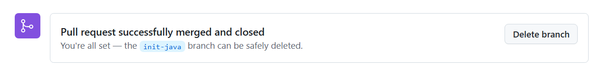

合并 PR 有三个选项：

- Create a merge commit: 将 PR 作为一个分支合并，保持留分支上所有的提交记录
- Square and merge: 为这次合并保留一个提交记录
- **Rebase and merge**：找到两个分支的共同祖先，然后在当前分支合并从共同祖先到现在的所有提交记录

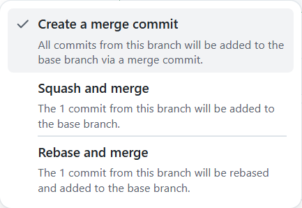

## Commit msg 格式

commit-msg 包含三部分：

- Header，必需
- Body，可选
- Footer，可选

每一行不超过 72 字符

```
<type>(<scope>): <subject>
// 空一行
<body>
// 空一行
<footer>
```

### Header

Header 只有一行，包含三个字段：

- type，必需
- scope，可选
- subject，必需

**type**

`type` 用于说明 commit 类别，只允许以下 7 个标识：

| 编号 | type     | 说明                           |
| ---- | -------- | ------------------------------ |
| 1    | feat     | 新功能（feature）              |
| 2    | fix      | 修补 bug                       |
| 3    | docs     | 更新文档                       |
| 4    | style    | 调整代码格式（不影响代码运行） |
| 5    | refactor | 重构                           |
| 6    | test     | 增加测试                       |
| 7    | chore    | 构建过程或辅助工具的变动       |

如果 type 为 feat 或 fix，则该 commit-msg 应该出现在 change log 中。

**scope**

`scope` 用于说明 commit 影响的范围，如数据层、控制层、视图层，根据项目而定。

**subject**

`subject` 是 commit 目的的简短描述，不超过 50 个字符

- 以动词开头，使用第一人称现在时，如 change，而不是 changed 或 changes
- 第一个字母小写
- 结尾不加句号

### Body

Body 部分是对 commit 的详细描述，可以分层多行。示例：

```
More detailed explanatory text, if necessary.  Wrap it to 
about 72 characters or so. 

Further paragraphs come after blank lines.

- Bullet points are okay, too
- Use a hanging indent
```

注意：

- 使用第一人称现在时，如 change，而不是 changed 或 changes
- 说明修改目的

### Footer

Footer 部分只用于两种情况：

1. 不兼容变动

如果当前代码与上一版不兼容， 则 Footer 部分以 `BREAKING CHANGE` 开头，后面是对变动的描述，理由和迁移方法。示例：

```
BREAKING CHANGE: isolate scope bindings definition has changed.

    To migrate the code follow the example below:

    Before:

    scope: {
      myAttr: 'attribute',
    }

    After:

    scope: {
      myAttr: '@',
    }

    The removed `inject` wasn't generaly useful for directives so there should be no code using it.
```

2. **关闭 Issue**

如果当前 commit 针对某个 issue，那么可以在 Footer 部分关闭这个 issue

```
Closes #234
```

或一次关闭多个

```
Closes #123, #245, #992
```

### 生成 changelog

Github 可以自动生成 changelog，内容包括：merged pull requests, contributors to the release, a link to the full changelog。

**为新 release自动生成 changelog**

1. 到 repository 主页面
2. 在右侧，点击 **Releases**

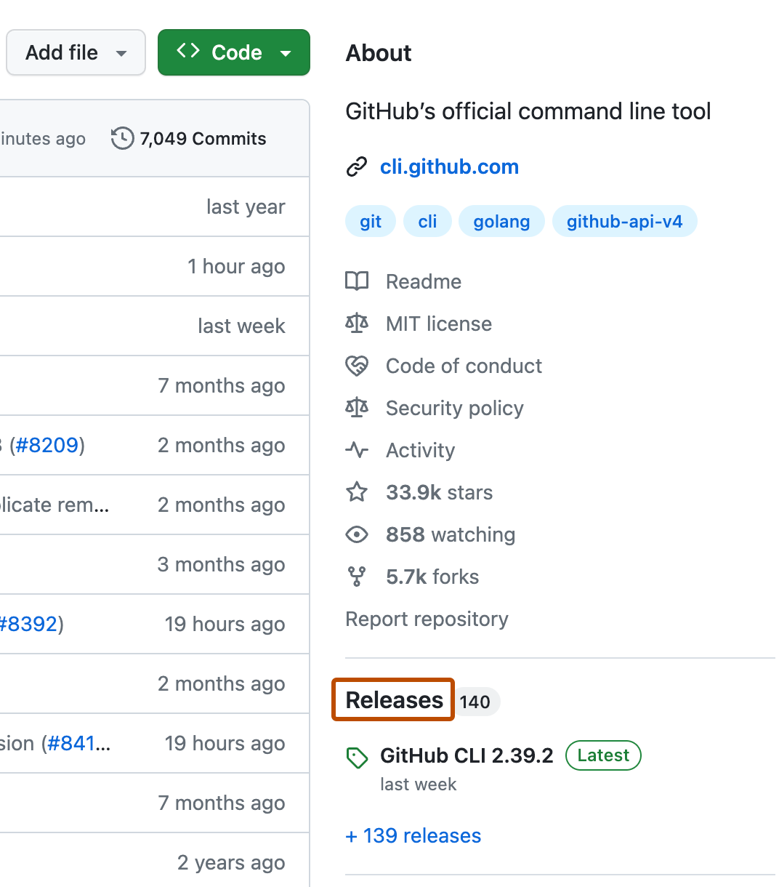

3. 在页面顶部，点击 **Draft a new release**
4. 选择 Choose  a tag 设置 release tag
   - 点击 create new tag 创建新 tag，输入版本号
5. ....


# Git 命令

## 配置

- 输出 git 版本号

```sh
$git -v
$git --version
```

- 设置用户名

```sh
$git config --global user.name "[name]"
```

- 设置邮箱

```sh
$git config --global user.email "[email address]"
```

- 启用命令颜色

```sh
$git config --global color.ui auto
```

## 创建仓库

- 初始化 git 仓库：运行 git 命令时对应的目录转换为 git 仓库

```sh
$git init [project name]
```

- 将本地仓库与远程 GitHub 仓库链接

```sh
$git remote add origin [url]
```

- 将 GitHub 仓库 Clone (下载) 到本地：所有文件，分支和 commits

```sh
$git clone [url]
```

- 显示远程仓库链接

```sh
$git remote -v
$git remove --verbose
```

## 修改

- 查看版本日志（当前分支）

```sh
git log
```

- 查看指定文件的日志，包括重命名（用于单个文件）

```sh
git log --follow [file]
```

- 查看两个分支的内容差异

```sh
git diff [first-branch]...[second-branch]
```

- 查看指定 commit 的元数据和修改内容

```sh
git show [commit]
```

- 添加指定文件到 git

```sh
git add [file]
```

- 添加当前目录所有文件到 git

```sh
$git add .
```

- 提交更改

```sh
$git commit -m "[descriptive message]"
```

## 分支

- 列出当前仓库的所有分支

```sh
git branch
```

- **创建**新分支

```sh
git branch [branch-name]
```

- **切换**到指定分支并更新工作目录

```sh
git checkout [branch-name] 
```

```sh
git switch -c [branch-name]
```

`git switch` 在 Git 2.23 引入，推荐使用。

- 将指定分支的历史**合并**到当前分支

```sh
git merge [branch-name]
```

- **删除**指定分支

```sh
git branch -d [branch-name]
```

## 重置

- 撤销 [commit] 之后的所有 commits，但保留本地修改

```sh
git reset [commit]
```

- 回退到指定 commit，放弃之后所有历史记录

```sh
git reset --hard [commit]
```

## gitignore 文件

列出 .gitignore 中文件，不使用 git 记录版本。

## 同步

- 从远程仓库下载分支所有的历史记录

```sh
$git fetch
```

- 将远程分支合并到本地当前分支

```sh
$git merge
```

- 将本地分支提交到远程

```sh
$git push
```

- 将远程仓库当前分支的最新 commits 更新到本地

```sh
$git pull
```

`git pull` 是 `git fetch` 与 `git merge` 的组合操作。

## 术语

- git：一个开源的、分布式版本管理系统
- GitHub：一个 git 仓库托管与合作平台
- commit：仓库快照，压缩为一个 SHA
- branch：commit 的轻量级指针
- clone：仓库的本地副本，包括所有 commits 和分支
- remote：GitHub 上的公共仓库，所有团队成员都在上面交换修改
- fork：GitHub 上其它用户拥有的仓库副本
- pull request (PR)：比较、讨论分支差异的地方，包括评论、集成测试等
- HEAD：当前工作目录，使用 `git switch` 可以切换到不同分支、tags 或 commits

## 参考

- https://docs.github.com/en/pull-requests/collaborating-with-pull-requests
- https://docs.github.com/en/repositories/releasing-projects-on-github/automatically-generated-release-notes
- https://git-scm.com/docs