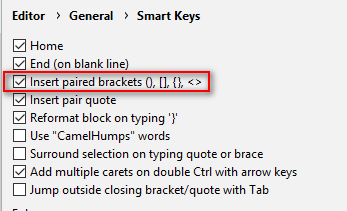
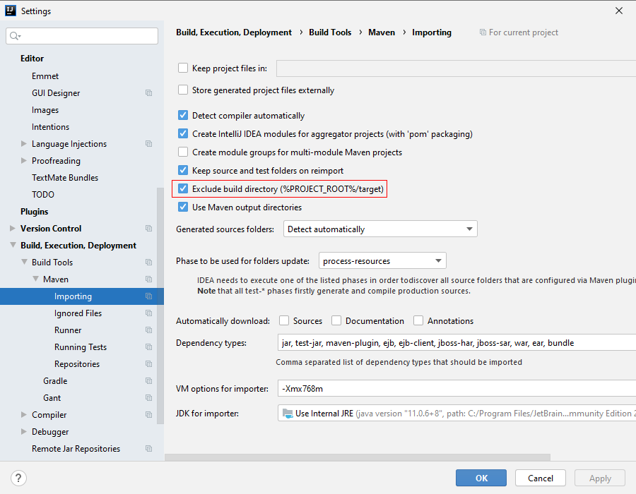

# QAs

## 自动完成的方法没有右括号

在设置中，勾选 "Insert paired brackets" 即可：

## Maven 安装的本地包 not found

删除项目的 .iml 文件后，重新导入项目。

## Maven target 目录不可见

取消勾选 "Exclude build directory"

不过勾选后，由于不需要对 "target" 目录构建索引，Intellij IDEA 在导入项目时会快一些。
