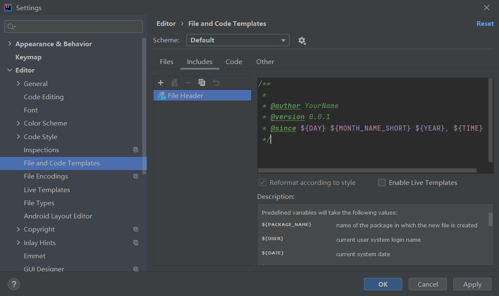
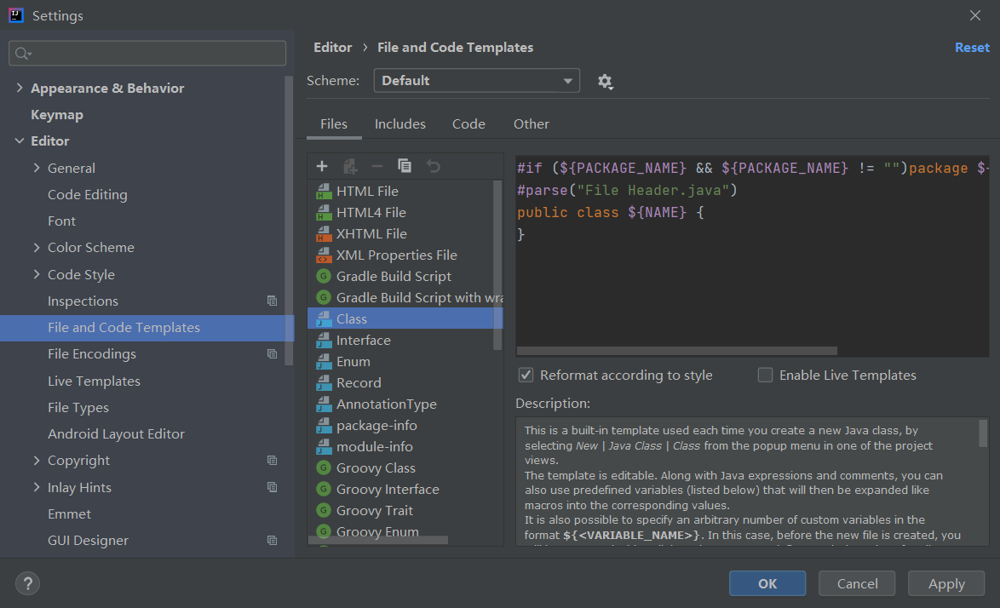
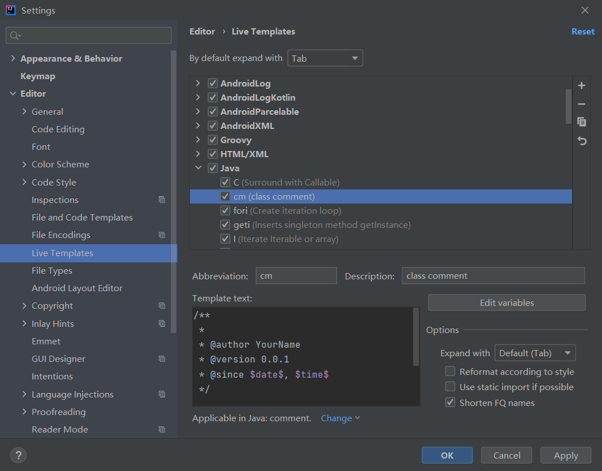
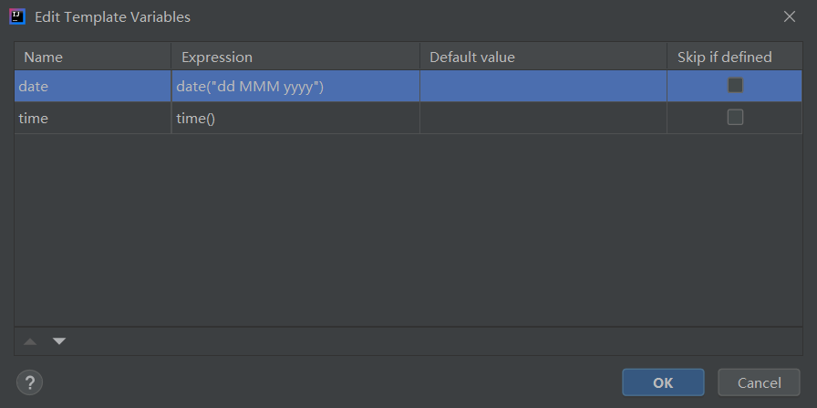

# IDEA 注释模板

- [IDEA 注释模板](#idea-注释模板)
  - [简介](#简介)
  - [文件模板设置](#文件模板设置)
  - [注释位置设置](#注释位置设置)
  - [动态模板](#动态模板)
  - [日期格式](#日期格式)
  - [参考](#参考)

2021-02-09, 10:08
***

## 简介

IntelliJ IDEA 注释模板自定义的方式有多种，下面介绍如Live Templates 和File and Code Templates。

## 文件模板设置

文件模板在创建对应文件时自动包含在文件中，例如，Java 注释：

选择菜单栏 File -> Settings -> Editor ->  File and Code Templates -> Includes > File Header

```java
/**
 *
 * @author YourName
 * @version 0.0.1
 * @since ${DAY} ${MONTH_NAME_SHORT} ${YEAR}, ${TIME}
 */
```

如下图所示：



上图中的 ${DAY} 表示月的天，会自动根据当期日期生成，具体含义在下面的 "Description" 窗口都有解释。

## 注释位置设置

如果有需求，可以设置注释在文件中的位置，例如对 Java 类，"File Header" 放在类声明前面：



满足我的需求，就不更改了。

## 动态模板

如下图所示：



这是和上面注释一样的动态模板。

缩写 "cm"，表示在 Java 中输入 `cm` 会自动弹出该注释。

其中变量以 `$var$` 定义，然后点击 "Edit variables" 输入具体变量的含义：



其中 `date([format])` 默认采用当前系统日期，格式也和当前系统一致。可以采用 `SimpleDateFormat` 接受的参数设置格式。

下面的 "Applicable in Java: comment" 表示应该该动态模板的范围，这里对应 Java 注释。

## 日期格式


## 参考

- [IntelliJ IDEA help](https://www.jetbrains.com/help/idea/template-variables.html#pdtv)
