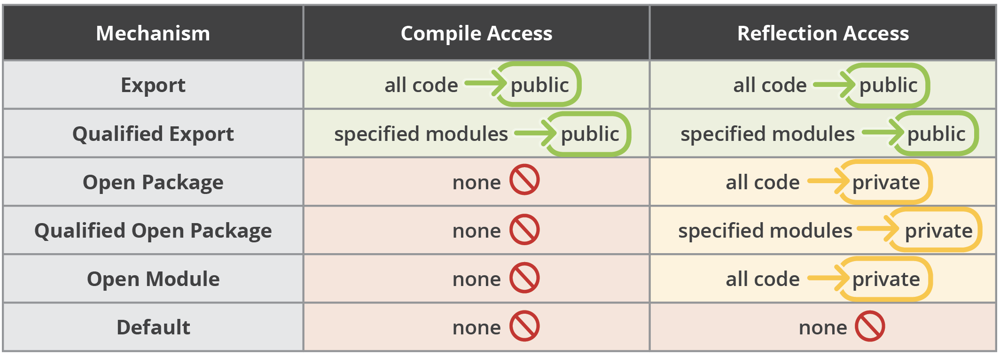

# JDK 资源

- [JDK 资源](#jdk-资源)
  - [OpenJ9](#openj9)
  - [新版特性](#新版特性)
    - [Java 9 新功能](#java-9-新功能)
      - [模块系统](#模块系统)
      - [Jshell](#jshell)
  - [module-info 语法](#module-info-语法)
    - [模块类型](#模块类型)
    - [默认模块](#默认模块)
    - [声明模块](#声明模块)
      - [requires](#requires)
      - [requires static](#requires-static)
      - [requires transitive](#requires-transitive)
      - [exports](#exports)
      - [export to](#export-to)
      - [uses](#uses)
      - [provides with](#provides-with)
      - [open](#open)
      - [opens](#opens)
      - [opens to](#opens-to)
    - [命令选项](#命令选项)
  - [Java 8 迁移 Java 11](#java-8-迁移-java-11)
    - [运行程序](#运行程序)
    - [更新第三方库](#更新第三方库)
    - [编译程序](#编译程序)
    - [运行 jdeps](#运行-jdeps)
    - [运行时访问警告](#运行时访问警告)
      - [`--add-exports`](#--add-exports)
  - [JDK 镜像](#jdk-镜像)

2020-09-02, 08:04
@jiaweiM
***

## OpenJ9

OpenJ9 的前身是IBM的 J9 Java 虚拟机，主要服务于IBM企业级软件产品，是一款高性能的JVM。

2017年9月，IBM 将 J9 JVM 捐献给 Eclipse 基金会，并更名 Eclipse OpenJ9，开启开源之旅。

OpenJ9 擅长于内存管理，同时针对容器化做了很多工作。

## 新版特性

### Java 9 新功能

#### 模块系统

Java 平台模块系统，也就是 Project Jigsaw，把模块化开发实践引入到了 Java 平台中。在引入了模块系统之后，JDK 被重新组织成 94 个模块。Java 应用可以通过新增的 jlink 工具，创建出只包含所依赖的 JDK 模块的自定义运行时镜像。这样可以极大的减少 Java 运行时环境的大小。这对于目前流行的不可变基础设施的实践来说，镜像的大小的减少可以节省很多存储空间和带宽资源 。

模块化开发的实践在软件开发领域并不是一个新的概念。Java 开发社区已经使用这样的模块化实践有相当长的一段时间。主流的构建工具，包括 Apache Maven 和 Gradle 都支持把一个大的项目划分成若干个子项目。子项目之间通过不同的依赖关系组织在一起。每个子项目在构建之后都会产生对应的 JAR 文件。 在 Java9 中 ，已有的这些项目可以很容易的升级转换为 Java 9 模块 ，并保持原有的组织结构不变。

Java 9 模块的重要特征是在其工件（artifact）的根目录中包含了一个描述模块的 module-info.class 文件。工件的格式可以是传统的 JAR 文件或是 Java 9 新增的 JMOD 文件。这个文件由根目录中的源代码文件 module-info.java 编译而来。该模块声明文件可以描述模块的不同特征。模块声明文件中可以包含的内容如下：

- 模块导出的包：使用 `exports` 可以声明模块对其他模块所导出的包。包中的 `public` 和 `protected` 类型，以及这些类型的 public 和 protected 成员可以被其他模块所访问。没有声明为导出的包相当于模块中的私有成员，不能被其他模块使用。
- 模块的依赖关系：使用 `requires` 可以声明模块对其他模块的依赖关系。使用 requires transitive 可以把一个模块依赖声明为传递的。传递的模块依赖可以被依赖当前模块的其他模块所读取。 如果一个模块所导出的类型中包含了它所依赖的模块的类型，那么对该模块的依赖应该声明为传递的。
- 服务的提供和使用：如果一个模块中包含了可以被 ServiceLocator 发现的服务接口的实现 ，需要使用 provides with 语句来声明具体的实现类 ；如果一个模块需要使用服务接口，可以使用 uses 语句来声明。

下面是一个模块声明文件的示例：

```java
module com.mycompany.sample {
    exports com.mycompany.sample;
    requires com.mycompany.common;
    provides com.mycompany.common.DemoService with
        com.mycompany.sample.DemoServiceImpl;
}
```

该声明中间中，模块 `com.mycompany.sample` 导出了 Java 包 `com.mycompany.sample`。该模块声明依赖于模块 `com.mycompany.common`。该模块也提供了服务接口 `com.mycompany.common.DemoService` 的实现类 `com.mycompany.sample.DemoServiceImpl`。

模块系统中增加了模块路径的概念。模块系统在解析模块时，会从模块路径中进行查找。为了保持与之前 Java 版本的兼容性，CLASSPATH 依然被保留。所有的类型在运行时都属于某个特定的模块。对于从 CLASSPATH 中加载的类型，它们属于加载它们的类加载器对应的未命名模块。可以通过 Class 的 getModule()方法来获取到表示其所在模块的 Module 对象。

#### Jshell

jshell 是 Java 9 新增的一个实用工具。jshell 为 Java 增加了类似 NodeJS 和 Python 中的读取-求值-打印循环（ Read-Evaluation-Print Loop ） 。 在 jshell 中 可以直接 输入表达式并查看其执行结果。当需要测试一个方法的运行效果，或是快速的对表达式进行求值时，jshell 都非常实用。只需要通过 jshell 命令启动 jshell，然后直接输入表达式即可。每个表达式的结果会被自动保存下来 ，以数字编号作为引用，类似 $1 和$2 这样的名称 。可以在后续的表达式中引用之前语句的运行结果。 在 jshell 中 ，除了表达式之外，还可以创建 Java 类和方法。jshell 也有基本的代码完成功能。

## module-info 语法

module-info 文件用于定义模块信息：

- 模块名称
- 模块依赖项
- 导出包列表
- 提供的 services
- 需要的 services
- 反射权限，即是否允许其它模块使用反射机制访问其私有成员。

|描述|说明|
|---|---|
|module module.name|声明模块，`module.name` 为模块名称，不能用下划线|
|requires module.name|指定依赖项|
|requires transitive module.name|指定依赖于本模块的模块，自动依赖于 "module.name" 模块|
|exports pkg.name|导出指定包中的 public 成员，方便依赖于本模块的其它模块使用|
|exports pkg.name to module.name|同上，但限制只有指定模块才能使用 "pkg.name" 的 public 成员|
|uses class.name|表示本模块使用服务 "class.name"|
|provides class.name with class.name.impl|注册 "class.name.impl" 类为服务 "class.name" 的一个实现|
|opens pkg.name|允许其它模块使用反射访问 "pkg.name"|
|opens pkg.name to module.name|同上，但限制到指定模块|



### 模块类型

有四种模块类型：

1. 系统模块：即 JavaSE 和 JDK 模块
2. 应用模块：即我们构建的模块，在 module-info.class 文件中命名和定义。
3. 自动模块：添加非官方模块，这类JAR没有 module-info 文件，这类模块名称通过 JAR 名字自动命名。自动模块对路径上加载的其他模块具有完整的访问权限。
4. 未命名模块：当类或JAR被加载到类路径而不是模块路径时，它会自动添加到未命名模块。主要为了向后兼容。

### 默认模块

使用如下命令可以查看默认模块：

```java
> java --list-modules
java.base@11.0.8
java.compiler@11.0.8
java.datatransfer@11.0.8
java.desktop@11.0.8
java.instrument@11.0.8
java.logging@11.0.8
java.management@11.0.8
java.management.rmi@11.0.8
java.naming@11.0.8
java.net.http@11.0.8
java.prefs@11.0.8
java.rmi@11.0.8
java.scripting@11.0.8
java.se@11.0.8
java.security.jgss@11.0.8
java.security.sasl@11.0.8
java.smartcardio@11.0.8
java.sql@11.0.8
java.sql.rowset@11.0.8
java.transaction.xa@11.0.8
java.xml@11.0.8
java.xml.crypto@11.0.8
jdk.accessibility@11.0.8
jdk.aot@11.0.8
jdk.attach@11.0.8
jdk.charsets@11.0.8
jdk.compiler@11.0.8
jdk.crypto.cryptoki@11.0.8
jdk.crypto.ec@11.0.8
jdk.crypto.mscapi@11.0.8
jdk.dynalink@11.0.8
jdk.editpad@11.0.8
jdk.hotspot.agent@11.0.8
jdk.httpserver@11.0.8
jdk.internal.ed@11.0.8
jdk.internal.jvmstat@11.0.8
jdk.internal.le@11.0.8
jdk.internal.opt@11.0.8
jdk.internal.vm.ci@11.0.8
jdk.internal.vm.compiler@11.0.8
jdk.internal.vm.compiler.management@11.0.8
jdk.jartool@11.0.8
jdk.javadoc@11.0.8
jdk.jcmd@11.0.8
jdk.jconsole@11.0.8
jdk.jdeps@11.0.8
jdk.jdi@11.0.8
jdk.jdwp.agent@11.0.8
jdk.jfr@11.0.8
jdk.jlink@11.0.8
jdk.jshell@11.0.8
jdk.jsobject@11.0.8
jdk.jstatd@11.0.8
jdk.localedata@11.0.8
jdk.management@11.0.8
jdk.management.agent@11.0.8
jdk.management.jfr@11.0.8
jdk.naming.dns@11.0.8
jdk.naming.rmi@11.0.8
jdk.net@11.0.8
jdk.pack@11.0.8
jdk.rmic@11.0.8
jdk.scripting.nashorn@11.0.8
jdk.scripting.nashorn.shell@11.0.8
jdk.sctp@11.0.8
jdk.security.auth@11.0.8
jdk.security.jgss@11.0.8
jdk.unsupported@11.0.8
jdk.unsupported.desktop@11.0.8
jdk.xml.dom@11.0.8
jdk.zipfs@11.0.8
```

### 声明模块

在包的跟目录定义文件 "module-info.java" 文件定义模块。

该文件称为模块描述符，包含构建和使用模块所需的所有信息。

如下：

```java
module myModuleName {
    // all directives are optional
}
```

`module` 为关键字，后面跟着模块名称。

#### requires

`requires` 用于声明依赖项，例如：

```java
module my.module {
    requires module.name;
}
```

通过该语法，本模块可以方位从依赖项导出的所有 public 类型。

#### requires static

有时候，我们写的代码依赖于另一个模块，但是我们模块的使用者并不是想用我们依赖的那个模块。

最常见的就是日志模块，比如当另一个日志模块存在时，我们写的代码可以漂亮的输出内部信息。但是使用本模块的人不想要这个日志功能，此时可以使用 `requires static` 指令，表示编译时依赖，运行时并不需要：

```java
module my.module {
    requires static module.name;
}
```

#### requires transitive

`requires transitive` 表示传递依赖，A模块的依赖项，引用A的模块也依赖项这些依赖项：

```java
module my.module {
    requires transitive module.name;
}
```

这样，后面使用 A 模块的模块，不再需要继续添加对应依赖项。

#### exports

模块默认不导出任何API。这种强大的封装功能是创建模块功能的主要动机之一。

我们的代码更加安全，不过我们也需要额外的工作，导出希望外部能使用的 API。

```java
module my.module {
    exports com.my.package.name;
}
```

这样，引用 `my.module` 的模块就可以使用 `com.my.package.name` 包中的 public 类型。

#### export to

`export to`  对 `export` 进行了限制，即只开放给部分API。例如：

```java
module my.module {
    export com.my.package.name to com.specific.package;
}
```

表示 `com.my.package.name` 只开放给 `com.specific.package`。

#### uses

`service` 是实现特定接口或抽象类的类，可以被其它类使用。

使用 `uses` 指定当前模块所需的 services。

需要注意的是，`uses` 中使用的类名是接口或抽象类，而不是实现类。例如：

```java
module my.module {
    uses class.name;
}
```

需要注意 `requires` 和 `uses` 的不同。

我们可以 `requires` 一个提供特定 `service` 的模块，该 `service` 实现了其 transitive 依赖的一个接口。

使用 `uses` 可以避免我们添加所有传递依赖，而添加接口所在的模块即可。

#### provides with

模块也可以提供 service.

使用 `provides` 关键字定义服务的接口以及实现类。

```java
module my.module {
    provides MyInterface with MyInterfaceImpl;
}
```

#### open

在 Java 9 之前，通过反射机制几乎可以访问任何类型和成员。Java 9 封装太强，如果我们想将模块开放出来，让其它模块可反射访问，可以使用 open：

```java
open module my.module {
}
```

#### opens

使用 `opens` 可以只开放指定包可反射访问：

```java
module my.module {
  opens com.my.package;
}
```

#### opens to

`opens...to` 可以只开放包给指定模块：

```java
module my.module {
    opens com.my.package to moduleOne, moduleTwo, etc.;
}
```

### 命令选项

|命令|功能|
|---|---|
|`--module-path`|指定模块路径|
|`--add-reads`|通过命令行指定依赖项|
|`--add-exports`|指定导出项|
|`-add-opens`|指定 open 项|
|`--add-modules`|添加模块|
|`--list-modules`|列出所有模块|

## Java 8 迁移 Java 11

Java 11 是Java 8下一个 LTS，早更新比晚更新好。

JDK 11 主要修改：

- Oracle 不再提供 32-bit 的 Windows 版本
- Java Web Start, Java Plugin, Java Control Panel 移除
- 移除 JavaFX，JavaFX 单独放在 [https://openjfx.io/](https://openjfx.io/)
- 移除 JAXB 和 JAX-WS
- 移除 Jav EE 和 CORBA 模块

下面按步骤迁移。

### 运行程序

在重新编译前在 JDK 11 上运行程序，大部分代码和库可以在 JDK 11 上正常运行，少部分需要更新。

迁移是一个迭代过程。一般首先运行程序，然后执行下面三个任务：

- 更新第三方库
- 编译代码
- 运行 jdeps

在运行程序时，注意 JVM 警告，有些 VM 选项新版可能不推荐。如果 VM 启动失败，则查看需要移除的 GC 选项。

如果程序运行成功，则应该仔细查看测试，保证在 Java 11 上的行为和 Java 8 上一致。例如，有些人发现日期和货币格式不一样。

### 更新第三方库

对使用的工具和第三方库，要确保更新到以支持 Java 11。

如果使用 Maven 或 Gradle，则最好对 Maven 和 Gradle 也进行更新。

在 OpenJDK wiki [Quality Outreach](https://wiki.openjdk.java.net/display/quality/Quality+Outreach)上可以看到很多使用 OpenJDK 构建的开源项目的测试状态。

### 编译程序

使用最新的 JDK 编译代码有利于程序的迁移。

使用 JDK 11 编译代码需要注意如下几点：

- 如果在源码中使用下划线 `_` 作为单字符识别符，在 JDK 11 中无法编译。在 JDK 8 中会有警告信息，从 JDK 9 开始报错。

例如：

```java
static Object _ = new Object();
```

该代码在编译时生成如下错误信息：

```java
MyClass.java:2: error: as of release 9, '_' is a keyword, and may not be used as a legal identifier.
```

- 如果使用 `javac` 的 `-source`, `-target` 选项，则检测一下参数值。

JDK 11 支持的 `-source/-target` 值包括 11(默认值), 10, 9, 8, 7, 以及 6 (6 不推荐，使用报警告信息)。

在 JDK 8，`-source` 和 `-target` 值推 1.5/5 之前的值不推荐，产生警告信息。而在 JDK 9 之后这些值直接报错。例如：

```java
>javac -source 5 -target 5 Sample.java
warning: [options] bootstrap class path not set in conjunction with -source 5
error: Source option 5 is no longer supported. Use 6 or later.
error: Target option 1.5 is no longer supported. Use 1.6 or later.
```

尽可能使用新的 `--release` flag，而不是使用 `-source` 和 `-target` 选项。

`--release` 的有效参数和 `-source` 及 `-target` 一样。

- 一些关键的内部 API，如 `sun.misc.Unsafe` 在 JDK 11 中依然可以访问，但是大部分内部 APIs 在编译时无法访问。使用内部的源码或依赖型可能会导致编译错误。

可以使用依赖项分析工具 jdeps 识别你项目代码的依赖项。

使用 `--add-exports` 选项可以作为临时解决引用 JDK 内部类的问题。

### 运行 jdeps

可以使用 `jdeps` 工具查看你项目依赖的包和类。如果使用了内部 APIs，jdeps 会建议使用其它工具替代。

使用 `-jdkinternals` 选项运行 `jdeps` 可以查看对内部 JDK APIs 的依赖。例如，对调用 `sun.misc.BASE64Encoder` 的类运行 jdeps：

```java
>jdeps -jdkinternals Sample.class
Sample.class -> JDK removed internal API
Sample -> sun.misc.BASE64Encoder JDK internal API (JDK removed internal API)
Warning: JDK internal APIs are unsupported and private to JDK implementation
that are subject to be removed or changed incompatibly and could break your application.
Please modify your code to eliminate dependency on any JDK internal APIs.
For the most recent update on JDK internal API replacements, please check:
https://wiki.openjdk.java.net/display/JDK8/Java+Dependency+Analysis+Tool
JDK Internal API Suggested Replacement
---------------- ---------------------
sun.misc.BASE64Encoder Use java.util.Base64 @since 1.8
```

如果使用 Maven，有一个对应的 `jdeps` 插件。

jdeps 命令选项，可以查看 [Java Platform, Standard Edition Tools Reference](https://docs.oracle.com/en/java/javase/11/tools/jdeps.html#GUID-A543FEBE-908A-49BF-996C-39499367ADB4)。

> jdeps 是一个静态分析工具，因此可能无法提供完整的依赖项列表。如果代码中使用反射来调用内部 API，jdeps 无法识别。

### 运行时访问警告

有些工具和库使用反射机制访问 JDK 内部API。这种反射访问在 JDK 未来版本会禁用，目前会发出警告信息。

例如，使用 Jython 会发出如下警告：

```java
>java -jar jython-standalone-2.7.0.jar
WARNING: An illegal reflective access operation has occurred
WARNING: Illegal reflective access by jnr.posix.JavaLibCHelper (file:/C:/
Jython/jython2.7.0/jython-standalone-2.7.0.jar) to method sun.nio.ch.Sel-
ChImpl.getFD()
WARNING: Please consider reporting this to the maintainers of jnr.posix.
JavaLibCHelper
WARNING: Use --illegal-access=warn to enable warnings of further illegal
reflective access operations
WARNING: All illegal access operations will be denied in a future release
Jython 2.7.0 (default:9987c746f838, Apr 29 2015, 02:25:11)
```

第二行警告给出了具体哪个 JAR 文件哪些代码访问了 JDK 内部API。

在 Java 程序启动后默认最多只发出一次关于反射访问的警告。发出警告的时间取决于执行反射操作的库，可能一开始就出现，也可能启动很长一段时间才出现。

可以使用 `--add-opens` 命令选项逐个库禁用警告信息。例如，可以用如下方式启动 Jython:

```java
>java --add-opens java.base/sun.nio.ch=ALL-UNNAMED --add-opens java.base/
java.io=ALL-UNNAMED -jar jython-standalone-2.7.0.jar
Jython 2.7.0 (default:9987c746f838, Apr 29 2015, 02:25:11)
```

这次就没有警告信息。不过可以看到，需要使用多个 `--add-opens` 才能覆盖所有尝试反射操作的库。

使用 `--illegal-access=warn` 命令选项可以对每个非法反射访问的操作发出警告，设置 `--illegal-access-debug` 则同时给出 stack traces 信息。

#### `--add-exports`

如果必须使用内部 API，可以用 `--add-exports` 命令选项打破封装。其语法为：

```java
--add-exports <source-module>/<package>=<target-module>(,<target-module>)*
```


## JDK 镜像

https://www.injdk.cn/

[清华 AdoptOpenJDK 镜像](https://mirrors.tuna.tsinghua.edu.cn/AdoptOpenJDK/)

华为镜像
https://repo.huaweicloud.com/java/jdk/
