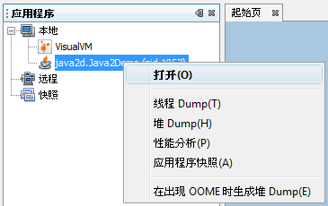
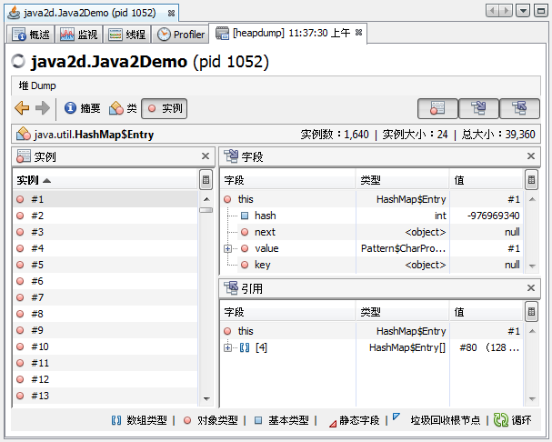
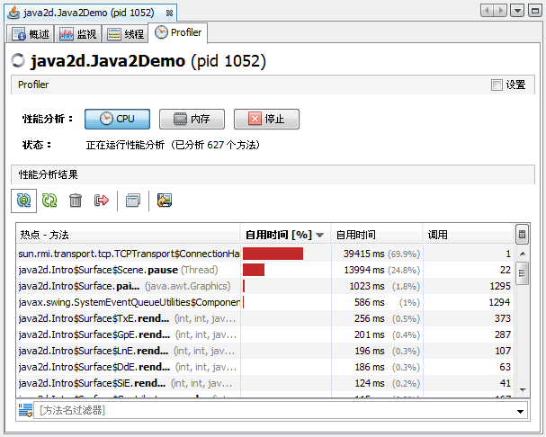
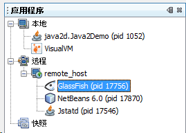
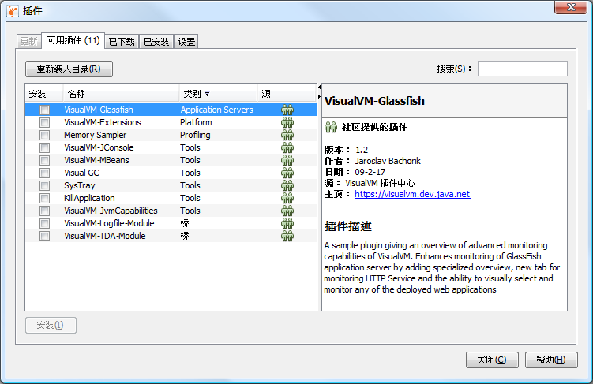

# VisualVM 入门

VisualVM 提供 JVM 上运行程序的详细信息，以可视化的方式呈现出来。它整合了多种命令行工具，包括 jmap, jstack, jConsole, jstat 和 jinfo。这些工具在标准 JDK 版本中均有。

它可以帮助我们发现内存泄漏，分析堆数据，监视垃圾回收和CPU。

## 安装
VisualVM 无需额外安装，它位于 JDK 的 bin 目录下，jvisualvm.exe，直接运行即可。

## 应用程序
在启动应用程序后，将打开 VisualVM 的主窗口。缺省情况下，“应用程序”窗口显示在主窗口的左窗格中。在“应用程序”窗口中，可以快速查看本地和远程 JVM 上运行的 Java 应用程序。

“应用程序”窗口是查看特定应用程序详细信息的主入口点。右键单击应用程序节点将打开弹出式菜单，从该弹出式菜单中可以选择是打开主应用程序标签，还是生成线程 dump 或堆 dump。

## 浏览堆 Dump
VisualVM 有一个可视化窗口，通过该窗口可以轻松浏览堆 dump。您可以装入现有堆 dump，或为本地运行的应用程序生成堆快照。

要生成本地应用程序的堆 dump，可以执行下列任一操作：
- 在“应用程序”窗口中右键单击应用程序节点，然后选择“堆 Dump”。
- 在“应用程序”窗口中双击应用程序节点以打开应用程序标签，然后在“监视”标签中单击“堆 Dump”。

要打开保存的堆 dump，请从主菜单中选择“文件”>“装入”，然后找到保存的堆 dump。

浏览打开的堆 dump：
- 单击“堆 Dump”工具栏中的“类”，以查看活动类和对应实例的列表。
- 双击某个类名打开“实例”视图，以查看实例列表。
- 从列表中选择某个实例，以查看对该实例的引用。

在生成堆 dump 后，VisualVM 将在新标签中打开该堆 dump，并在“应用程序”窗口中的应用程序节点下为该堆 dump 创建一个节点。要保存生成的堆 dump，请右键单击该堆 dump 节点，然后选择“另存为”。如果没有明确保存生成的堆 dump，则在应用程序关闭时将删除该 dump。

## 对应用程序进行性能分析
VisualVM 包括一个 Profiler，可以使用它对本地 JVM 上运行的应用程序进行性能分析。您可以在应用程序标签的 "Profiler" 标签中访问性能分析控件。通过该 Profiler，可以分析本地应用程序的内存使用情况和 CPU 性能。

> 注意：要对 JDK 6 上运行的应用程序进行性能分析，需要关闭该应用程序的类共享，否则该应用程序可能会崩溃。要关闭类共享，请使用 -Xshare:off 参数启动应用程序。

1. 启动本地 Java 应用程序。（使用 -Xshare:off 参数启动该应用程序。）
2. 在“应用程序”窗口的“本地”节点下，右键单击该应用程序节点，然后选择“打开”以打开该应用程序标签。
3. 在该应用程序标签中单击 "Profiler" 标签。
4. 在 "Profiler" 标签中单击“内存”或 "CPU"。

在选择性能分析任务后，VisualVM 将在 "Profiler" 标签中显示性能分析数据。

## 连接到远程主机
通过 VisualVM，可以轻松监视远程主机上运行的应用程序，并查看有关远程系统的常规数据。要查看远程主机上应用程序的相关信息，必须首先连接到远程主机。已连接的远程主机将列在“应用程序”窗口的“远程”节点下。展开远程主机节点可查看远程主机上运行的应用程序。

要从远程应用程序中检索数据，需要在远程 JVM 上运行 jstatd 实用程序。有关如何启动 jstatd 的更多信息 请参见 jstatd - Virtual Machine jstat Daemon（jstatd - 虚拟机 jstat 守护进程）。无法对远程主机上运行的应用程序进行性能分析。
1. 右键单击“应用程序”窗口中的“远程”节点，然后选择“添加远程主机”。
2. 在“添加远程主机”对话框中，键入远程计算机的主机名或 IP 地址。
3. （可选）键入远程主机的显示名称。此名称将显示在“应用程序”窗口中。如果没有输入显示名称，则在“应用程序”窗口中使用主机名标识远程主机。
4. 单击“确定”。

单击“确定”后，将在“远程”节点下显示远程主机的节点。展开远程主机节点可查看远程主机上运行的 Java 应用程序。

您可以双击远程应用程序的名称，在 VisualVM 中打开该应用程序标签。

## 安装 VisualVM 插件
通过安装 VisualVM 更新中心提供的插件，可以向 VisualVM 添加功能。例如，安装 VisualVM-MBeans 插件可以向应用程序标签中添加 "MBeans" 标签，通过此标签，可以在 VisualVM 内监视和管理 MBeans。

安装 VisualVM 插件：
1. 从主菜单中选择“工具”>“插件”。
2. 在“可用插件”标签中，选中该插件的“安装”复选框。单击“安装”。
3. 逐步完成插件安装程序。

该屏幕快照显示了选中 VisualVM-MBeans 插件的“插件”管理器。
